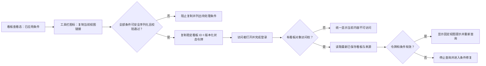

# YPBI 产品需求文档

## 已确认补充：团队账号管理

管理员在顶部“账号管理”进入团队列表，可搜索和分页、创建账号、分配普通账号/管理员权限、停用/启用、重置临时密码。普通账号不显示入口，直接访问页面或接口同样拒绝。沿用现有 `reader` / `maintainer` 存储角色，保留已有 `analyst` 数据但不提供新建入口。

新建和重置密码最少6位，首次登录强制改密，不展示或保存明文旧密码。权限变更、停用和密码重置使原会话失效。禁止在团队页修改自身账号；保护最后一个可用管理员，服务端用事务锁防止并发移除。停用可恢复，不提供物理删除。

## 0. 文档信息

| 项目 | 内容 |
|---|---|
| 文档 ID | BI-PRD-001 |
| 版本 / 状态 | 2.41 / 已确认97项口径已同步；正式指标准入独立 |
| 优先级 | P0 |
| 用途 | 产品经理与同事阅读评审、后续 AI 继续澄清并按已确认章节开发和验收的产品需求权威源 |
| 指标权威版本 | 本次需求核对基线为 `v0.36-draft`；开发或验收开始时重新读取权威源当前版本，并在实施记录中注明实际使用版本 |
| 更新时间 | 2026-09-22 |

本文只写目标产品及稳定规则。当前代码、API、数据粒度、支持状态和改造事项统一见[现有平台调整方案](./BI-现有平台调整方案.md)。

指标 ID、名称、版本、分类、维度和口径只引用[全站指标体系](../../../全站埋点与指标体系/全站指标体系.md)；事件 ID、名称、版本、属性和定义 / 契约状态只引用[埋点权威源](../../../全站埋点与指标体系/H5全站埋点规范-协作主文档.md)。YPBI 不建立第二套公式、指标或事件定义。

埋点权威源记录产品期望和已确认的事件契约，不等于事件已经开发、上报或可分析。事件的实际交付与运行状态必须来自开发提供的真实采集和查询服务；正式可分析事件取“权威源已登记的事件”与“已开发上线、有真实数据、YPBI 可查询且验数通过的事件”的交集。只在文档中登记但未交付的事件保留为待建设且不可选；开发侧出现但权威源未登记的事件标记为未治理，不自动进入正式分析，确认后先回写权威源。

后续 AI 开发时必须同时读取本文、现有平台调整方案和[UI 防回归规则](../UI-已确认问题与防回归规则.md)。UI 文档只继承视觉、响应式和通用交互护栏，其中记录的旧入口、旧名称和旧流程不覆盖本文的目标架构。内嵌线框的准入状态与所在章节一致：已确认章节的线框只约束信息层级、内容范围和操作关系，不是最终视觉稿；待确认章节的线框是待讨论方案。最终视觉与响应式基线按第 4.3 节代表页闸门确认。独立 Demo、竞品截图和导出样例只帮助理解，不证明正式数据能力，也不覆盖文字规则。

### 0.1 文档阅读与质量标准

本文必须同时满足“人能快速读懂”和“AI 能无歧义执行”，不得依赖聊天记录补全需求。

本文是后续 AI 生成和迭代 YPBI 的产品规格，不套用面向传统研发评审的通用 PRD 模板或外部需求说明写作规范。只保留影响 AI 实现正确性的功能、对象关系、交互、状态、数据边界、依赖和验收门槛；不强制增加用户故事、五章式结构、逐按钮描述或重复数据字典。

| 阅读层 | 解决的问题 | 写作要求 |
|---|---|---|
| 快速理解 | 产品包含什么、页面如何组织、当前确认到哪里 | 每个模块先给目标、功能点清单和必要的页面/流程示意；使用产品语言，不堆实现术语 |
| 规则核对 | 点击后发生什么、不同状态如何处理、哪些能力不能做 | 紧随功能点写清交互、状态、边界、数据真实性和多端规则，不把关键细节藏在其他章节 |
| 开发执行 | AI 如何在不猜测的情况下实现并验收 | 明确入口、对象关系、默认值、条件、异常和验收标准；当前能力与改造缺口统一查阅调整方案 |

- 已确认事实直接陈述；建议和尚未决定的内容只能放入“待确认”，不得混写成需求。
- 对话只承担澄清和决策过程。每轮确认后，用户可感知、研发必须实现且测试可验收的展示 / 交互结果写入本文；组件实现、响应式和自动化防回归细节写入 UI 防回归规则。两层通过引用关联，不复制第二套口径；后续同类反馈直接替换权威现行规则并清理冲突旧分支，不依赖聊天记忆。
- 示意图固定信息层级和操作关系，文字规则固定行为；二者冲突时以同版本文字规则为准。
- 只写会影响产品行为或验收结果的细节，不复制指标公式、事件契约、代码设计或讨论过程。
- 权威业务指标只引用指标 ID、名称和版本，公式继续由《全站指标体系》唯一维护；事件分析等通用统计方式属于 YPBI 产品计算规则，必须在对应章节记录展示名称、精确定义、公式、分子与分母、去重粒度、时间归属、缺失身份及除零处理，AI 不得根据名称自行推断。

### 0.2 快速阅读路径

| 读者 / 任务 | 推荐顺序 |
|---|---|
| 产品经理快速检查产品是否合理 | 产品定位（第 2 节）→ 产品架构（第 3 节）→ 看板与分析（第 5～9 节）→ 数据中心与管理（第 10～11 节）→ 目录与数据核对（第 15 节） |
| AI 实施某个已确认模块 | 章节状态（第 1 节）→ 对应功能章节 → 全局规则（第 4 节）→ 验收门槛（第 14 节）→ 现有平台调整方案 |
| 核对“当前能不能做” | 现有平台调整方案中的数据能力与接口映射；不得仅凭本文功能描述判断接口已支持 |

## 1. 章节状态

核心产品范围已经确认，但不代表所有数据能力都可直接上线。后续开发必须按下表读取章节状态，并按现有平台调整方案逐项通过数据准入。

| 需求 ID | 模块 | 状态 | 已确认边界 |
|---|---|---|---|
| BI-GLOBAL-001 | 产品架构与全局规则 | 已确认，可开发 | 一级结构、对象关系、真实性、指标与维度准入、筛选、响应式原则和阅读者 / 分析者 / 维护者三档最小操作角色 |
| BI-DASH-001 | 看板中心与看板编辑 | 已确认，可开发 | 查看、收藏、刷新、导出、复制当前视图链接、官方看板首次开放门槛、看板生命周期、添加分析、布局编辑和直接保存 |
| BI-DASH-003 | 核心经营总览 | 已确认，可开发 | 官方跨业务看板的首屏 9 张独立指标卡、三组关键链路、M080/M031 关键质量、客观数据状态、经营明细内纯数值卡、局部平台筛选、11项基础指标及第15节维度列及完整导出边界均已确认；各指标能否进入正式环境仍须独立完成权威映射、真实查询和验数 |
| BI-DASH-002 | 指标速览 | 已确认，可开发 | 多份个人命名速览、自选权威指标观察项、单 PID/单日扫数、所选 PID 与正式大盘的日周对比、指标数据详情抽屉、真实状态、刷新导出及指标定义/分析/看板联动；只展示客观数据，不生成点评 |
| BI-DASH-004 | 功能使用概览 | 已确认，可开发 | 稳定页面/模块渗透率横向比较、完整表格、单功能详情与最多 5 项趋势比较均已确认；稳定指标引用、正式事件、同口径活跃分母、查询和验数未就绪前不得上线空壳 |
| BI-DASH-005 | 获客与新增 | 已确认，可开发 | 最近 7 个完整业务日、上一等长周期、整板筛选、六张独立详细指标卡、响应式布局、维度明细、首次激活质量、渠道结算、真实状态和完整导出均已确认；逐项权威映射、维度兼容、查询与验数仍是生产准入条件 |
| BI-DASH-006 | 活跃与留存 | 已确认，可开发 | 固定业务看板边界、首屏四张详细指标卡、活跃结构、自然月 MAU、注册 Cohort、再激活、分区日期、真实状态和导出均已确认；逐项权威映射、成熟状态、维度交叉、查询与验数仍是生产准入条件 |
| BI-DASH-007 | 视频消费表现 | 已确认，可开发 | 首屏六张独立指标卡、消费结构、有效观影、有效观影留存、内容贡献排行、交互、状态和完整导出均已确认；各指标仍须逐项完成权威映射、真实查询、加工和验数 |
| BI-DASH-008 | 播放与观看质量 | 已确认，可开发 | 播放发起、起播规模与质量、首帧耗时分布、阶段关系、结构诊断、状态和完整导出均已确认；不混入视频消费结果 |
| BI-DASH-009 | 内容发现与互动 | 已确认，可开发 | 首屏六卡、视频首页一级分类 Tab 使用、一级分类下视频内容点击、搜索承接、视频及作者/社区互动、状态和完整导出均已确认；两类点击事实分离，V1 不展示二级分类 |
| BI-DASH-010 | 会员与付费经营 | 已确认，可开发 | 首屏六张付费经营卡、新用户价值、付费与收入结构、会员引导/付费墙、状态和完整导出均已确认；会员存量、到期和续费在权威指标缺失时不建设空壳 |
| BI-DASH-011 | 支付链路与到账质量 | 已确认，可开发 | 首屏六张支付链路卡、阶段关系、支付方式和商品/到账诊断、成熟状态及完整导出均已确认；不把异质阶段伪装成真实漏斗 |
| BI-DASH-012 | 运营玩法概览 | 已确认，可开发 | 签到、任务、福利、邀请的六项核心结果、分区诊断、不适用状态、交互和完整导出均已确认；不同玩法不串成漏斗 |
| BI-DASH-013 | 产品体验与启动质量 | 已确认，可开发 | 启动成功质量、辅助次数、版本分布与新老用户拆解、状态和完整导出；全局导航位于功能使用概览 |
| BI-F-003 | 已保存分析与看板组件 | 已确认，可开发 | 对象分离、稳定引用、来源修改同步、组件展示独立和操作边界 |
| BI-F-003-GOV | 已保存分析 V1 治理边界 | 已确认，可开发 | V1 不提供来源分析删除入口，不建设复杂资产分级和被引用删除策略；底层只区分个人与维护范围，新建、另存默认归当前用户，个人来源加入官方看板前生成独立维护范围副本；存量无归属来源保持只读 |
| BI-F-004 | 指标中心 | 已确认，可开发 | 只读同步权威指标体系，不在 YPBI 改口径 |
| BI-F-006 | 事件中心 | 已确认，可开发 | 同步事件体系并显示定义、上线、可查询和验数状态 |
| BI-F-005 | 指标分析 | 已确认，可开发 | 权威指标的轻量查询、对比与拆解；默认 1 个、最多 5 个指标，最多 2 个真实交叉分组，按兼容规则展示和保存 |
| BI-F-001 | 事件分析 | 已确认，可开发 | 正式事件准入、三项基础统计、数值属性统计、事件条件、公共范围、分组、日期对比、结果、保存复用、导出和真实状态 |
| BI-F-002 | 真实漏斗分析 | 已确认，可开发 | 人数漏斗、2～10 步、有序非严格相邻组链、首步日期与成熟窗口、确定性选序、三类条件、单一分组、结果口径、中位耗时、周期对比、保存复用和真实状态 |
| BI-ADMIN-001 | 数据源维护 | 已确认，可开发 | V1 归入受保护的管理入口，所有已登录用户完成二次认证后可人工轮换站1/站2共享Token；日常查询自动使用服务端有效凭据，不要求逐次输入，不扩展成数据建模平台 |
| BI-EXPORT-001 | 导出 V1 | 已确认，可开发 | 内容结构、真实性和命名规则已确认；技术容量由压测确定 |

只有用户明确确认后，待确认章节才能改为“已确认，可开发”。

“已确认，可开发”只代表产品规则已确认，不代表当前接口已经完整支持；开发前仍须逐项通过现有平台调整方案中的数据能力门槛。指标中心、事件中心不得先用假目录、假状态或手工固定数据冒充同步能力。

产品规划与生产准入分开：只要指标已经登记在《全站指标体系》中，规划看板时即可按理想完整目标纳入，不因“技术称已实现（待验数）”“现有接口口径待验数”“埋点草稿支持”或“需平台加工”等当前状态从需求中删除。当前状态只决定实施依赖、普通用户是否能看到真实结果以及能否上线；开发前仍须完成权威版本映射、真实查询和验数。权威源尚未登记的指标不得由 YPBI 自行命名或编造公式；权威源仍待确认的口径可作为目标占位引用，但必须保留其状态，不能被误读为已定口径。

正式业务数值遵循“先治理、再接入、后展示”：官方看板、指标速览及其他固定业务结果中的 KPI、比率或稳定分析结果，必须能追溯到《全站指标体系》的稳定指标 ID 和版本；即使接口已经返回结果，权威源尚未登记时也只能标记为“待指标治理”，不能直接作为正式指标发布。一级/二级分类、Tab、PID、客户端平台、新老用户、获客类型、渠道、位置等用于筛选、分组或明细展示的字段和值属于维度，不为每个具体取值复制独立指标。事件分析中的总次数、总用户数、人均次数及事件属性分组属于通用事件统计，追溯到正式事件、统计方式和条件即可，不要求把每个临时分析组合登记成业务指标。

新增固定业务结果的协作顺序为：先检索权威指标与事件，已有则复用稳定 ID；没有时由维护者输出可复制的指标登记提示词，列明业务目的、建议名称、定义、公式、主体、时间归属、去重、维度、来源、接口与验数状态，交由指标权威源确认和登记；随后 YPBI 同步指标中心、建立真实查询映射并验数，最后才进入正式界面。YPBI 不自动修改指标权威源，也不因接口“据称有数据”跳过映射和验数。

## 2. 产品定位与 V1 原则

YPBI 用两类核心能力完成“看现状—找原因—沉淀复用”：

- 看板中心持续查看官方经营看板和个人看板。
- 指标速览集中巡检个人关注的多项权威指标，不替代看板、分析或正式报表。
- 分析中心通过指标、事件和漏斗进行自助分析，并把结果保存后加入看板。

V1 的使用角色不是完整权限矩阵：业务阅读者主要查看、筛选和导出；产品/数据分析者创建并保存分析、维护个人看板；授权维护者维护官方看板。三档角色均可按第11节维护共享数据源。最小操作角色、对象归属与数据范围校验按第4.4节执行；第13节只后置完整RBAC、审批和主动授权。

V1 优先打通真实数据闭环。便利性增强、复杂治理和高级分析默认后置；但身份、事件顺序、转化窗口、成熟样本、缺失值等会决定结果正确性的能力不能因为“V1 简化”而省略。做不到时应缩小可用范围，不能展示伪结果。

正式界面、详情、下钻和导出禁止使用 Mock、硬编码、固定趋势或推算元数据冒充真实能力。业务数值只能由已登记的正式上游 API，或由明确登记的服务端加工服务通过受控查询接口返回。前端、本地配置、Markdown 或其他文档、返回行的最大日期、请求时间与“昨日”都不得生成、补齐或推断业务数值、完整性状态或数据水位；文档只定义口径和准入，不是运行时数据源。

本文所称“真实交叉粒度”是数据服务能直接返回多个条件组合后的结果，而不是把各自汇总数拼在一起；“数据水位”是当前可以可靠计算到的最晚时间；“成熟样本”是已经走完整个观察窗口、可以判断转化或流失的样本。

### 本地真实数据阅读（2026-09-12 已确认）

已登录用户从现有看板中心直接阅读接口能够返回的真实日数据；各卡独立显示可用结果，缺失项不阻断整板。未验数结果在标题旁使用紧凑“待验数”标记；来源、查询时间、未知完整性及适用范围放入详情，不增加常驻横幅或逐卡长说明。真实0、无记录、空值、异常值和请求失败分别显示，不降级为演示数据。

本批以单业务平台的逐日结果打通阅读：主值明确标注所选结束日的日值，趋势及完整表覆盖所选区间；结束日无值时保留该日状态，不向前取值冒充。不提供未经确认的跨日去重、大盘合计、跨端相加或平均比率。公共/我的概览继续共用工作台；个人对象体验保留明确的本地体验边界，不冒充真实账号对象。

本批只接数据，不改变既有页面结构、区块顺序、布局尺寸、图表类型和功能；复用既有渲染组件。可读取的卡片、趋势、表格、详情和导出共同采用同一真实快照；未接入模块保留原效果并在标题旁标“演示数据”。真实请求失败不回退演示。交付提供逐看板、逐模块的数据支持清单，区分真实数据（待验数）、当前缺少数据支持及演示数据，并说明待接入不等于上游确定无数据。后续同类数据接入均以原页面为视觉和交互基线。

该路径仅适用于经批准的独立本地联调，服务端同时保护登录、只读权限、有效PID范围和显式开关；关闭后停止提供联调数据。既有正式指标验数、水位和上线门槛不降低，账号库、线上旧BI及指标权威定义不变。

### 2.1 核心任务与产品成功信号

以下信号用于验证 YPBI 自身是否帮助用户完成任务，不是业务指标目标。V1 没有可靠基线时先确认信号定义，不编造目标值；只有完成事件契约、隐私边界和授权流程并实际交付后，才能采集对应基线。未获批准前只可使用已经合规存在的信号，不能用安全审计或前端临时事件代替产品埋点。

| 核心任务 | 完成闭环 | 首批观察信号 |
|---|---|---|
| 阅读看板 | 找到目标看板 → 应用筛选 → 获得有效结果 → 查看详情或导出 | 首次有效结果耗时、查询成功 / 失败、导出成功 / 失败、关键步骤流失 |
| 分析沉淀 | 配置分析 → 成功查询 → 保存 → 加入看板 | 各步成功 / 失败、完整闭环完成率、已保存分析再次使用 |
| 维护资产 | 进入可维护对象 → 编辑 → 校验 → 保存并重新读取 | 保存成功 / 失败、权限拒绝、`revision` 冲突及冲突恢复 |

## 3. 产品架构

### 3.1 一级结构

| 导航分组 | 一级入口 | 二级内容 | 说明 |
|---|---|---|---|
| 工作空间 | 看板中心 | 公共概览、我的概览、指标速览；我的收藏位于公共概览目录内 | 公共概览按业务分类展开到具体看板；指标速览是独立的个人扫数对象；收藏是快捷入口，不是第三种看板对象 |
| 工作空间 | 分析中心 | 指标分析、事件分析、漏斗分析、已保存的分析 | 三类分析分别承接指标查询、事件探索和用户级有序转化；已保存的分析统一管理复用资产 |
| 工作空间 | 数据中心 | 指标中心、事件中心 | 统一承载可被分析使用的指标和事件元数据，不再设置重复的“数据字典” |
| 管理 | 数据源维护 | 连接配置、检测与运行状态 | 受保护的低频维护能力，放在导航底部管理分组，不与日常分析工作空间并列 |

```text
YPBI
├── 工作空间
│   ├── 看板中心：公共概览（含我的收藏）/ 我的概览 / 指标速览
│   ├── 分析中心：指标分析 / 事件分析 / 漏斗分析 / 已保存的分析
│   └── 数据中心：指标中心 / 事件中心
└── 管理
    └── 数据源维护：连接配置 / 检测 / 运行状态
```

#### 3.1.1 稳定页面路径与未接入状态

顶栏 Logo 与一级导航使用留白分隔，不设置竖向隔栏；一级导航文字保持清晰正文层级，整条顶栏以轻阴影与内容区区分。导航项只用文字色和下划线表达选中，不逐项加阴影或增加顶栏高度。

目标信息架构使用以下稳定语义路径。桌面端在顶部常驻展示看板中心、分析中心、数据中心；管理入口按现有权限展示。含二级页面的一级入口用于展开菜单，选择具体页面后导航。菜单悬停 200ms 展开、离开整个触发区和菜单 250ms 收起；进入菜单取消收起，只允许一个菜单展开。点击、Enter、Space 和向下方向键同样可以展开，悬停不抢焦点；Esc 关闭并返回触发项，点击外部或焦点离开菜单关闭，Tab 自然通行。宽度不超过 900px 时使用点击展开的分层导航。页面名称、面包屑、选中态、权限和路径由同一份产品导航登记源派生；保留原有稳定路径、返回与刷新恢复能力。

| 一级入口 | 二级页面 | 稳定路径 | V1 目标 |
|---|---|---|---|
| 看板中心 | 公共概览 | `/dashboards/public` | 阅读官方看板 |
| 看板中心 | 我的概览 | `/dashboards/mine` | 创建和维护个人看板 |
| 看板中心 | 指标速览 | `/dashboards/metric-overviews` | 管理个人命名速览 |
| 看板中心 | 我的收藏 | 公共概览目录内的收藏分组 | 快速返回已收藏看板；旧 `/dashboards/favorites` 仅重定向到公共概览，不保留独立菜单 |
| 分析中心 | 指标分析 | `/analysis/metrics` | 创建指标分析；具体分析使用稳定对象或指标子路径 |
| 分析中心 | 事件分析 | `/analysis/events` | 创建事件分析 |
| 分析中心 | 漏斗分析 | `/analysis/funnels` | 创建真实漏斗分析 |
| 分析中心 | 已保存的分析 | `/analysis/saved` | 管理三类已保存分析 |
| 数据中心 | 指标中心 | `/data/metrics` | 查看权威指标定义与准入状态 |
| 数据中心 | 事件中心 | `/data/events` | 查看事件契约与真实可查询状态 |
| 管理 | 数据源维护 | `/admin/data-sources` | 维护已登记数据源连接 |

产品架构与运行时开放状态分开：已确认但尚未形成真实闭环的二级页可以在开发候选环境中显示低权重“待接入”状态，并进入只说明目标与未开放原因的保留页；不得放入模拟卡片、虚构数量、无效创建 / 保存按钮或旧功能拼接结果。正式可用状态必须由当前代码、公共契约、权限和数据准入共同决定，不能把本文的目标清单当成运行时开关。手机端仍呈现同一层级与名称，不把二级页面压平为另一套导航。

“报表”与看板是不同产品形态，但当前没有已确认的固定列查询、对账、周期交付或归档需求，因此 V1 不显示报表一级入口。以后出现真实报表对象时再增加，不把“专项”或“专用代码页面”自动叫作报表。

### 3.2 稳定对象关系


| 对象 | 单义定义 |
|---|---|
| 指标 | 权威指标体系中的稳定 ID、名称和版本；YPBI 只引用 |
| 事件 | 埋点权威源中的稳定事件及版本；是否可查询还取决于上线、数据覆盖和验数 |
| 业务分类 | 指标体系提供的可调整分类，用于导航和检索，不写死在前端 |
| 分析 | 一次指标、事件或漏斗查询及结果 |
| 已保存分析 | 可重复执行的查询配置，不包含看板布局；底层归属为绑定 Owner 的个人范围或由维护者负责的维护范围 |
| 看板组件 | 某个来源分析在看板中的展示实例，只保存展示和布局信息 |
| 官方看板 | YPBI 维护并供业务阅读的正式看板 |
| 我的看板 | 当前用户创建和维护的看板 |
| 指标速览 | 当前用户创建的命名扫数配置；保存指标观察项、顺序、分类展示和默认查看条件，不保存或重新定义指标公式 |

界面名称与产品对象统一如下：`公共概览` 展示官方看板，`我的概览` 展示我的看板，`指标速览` 管理当前用户的多份命名速览，界面俗称“卡片”的对象统一称为看板组件，`已保存的分析` 是可复用分析资产。V1 不建立独立“看板模板”对象和模板入口；原系统模板迁为官方看板，原个人模板迁为我的看板。

“我的概览、指标速览、我的收藏”以及归属个人的已保存分析不要求 V1 建设完整角色权限系统，但必须具备稳定用户身份、对象归属和受保护写入；否则“我的”只是伪个人化能力，不能正式上线。

### 3.3 核心使用闭环

```text
数据中心核对可用对象 → 创建并真实查询分析 → 保存分析 → 加入看板
→ 编辑看板布局与设置 → 保存生效 → 查看、筛选、刷新和导出

个人来源加入官方看板 → 确认创建维护范围副本 → 原子生成新来源与组件引用
→ 官方组件只随维护副本更新，个人原件后续修改不影响官方结果

看板组件标题 → 返回来源分析 → 修改 → 保存前确认真实影响范围
→ 保存后所有引用该来源的组件同步查询配置
```

没有来源分析编辑权限时，点击组件标题进入只读的来源分析页；已登录且个人资产写入能力可用时，可“另存为分析”并绑定当前用户后再编辑。没有稳定身份或写入保护时禁用另存。YPBI 不再为同一结果额外建设一套通用卡片详情页。

### 3.4 看板分类

- 指标中心完整同步权威指标体系的“一级分类 → 二级分类 → 指标”，名称、归属和顺序不在 YPBI 复制维护。
- 公共概览导航采用“一级分类 → 看板”两级结构；一级分类作为官方看板的业务归属，后续随权威源灵活调整，不在 YPBI 写死。
- 全局导航统一位于顶部；左侧仅承载当前工作区的对象目录或分类，例如看板目录、指标分类。没有局部目录的页面直接使用内容区。看板阅读态右侧直接呈现选中看板，目录介绍页不是必经入口；全局导航与局部目录各自只展示一份。
- 每张官方看板记录一个所属一级分类和一个或多个覆盖二级分类；二级分类用于确定看板内容范围及板内业务分区，不在公共概览增加第三层目录，也不要求“一项二级分类对应一张看板”。业务判断相近的二级分类可以合入同一看板。
- 核心经营总览是跨业务分类的置顶管理视角，不是新增业务分类。
- 看板按业务判断组合，不按 API、代码模块或页面实现方式拆分。
- 广告范围为第5.2.1节广告点击表现及第15.1/15.4节经营明细和摘要；独立广告BI与其他广告专题后置。
- 空分类不在公共概览导航中显示。
- 分类拆分、合并或删除前必须先确定所属看板的新归属，不能产生无归属看板。
- 分类变化只调整看板的导航归属，不改变看板内的指标、来源分析和组件配置。
- 看板使用稳定 ID；分类或名称变化后，已有收藏、当前视图链接和配置关系继续有效。

## 4. 全局规则

### 4.1 时间与筛选

日期范围触发器按完整起止日期保留可用宽度，展开期间保持选中反馈；日历明确区分起止端点、已选范围和待选结束日。调整工具栏顺序或收纳方式后，文字与图标仍完整可读，鼠标、触屏和键盘的选中状态一致。

| 条件 | 目标规则 |
|---|---|
| 日期范围 | 固定公共条件；页面只显示一个日期范围触发器，以“开始日期～结束日期”回显范围。复用同一日期组件：桌面左侧快捷项、右侧并列双月日历及明确起止输入，支持跨月、跨年和键盘选择；手机全屏、日历上下排列。选择端点或快捷项只更新面板草稿，确认后回填外层筛选，外层应用后才查询；取消、Esc 或外部关闭丢弃面板草稿。默认最近 7 个已完整业务日，结束日取当前看板全部组件共同可靠的数据截止日，时区 `Asia/Shanghai`，包含起止日 |
| 快捷日期 | 今天、昨天、本周、上周、本月、上月、本年、去年、过去 7/14/30/60/90/180 天和自定义；不可用项按当前对象能力禁用并说明原因 |
| 日期对比 | 全部官方看板首次进入统一默认“不对比”，核心经营总览与各专题不再覆盖此默认；用户已应用的会话条件和有效当前视图链接优先；支持上一等长周期、上周同期、上月同期、去年同期和自定义对比期，一次最多 1 个对比期。不对比时不请求或补造对比结果，页面同步移除对比数值、线、图例和提示字段，不保留占位 |
| 保存语义 | 快捷日期保存为动态时间方式，再次打开时重新解析；自定义日期保存具体起止日期 |
| 当前视图链接语义 | 属于保存语义的明确例外：复制所有已应用且影响服务端结果的整板 / 分区查询状态；快捷日期和对比期固化为具体日期，“全部 PID”固化为实际 PID 集合，正式大盘保留 `official_overall` 语义；详细边界见第 5.1 节 |
| 业务平台 `pid` | 固定公共条件；平台清单和数量由正式平台目录及当前查询能力动态返回，支持全部、单平台和多平台；受控平台维度的表格与导出保留当前查询实际返回的全部有效平台，图表展示按各分析模块规则处理 |
| 客户端平台 `platform` | 仅在当前看板全部组件具备相同真实交叉粒度时显示 |
| 新老用户 | 候选公共条件；完成按业务日加工、接口接入和逐指标验数后开放 |
| 获客类型 | 候选公共条件；完成归因版本、接口接入和逐指标验数后开放 |
| 来源渠道 | 仅在当前看板全部组件支持同一渠道粒度时显示 |
| 事件属性 | 用于事件分析、漏斗分析或事件专属组件，不作为混合数据源看板的通用条件 |
| 用户属性、用户分群 | V1 不显示；待正式用户属性库、分群对象和查询能力具备后再设计 |

- 筛选分为三层：看板公共筛选作用于全部组件；看板业务筛选是该看板特有、但仍被全部组件共同支持的条件；组件局部条件在来源分析中配置。V1 不提供“看似全局、实际只作用于部分组件”的筛选。
- 数据筛选用于排除不符合条件的记录；数据分组用于保留当前范围并按维度值拆开比较；按业务分类排列页面对象只影响阅读组织，不参与查询计算。“只看 Android”是筛选，“同时比较 Android / iOS”是分组，两者不复用同一配置语义。
- 看板公共筛选只能出现所有组件都真实支持且语义一致的维度；只支持部分组件的条件放在来源分析，不放入整板筛选区。
- 多维组合必须来自真实交叉粒度，不能拼接多个单维汇总。
- 多个 `pid` 只有在正式身份加工层支持跨业务平台去重时，才能输出合并区间用户数；否则只做各 `pid` 独立对比，不相加冒充跨平台去重人数。
- 不同字段之间使用 AND；同一字段选择多个值时使用 OR。来源分析固定条件与看板条件仍取 AND；发生矛盾时查询前提示并阻止。
- 筛选修改在点击“应用”后统一查询；选择日期范围的起止点期间面板保持打开，取消不改变已生效结果。
- 看板默认条件被用户会话条件覆盖；来源分析固定条件与公共条件取交集。
- 切换看板时保留目标看板支持的会话条件；移除不兼容条件并明确提示，不静默带入或忽略。
- 会话条件只保存已应用的公共统计日期、业务平台范围与对比方式；普通切板和刷新继续使用，未应用草稿不传播。有效当前视图链接优先于该历史项状态，历史项优先于会话条件，最后使用看板默认值。返回 / 前进恢复对应历史项的已应用条件。平台、新老用户、获客类型和来源渠道仅在目标全部组件支持同一语义时继承；当前未接入的条件不因记忆功能而开放。
- 注册日期、首次有效观看日期、首次体验失败日期、分类层级、所选指标、排序、搜索、图例显隐及图形缩放属于局部状态，不跨看板传播。专题首次进入时，其未单独指定的日期锚点以当前公共日期初始化，后续可独立调整。日期超过目标能力时保持用户所选日期并明确阻止查询，提供调整日期入口，不静默截短、补数或退回默认日期。
- 已生效条件以可移除的条件标签展示；除日期和业务平台外没有其他可用条件时，隐藏“更多筛选”。
- 桌面端筛选器使用与入口锚定的弹层，手机端使用全屏抽屉；两端字段、操作符和已生效结果一致。
- 服务端必须再次校验每个筛选是否真实支持，不能只依赖前端隐藏或禁用。
- “过去 N 天”以当前对象共同可靠的数据截止日为结束日；“今天”只有在全部查询对象支持当天数据时可用。所有快捷项和同期项都显示解析后的具体起止日期与数据截止时间。
- 自然周从周一开始；本周 / 本月 / 本年止于当前对象可查询截止日，往期自然周 / 月 / 年保留完整区间。当前周期尚无可查询日、超过历史范围或单次查询上限时禁用快捷项并就地说明，不静默裁短已结束周期。手动输入校验真实日期、起止顺序和对象上限；选历第二次早于第一次时交换端点，单日范围合法。双月日历及快捷项共用日期计算，不由各页分别维护。动态保存语义沿用本节，未具备保存能力的选择器不展示动态 / 静态开关。
- 当前期与对比期必须使用相同指标/事件/步骤、筛选、分组、时间粒度和时区并独立查询。日历同期或自定义对比出现天数差异时显示双方实际天数和提示，不静默补齐或截断；变化率继续遵循第 4.2 节分母与缺失规则。
- “上线至今”只有在所选 `pid` 都存在可信上线日期且查询能力支持时才出现，不作为固定通用快捷项。
- 留存日期表示 Cohort 起始日；漏斗日期表示第一步发生日；快照或最新值不混入普通时间同步看板。

### 4.2 数据状态

只读数据表与说明弹窗仅保留右上角关闭按钮和 Esc 关闭；不另设只有“关闭”按钮的底栏。存在确认、取消、下载或进入分析等独立任务时保留相应操作区，正文独立滚动，关闭后焦点回到实际触发入口。

查询响应的公共水位契约为 `meta.watermark = null | { type: "complete_through_business_date"; completeThrough; timeZone: "Asia/Shanghai"; pid; sourceApiId; sourceKind: "upstream_explicit" | "upstream_completion_api"; observedAt }`。`upstream_explicit` 仅表示本次正式业务查询 API 明确返回的完整日；`upstream_completion_api` 仅表示已登记的上游或服务端加工完成状态 API 明确返回的完整日。两者都必须携带与查询相同的 PID、可追溯接口 ID 和带时区的取证时间；未知、结构不合法、范围不一致或来源未登记时一律当作无可信水位并失败关闭。

当前 `/api/admin/statistics/pDaySum` 没有经确认的水位字段或独立完成状态接口，因此 M016 生产 source 仍返回 `watermark=null`，验数状态仍为 `not_started`，普通用户正式查询保持关闭。首次进入正式分析时，默认日期还需服务端新增只读水位 / readiness 能力，或由查询契约支持 `latest_complete` 并返回实际解析范围。该能力接入前，“截至昨日”只能是不发起正式查询的表单候选值，不能冒充最新完整日。

| 状态 | 展示与计算规则 |
|---|---|
| 真实 0 | 数据已产出且服务明确返回 0；显示并参与合法计算 |
| 无记录 | 显示无记录或空值，不补 0、不参与计算 |
| 状态待确认 | 缺行含义、覆盖或数据水位未知；不参与计算 |
| 未产出 / 未成熟 | 单独标记；未成熟样本不进入分母、流失和变化率 |
| 查询失败 | 显示真实错误；保留旧结果时标明“上次成功结果”和时间 |
| 部分数据 | 明确成功与失败范围，失败范围不补 0 |
| 能力不支持 | 查询前阻止，并说明缺失的数据、粒度或组合能力 |

趋势缺失点断开，表格保留状态，排行排除缺失项。比率或变化率的分母为真实 `0`、缺失、失败或未成熟时显示 `—`，不得显示 `0%`、无穷大或通过补 0 继续计算。没有服务端真实进度时只展示不定进度；自动结论没有充分真实证据时不输出确定性结论。

统一数值显示遵循以下规则：

- 指标卡为节省空间可使用紧凑单位：绝对值达到 1 万显示“万”，达到 1 亿显示“亿”，最多保留 2 位小数并去除无意义的末尾 0；紧凑值只改变展示，不改变查询、比较或导出计算。
- 悬停提示、详情和页面聚合表展示带千分位的精确值；人数和次数默认不显示小数，金额明确币种并按权威精度展示，时长明确使用秒、分钟或小时，比率与变化率最多保留 2 位小数，比例差固定标为百分点。
- 指标权威源另有精度要求时以权威源为准；任何换算后的单位必须同时可追溯原始单位和精确值。同一图表的同类数值使用相同单位，不混用“元/万元”或“秒/小时”。
- 页面四舍五入只作用于显示，后续计算继续使用服务端原始精度。XLSX 中数值保持可计算的数值类型，不把 `1.23万`、`12.5%` 等格式化文案当作原始数值导出；单位、币种和口径写入列名或导出说明。
- 真实 `0` 按对应单位显示；缺失、失败、未成熟和不可比显示 `—` 及原因，不能经格式化变成 `0`。

列表、目录和整页状态统一如下：

| 页面状态 | 展示与可用操作 |
|---|---|
| 首次加载 | 显示骨架或不定进度；不提前显示空列表或“连接正常” |
| 真实空状态 | 区分“尚未创建”与“筛选后无结果”，只给出有效的创建、清除筛选或返回操作 |
| 无权限 | 不显示受限数据摘要；说明无权访问或操作，隐藏或禁用写入入口 |
| 首次失败 / 超时 | 显示可行动的错误摘要和重试；不显示假空态、假 0 或旧数据 |
| 已有结果后刷新失败 | 保留上次成功结果，明确标记结果时间、刷新失败范围和重试入口 |
| 目录同步失败 / 过期 | 当前会话已有成功目录时可只读保留，并同时展示刷新失败、权威版本与源文件日期；若未来使用跨会话缓存，还必须标记上次成功同步时间。没有可追溯的成功目录时显示失败态，不用本地固定数组补齐 |

### 4.3 通用交互与多端

- 11 个正式业务看板的主要业务区块统一使用“16px 中等字重标题＋标题旁 13px 中灰色一句引导”。引导只回答“这个区块帮助判断什么”，不写指标公式、查询条件、数据状态或实现说明。窄屏时引导换到标题下方并自然换行，不缩小字号、不截断或只放入提示层。不在每张指标卡旁重复引导；父子区块语义相同时只由父区块展示，面板说明、正文和提示层不复制同义文案。页面保留既有区块标题，以第 5.16 节稳定文案键绑定对应区块；一句引导必须从该表生成，不在各页硬编码。表内“区块名称”用于校验文案键指向的业务区块，不强制改写现有页面标题；文案键只用于实现索引，不出现在页面或导出中。
- 来源分析页中的图表与下方结果表使用同一查询快照；图表负责看趋势和差异，表格负责核对完整聚合结果。看板组件只展示其已配置的 KPI、图表或表格，不强制在每张组件内重复放结果表。
- 图表类型由结果结构、指标单位和业务语义决定；不兼容类型禁用并说明原因，不允许仅靠前端换皮伪造图表。
- 桌面端支持完整分析配置和看板编辑；平板、手机支持查看、收藏、筛选、刷新、复制当前视图链接、进入来源分析和导出，不进入复杂编辑。
- 视觉、弹层、焦点、滚动和响应式继续遵循[UI 防回归规则](../UI-已确认问题与防回归规则.md)，本文不建立第二套设计规范。
- 新 Product Shell 顶栏及登录体系统一使用用户确认的完整 `YiPinBI` 品牌字标资源，不再把图形标与 `YPBI` 文本分别拼装。资源必须是真透明底、保持原始比例且在桌面和窄屏完整显示；空间不足时优先收敛面包屑和次要操作，不能裁掉或隐藏字标文字。遗留经典版在迁移隔离期保持原状，只有页面迁入新 Product Shell 时才统一替换，避免品牌改动跨越已确认的旧新边界。
- 看板与分析页顶部使用紧凑工具栏：桌面端把主要日期、业务范围、对比、应用及图标操作收在标题右侧；优先缩减控件宽度、组合辅助操作，将次要筛选放入有名称的“更多筛选”，不因单个控件默认宽度直接另起整行。窄屏可按任务顺序重排，完整筛选与待应用状态始终可达。同一工具区按“连续筛选组 → 搜索”或“搜索 → 连续筛选组”组织，不将搜索插入两个同类筛选之间；视觉顺序与键盘顺序一致。组合搜索框由外层统一绘制焦点边框，内层输入不重复描边，独立输入仍保留焦点反馈。
- 页面分区号、文档决策项号和指标内部编号（如 `01A`、`MD-06`、`M016`）只作为实现、口径追溯或文档维护键，不出现在用户页面的标题、卡片、分区、列表 / 表格、图例、提示或导出展示字段中；用户可见位置使用正式业务名称与口径版本。PID 是用户需要识别和检索的业务稳定标识：业务范围选择器、经营明细与导出均以业务名称为主、PID 为辅助信息，并支持按名称或 PID 检索。
- 指标名称和卡片标题使用主要文字色、中等字重，字号比日期、单位、说明和状态高一个语义层级，链接态不使用下划线，不附加装饰性跳转箭头；原有点击入口、键盘访问和说明入口保留。任何用户可见的指标名称都统一通过名称旁说明入口查看定义，包括卡片、关键链路阶段、关系 / 诊断指标、质量区和经营明细表头，不只覆盖观影率、有效观影率、留存率和启动成功率等百分比指标。悬停与键盘聚焦显示简洁摘要，点击打开完整说明；内容实时读取指标中心当前权威版本，页面不维护第二份定义。已由当前数值明确表达的单位不在提示中重复。
- 涨跌采用全局方向色：上涨绿色、下降红色、持平中性，并同时保留箭头或正负号及差异数值。颜色只表达数值方向；业务利好、风险或达标评价须另有权威目标和规则。卡片、链路、质量区与表格中的常驻比较属于辅助层级，共用小于指标名称和正文的字号；周期文字使用常规字重，变化值使用中等字重，不与当前数值争抢重点。悬停详情中的比较仍按信息阅读所需的正文层级展示，不随常驻摘要缩小。卡片、质量区、表格、差值及图表悬浮提示共用同一实现和设计 Token，深色提示采用同色系的可读亮色；当前值、周期标题和图例不随涨跌染色。缺失、未成熟、不可比或基准为零而无法计算变化率时使用中性原因，不显示伪涨跌；真实零值参与合法比较。不对比时移除比较内容。方向取自合法数值或服务端方向字段，不解析展示字符串、不从指标名称猜测好坏。
- 聚合表的文字列标题与内容左对齐，数值列标题与数值右对齐，排序和说明入口独立可达。名称已表达的计数单位省略；小时、币种和复合单位紧跟列名以小号括注显示，不单独占据一行。百分数单元格已带百分号时不在表头重复。精确提示、指标定义与导出保留完整单位。提示层脱离表头、固定列及滚动容器裁切，自动按实际尺寸避让视口；悬停、聚焦和触控均可阅读，Esc 关闭。数值提示将当前结果、每组基准及变化分块；日期使用辅助字号，当前值高于名称和日期，基准值与变化保持正文层级。定义和公式按语义换行，禁止将完整比较拼成长句或由外层字号决定提示层级。

#### V1 设计实施闸门

2026-09-09 已确认：核心经营总览与完整图表 / 状态体验采用当前实现作为本阶段基线，后续按具体问题迭代。服务器 / 连接配置与真实联调按用户确认后置，当前先推进不依赖环境的产品实现和自动回归；恢复联调后仍以首个指标闭环为起点。此次顺序调整不改变 V1 范围，界面确认不代替数据验数或正式上线验收。

- 已完成的 Product Shell 作为产品架构、语义路由和导航底座保留；它不等于正式业务页的最终视觉已定稿。
- 正式看板批量开发前，先用“核心经营总览”做一个开发环境独立设计样板。样板使用明确标记的 fixture 数据与状态，不登记为产品语义路由、不出现在正式导航、不接正式业务查询或写入，也不将样例值伪装成已接入的真实结果。
- 样板同时覆盖 `1280 / 1024 / 390` 三档视口、正常态和同页组合异常态。组合异常态只组合当前看板真实适用的加载、无记录、未成熟、部分数据、首次失败或旧结果刷新失败，用于校验局部失败不覆盖其他成功内容，不为凑状态扩建产品功能。
- 样板按 `1280 / 1024 / 390` 三档持续评审五类 V1 基线：整页信息密度；KPI 卡的高度、当前值、对比和自身趋势；工具栏主次操作及窄屏收纳；看板级与卡片级数据状态的展示强度；手机端经营对比表的保留列、横向滚动和操作方式。完整图表体验页是共用图表语法的校准源；代表业务页可因卡片密度减少刻度数量或缩短日期格式，但坐标关系、线 / 柱样式、图例、悬浮信息和异常语义不得另做一套低质量实现。样板仍是实现校准基线，不是最终视觉稿或正式数据页。
- 基线确认后只先固化已有真实复用理由的 Token、紧凑指标卡及其明确状态模型；看板页头、筛选条、链路、质量区和经营表在出现第二个真实用例前保持页面内实现，不抽成万能组件。随后按页逐步接入真实查询、状态、交互与导出；正式页仍须满足自身数据和开放门槛。
- 核心经营总览只展示自身业务真正需要的图表，不为充当组件展厅而加入无关饼图、漏斗或 Cohort。完整类型与状态统一在仅开发环境精确地址 `/dashboards/public?design=v1-chart-states` 可达的“V1 图表与状态体验页”确认；该入口不进入正式导航和生产构建，不接正式业务查询或写入。
- 图表体验页覆盖 V1 已确认的共用类型与必要变体：紧凑 / 详细 KPI 卡、单系列和当前期 / 对比期折线、多系列折线、时间纵向柱、类别并列柱、横向排行、满足可加总与互斥门槛的堆叠柱、满足整体与互斥门槛的饼图 / 环形图、普通聚合表和二维交叉表；真实漏斗、Cohort 矩阵 / 专用热力视图及首帧耗时分布作为专用分析样式单独展示，不因此进入通用图表选择器。首帧耗时样例本期只验收分布区间、样本数、单位和精确悬浮信息；P50 / P90 / P95 等默认分位摘要仍受 MD-06 约束，不得因体验 fixture 而视为正式能力已准入。
- 每类样式至少核对标题与查询上下文、当前值或摘要、坐标轴、图例、精确悬停信息、实际日期、对比基准、单位、完整结果表入口，以及正常、真实 `0`、缺失、部分数据、无记录、失败、长名称和多分类时的可读性。体验页覆盖 `1280 / 1024 / 390`，受控低基数完整显示，高基数仅图形按 TopN 收敛，表格保留全集。
- 面积、散点、气泡、雷达、仪表盘、地图、任意双轴和其他高级图表不进入 V1 体验页。体验 fixture 只用于视觉和交互验收，不证明正式数据能力，也不构成抽取万能图表组件的第二个真实业务用例；共用抽象仍须由正式页面复用需求驱动。

#### 导航、刷新与草稿恢复

- 每个一级 / 二级页面，以及产品明确支持直接打开或收藏的看板、速览、已保存分析、详情页和编辑页，使用稳定语义 URL 与稳定对象 ID；轻量抽屉、菜单和瞬时编辑子态不要求独立 URL，除非对应章节另有规定。站内普通导航不得整页刷新。浏览器后退 / 前进恢复来源页面、对象和已应用查询状态，直接 URL 或刷新重新读取最新已保存对象；带“复制当前视图链接”状态令牌时按第 5.1 节的优先级恢复。
- hover、菜单开合、滚动位置、临时图例显隐等瞬时阅读状态不写入业务配置，也不要求跨刷新恢复。分页和排序只有在其属于已应用查询条件时才进入 URL 或状态令牌。
- 未保存草稿不得进入 URL 或当前视图链接。站内后退、切换对象和可控路由离开由应用提示确认；刷新、关闭标签页或关闭浏览器时，在浏览器允许离开拦截的条件下使用原生确认，不能依赖自定义提示文案或保证所有终端均出现。确认离开后丢弃草稿。查询 / 保存失败，或收起、临时关闭配置抽屉时，在当前会话保留草稿并在重新打开时恢复；显式点击“取消 / 放弃”并确认后丢弃，保存成功后清除。V1 不因此新增跨设备或跨会话自动草稿。
- 直接 URL 指向无权限、已删除、已失效或不存在对象时进入对应安全状态，不泄露对象标题、条件、结果或存在性细节。

#### 异步操作与三层状态

- 服务端对象状态、页面查询状态、表单 / 编辑草稿状态彼此独立：修改草稿不能把旧查询结果标成新结果，查询失败不能改写已保存对象，服务端保存成功前不能显示已生效。这是状态所有权和结果语义边界，不强制建立三个全局 Store 或通用状态机；仅在这些状态实际共存时分离管理。
- 查询、保存、复制和导出进行中，当前动作显示进行态并阻止同一动作重复提交；前端负责交互防抖，关键写操作仍由服务端保证幂等、并发和失败恢复。重复点击不得创建重复对象或任务。
- 网络错误、超时或服务端失败后，保留可安全恢复的非敏感输入、当前草稿、已应用条件和上次成功结果；旧结果必须标明实际查询时间和过期 / 刷新失败状态，不能按新条件加入看板或导出。Token、密码、越权值和已失效敏感条件不作恢复。
- 只有产品语义允许部分成功的批量查询或导出，才逐项列出成功与失败范围并只重试失败范围；要求原子的保存、复制和“创建维护副本并加入官方看板”等写入必须全部成功或全部失败，不得留下半成品。仅在页面提供明确的“取消任务”入口且服务端任务支持取消时，服务端确认取消后才显示任务已取消；关闭等待界面不等于取消任务，必要时再次载入对账最终状态。`revision` 冲突阻止覆盖，允许重新加载；有权限时可另存为新对象。

#### 可访问性最低线

- 核心查看、筛选、查询和适用的编辑流程可仅用键盘完成；焦点顺序随阅读顺序且始终可见。模态 Dialog 和全屏 Sheet 打开后把焦点移入合理位置并限制在其中；非模态锚定面板、菜单和列表框按对应语义管理焦点，不限制用户离开。两类覆盖层均在语义适用时支持 Esc 关闭，关闭后焦点返回触发器。
- 优先使用原生语义控件；输入具有可关联标签和错误说明，仅图标按钮必须有可访问名称和可见提示。图标只承载明确动作、状态或结构，不以装饰图标代替必要文字。
- 状态、涨跌、选中和错误不能只靠颜色表达。图表具有名称与摘要，并提供同一查询快照的结果表，或提供明确进入表格 / 来源分析的键盘可达路径。
- 以 WCAG 2.2 AA 为最低目标：普通文本对比度至少 `4.5:1`，大型文本至少 `3:1`；识别可用控件、当前状态和有意义图形所必需的非文本视觉信息至少 `3:1`。指针目标满足 AA 的 `24×24 CSS px` 最小尺寸或标准允许的间距 / 等价入口等例外；移动端优先使用 `44×44 CSS px`、桌面紧凑控件优先使用 `32×32 CSS px`，二者是项目设计默认值，不冒充 WCAG AA 硬门槛。尊重 `prefers-reduced-motion`，任何功能不得依赖动画才能完成。

#### 动效与加载反馈

轻量动效统一应用于菜单、筛选 / 日期面板、模态窗口、移动目录与折叠内容的进入过程；优先短暂淡入，侧栏可短距离滑入。关闭、Esc、焦点恢复、点击、请求与结果更新即时执行，不等待动画完成；不得通过动画持续改变容器宽高、表格行高或图表尺寸。图表线柱、主数值与提示跟随保持即时，不增加数值滚动或整页串行动画。加载保留稳定占位与中性环形反馈，不显示虚假进度；完成即停止，后台页面暂停循环，减少动态效果时使用静态提示。动效时长和曲线从同一 Token 读取，不增加动画库，也不依赖动画事件控制业务逻辑。

#### 看板说明

- 每张官方看板必须配置看板说明；我的看板可选。查看态只在标题旁放低权重说明图标，悬停显示一句用途，点击打开轻量弹层或抽屉，不在首屏常驻大段文字。
- 完整说明只记录“这张看板帮助回答什么、适用业务范围、默认时间语义、关键已知限制”；指标定义通过名称旁的说明入口读取指标中心当前权威版本，不在看板说明中复制公式或口径。
- 看板说明在看板编辑态的“看板设置”内维护；官方看板仅维护者可编辑，我的看板仅 Owner 可编辑。说明变更跟随看板 `revision` 保存，不改变指标、查询和筛选配置，不扩展为评论、发布或完整版本系统。

#### 看板组件的信息层级与视图切换

看板组件统一按“标题与说明 → 查询上下文 → 合法摘要 → 主视图 → 图例/状态”阅读，避免每类来源各做一套卡头。

同一行同类指标卡的顶部、底部和数据表入口对齐，正常、无数据、未成熟、失败状态共用行高；纯数值行随内容收拢，数值＋趋势行保留相同绘图区。不同类型的纯数值摘要与专用大图不强行等高，采用独立区块重排。不得使用浏览器缩放或全局 transform 补偿布局。

比例及人均卡默认用一行“计算依据”入口；悬停显示实名输入与对应值，点击打开完整公式、输入、结果及范围，不在每张卡重复常驻两行基数和长公式。完整同口径数据表继续列出实名输入及逐日数值，折叠只改变阅读密度，不省略核对能力。

图表工具栏左侧为有名称的指标及维度选择组，右侧为放大、导出等辅助操作；低基数选项直接显示，高基数放入有明确名称的菜单。同一组选项只出现一次，不同时显示快捷项和包含相同项的空白“请选择”菜单。留存趋势将图例放在坐标轴下方的独立区域；色阶只用于热力图及着色表格。

未接入模块在开发体验中可以展示独立合成数据，标题旁常驻“演示数据”文字状态；图、卡、表和下载必须使用同一演示快照并标明性质。正式查询失败、未成熟和权限拒绝不自动降级为演示值。付款方式采用已确认的支付宝、微信，不使用虚构方式名称。演示模式不接收或发送真实 Token。

个人工作区、指标速览、支付辅助指标和分析跳转复用共享搜索、按钮、链接及区块规范；刷新和直接深链必须获得完整样式，不依赖先访问其他页面加载 CSS。看板只提供有明确业务上下文的分析入口；日报阶段比值不跳转到空白的有序用户漏斗。开发体验提供“连接真实数据”入口，离开演示身份并进入正式登录与维护流程；入口本身不授予权限，也不把演示会话传给真实数据服务。

独立数值摘要采用“名称 → 核心数值与小号单位 → 对比 → 必要口径提示”的层级。名称使用清晰正文层级，数值至少为名称字号的 1.8 倍；对比标签与说明小于名称，方向和值复用全局变化色。该规则覆盖独立 KPI、链路阶段、转化和质量指标；表格保持紧凑列式阅读，不套用大数卡字号。具体尺寸仅由设计 Token 维护。

日指标 KPI 在“数值＋趋势”模式采用上下结构：左侧主值固定为所选结束日 D，中间为启用后的日值比较，右侧为所选完整日期范围内合法的辅助统计，下方保持原趋势。D 的实际日期就近可见，选择历史区间时不写“今日”；D 缺失或未产出保留该日状态，不向前取最近有值日。“纯数值”模式沿用同一摘要，不改变取值；窄屏按主值、对比、辅助统计顺序自然换行，不增套卡、悬空操作或空白统计栏。

- 日值比较：启用日期对比时，主值旁固定显示“较前一天”（D−1）和“较上周同日”（D−7）；悬停、键盘聚焦或点击可核对双方准确日期、值、绝对差与变化。不使用“环比上期”代替明确日期，不把 D−N 改标为 D−1。人数、次数、金额显示相对变化；比率显示百分点。基准为 0、日期缺失、失败或不具备可比条件时显示不可比及原因，真实 0 保留。
- 日期显示：普通日卡与轻量诊断在主值上方简写为“8-31（一）”，不加“所选日”；完整年份保留在日期范围、日期提示、同口径明细与导出中。星期按已返回的业务日期计算，不受浏览器时区影响。自然月与成熟批次仍显示其自身范围。
- 趋势区间比较：下方实线 / 虚线继续由全局选择的对比区间控制，卡内不常驻“趋势对比”说明行；当前期 / 对比期图例、点位提示及明细保留准确日期。它与上方两个末日基准分别取数、分别说明。不对比时隐藏两组日值变化与趋势比较，并停止额外参考日期查询；不因卡片比较改动业务平台、日期或数据范围。
- 周期辅助统计：可加次数、时长、币种一致的金额或已证明按日互斥的新增结果，可显示合法来源的“合计 / 均值”；活跃、观影、付费等去重人数只提供合法日均或独立区间去重人数，不累加每日人数。比率和人均只显示合法的“区间整体值”，不平均日比率，也不强制保留两项。表面简写合计、均值，提示注明完整日期范围、日数和统计语义；日均人数保留小数。服务端在同一查询快照计算，任何日缺失、异常、失败或区间未结束时不产生完整周期统计；缺来源省略该项并在能力清单登记。单日不重复主值，不在浏览器生成正式汇总。
- 时间例外：月活使用自然月；注册、存量及有效观影留存保留已确认的批次与成熟规则，明确实际范围，不把未成熟的 D 批次当作有效日值。这些卡片保留自身合法比较，不机械显示 D−1 / D−7。
- 同口径计算表：单一指标的输入名称固定时，表头直接使用“新增用户有效观影人数（分子）”“新增用户数（分母）”，行内只显示值和必要状态；对比期同样处理，单位保留在表头或单元格中。输入名称或单位随行变化时保留逐行身份，不强行折叠为固定名称。页面与导出共用此规则，公式与范围集中说明，真实 0 和待接入各自保留。
- 小数精度：小于 0.1 的真实人均金额最多显示四位小数；日比较小于 0.01 的非零变化显示四位，更小值显示带方向的界限，不能显示成上涨 / 下降 0.00。原始精度、单位与基数保留在同口径明细及导出中，不改变公式或货币尺度。
- 诊断摘要：落地页转化及同类仅有数值的关系区就地提供轻量趋势、明确日期和启用后的变化；完整趋势、计算依据与数据表按需展开并复用原结果，不要求用户返回其他卡寻找。播放阶段与支付日报的多项摘要采用明确趋势入口，避免重复铺设小图；支付摘要按末日与同一支付方式阅读，原周期核对表保留其语义。已有完整图表不再复制；业务核对输入继续并列，不将不同主体的阶段量包装成有序用户漏斗。轻量图不铺满点位标签，缺失断开，末日值由旁边摘要直接读取。

| 区域 | 固定规则 |
|---|---|
| 标题区 | 左侧展示组件标题和说明入口；标题进入来源分析。右侧展示当前来源真正支持的视图切换及更多菜单 |
| 查询上下文 | 常驻显示实际日期范围、时间粒度、业务范围摘要、数据截至时间和状态；卡头最多保留 3～4 项，完整筛选统一进入“筛选信息”，不得用省略号隐藏到无法判断口径 |
| 摘要区 | 只展示对当前指标有意义的当前值、周期汇总或对比。截图中的“当前值＋合计＋均值”不是通用模板：区间 UV、区间去重人数、比率、留存、人均等必须使用服务端按权威口径重算，不得累加或平均时间点结果 |
| 主视图 | 使用当前组件保存的默认图表；切换视图时复用同一查询快照和已生效条件，不改变来源分析、筛选、分组或指标口径 |
| 图例与状态 | 图例默认位于图表下方，超出一行分页；正常完整结果不重复常驻“完整 / 已验数 / 可用”标签，数据截至时间并入查询上下文；加载、无数据、失败、部分数据、未成熟和过期状态才在当前组件内分别表达 |

视图切换是阅读动作，不是编辑动作。时间来源在结果具备对应结构时显示“折线 / 柱状 / 表格”，构成图按第15.2节开放饼图/环图，漏斗来源显示“漏斗步骤 / 转化趋势 / 表格”；单值 KPI 或缺少时间序列、分组结果时不生成不存在的视图。周期比较沿用原筛选、图线、提示与表内信息，不提供独立“对比”阅读页签。组件内部图形切换只在当前会话生效；整板指标卡模式按下方个人阅读偏好规则记忆。授权维护者在看板编辑态选择并保存组件默认视图。表格展示完整聚合结果，不冒充原始事件明细。


详细时间卡在“数值＋趋势”模式的标题右侧提供“折线 / 柱状 / 表格”；周期对比、虚线、涨跌提示与表格对比列保持。紧凑卡保持简洁。该模式内切换图形或表格时主阅读区高度固定；切为“纯数值”时移除主阅读区及其空白占位。卡内表独立滚动、表头固定，分页位于滚动区域外；完整数据表继续由独立窗口提供导出、每页条数与跳页。分页左侧显示当前条目范围及总数，右侧显示页码、省略号及前后页；不足一页仅显示范围。排序、搜索或查询范围变化后回到第一页，导出不受阅读分页影响。

图形选择先明确组件要回答的业务问题，再按结果结构、单位、系列数量及日期密度确定默认形式，合法类型与条件见下方图表兼容规则。连续变化默认折线；强调各日绝对规模或同日组间差异时优先评估纵向/并列柱；名称较长的类别比较使用横向条形。构成、留存与有序转化分别按既有专用规则选图，不为增加图表种类而替换。新增用户及其他指标不按名称、单位或可累加性机械定图，同一指标在不同分析任务中可采用不同形式。试做先在相同数据、范围与容器下核对合法候选的可读性，再确认默认类型；用户切换合法图形后不因窗口变窄而自动换型。超过 31 个日期时，折线与时间柱图共用图下方的日期缩放条：背景保留全段趋势，拖两端缩放、拖中间平移，显示当前可见起止日，支持键盘和恢复全部。图内日期及数据点同步变化；只裁剪绘图窗口，保留全部原始逐日值、完整表与查询摘要，不在前端生成周 / 月聚合。

多系列趋势的图例放在图下方。超出可用宽度时保持单行，并在右侧提供上下翻页箭头和当前页 / 总页数；页数按实际宽度适配，不固定系列数量。翻页只改变可见图例，不改变曲线、选中状态、查询、表格或导出；搜索图例后回到第一页，清空后保留原曲线选择。图例较多时保留搜索与恢复入口，分页及系列选择支持键盘，首尾禁用对应箭头，不以图例页数裁剪业务结果。

指标名称整体支持悬停与键盘查看同一权威口径，点击仍进入来源分析；当前比较标签、变化值和说明图标组成一条可操作区域，共用完整比较说明。自动聚焦和关闭后的焦点恢复不应主动弹出提示；真实鼠标悬停及键盘导航仍可查看。

收藏、复制、刷新等完成反馈使用统一短暂提示，默认约 3 秒自动收起；悬停、键盘聚焦和页面不可见时暂停计时，重复操作更新提示及计时，不堆叠遮挡内容。提示不抢焦点，支持主动关闭。需要处理的错误、查询未应用、权限或数据异常保留在相关区块，不依靠自动消失的提示传达。

表格的共同查询条件（数据区间、平台范围等）统一在表头摘要展示，不重复占用每一行。只有结果真实存在逐行差异时才保留相应日期 / 范围列；逐日业务日期和对比实际日期属于数据维度，不隐藏。不得仅因当前指标值或状态碰巧相同而自动删除列；导出仍保留可追溯的完整查询范围。

看板查询栏顺序固定为“日期 → 业务平台 / 范围 → 专题筛选 → 对比 → 应用”，附属动作顺序为“收藏 → 复制链接 → 刷新 → 全屏 → 导出”。缺少某能力时省略该项，其余不换序；窄屏折叠到更多筛选后，面板内仍按业务范围、专题筛选、对比排列，视觉顺序与键盘顺序一致。查询控件与结果操作分组，禁止由页面各自拼出不同次序。

全部看板使用同一页头、面包屑、标题和区块标题层级。存在不同时间语义时，主要统计日期常驻页头，注册日期、首次有效观看日期、首次体验失败日期等独立条件收纳在页头“更多筛选”，统一应用；结果区只显示各自已应用日期，不再散放日期控件。界面和业务导出使用“注册日期、首次有效观看日期、用户数、次日、第 3 天”等业务语言；技术术语留在契约，权威指标名称和公式保持原样。 看板说明由同一轻量无边框图标触发，悬停简述、点击持续阅读；弹层在视口内避让并保留 Esc 与焦点恢复。标题按自身内容保留宽度，控件不足以同排时按查询 / 操作组换行，不挤断标题或日期。

业务看板的结构图与排行图默认展示图形，通过共享“查看同口径数据表”打开完整结果，查询、搜索、排序、分页、详情和导出能力保持。第5.10节商品与分端收入、新老用户付费表现为明确例外：图旁常显紧凑摘要，精确结构明细直接承接核对。留存矩阵及二维交叉表本身是主结果，直接展示表格；二维表以一个维度为行、另一个维度为列，不把两个维度串成一列。合计仅展示查询直接提供的合法汇总，人数、比率和人均值不得由交叉单元格自行求和。完整图表体验与业务看板共用这些展示组件。

#### 指标与视图选择的可发现性（已确认，本地效果待验收）

- 看板及完整图表体验的同类指标、分析维度和阅读模式选择按任务频率、选项数量、名称长度与空间选择控件。2或3个高频短选项直接使用带名称和选中态的分段控件，例如“充值金额 / 付费人数 / ARPPU”“按商品 / 按客户端”“金额 / 占比”；只有1项时显示名称，不制造切换入口。完整指标名及定义在说明和数据表保留。
- 固定选项不超过8项时，选择菜单不展示搜索框；较长或动态目录才启用搜索。低频配置保留菜单，不将全部指标、平台或渠道平铺为按钮。当前选项常显，控件标明是在选指标、选维度还是选视图；比较维度统一使用一个完整选择器，不拆成两项快捷按钮和更多菜单。多组选中继续复用下方分组图例机制，不把单选分段用于多选。
- 短选项在窄屏按组换行，不截断至无法识别；长列表收纳后仍能看到当前值、打开完整选项并通过键盘操作。当前查询无数据不改变控件类型或隐藏已支持选项，能力不可用则显示对应原因。
- 更换控件不改变原动作语义：局部阅读切换立即作用于本区，业务查询条件继续统一应用。切换指标需要数据时显示加载/失败，并阻止旧响应覆盖新选择；不得以新标题显示旧指标值。同区摘要、图表、精确提示及对应表保持同一条件，完整导出按原结果范围执行。保持阅读位置，局部选择只在当前会话内生效；整板模式记忆另按下节执行。

#### 整板指标卡展示与业务阅读结构（已确认，本地效果待验收）

- 适用位置：公共概览和我的概览的看板查看态。页头在查询区与附属动作区之间提供“指标卡展示：纯数值 / 数值＋趋势”分段控件；窄屏换行收纳，两个选项均可键盘及触控操作。不扩展到指标速览、来源分析页或看板编辑态；整板没有适用指标卡时不显示控件。
- 初次默认“数值＋趋势”。选择后立即作用于当前整张看板的全部普通单指标卡，包括首屏及后续业务分区；不需要点击“应用”。经营明细摘要、明确固定为单值的阶段/质量摘要维持纯数值；漏斗、留存矩阵、构成图、独立分端/商品趋势、排行、分布与明细表保留自身形式。适用性来自组件类型和实际能力，不按指标名称逐页硬编码。
- “纯数值”保留名称、数值、单位、实际日期及周期聚合语义、数据截至时间、已启用对比、数据状态、定义与计算依据、已有拆解和同口径完整结果入口；移除卡内绘图区、图形切换及其占位。卡片降低高度，同分区按可用宽度紧凑重排，不改变业务顺序、增减指标或裁剪导出。“数值＋趋势”恢复原紧凑/详细卡类型及当前会话内该卡的合法阅读视图；数据或能力变化使旧视图失效时使用当前合法默认并说明原因。
- 模式切换仅改变呈现，不提交新的业务查询，不修改日期、PID、分组、比较、分母、周期结果或任何结果状态。单日查询保留单日结果，不扩展为7日来补趋势。缺少时间序列能力的指标保持纯数值，并在能力说明中明确；已支持序列但本次加载、无记录或失败时展示对应状态，不按“纯数值”隐藏故障。
- 模式是个人、逐看板的阅读偏好，不批量作用于其他看板，不修改共享布局、来源分析或看板修订。目标支持本人重开和刷新恢复；记忆不可用时本次选择仍生效，并说明偏好未保存。正式身份及偏好存储独立准入，不借此修改公共API或账号库；本地试做明确本机记忆边界。模式不进入复制的查询视图链接，接收者使用自己的模式；链接恢复查询条件时也不覆盖个人模式。返回/前进按目标看板恢复偏好，退出或切换账号不能读取他人偏好。
- 按业务问题组织看板：核心卡交代结果，专用图表解释趋势、结构、阶段或分布，精确表承接核对和导出。各区块先明确要回答的问题，再引用已有指标及合法图形；同一结果不以多张同义卡重复占位。跨指标关系通过明确命名的分析区表达，普通卡保持独立，不恢复点击一张卡隐式控制全板的交互。
- 整板重组以既有专题和分析能力为基础。先核对已有指标/维度、当前表示、拟回答问题和数据缺口；新指标先回权威指标文档，未确认的专题移动或图形仅登记在调整方案候选区。构成、阶段、留存或分布不会因有统一模式就退化成数值列表。
- 试做覆盖两种模式、往返恢复、无序列和失败状态、单日/7日/30日、长名称/大数、1280/1024/390视口；核对重排后无空白占位和页面横向溢出，名称、状态及操作可达，固定纯数值区和独立分析图未被切换。整板试做与完整图表体验复用共享组件；同一组示例的摘要、趋势、结构与明细相互核对，合成值仅用于体验，不代表正式准入。卡片密度和图形布局以实际体验验收。

#### 分组多选展示（已同意试做，效果待确认）

总体摘要及总体明细行直接读取同范围未分组结果；趋势提供“总体 / 分组对比”，后者默认全组并可逐组显隐。总体不是额外构成分类，不与子组堆叠。可加总金额和时长的同日提示展示总体、各组数值和占总体比例；隐藏子组不改变总体及占比分母。跨端或跨日用户只用真实去重总体，ARPPU等人均值不求和或平均。

- 适用位置：在既有看板结构组件及完整图表体验中试做少量同单位、单个非时间分组的比较。默认同时展示全部适用分组，再允许聚焦其中一组或多组。新老用户、客户端仅作为交互示例，不指定观影人数必须采用该拆解，不为留存等不适用指标增设分组；具体组件、默认图形和布局在试做体验后确认。
- 分组选择直接复用带选中状态的图例；两个分组默认均选中，取消其中一项仅保留另一项，重新选中恢复并列展示，至少保留一组。分组较多时复用搜索、分页和恢复全部，不增加一套同义筛选按钮；分页或搜索只改变可见选项，不改变已选分组。选中状态同时通过文字或勾选表达，键盘和触控可操作。
- 分组展示是当前查询快照的局部阅读视图，不改变查询条件、分组定义、时间范围或分母。选择后当前组件的系列、分组数值、同日提示和对应明细视图同步；明细标明已显示分组并保留“查看全部分组”，分页重置。完整聚合结果与既有完整导出保留全部已查询分组，导出说明明确完整范围；经营宽表和其他组件不随此动作裁剪。正式筛选仍走第4.1节的应用流程，不以隐藏系列替代查询。
- “全部展示”保留各组独立结果，不表示将各组相加。合法总体结果单独标注其实际范围；人数去重、比例与区间汇总继续读取权威查询结果，不因选择变化重算总计或占比分母。端别与新老用户交叉需真实交叉能力，缺失保留状态。已应用查询或维度变化后恢复全部适用分组，清除旧点位详情；显示选择不写入业务配置。
- 试做同时检查全部/单组选中、恢复、同日集中提示、精确值与比例计算依据、单日/7日/30日及允许长范围、极端量级差和1280/1024/390布局。代表业务页与完整图表体验复用同一表现；绘图区、图例、标签或提示不可读时先调整布局和密度，业务值、真实日期与完整结果保持。新增专用图形和指标准入仍按其对应章节确认。

#### 折线图、柱状图与悬停信息

同口径数据表通过独立查看窗口打开，保留实际日期、精确值、对比与状态，并在窗口标题栏右侧提供该表的导出入口；导出覆盖当前已应用查询的完整表格，保留精确数值、必要单位、状态及对比日期，不受分页和临时显隐裁剪。导出按实际来源标注：合成结果为“演示数据”，本地真实结果为“待验数”；两类来源分开下载或分表保存，正式服务未接入时禁用下载并说明原因；关闭后回到触发入口，邻卡尺寸、趋势位置和当前阅读位置不变。所有可交互图表卡悬停时使用同一品牌色细描边，不改变边框厚度、位置或大小；键盘聚焦同样可辨识。纵轴在覆盖有效范围的前提下采用 1、2、5 乘以 10 的整数次幂的规整间隔，通常保留 3～5 个刻度；步长和边界由共享展示逻辑生成。百分数轴按同一规则缩放，数值与业务计算不变。

时间范围验收覆盖单天、默认一周、跨月 30 / 90 天及允许范围上限；分别检查紧凑卡和详细卡在桌面、手机的真实渲染。单天数据点居中，长序列柱宽随日期密度收缩、折线常驻标记抽稀，日期文字按可用宽度避让并保留首尾；仅减少视觉标签和常驻标记，逐日数据、悬停、对比实际日期与完整数据表保持完整。未支持的查询显示明确状态并阻止旧快照导出；合成布局测试不代表正式查询已支持相应范围。

目录式看板正文铺满目录右侧的可用宽度，仅保留统一页边距；宽屏、收起目录和全屏模式使用同一规则。对比弹层以当前值为主、日期为辅，按行组织两期、差值与变化率；仅在两期信息与变化摘要之间使用一条低对比度分隔线，其余层级通过留白区分。 目录中的收藏标记位于条目右端，名称区弹性占宽、长名称截断可查看全文。表格标题、页签与筛选属于同一工具区，通过留白组织，不叠加标题底线和页签底线；选中页签保留单条指示线。

时间折线与柱状图在整个绘图区按最近日期连续响应鼠标移动，空白处和真实零值日期同样可查看，无须瞄准节点或柱顶。当前与对比数据保留实际日期；非等长序列独立展示，不制造对应关系。交互命中区不显示空心矩形边框；键盘焦点以轻量日期引导标识，同样可查看精确数据。紧凑卡、详细卡与完整体验页共同遵循此规则。

| 类型 | 适用与布局 | 展示规则 |
|---|---|---|
| 折线图 | 默认用于时间趋势；横轴按真实时间升序，纵轴为同单位指标 | 当前期用实线，对比期用相同颜色虚线；维度系列用颜色区分。保留真实折点并以直线段连接，可使用圆角线帽 / 连接，禁止曲线平滑制造未发生的中间走势。完整图显示实际日期、纵轴刻度和单位；可使用非零起点聚焦变化，但不隐藏实际范围。缺失点断线；点位不密集时显示节点，密集时仅悬停显示 |
| 纵向柱状图 | 用于按日/周/月的离散量，或少量、短名称类别比较 | 数值轴必须从 0 开始并显示刻度与单位；日期按时间升序，类别比较按已声明排序，柱体与对应日期 / 类别刻度对齐。并列柱最多承载当前期和一个对比期或少量同单位系列；不把大量维度挤成细柱 |
| 横向柱状图 | 用于 PID、渠道、页面、功能等类别较多或名称较长的比较 | 默认按主指标降序，完整保留受控低基数维度并允许纵向滚动。核心看板与概览不把大量 PID 堆成难辨趋势线；详细分析页在同单位、单分组维度且全部系列可读时，可使用多系列折线对比 |
| 堆叠柱状图 | 只用于总量与互斥构成 | 继续遵循可加总、非负、覆盖完整和分组互斥门槛；多个功能渗透率可重叠，不得堆叠或改成占比图 |

- 图表卡默认把标题和查询上下文放在图上方，主图占卡片主要面积；KPI 小卡优先位于看板上部，简单单系列折线/柱状图可双列，关键趋势、多系列图和完整表格优先整行。具体宽度仍由第 5.4 节受控栅格保存，不固定像素。
- 同图只展示单位和量级可共同阅读的系列；V1 不开放任意双轴，不把人数、金额和百分比放到同一纵轴。时间趋势优先折线，离散发生量可用柱状；图表类型由指标语义与结果结构共同决定，不按视觉偏好强制替换。
- 图上默认不铺满数值标签；少量类别可显示标签，密集趋势通过悬停或键盘聚焦查看。多系列图例超出一行时分页，支持系列显隐、恢复全部；悬停或聚焦某系列时突出当前线、弱化其余线。普通图例临时显隐不改变查询、表格或导出；明确启用上述“分组多选展示”试做的组件采用同区块视图联动，完整结果和导出边界仍按该规则保持。
- 图表悬浮提示只补充当前阅读位置无法直接获得、且理解该点所必需的信息。日期或分类作为标题；单位直接跟随精确数值，不单列“单位：人 / 次 / 元”等字段；卡片标题、图例或提示标题已经明确的指标名、系列名、数据日和“当前值”等标签不重复。已启用对比时增加双方真实日期与值、绝对差和合法变化率或百分点；真实 `0` 按普通数值展示，不追加解释。只有缺失、未成熟、部分或失败才用一行短状态说明原因。多系列默认只展示当前聚焦系列；确需同点比较时按系列紧凑列值并限制条数，其余进入图例或同口径表。提示自动避让且不改写卡片持久摘要。
- 指标名称旁说明入口在悬停和键盘聚焦时展示业务含义与计算公式或统计方式，点击可阅读完整说明。全部业务页面共用由指标权威源派生的展示释义：使用业务名称表达事件、字段、条件和去重对象，保留分母、时间窗口、阈值及例外，不透传代码、内部编号或 SQL。百分率公式明确乘以 100%，金额均值及次数比值保持原单位。尚未完成业务释义的内容明确标为待补充，不以技术原文兜底，也不猜测口径。聚合方式、实际日期、范围、数据截至时间和已知限制按场景补充，界面不维护另一套指标计算规则。

复合指标结果的计算依据：

- 比率、人均值和构成占比保留计算所用指标的业务名称、准确值及单位。卡面以一行“计算依据”入口呈现，悬停读取实名输入，点击查看完整公式、值与结果；长名称在只读详情中换行。同口径数据表直接提供分子指标及值、分母指标及值、公式、最终结果和状态，对比期使用各自输入；不得仅提供百分数或要求逐行打开详情。复杂公式保留全部已登记输入。经营宽表保留原业务列，计算依据通过单元格详情承接。趋势点、热力格和拆分结果使用各自同范围输入。
- 展示释义由指标权威源与当前引用版本派生；公式中使用业务名称，数值代入使用当前已应用条件下的同一结果快照，明确日期、PID、维度、人群、观察窗口与聚合方式。正式结果和计算输入由已登记查询或加工服务提供，浏览器只展示；不从两张独立卡片拼值、不由比率倒推基数、不平均每日百分比。百分率的代入式带“×100%”，人均金额和次数比值按其权威单位表达。使用未舍入值核验结果、按统一精度显示，展示舍入不被当作口径差异。
- 结果真实可用但计算输入尚未接入时保留结果，并标记“计算基数待接入”；分子与分母分别保留可用、缺失或受权限限制的状态，不补0、不倒算，也不显示含虚构输入的完整代入等式。计算所用分母本身为0或无效时按第4.2节显示不可计算及原因；分子为真实0且分母有效时显示真实0%。公式仍待权威确认时显示其状态，不把建议公式作为已验数解释。比较结果各自使用本期、基准期的独立输入，详情与已有导出中的计算输入及状态保持一致。


图表兼容规则：

普通卡在纯数值模式下移除绘图区，按同排最大内容高度对齐，数据表入口置底；与专用图相邻时使用独立行或上下组合，不拉伸纯数值卡补齐邻图高度。模块、子标题、指标选择与分组选择分别成层；区块外间距大于内部间距。密度通过卡片高度、说明层级和工具栏重排调整，不对整站使用zoom或transform缩放。1280/1024/390及浏览器80%/100%/125%验证操作可达、内容不裁剪。

看板说明悬浮显示解决的问题及主要指标组；点击打开包含完整指标清单和口径边界的只读详情。所有只读模态窗口支持关闭按钮、Esc及遮罩关闭；指针必须在遮罩按下和抬起，拖拽出窗口不关闭。关闭最上层并恢复触发焦点；编辑窗口沿用未保存确认流程。

下表只定义结果结构与图表的合法关系，不代表表中所有图表都是 V1 必做项。各分析类型的实际开放清单以其已确认章节为准。

| 结果结构 | 开放类型 | 关键条件 |
|---|---|---|
| 单个聚合值 | KPI、表格 | 无非时间分组；值和状态可被准确表达 |
| 时间序列 | 折线、面积、柱状、表格 | 存在真实时间轴；多系列单位和数量适合共轴展示 |
| 分类比较 | 横向/纵向柱状、表格 | 至少一个分类维度和一个数值；排序与缺失状态明确 |
| 总量与互斥构成 | 堆叠柱状、表格 | 单个可加总指标，分组互斥、数值非负且覆盖完整；比率、人均值等不可加总指标禁止堆叠 |
| 构成占比 | 饼图/环图、条形、表格 | 一个非负数值、分类互斥且存在明确整体；分类过多时提示改用条形或表格 |
| 多指标，且最多一个非时间维度 | 表格为默认；条件满足时开放折线/柱状 | 只有轴结构、单位和系列数量兼容时才开放图形 |
| 两个非时间维度 | 二维交叉表 | 必须来自服务端真实交叉粒度；V1 不直接绘制二维多系列图，先固定其中一个维度值后才可按另一维绘图 |
| 有序漏斗结果 | 漏斗、转化趋势、结果表 | 至少两个有序步骤，且来自真实用户级漏斗计算 |
| 明细记录 | 表格 | 不用趋势、占比或漏斗图冒充聚合结果 |

会造成数值或语义错误的图表类型直接禁用并显示原因；只是阅读效果较差时允许选择但给出提示。筛选或配置变化导致当前图表不再兼容时，明确提示并回退到表格，不静默生成错误图形。

默认展示形式按“指标或统计项 × 使用场景”配置，不是指标的永久属性。指标体系继续维护指标定义、口径、维度和推荐数据产品，不承担为每项指标指定唯一图表；同一指标在指标速览、核心总览和专题看板中可以采用不同的合法形式，但都不得改变权威口径。

每张正式看板确认时，指标引用表必须至少记录“指标 ID、指标名称、业务用途、页面位置、默认形式、详细形式”，由下列全局规则生成初始方案；产品确认整张看板及必要例外，不要求逐项重新设计图表。

正式看板首屏中承担核心经营判断的单一指标，使用“独立指标卡”：在一个稳定阅读单元内承载指标名称与口径入口、实际日期或区间、当前值、合法对比、数据截至时间和状态；自身趋势按整板指标卡模式展示。卡片之间不共享趋势，也不通过点击切换其他区域；点击标题或明确的“进入分析”进入指标分析，点击卡内趋势点只查看该点详情。缺少真实趋势或对比能力时展示对应能力状态，不生成假图、假对比或静默隐藏缺口。

在“数值＋趋势”模式，独立指标卡按看板场景使用两种密度：核心经营总览等跨业务总览使用紧凑卡，保留当前值、对比和可悬停的迷你趋势；获客与新增等专题看板使用详细卡，提供带时间轴的完整趋势。数量、金额、次数按场景使用折线或柱状，比率默认折线且变化使用百分点。“纯数值”模式使用上述共享摘要与重排规则。各模式和密度均不改变指标、筛选、周期聚合和比较口径；各专题下列默认趋势形式均指“数值＋趋势”模式。

紧凑指标卡使用明确且互斥的数据状态：有效结果与加载、无记录、有记录但无值、尚未产出、未成熟、首次失败、未准入和不支持分开；有效结果再独立记录完整/部分及空闲/刷新中/刷新失败。真实数值 `0` 属于有效结果，可继续显示合法对比和零高度柱；全零时保留可读坐标与日期命中区。已有结果刷新失败时保留旧值并标记失败，首次失败不显示旧值。差异遵循第 4.3 节全局方向色，颜色不承担业务好坏判定。验数状态、范围完整性与可信数据水位分别展示，不合并成一个模糊“健康”标签。

紧凑与完整图表的纵轴统一使用带千分位的数字，按同一自动规整规则生成等间距刻度，范围向外取整以覆盖全部有效值；紧凑图根据高度通常显示 3～5 个刻度，极小整数范围可只保留 2 个，不把数据最大值、最小值及其中点直接作为固定三档轴标。数字与网格线垂直对齐，同轴刻度保持可区分精度，不以逐项“千 / 万”缩写代替单位。卡片标题或主数值已明确单位时，图上不再增加独立单位行；比率刻度保留百分号，时长、币种等必要单位保留在主数值和精确提示中，独立图缺少单位上下文时才在轴侧补充。柱体及对应日期命中区均可悬停查看该点，不只在柱顶提供入口；当前期与对比期都可通过键盘查看。图表真实渲染提示与名称说明同样遵守分行、涨跌色及视口避让规范，界面不得显示 HTML 或样式代码。

当前期与对比期只有在点数相同且合同明确按相对周期位置对齐时，才合并为一组交互点；每个点同时展示双方真实日期、值与合法差值。自定义对比等非等长周期必须保留两条独立完整序列，各点只说明自己所属周期的实际日期、值和状态，不按数组位置制造对应关系或差值。任一日期无记录、无值、未产出或未成熟时，趋势断线并保留可聚焦的状态点，不画成 0。折线坐标域按有效值范围自动规整，可使用明确标注的非零起点；常量序列增加安全边距，不用固定最小跨度压平比率的小幅变化。取整只改变坐标，不改变数据点、比较值或统计结果。

同一条件可能连续触发整板刷新或同卡重试时，只允许最新一次请求更新页面；较早请求即使更晚返回也必须丢弃。取消旧请求用于减少浪费，唯一请求/尝试标识用于保证正确性，两者都要具备；页面离开、条件变更和身份范围变化后，旧响应不得恢复已失效结果。不可重试的契约、权限或准入失败不显示“重试此卡”，可重试的临时失败才提供对应入口。

该规则不覆盖所有 BI 组件。多指标比较、PID/渠道/平台结构、排行、Cohort 留存、真实漏斗、数值分布、阶段关系和经营明细继续使用各自的专用图表或表格；事件分析和指标分析继续使用“大图表＋完整聚合表”的来源分析布局。任何独立结构组件必须在标题或条件区明确固定的指标与维度，不依赖另一张卡片的隐式选中状态。

#### 总指标与维度结构

固定业务看板默认采用“权威指标总结果卡 → 有明确业务必要时增加该指标的结构组件 → 进入指标分析继续探索”三级关系。维度拆分不复制指标：如“Android 日活”默认表示 `M016＋platform=android` 的已验证结果，只有权威源真正登记为独立指标时才使用新指标 ID。

- 总结果卡继续只承载该指标的整体结果、对比、自身趋势和状态，不把每个维度值复制成一张 KPI 卡。结构组件始终固定一个基础指标，可在该指标权威登记且查询验证通过的低基数维度中切换；切换不改变总卡或其他组件。
- 结构组件一次只绘制一个非时间分组维度，并保留同快照精确表格。两维组合以真实交叉表为主；如需绘图，先通过固定筛选选定其中一个维度值。任何交叉值都必须由服务端直接返回，禁止总量相减、单维拼接或跨 PID 本地汇总。
- 次数、金额、总时长等可加总事实，只有在各组互斥、覆盖完整且同一事实只归属一组时，才显示堆叠或份额。人数在跨端、跨渠道等维度中可能重复，未证明互斥时只并列比较，不求和、不计算伪占比。
- 比率、留存率和人均值不得相加、堆叠或平均各组结果，默认使用并列条形、分组趋势或结果表；比率组间变化继续使用百分点。留存必须在界面中明确 D0 Cohort 归属维度，不得将目标日的客户端平台误当为 D0 分组。
- 指标本身已限定新用户、老用户或其他特定人群时，不再展示无业务意义的同名人群拆分。未归类、其他平台或归因待确认不能静默丢弃；如其存在使已展示组不能回对总量，必须显示独立状态或明确范围差异。

首批业务适用关系如下，后续只随指标权威源的维度和版本调整，YPBI 不自行扩展：

| 业务对象 | 基础指标 | 优先拆解 | 展示边界 |
|---|---|---|---|
| 活跃 | M016 | 客户端平台、新老用户 | 新/老用户在同范围回对总日活；客户端人数如可跨端重复则只并列比较。M018 月活只做已登记的客户端平台比较，不相加或伪占比 |
| 注册留存 | M020～M023 | D0 客户端平台、D0 获客类型 | 使用 Cohort 表和分组留存趋势；分母已是新增用户，不再做新老拆分；目标日允许跨端 |
| 视频消费 | M026、M101、M102、M098、M081、M036 | 客户端平台、新老用户、获客类型、来源渠道 | 可在同一“消费结构”中按已验证兼容项切换；M034/M035/M043 与该组当前登记维度不完全一致，确认前不共用选择器 |
| 有效观影留存 | M040～M042 | D0 首次有效观看客户端平台 | 使用 Cohort 表与并列留存趋势，不作普通端别构成；目标日允许跨端 |
| 获客与新增 | M001～M008 中已登记项 | 来源渠道、下载目标、获客类型 | 落地页的 Android/iOS/App Store 是下载目标，不等于客户端平台；M006/M007 仍只作趋势参考 |
| 付费与支付 | 当前权威源已登记的 M058～M072、M084～M090、M104～M105 中相关项 | 客户端平台、新老用户、来源渠道或支付方式 | 每个指标独立取权威维度交集；新增付费类指标不再做新老拆分，支付方式不伪装整板公共筛选 |
| 功能渗透 | 权威源后续确认的模块通用指标 | 模块/页面/动作/入口 | 模块对象是分组维度，不是多个同义指标；稳定指标 ID 和查询能力就绪前不进入官方看板 |

| 用户要完成的判断 | 默认展示形式 | 关键边界 |
|---|---|---|
| 查看当前核心结果及其变化 | 独立指标卡，按整板模式显示纯数值或数值＋趋势 | 同时展示统计范围、单位、对比和数据状态；不能把时间点值、区间累计与区间去重混写；无真实时间序列时不生成趋势 |
| 查看规模或比率的连续变化 | 折线图 | 使用真实时间轴；缺失点断开，比率按权威口径逐期重算 |
| 查看新增量、金额或发生次数随日期的趋势 | 折线图 | 使用逐日真实结果；明确以独立日期的数量比较为目的时可用零起点柱状图，周期累计值不能重复画成每日值 |
| 比较 PID、渠道、平台、页面或功能 | 横向柱状图 | 受控核心维度完整展示；开放高基数维度仅图表侧按通用 TopN 规则收敛，表格和导出保持完整 |
| 查看互斥构成 | 堆叠柱状图；必要时占比视图 | 只有指标可加总、分组互斥、覆盖完整且整体分母合法时开放 |
| 查看排行 | 横向柱状图＋完整结果表 | 图形帮助比较，表格保留准确值、排序、状态和完整对象范围 |
| 查看精确值或多维交叉 | 表格 | 两维组合复杂或单位不兼容时直接以表格为主，不强行绘图 |
| 查看注册或行为留存 | Cohort 表格／专用热力视图＋留存趋势 | 只使用已成熟 Cohort；专用热力视图不因此进入通用 V1 图表选择器 |
| 查看同一主体的有序转化 | 漏斗图＋结果表 | 必须具备真实主体、顺序、转化窗口和成熟样本 |
| 只有阶段汇总或关系指标 | 阶段卡＋关系指标 | 不得使用漏斗外形暗示同一用户转化 |
| 查看数值分布或耗时质量 | 分位数或分布图＋结果表 | 只有查询返回真实分布或分位数时使用，不以平均值伪装分布；不因此默认开放通用高级图表 |

分组值的通用展示规则：

- `pid`、客户端平台、新老用户、获客类型等固定、受控、低基数核心维度默认完整展示，不使用 TopN。业务平台汇总优先使用可纵向滚动的横向柱状图完整显示当前查询返回的全部有效值；详细分析页在只有一个非时间分组维度且同单位时，可完整绘制全部有效系列，图例分页且支持点击筛选、恢复全部。少量同单位分类使用不同系列色、线型或点型，图例位于图下；悬停任一日期区域，按稳定图例顺序逐行展示该日各可见分类的精确值和必要单位，颜色与图线一致。多分类不冒充两期对比，不额外复制一排相同摘要。系列较多时支持搜索与局部突出，提示聚焦所选系列，避免一屏堆叠全部数值。不同单位必须分图，不进入核心首屏多系列。
- 渠道、内容 ID、页面、搜索词等开放型高基数维度，分组值超过 10 个时，图表默认展示整个查询周期汇总值最高的前 10 项，并提示“图表仅展示前 10 项，完整结果见下方表格”。Top10 只控制图表，不裁剪查询结果、结果表或导出；多个分析项时默认按主指标排序，并允许显式切换排序依据。
- 两个非时间维度默认使用层级或二维交叉表；用户先固定其中一个维度值后，当前结果只剩一个分组维度时才开放图形。只有服务端能够准确返回完整剩余量且统计值可加总时，图表才生成“其他”，否则不推算。

### 4.4 V1 最小身份与操作权限

V1 不建设完整角色矩阵和数据权限平台，但下列最小保护不能后置：

V1 已确认没有可复用的公司统一登录，YPBI 建立自己的独立账号登录。每位同事使用稳定、可区分的账号，作为个人看板、指标速览、收藏、已保存分析和操作审计的 Owner 身份；上游数据 Token、数据源维护密码、浏览器本地标识或共享账号均不能替代普通用户身份。

YPBI 以普通互联网可访问的 HTTPS 站点运行，不依赖先登录公司系统、内网或 VPN。“公网可访问”不等于匿名开放：除登录页、静态资源和必要健康检查外，产品页面、查询、导出和管理能力都必须先验证 YPBI 账号；未登录或会话失效时进入登录页，成功后只回到原本的同源安全路径。生产环境禁止经旧 HTTP 端口、经典版或遗留匿名 API 绕过这一边界。

首批账号管理保持最小：不开放自助注册、忘记密码邮件或账号管理页。授权运维人员通过服务端交互式 CLI 创建、重置密码、停用、重新启用或调整账号角色；不提供批量导入和账号列表接口。密码不经命令参数、环境变量、管道、管理页或文档传递。新建和重置后的账号首次登录必须修改临时密码；在完成前不能进入 BI，但必须提供退出并切换账号。普通 BI 账号密码为 6～256 个字符，新密码不得与当前密码相同；数据源维护密码仍至少 12 个字符。重复设置相同角色或状态不产生变更；重新启用保留原密码、角色与首次改密状态，只清除失败计数和锁定。

登录会话采用服务端可撤销会话与 `HttpOnly` Cookie，生产 Cookie 同时必须为 `Secure` 和 `SameSite=Strict`，密码、会话原文与 CSRF 密钥不得写入浏览器持久存储、URL、日志或导出。单次会话绝对有效期为 12 小时；主动退出、改密、管理员重置密码、停用、重新启用或角色实际变化必须撤销相应普通会话。维护二次会话还必须绑定账号当前安全版本，使上述安全状态变化后旧维护 Cookie 不能在重新登录后复用。连续 5 次密码错误后账号锁定 15 分钟；公网入口还必须对登录 API 做独立速率限制，但界面统一显示“账号或密码错误”，不暴露账号是否存在、已锁定或已停用。

登录请求必须通过严格同源校验；登录前尚不存在会话 CSRF，不能要求客户端伪造一个替代值。退出、改密以及所有已认证的状态变更或数据写入必须同时通过严格同源与当前会话 CSRF 校验。登录服务、身份数据库或可信反向代理配置不可用时必须失败关闭，不回退为匿名用户。一般 `401` 使当前产品内容卸载并返回登录；`403` 保留当前身份并显示无权限状态，不得把越权错误误判为退出。

应用在前台复核会话或换号后，一旦账号、角色、权限集或 PID 范围任一变化，必须把它视为新的认证作用域：卸载旧页面树、取消旧请求，并清除旧结果、未应用查询草稿、表单草稿和弹层状态后重新加载。该内部作用域标识不得携带会话或 CSRF Token；语义范围不变时，不得因权限数组顺序等无关差异重置用户页面。

V1 不做逐用户 PID 数据权限。所有已登录且具备 BI 访问权的账号，统一可查看平台目录当前动态返回的全部可用 PID；PID 数量不得硬编码，新增或停用 PID 跟随服务端平台目录生效。该规则只统一数据范围，不取消阅读者、分析者、维护者的操作权限，也不允许把多个 PID 的人数类指标直接相加。

| 对象 / 动作 | V1 最小规则 |
|---|---|
| 查看与导出 | 仅向本身具备 BI 访问权的用户展示；导出与查看使用同一数据范围，不因导出扩大可见数据 |
| 复制当前视图链接 | 登录用户可复制自己当前有权查看的看板视图；链接只复现经过服务端校验的安全查询配置，不授予看板或数据权限，打开时按访问者身份重新校验 |
| 我的看板、指标速览和收藏 | 必须有稳定登录身份；只有 Owner 可写入自己的看板、速览与收藏关系 |
| 官方看板 | 只有服务端识别的授权维护者可写；尚无可靠能力标识时保持只读 |
| 已保存分析 | V1 不增加官方 / 个人分类 Tab，但底层必须区分个人与维护范围。个人来源绑定当前 Owner；维护范围来源只允许维护者写入。个人来源加入官方看板前必须生成独立维护范围副本，存量无归属来源保持只读 |
| 数据源凭据 | 阅读者、分析者和维护者先完成普通登录与首次改密，进入后再输入独立维护密码；维护会话同时绑定操作者和可信客户端 IP，普通账号退出或改密后同步失效，不与普通看板写入权限混用 |

V1 操作角色固定为三档并逐级包含前一档能力：

| 角色 | 可执行动作 |
|---|---|
| 阅读者 | 查看有权对象、筛选、刷新、收藏、复制当前视图链接、进入来源只读查看和导出当前有权数据；完成首次改密和维护二次认证后可更新共享数据源Token |
| 分析者 | 包含阅读者能力；创建、保存和另存自己的指标 / 事件 / 漏斗分析，维护自己的看板与指标速览，并将已验证分析加入自己的看板 |
| 维护者 | 包含分析者能力；维护官方看板、官方看板说明与分类归属，创建或维护官方看板使用的维护范围来源副本；受控技术验数权限仍限定维护者 |

三档角色首批都固定返回 `pidScope=all`，并只从平台目录动态读取当前可用 PID；角色差异只影响操作权限。系统不提供“按账号勾选 PID”的配置，也不在前端固定 PID 数量。

角色只决定能否执行产品动作，不替代看板、PID、字段和数据范围权限。服务端必须校验角色和对象归属；前端根据结果隐藏或禁用不可用动作。现有账号未完成角色映射时按阅读者处理，不能默认获得分析者或维护者权限。

所有受保护的写入、导出和当前视图链接访问必须由服务端重新校验，不得只靠前端隐藏按钮。无可靠身份时不上线“我的”写入和收藏；跨部门数据范围、字段脱敏、主动授予他人访问权和审批仍属后续完整权限建设。

当前视图链接的复制和打开必须记录安全审计日志，至少包含操作者、看板稳定 ID、动作、结果 / 失败原因、时间和请求 ID；日志不得记录完整链接、筛选明文、身份凭据或查询结果。该日志用于安全与故障追溯，不等于新增产品埋点。

## 5. 看板中心

目标：让用户快速找到并持续阅读正式看板或个人看板，在不破坏数据口径的前提下完成筛选、追溯来源、导出和布局维护。

### 5.1 功能点清单

| # | 功能点 | 关键细节 |
|---|---|---|
| 1 | 浏览与搜索看板 | 看板中心包含公共概览、我的概览和指标速览；公共概览目录顶部设可展开的“我的收藏”快捷分组，下方按“业务分类 → 看板”展开；不另设收藏页面，目录名称搜索覆盖收藏及业务分类，同一对象只展示一次搜索结果；收藏为空时仅显示紧凑引导 |
| 2 | 看板收藏 | 标题旁可收藏/取消收藏；收藏只形成个人快捷入口，不复制看板 |
| 3 | 整板筛选 | 统一选择日期、业务平台及当前整板真正共同支持的更多条件 |
| 4 | 整板刷新 | 沿用已应用条件重新查询全部组件，不刷新浏览器、不重置筛选 |
| 5 | 查看组件 | 显示标题、来源类型、必要条件摘要、数据截至时间和当前状态；按第 4.3 节显示已配置主视图，并可在同一查询快照内切换来源真正支持的趋势、表格或漏斗视图；周期对比通过筛选与图表内的对比系列表达 |
| 6 | 进入来源 | 点击组件标题直接进入对应的指标、事件或漏斗来源分析，并把当前看板条件作为临时条件带入；有权限时默认可编辑，无权限时只读；已登录且个人资产写入可用时可另存并绑定当前用户 |
| 7 | 单组件操作 | 更多菜单提供“进入分析、导出”；查询失败时额外提供“重试”。查看态不移动或移除组件，也不删除来源分析 |
| 8 | 全屏 | 放大整张看板并保留当前筛选、状态和组件顺序 |
| 9 | 导出 | 导出整板结果包或单组件聚合结果，规则见第 12 节 |
| 10 | 复制当前视图链接 | 顶部紧凑工具栏提供图标入口；复制当前看板和已生效查询条件的可访问链接，不等于分享或授权 |
| 11 | 进入编辑 | 桌面端进入明确的看板编辑态；平板和手机不显示编辑入口 |
| 12 | 管理个人看板 | 我的概览支持新建空白看板、改名和删除；删除需二次确认，且不删除来源分析 |
| 13 | 复制官方看板 | 公共看板支持“另存为我的看板（保存至我的概览）”；个人副本可独立维护名称、布局和组件展示，但查询来源仍保持共享引用并随来源同步；需隔离查询时须另存来源分析并替换引用 |
| 14 | 核心经营总览 | 公共概览置顶展示跨业务核心经营看板，按独立核心指标卡、关键链路与质量、经营明细的顺序阅读；具体规则见第 5.2 节 |
| 15 | 整板指标卡模式 | 普通指标卡统一切换纯数值/数值＋趋势；固定单值区及独立分析图不受影响，范围、偏好与状态规则见第4.3节 |

页面顺序：看板名称与说明 → 数据范围和状态 → 日期 / 业务范围 / 专题筛选 / 对比 / 应用 → 指标卡展示 → 收藏 / 复制当前视图链接 / 刷新 / 全屏 / 导出 → 按业务阅读顺序排列的组件。编辑及其他低频能力进入权限允许的更多菜单；控件顺序、收纳、提示和键盘可达性遵循第 4.3 节。

三个名称相近的动作必须使用不同文案且不能混用：“复制当前视图链接”只复制可访问 URL；“另存为我的看板”创建一份新的个人看板对象；看板编辑中的“复制组件”只在当前看板新增一个继续引用同一来源分析的组件实例。

整板刷新期间保留现有结果并标记“正在刷新”。全部成功后更新最后成功查询时间；部分失败时成功组件更新，失败组件保留上次成功结果并提供单卡重试。数据截至时间来自数据源，不能用点击刷新时间替代。

整板刷新与单卡重试是互斥的结果更新通道：整板刷新进行中，全部单卡重试入口禁用且服务端调用前再次拒绝；用户发起整板刷新时，已在进行的单卡重试必须取消并清除其临时状态，最终只接受本次整板结果。切换日期、PID 或其他查询条件时同样取消旧条件请求，旧条件或旧尝试的成功、失败即使更晚返回也不得覆盖当前页面。身份服务临时不可用时清除受保护的旧结果并允许用户“重新检查”；登录失效进入登录流程，无权限保留当前身份并显示无权限状态，二者不得作为普通网络错误自动重试。

复制当前视图链接遵循以下 V1 规则：

1. **入口与范围**：入口只出现在官方看板和我的看板的整板查看态，位于顶部紧凑工具栏，以图标按钮呈现，悬停或键盘聚焦说明为“复制看板及当前已应用查询条件”；桌面、平板和手机均可使用。不扩展到指标速览、分析页或单组件；看板编辑态不提供该动作。全屏态调用时复制同一查询视图，打开后进入普通看板查看态。
2. **复现对象**：链接使用永不复用的稳定看板 ID，打开时读取该看板及其来源分析的最新已保存版本，不保存历史快照。复制时只额外记录看板修订号和复制时间用于识别后续变更；若版本已变化，仍按最新版本查询，并在结果上方提示“看板已更新，当前展示最新布局与来源，查询条件来自复制链接”。
3. **必须包含的查询状态**：记录所有已应用且会影响服务端查询的整板或分区控件，包括当前期、对比期、各分区独立日期、时间粒度、业务范围、公共筛选和业务筛选。官方大盘使用明确的 `official_overall` 语义；选择具体业务时使用当次实际 `pid` 集合，两者不得互相替代。筛选弹层未应用的草稿、编辑态未保存的默认值均不进入链接。
4. **固定语义与优先级**：今日、本周、过去 7 天等快捷日期在复制时解析为具体起止日期；“全部 PID”固化为当次实际 PID 集合，后续新增 PID 不进入旧链接。“无对比”和“无筛选”也要显式记录，避免被默认值补回。页面状态优先级固定为“校验通过的链接状态 > 当前浏览器会话 > 看板默认值”，链接对其承载的查询控件采用整组替换，不与会话或默认值拼接。
5. **安全载荷**：浏览器地址只暴露稳定看板 ID 与带版本号、可由服务端验证的不可读状态令牌，不以明文拼接筛选名称、筛选值、账号标识、凭据或查询结果。令牌只允许已登记、具备明确类型与枚举范围的链接安全字段；自由文本、用户 / 设备 / 账号 / 订单 / 支付 / 内容标识、原始表达式和任意 URL 参数默认禁止。任一已应用条件无法安全序列化或未通过服务端校验时，必须阻止生成链接并列出需处理的条件，不得悄悄省略。
6. **明确排除项**：链接不包含查询结果、缓存、账号身份、凭据、来源分析的固定条件副本、滚动位置、全屏状态、图例临时显隐、组件临时视图、表格临时排序 / 分页或任何未保存编辑。打开时使用最新已保存来源的固定条件重新查询，因此补数或口径版本变化可使数值变化，但链接承载的查询状态保持不变。
7. **生成时机与反馈**：只有当前条件已经应用且服务端链接校验完成时才允许复制；校验进行中禁用入口并显示“正在校验”。数据查询失败不阻止复制已经校验通过的查询条件。复制成功提示“当前视图链接已复制”；浏览器拒绝剪贴板权限时弹出可选中的完整链接供手动复制；生成失败时说明可处理原因并提供重试，不显示虚假成功。
8. **打开顺序**：收到链接后依次执行“登录并仅回到同源链接 → 校验看板对象访问权 → 读取最新已保存看板与来源 → 验证令牌签名、版本、类型、枚举、日期范围、条件数量和当前能力 → 发起查询”。链接状态始终按不可信输入处理；未知版本、篡改、格式错误或超限时不得发起数据查询，显示“当前视图链接无效”，提供“打开看板默认视图”和“返回看板中心”，且不得自动回退后直接查询。
9. **权限与防泄露**：链接本身不增加任何权限。对象不存在、已删除或无权访问时统一显示“当前内容不可访问”，且在完成对象权限校验前不展示看板名称、筛选值、是否存在或数据摘要。个人看板仍只有 Owner 可打开；看板改名、调整分类或移动目录不影响稳定 ID，但已删除 ID 永不分配给新看板。
10. **正常打开状态**：验证成功后自动查询，并在页面顶部显示低权重提示“已按链接载入固定视图”，同时展示实际日期和业务范围；提供“恢复看板默认视图”。恢复后清除地址中的链接状态并按当前看板默认值重新查询，不修改看板默认设置。若查询失败，保留已载入条件并沿用整板 / 单组件重试规则。
11. **失效条件修复**：只有对象有权访问后才进入条件修复。仍有权限但字段、PID 或枚举值已失效时，可列出具体失效项；条件仍存在但访问者无权使用时只显示受限项数量和通用说明，不回显敏感值。页面停止查询并要求用户确认处理；可选条件允许“移除失效条件后查询”，必选业务范围失效时必须重新选择，禁止回退到“全部”或其他默认范围。确认后同步更新当前地址状态并查询，但不修改看板默认值。
12. **生命周期边界**：V1 不建设链接列表、单独到期时间、手动撤销或访问名单；链接是否可用取决于看板仍存在、访问者仍有权限、状态令牌可验证且条件仍有效。主动分享授权仍属于后续版本。



```text
链接打开后的页面反馈
┌──────────────────────────────────────────────────────────────────┐
│ 已按链接载入固定视图｜2026-09-01～2026-09-05｜业务：A、B          │
│ 看板已更新，当前展示最新布局与来源，查询条件来自复制链接（按需）   │
│                                               [恢复看板默认视图] │
└──────────────────────────────────────────────────────────────────┘
失效时：[2 项条件已失效／1 项条件受当前权限限制] [处理条件]
处理后：可选失效项确认移除；必选业务范围重新选择；地址状态同步更新。
```

官方看板在普通查看态不能删除；个人看板删除需二次确认，只删除看板及其组件实例，不删除仍可独立存在的来源分析。

正式业务看板目标清单与建设顺序已经确认：

| 建设顺序 | 一级归属（可随权威源调整） | 正式看板 | 稳定业务范围 | 当前准入状态 |
|---|---|---|---|---|
| 已完成需求确认 | 跨分类置顶 | 核心经营总览 | 跨业务核心结果及各自趋势、关键链路、质量状态与经营明细 | 已确认，可开发；逐项数据仍须准入 |
| 首批 1 | 用户生命周期 | 获客与新增 | 落地页与下载意向、获客转化、新增规模与质量、首次激活 | 详细产品需求已确认；数据能力按指标和维度逐项准入 |
| 首批 2 | 用户生命周期 | 活跃与留存 | 活跃规模、注册留存、再激活与新老用户 | 详细产品需求已确认；数据能力按指标、时间锚点和维度逐项准入 |
| 首批 3 | 内容消费与互动 | 视频消费表现 | 观影规模与转化、有效观影与留存、观看时长与内容排行 | 详细产品需求已确认；数据能力按指标、维度、内容键和 Cohort 逐项准入 |
| 首批 4 | 商业变现 | 会员与付费经营 | 付费规模与复购、付费转化与用户价值、会员引导与付费墙 | 详细产品需求已确认；数据能力按指标、币种、用户/订单主体及维度逐项准入 |
| 首批 5 | 商业变现 | 支付链路与到账质量 | 支付提交、下单、回调、到账、失败与链路转化 | 详细产品需求已确认；数据能力按事件版本、链路关联、观察窗口和维度逐项准入 |
| 后续 1 | 内容消费与互动 | 播放与观看质量 | 播放尝试、起播、首帧、播放失败与观看质量 | 详细产品需求已确认；数据能力按事件版本、尝试关联、分位数和维度逐项准入 |
| 后续 2 | 内容消费与互动 | 内容发现与互动 | 视频首页顶部频道Tab使用、一级分类下内容点击、搜索、内容发现、点赞、收藏、作者和社区互动 | 详细产品需求已确认；数据能力按事件版本、频道Tab键、分类键、内容键、搜索关联和维度逐项准入 |
| 后续 3 | 运营玩法 | 运营玩法概览 | 签到、任务、福利、分享与邀请 | 详细产品需求已确认；数据能力按玩法开通状态、事件版本、结果关联和维度逐项准入 |
| 后续 4 | 产品体验 | 产品体验与启动质量 | 启动质量与版本人群表现 | 详细产品需求已确认；数据能力按启动终态、身份分母、版本归属和人群逐项准入 |
| 后续 5，数据前置 | 产品体验 | 功能使用概览 | 按稳定页面或模块比较真实功能渗透率 | 详细产品需求已确认；稳定指标引用、正式事件、页面/模块映射、同口径活跃分母、查询和验数未就绪前不建设空壳 |

上述顺序只确定需求澄清和目标建设先后，不代表排期承诺。分类展示名、顺序和看板归属可随权威指标体系调整；看板稳定 ID、已确认业务范围、指标口径、收藏和链接关系不得因此变化。视频消费结果与播放技术质量、付费经营结果与支付链路质量分别保留为独立看板；功能使用概览因比较对象和结果形态不同，也不并入产品体验与启动质量。

本轮获客渠道质量、整体活跃次日回访、有效观看后观察日三去向和版本表现均在上表已有的 11 个正式看板内增强，不新增独立看板、不改原工作台与非目标模块，也不建设单视频详情页。数据能力未准入时只能在开发环境以明确隔离的演示数据验证交互，不生成正式数值、不影响已有真实结果。

官方看板首次对普通用户出现在公共概览前，必须同时满足：首屏核心组件全部可用、默认筛选可用、至少一个下层诊断或明细区可用、整板导出可追溯。首次开放后，非核心区域可以按真实数据能力逐项增加，但不得预留空卡、假 0 或 Mock；尚无任何达到门槛看板的分类不展示空目录。该门槛只控制产品可见性，不替代每个指标、事件、维度和组件自身的数据准入与验数。

看板阅读流程：首次进入公共概览默认呈现可访问的核心经营总览；带具体看板链接时优先打开目标，不静默替换失效或无权限对象。左侧顶部提供名称搜索，核心总览跨分类置顶，下方按“一级分类 → 看板”展开；点击看板名称一次即切换右侧内容，当前项持续高亮。分类支持展开/收起；搜索时自动展开匹配分类，清除后恢复原展开状态，无匹配只在目录中提示，不清空当前看板。目录与正文独立滚动，切板正文回到顶部，目录位置保留；名称过长省略且可悬停/聚焦查看全文。浏览器前进/后退、刷新与直接链接保持选中对象一致，目录搜索与展开状态保留在当前历史项。桌面目录从左侧收纳为窄轨道，展开 / 收起入口固定在左侧底部工具区，使用中性无阴影图标按钮，与目录自然衔接，不占用正文标题区。收起后隐藏搜索与目录项，保留可见、可键盘操作的展开入口；展开恢复搜索、分类和目录滚动位置。只通过点击或键盘切换，悬停仅提示，不自动展开；把手与正文不重叠，图表使用最终可用宽度，不逐帧缩放。窄屏通过“选择看板”打开模态目录；选择后关闭，Esc/取消恢复触发点。说明回到标题旁低权重入口；时间、PID 与对比只作用于右侧看板。

开发体验边界：本地工作台从上表生成名称、归属、范围及准入说明，分类顺序校验权威指标快照。默认显示核心总览，全部已登记看板直接切换到对应 DEV 阅读页面。演示身份下显示标记清楚的合成结果，不调用真实业务查询；已登录本地读取按第2节执行，保持原版式并区分真实待验数与演示模块；收藏仅保存在当前浏览器，未开放正式对象保存、编辑或账号同步。预览选中项只使用已登记开发引用，不作为正式对象 ID，开发样板不进入生产包。正式公共概览继续遵守首次可见门槛。

公共概览与我的概览共用同一工作台：顶栏、左侧目录、搜索、目录收起和右侧内容布局一致，在目录顶部切换范围。公共范围显示官方分类及看板，个人范围显示当前用户的看板；切换后只更新目录和内容，保留各自的选择、目录状态与可回退链接，不进入另一套页面结构。个人新建、编辑、删除和来源分析关系沿用原规则。

开发评审工具默认收纳在账号菜单的“体验工具”中，打开后可访问完整图表体验、正常态及组合异常态。业务页面顶部不展示开发横幅；各模块标题旁的“演示数据”标识继续保留。个人对象的本次体验保存边界在个人目录提示，不能因收起工具而隐藏数据归属。移除“返回经典版”可见入口，遗留实现仍隔离保留。图表业务提示使用中文名称和必要数据，不展示页面键、协议编码或内部行标识；稳定ID及查询映射保持不变。

### 5.2 核心经营总览（已确认，可开发）

经营明细扩展采用第15.1节的单张宽表，以查看和导出完整数据为主；业务分类只组织列顺序，不通过分类页签拆开结果。新增指标列和维度切片仍须通过权威登记、真实查询和验数。经营明细内部的纯数值卡与表格遵循第15.4节；首屏九张数值＋趋势卡及关键链路与质量区的顺序保持第5.2节已确认规则。

定位：核心经营总览是公共概览中置顶的官方跨业务看板，用于帮助用户基于真实结果、周期变化和业务构成判断经营表现，再进入专题看板或来源分析定位原因。它不是新的指标分类，也不承担展示全部指标；没有权威目标或阈值时，页面不根据单次涨跌自动判定“正常/异常”或使用红绿颜色表达好坏。

本页同时是第 4.3 节 V1 设计实施闸门的代表页。开发环境样板的信息密度、卡片、工具栏、数据状态和多端表格已获用户确认，可作为后续实现校准基线；它不是最终视觉稿，也不算正式看板已开放。正式页仍须按本节逐项完成权威映射、真实查询、验数和可见性门槛。

| # | 功能点 | 已确认规则 |
|---|---|---|
| 1 | 核心结果 | 首屏纳入 9 项已确认核心指标，覆盖用户规模、用户增长、内容消费、消费效率、留存和付费经营；采用主结果与效率/留存两级信息层级。九项各使用一张紧凑独立指标卡，按第4.3节展示主值、合法对比、周期辅助统计、自身趋势和必要状态，不设置跨卡片选中或共享趋势。正常卡在标题辅助行合并展示聚合语义、验数状态与数据截至时间，不保留重复的底部“完整 / 已验数”状态条；部分、未成熟、失败或旧结果等例外才在卡内显性提示。正式展示仍须满足已接入、可查询和验数通过 |
| 2 | 自身趋势与结构边界 | 各核心指标的时间变化由其自身卡片承载，不再设置共享主趋势或随卡片点击切换的右侧结构区。等长且按相对周期位置对齐的当前/对比序列保留两个独立视觉点；悬停或聚焦任一方均可核对双方真实日期与差值。非等长序列独立展示，不按位置伪造对应关系。缺失日保留状态点并断线，不补 0。业务 PID 间的核心结果比较由页面底部经营明细表承载；其他维度结构进入对应专题看板、来源分析或完整导出。后续如增加常驻结构图表，必须明确固定指标和维度，作为独立组件查询 |
| 3 | 关键链路与质量 | 核心指标卡之后采用“关键业务链路＋右侧状态栏”并列层：左侧按内容消费、获客转化、支付三组组织阶段值与已登记关系指标；右侧依次展示 M080 启动成功率、M031 起播率和客观数据状态。各组、各指标按自身接入与验数结果独立准入，不把不同主体或窗口的阶段量包装成真实用户漏斗 |
| 4 | 经营明细 | 页面底部按第15.4节提供局部平台筛选、紧凑纯数值卡及单张宽表；平台行和指标切片列用于查看及导出。首屏九张趋势卡保持不变。日期、变化参考、状态与单元格详情沿用本节规则，列扩展及单张宽表导出以第15节为准 |
| 5 | 业务范围 | 默认以正式服务返回的“大盘整体结果”为目标，并允许切换单个或多个 PID；正式大盘能力未接入时明确显示暂不支持，YPBI 不自行跨 PID 去重、求和或加权制造大盘 |
| 6 | 阅读与进入分析 | 指标卡主体只承担当前卡片阅读，不改变其他卡片或整板状态；点击卡片标题或明确的“进入分析”进入指标分析。点击卡内趋势点先展示该点详情，再由明确入口携带真实支持的日期、PID 和看板条件进入来源分析，不静默改写整板筛选 |
| 7 | 与指标速览的边界 | 核心经营总览是所有用户共同阅读的官方分析看板，强调结果、趋势、结构和定位；指标速览是每位用户自定义的单日密集扫数表，两者不互相替代 |
| 8 | 数据真实性 | 所有数值、趋势、结构、链路和明细均来自真实查询；指标未接入、未验数、无记录、未成熟、查询失败和部分数据分别展示，不用占位值或 Mock 冒充正式结果 |
| 9 | 看板说明 | 遵循第 4.3 节全局看板说明规则；查看态低权重展示，维护者在看板设置中编辑，不扩展为评论区 |
| 10 | 广告点击表现 | 关键链路之后、经营明细之前提供四项单日摘要与共用日趋势；选中广告指标只联动本区，具体规则见5.2.1 |

首屏指标引用和默认形式如下。这里只确定指标选择、业务用途与 BI 展示，不复制指标公式；周期聚合语义见本表后的已确认规则。

| 层级 | 指标 ID | 指标名称 | 首屏用途 | 卡片摘要形式 | 卡内自身趋势 | 基础指标状态 |
|---|---|---|---|---|---|---|
| 主结果 | M016 | 日活跃用户数 | 用户规模 | 紧凑独立指标卡 | 折线图 | 技术称已实现（待验数） |
| 主结果 | M008 | 新增用户数 | 用户增长 | 紧凑独立指标卡 | 按日折线图 | 技术称已实现（待验数） |
| 主结果 | M026 | 观影用户数 | 内容消费人数 | 紧凑独立指标卡 | 折线图 | 技术称已实现（待验数） |
| 主结果 | M102 | 观影总时长 | 内容消费总量 | 紧凑独立指标卡（小时） | 按日折线图 | 需平台加工 |
| 主结果 | M059 | 付费用户数 | 付费规模 | 紧凑独立指标卡 | 折线图 | 技术称已实现（待验数） |
| 主结果 | M058 | 总充值金额 | 付费结果 | 紧凑独立指标卡（显示币种） | 按日折线图 | 技术称已实现（待验数） |
| 效率 / 留存 | M081 | 活跃用户观影率 | 内容消费渗透 | 紧凑独立百分比卡 | 折线图 | 技术称已实现（待验数） |
| 效率 / 留存 | M036 | 有效观影率 | 观看质量 | 紧凑独立百分比卡 | 折线图 | 需平台加工 |
| 效率 / 留存 | M020 | 注册用户D1留存率 | 新增用户次日留存 | 紧凑独立百分比卡，显示对应成熟批次 | 折线图（横轴为 D0 Cohort 日期） | 技术称已实现（待验数） |

桌面端默认按第一组 6 项主结果、第二组 3 项效率 / 留存组织，紧凑卡默认每行 3 张；“6＋3”固定的是业务分区和默认阅读顺序，不是不可调整的卡片版式。授权维护者可在桌面编辑态按第 5.4 节受控栅格逐张调整宽度、高度和分区内顺序，查看者不能调整；调整后仍保留两组归属、必备字段和最小可读尺寸。平板与手机按可用宽度自动换行并保持业务分区，不另存一套布局。每张指标卡嵌入自身可读趋势，不存在默认选中指标、跨卡片共享趋势、选择高亮或回退状态。百分比指标的变化显示为百分点。M020 明确展示为“注册用户D1留存率”并标注对应 Cohort 日期和成熟状态；M040“D1有效观影留存率”留在内容消费专题，不以“次留”简称混入首屏。

每张首屏卡固定展示权威指标名称、末日主值及实际日期（固定批次例外）、有来源的周期辅助统计、数据截至时间和必要状态；主值与比较采用第 4.3 节统一规则。聚合语义与数据截至时间以低权重上下文表达，正常完整且已验数的结果不重复标签；异常保留恢复说明。指标说明入口直接读取指标中心权威定义，不显示内部 ID。

首屏日期、周期与独立卡片规则：

1. 默认查询截至所有已准入且当前展示指标共同可靠数据水位的最近 7 个完整业务日；9 项目标指标全部准入后即使用 9 项共同水位。不机械使用 T-1，也不将尚未完整的今天并入默认区间；页面始终显示解析后的实际日期范围和共同数据截至时间。
2. M016、M026、M008、M102、M058、M059 主值均为所选结束日，趋势保留逐日值。合法周期结果移入第 4.3 节辅助统计：M016 / M026 可显示日均，M008 / M102 / M058 可显示累计及合法日均，M059 区间去重结果独立读取，不累计日 UV。M102 统一换算为小时，M058 保留已确认币种；辅助标签明确日均、累计或区间去重，不改权威指标名称。
3. M081、M036 主值为末日比率；周期整体结果由服务端按权威口径返回并放入辅助统计，不平均日比率。M020 保留所选区间内已成熟注册 Cohort 汇总及以 D0 为横轴的趋势，明确成熟批次；只比较均已成熟且等价的 Cohort 范围。
4. 默认不对比，用户可开启“上一等长周期”比较；关闭后不显示对比值、差值、涨跌幅、对比线或仅属于对比期的图例。启用对比时，当前期与对比期使用相同指标、筛选、粒度、时区和有效数据范围。百分比指标使用百分点表示变化；任一时期不完整、未成熟或不具备可比能力时不生成变化值。
5. 九张卡同时展示各自结果，并按第4.3节整板指标卡模式显示或收起卡内趋势；不存在默认选中指标或依赖点击产生的共享上下文。修改整板筛选或刷新后，各卡按同一看板会话条件独立更新；某张卡能力不支持、无记录、未成熟或失败时只更新该卡状态，不回退到其他指标，也不影响其他卡的成功结果。点击标题或“进入分析”按指标 ID 打开指标分析。
6. 启用对比时，每张卡的自身趋势使用“当前期实线＋对比期虚线”。等长周期按区间相对位置对齐；非等长周期保留两期全部真实点并明确实际天数，不补齐或截断。正常点的提示只展示实际日期或 Cohort 日期、当前值、对比值、绝对差和合法变化率或百分点；只有缺失、未成熟、部分或失败时才增加状态和原因。缺失点断开，提示不改写卡片顶部周期汇总。
7. 首屏九项卡片的逐日趋势统一使用迷你折线；类别比较和独立日期数量比较按第 4.3 节选择柱状。迷你图沿用完整图表体验页的坐标轴、网格、线 / 柱、当前期 / 对比期和 tooltip 语法；默认 7 日趋势在宽度允许时展示全部实际日期；长区间或窄容器按实际可用宽度抽稀日期标签并保留首尾，逐日数据仍完整保留。可减少纵轴中间刻度，但必须保留清晰的数值范围和不重叠的图例，不得把刻度硬挤进不足高度；当前期使用蓝色实线与实心点，对比期使用弱化虚线与空心点，禁止合并成半色点或给柱顶增加装饰标记。任一形式都不得把缺失点补成 `0`，趋势点必须保留真实日期、单位与状态。
8. 业务 PID 比较由经营明细宽表承载，不增加重复的PID结构区。经营明细内数值卡与局部平台筛选按第15.4节联动；客户端和新老用户按已确认切片列展示，其他维度进入相应专题或来源分析，不隐式联动首屏九张卡。
9. 后续如业务判断确需常驻结构分析，应新增标题和条件明确的独立图表或表格，固定写明指标与维度。结构项展示维度名称、当前值、合法周期变化和真实状态；只有指标可加总、分组互斥且整体分母一致并完成验数时才展示占比，不计算伪份额，也不依赖另一张卡片的选中状态。
10. 点击卡内趋势点只打开该指标的点位详情，提供显式“进入分析”入口；独立结构图表存在时，其维度项同样先展示点位详情。进入指标分析只携带真实支持的所点指标、实际日期或维度值及当前看板条件，不静默修改整板公共筛选；目标分析不能表达该条件时禁用入口并说明。整板 PID 公共筛选只有在全部受控组件支持同一 PID 语义时才出现。

首屏批量查询固定遵循以下产品语义：

- 同一次已应用的业务范围、日期和对比条件只发起一个首屏批量查询；默认返回上述 9 项，并允许单卡失败后只携带对应指标 ID 重试。子集重试不得改变卡片的固定分区、顺序、聚合或图表形式，也不得额外返回未请求指标。
- “大盘整体”与 PID 列表是两种不同范围。大盘只接受上游或正式加工服务直接给出的整体结果；选择多个 PID 时，每个 PID 独立返回 9 项结果和状态，按服务端当次有效平台目录排序，禁止压成一份跨 PID 合计。
- 默认周期由服务端按共同可信水位解析为最近 7 个完整业务日；只有用户启用对比时才返回对比周期与相关字段，选择“不对比”时请求和响应均不携带对比值、差值、变化、对比趋势或对比专属图例。自定义当前期与对比期可以不等长，两条趋势分别保留各自全部真实日期点，不用位置配对造成截断或补齐。
- 成功响应必须至少有一个已准入卡片结果能提供与查询范围一致的真实可信水位；该结果可以是可用数值，也可以是经可信水位证明的无记录、无值、未产出或未成熟状态。其他指标才可在同一响应中以未准入、不支持或失败状态并存。若当次所有指标与范围都无法提供真实可信水位，服务端顶层返回数据未就绪，页面展示整页不可用状态；不得以请求结束日、查询时间、“昨日”或测试固定日期伪造 `commonCompleteThrough`，也不得返回“HTTP 200＋全部卡片未就绪”的假成功。
- 每个范围必须逐项返回结果或明确状态。可用结果携带实际统计范围、纳入计算日期、当前值、对比、两条独立趋势、权威版本、映射版本、验数状态、来源和可信水位；不可用状态至少区分无记录、无值、未产出、未成熟、尚未准入、不支持和失败。真实 `0` 是有效值，任何缺失或失败都不能转成 `0`。
- 首屏允许部分成功并以逐卡状态呈现；单卡失败不使整批失败。响应与原请求的范围、指标、日期、顺序、单位、币种、对比算法、趋势日期和可信水位不一致时，客户端拒绝展示整份异常响应，不自行修正或猜测。

关键业务链路在一张卡片内采用“内容消费 / 获客转化 / 支付链路”紧凑文字 Tab，默认打开内容消费。阶段规模在上，转化表现在下，名称与数值就近纵向排列；按实际指标数量自适应，不把单项指标拉满成分离的左右布局。省去重复页签标题、常态可用标签、大面积灰色分区和“已登记关系指标”等内部说明。保留简短的次数口径、不同统计主体和趋势参考提示，完整条件放在指标说明中；支付诊断指标另组展示。全部内容进入正常文档流，隐藏面板不可聚焦；切换支持键盘且不改变全局筛选。每个阶段、转化及诊断指标都提供同一套说明入口。具体指标集合、公式与统计边界继续以权威指标体系为准，不补算未登记关系或改变分母。

| 链路 | 阶段或核心结果 | 关系与诊断指标 | 展示边界 |
|---|---|---|---|
| 内容消费 | M016 日活跃用户数、M026 观影用户数、M035 有效观影用户数 | M081 活跃用户观影率 | 三个阶段值按业务阅读顺序展示；M081 只连接 M016 与 M026。M026 到 M035 之间没有已登记的用户级转化指标时不生成百分比。M036 有效观影率是观看尝试级质量指标，已在首屏效率 / 留存组展示，不连接两个人数阶段，也不在右侧关键质量区重复出现 |
| 获客转化 | M001 落地页访问次数、M003 落地页下载点击次数、M008 新增用户数 | M005 落地页访问-下载点击转化率、M006 落地页下载点击-注册转化率、M007 落地页访问-注册转化率 | 展示阶段规模与三项核心转化，不绘制收窄漏斗。M005 显示权威源登记的次数口径提示；M006、M007 在当前主体和窗口尚未统一时只标记为趋势参考，不能宣称为同一用户精确转化。M099 落地页访问-下载点击转化率（去重）作为来源分析中的诊断指标，不与三项核心转化并列抢占主位 |
| 支付链路 | M084 支付提交次数、M086 充值到账订单数 | M090 支付提交-充值到账转化率；M070 充值页访问-支付提交转化率、M071 下单成功率、M072 支付回调-充值到账转化率作为诊断 | 主区先回答提交规模、到账结果和端到端转化，再以下单、回调等诊断指标定位环节。六个支付事件是数据依赖，不机械等同于六个看板节点；没有稳定指标 ID 的事件结果不直接生成正式 KPI。M085 支付提交用户数可在来源分析及已准入的支付导出中查看，不与订单/请求级主链强行相连，不替代第15.1节的订单获取用户数 |

支付链路依赖的六个事件为：进入充值页 `recharge_page_view`、点击支付 `recharge_submit_click`、下单请求结果 `order_create_request_result`、支付等待超时 `payment_wait_timeout`、支付回调处理结果 `payment_callback_process_result`、充值到账状态变化 `recharge_credit_status_change`。用户已确认六个埋点均已存在，因此目标方案不再提出新增同义支付埋点；实施时把这一现网事实同步进事件中心，并核对实际事件版本、近期开数、链路关联、查询支持和验数状态。埋点存在不等于 YPBI 已可查询或对应指标已经可用。`payment_wait_timeout` 当前没有可直接引用的稳定指标 ID，只作为链路数据依赖；如需在看板展示超时次数或比率，须先在指标权威源新增或确认对应指标。

三组链路按组独立准入：首次建设时，只有一组所需指标已经完成权威映射、真实查询和验数，才向普通用户开放该切换项；未就绪组不会以空卡、相邻指标、本地推算或 Mock 占位。某组一旦正式发布，后续临时无记录、未成熟、部分失败或查询失败时保留入口，并按第 4.2 节展示真实状态。产品需求中的完整目标与生产环境的数据准入必须分开管理，数据缺口不删除合理需求，理想需求也不等于当前已经可用。

关键质量与数据状态规则：

| 对象 | 已确认规则 |
|---|---|
| 关键质量指标 | V1 常驻 M080 启动成功率与 M031 起播率，均使用紧凑百分比卡，标题与其他指标保持同级主要文字层级，不因位于质量区而灰化；不强制复制首屏完整趋势。继承整板业务范围、日期、对比期和公共筛选，变化以百分点展示。点击标题或明确入口进入指标分析；卡片其余区域不修改其他指标卡、独立图表或整板筛选，不复制指标公式 |
| 首帧耗时 | M032 首帧耗时不作为 V1 常驻卡。它是分布型指标，待权威默认统计量、分位数查询、单位和验数能力明确后，再进入质量详情或后续版本；不得用简单平均值替代耗时分布 |
| 数据准入 | M080、M031 当前目标保留，但只有事件实际上线、查询映射、PID 范围和验数全部通过后才显示真实卡片；一项可用时单卡自适应，两项均不可用时不留空壳，由数据状态说明缺口 |
| 数据状态摘要 | 固定展示实际数据范围与共同可靠数据截至时间、已覆盖 PID 数 / 当前正式范围内应覆盖 PID 数、当前期与对比期完整性、未成熟 / 无记录 / 部分失败 / 暂不支持数量，以及本次查询完成时间。应覆盖 PID 范围由正式服务动态返回，不写死数量 |
| 数据状态详情 | 点击摘要展开指标 × PID × 日期级详情，至少给出状态、实际覆盖范围、缺失或失败原因和可用来源；刷新时间仅表示本次查询完成时间，不得冒充上游数据截至时间 |
| 状态判定 | 统一使用“完整、部分数据、无记录、未产出或未成熟、查询失败、能力不支持”。状态由服务端真实能力与查询结果给出；缺行、空值或失败不得转换为 0，也不得由前端猜测完整性 |
| 判断边界 | V1 不生成综合健康分、数据质量分或自动红黄绿经营结论。没有权威目标和阈值时，只客观展示数值、变化和数据状态；状态颜色只表达系统状态，不表达经营好坏 |

经营明细表规则：

1. 经营明细用于日常取数和导出分析，采用单张宽表，不按活跃、留存、观影、支付、获客设置切换Tab。区域内紧凑数值卡、独立平台筛选和维度列遵循第15.4节，后续多日扩展遵循第15.1节。
2. 表格一行代表正式服务动态返回的一个业务范围。冻结列为数据状态和业务名称 / PID；产品模式、推广状态作为普通文本列；业务名称为主信息，PID 作为可见的稳定标识并支持检索。产品模式与推广状态来自正式配置或接口元数据，未接入时标记能力缺口，不手工编造。业务范围的数量和顺序由正式服务动态返回，不写死平台数量。
3. 基础指标为以下11项权威指标；第15节确认的切片和扩展列在此基础上准入，不限制为11个展示列：M016 日活跃用户数、M008 新增用户数、M026 观影用户数、M102 观影总时长、M059 付费用户数、M058 总充值金额、M081 活跃用户观影率、M036 有效观影率、M020 注册用户D1留存率、M061 活跃用户-付费转化率、M090 支付提交-充值到账转化率。前 9 项与首屏核心指标保持一致；M061、M090只补充日报所需的付费效率和到账链路质量，不加入首屏 6＋3 卡片。产品目标不因当前缺口删除，但正式普通用户界面只呈现已完成权威映射、可查询且验数通过的指标列，未就绪项进入数据状态与导出说明，不用空列、假 0 或 Mock 补齐。
4. 明细区使用独立的单日日期选择器。默认取整板所选范围内不晚于结束日的最近共同完整业务日；该范围没有共同完整日时显示真实无数据状态。用户切换明细日期只刷新经营明细及其导出，不改写上方看板日期和结果；界面始终显示实际数据日、时区与数据截至时间。 开发体验当前按第15.1节使用全局结束日单日快照，正式独立日期选择尚未实施。
5. 默认只展示当前值，列头单位按第 4.3 节去重并紧跟列名，不另占一行。表头“变化参考”统一选择“不显示 / 较昨日 / 较上周同日”；选中后每格仅增加该组变化，周期标签由表头表达，不在所有单元格重复。切换只改变当前页面的阅读方式，不修改查询快照、按当前值排序或完整导出；重新进入时默认不显示。正常完整状态使用中性文字，部分、失败等保留语义状态。数量与金额显示相对变化率，比率与留存显示百分点。两组基准仍按同一业务时区的前一自然日和上周同日取值，不用最近有数日期替代。悬停、键盘聚焦或点击详情可核对当前值、两组准确日期、基准值、绝对差与合法变化；任一基准不可比或缺失时如实说明，不生成变化值。
6. 列标题使用权威指标名称，提示或详情展示权威版本、单位和数据日期，不显示内部指标 ID，不复制公式。M102 显示小时，M058 显示已确认币种；M020 按所选 D0 Cohort 展示，未成熟即标记“未成熟”，不得静默替换成更早批次，其详情给出 Cohort 日期、成熟状态和排除原因。
7. 若上游提供并验数通过正式“大盘整体结果”，表格首行固定为“大盘”，其余 PID 排在下方；没有正式大盘结果时不展示该行，不由 YPBI 对各 PID 求和、平均、加权或去重制造大盘。
8. 默认按“日活跃用户数”当前值降序排列；排序只通过指标列头切换升序 / 降序并标明当前排序，不提供独立“排序说明”按钮。有效数值优先，真实 0 随后，缺失、未成熟和失败项排在末尾并保留状态。桌面和平板横向滚动时冻结身份与状态列；手机保持表格语义和横向滚动，不折成难以比较的卡片。
9. 点击具体指标单元格打开该业务范围 × 指标 × 所选日查询快照的数据详情，展示当前值、“较昨日 / 较上周同日”基准、差异、实际日期、单位和状态，并提供明确的“进入指标分析”；整行和业务名称不设置模糊跳转。Android/iOS与新老用户按第15.4节呈现已确认切片列；其他维度须按第15节核对数据能力后准入。
10. 经营明细的XLSX按第15.1节输出单张完整宽表，不再拆为端别、新老、支付等多个主体数据Sheet。局部平台筛选决定本区导出范围；工作簿包含`00_导出说明`、`01_经营明细`、`02_数值摘要`、`03_字段说明`、`99_数据状态与限制`，宽表保留当前值与两组实际基准列。整板导出另保留各独立结果对象，不把区域导出冒充整板结果。
11. 客户端、新老用户及其交叉结果只使用权威源允许且接口直接支持、验数通过的数据，不以相减或边际拼接生成。来源渠道不固化枚举；访问与转化引用M001/M003/M008/M005/M006/M007，支付引用M058/M059/M061/M084/M085/M086/M090/M070/M071/M072，留存观影引用M020/M021/M022及相应观影指标。定义缺口和未就绪能力进入数据说明，开发体验的目标列占位边界按第15.4节执行。
12. V1 不支持自由拖拽行列、表内自定义公式、自动归因或复杂拆分配置。多日、列查找及显隐配置按第15.1节分阶段实施，不改变单张可导出宽表的定位。

广告点击表现按第5.2.1节呈现，经营明细与数值摘要按第15.1及15.4节引用相同权威指标；首屏九卡与独立广告BI不属于该广告区。页面日期使用统一日期组件。M058 只有在当前范围的币种和充值范围已统一、可比较且完成验数时才展示总计与变化；不由 YPBI 本地换汇或混合不一致范围。未接入或未验数指标不得为保持九宫格完整而使用空壳、相邻指标或 Mock 补位；页面应按真实可用指标自适应排版。

以下低保真示意只用于帮助产品理解和讨论页面层级、阅读顺序、主要区域关系与动作分流，不是最终 UI、设计稿或验收基准，也不锁定像素、颜色、卡片宽度和最终排版。后续 AI 实现以本需求正文和《UI-已确认问题与防回归规则》为准；示意图不得被当作真实数据样例或直接照图复刻。

```text
核心经营总览
[名称 / 说明] [日期] [业务名称 / PID] [公共筛选] [对比期] [应用] [收藏 / 复制 / 刷新 / 全屏 / 导出]
[实际范围与已生效条件｜共同数据截至时间｜完整 / 部分 / 失败状态]
┌────────────────────────────────────────────────────────────┐
│ 主结果 6 张独立紧凑卡：当前值｜已启用的对比｜各自迷你趋势｜状态     │
│ 效率 / 留存 3 张独立紧凑卡：比率｜已启用的对比｜各自趋势｜状态    │
├────────────────────────────────┬───────────────────────────┤
│ 内容消费｜获客转化｜支付链路      │ 启动成功率 / 起播率         │
│                                   │ 数据范围 / 覆盖 / 完整性状态 │
├────────────────────────────────┴───────────────────────────┤
│ 广告点击表现：四项单日摘要｜总体 / 新用户｜所选指标日趋势        │
├────────────────────────────────────────────────────────────┤
│ 业务名称 / PID × 完整单日经营明细｜较昨日 / 较上周同日｜完整导出 │
└────────────────────────────────────────────────────────────┘

九张卡同时可读且互不切换；卡片标题＝进入指标分析；卡内趋势点＝先看点位详情，再显式进入分析。
```

#### 5.2.1 广告点击表现（已确认，本地效果待验收）

位置为看板中心 → 核心经营总览 → 关键业务链路之后、经营明细之前。面向运营集中查看广告点击覆盖、点击规模及活跃用户点击强度，再通过每日趋势定位变化日期；复用现有点击指标，不新建同义指标或独立广告看板。

| 功能点 | 规则 |
|---|---|
| 四项摘要 | 从左至右为M094广告点击用户数、M055广告点击次数、M111活跃用户广告点击渗透率、M110活跃用户人均广告点击次数；使用权威名称、单位与计算依据 |
| 指标选择 | 默认选中广告点击用户数；点击摘要的指标选择区域更新本区趋势、单位及当前指标文字，并保留明确选中态。定义说明、数值详情和进入分析使用各自明确入口，不与选择动作共用命中区 |
| 日趋势 | 人数和次数采用纵向柱，渗透率与人均次数采用折线；一次只展示一种指标及单位。逐日点按真实业务日排序，单日保留一根柱或一个可读点；缺失日断开，不补0 |
| 人群选择 | 采用显式“总体 / 新用户”单选，默认总体，同时更新本区四项摘要、趋势及对应明细。新用户引用各基础指标已登记的分析视图，不将总体与新用户相加，不推算老用户 |
| 精确阅读 | 悬停、键盘聚焦或触控日期，显示该日实际值、单位及状态；比例和人均值调用第4.3节同快照计算依据，提供权威公式、分子分母指标名称及实际输入 |
| 明细与导出 | 提供所选广告指标完整逐日结果的表格入口；整板导出保留四项摘要、已应用人群下的全部日期结果、计算依据和状态，不因当前选中指标、缩放或分页丢失其他已查询结果 |

数据与联动规则：

1. 本区继承整板已应用日期、业务范围和可用筛选，不继承下方经营明细的局部平台条件。四项摘要统一采用所选范围结束业务日并明确标注日期；结束日未完整或缺失时保留状态，不静默回退到更早日期。趋势展示完整所选范围，不能以日人数之和、每日比率平均或临时相除生成区间摘要。默认日期继续遵循整板共同可靠水位与最近7个完整业务日。
2. 大盘结果、单PID和多PID遵循第5.2节的独立范围语义。多PID结果按各PID分别提供摘要和日序列，通过名称和图例识别，不合并制造大盘。某范围不支持人群或筛选时明确说明，不静默忽略条件。
3. 摘要、趋势、计算依据与表格来自同一已应用查询快照。人群切换后同步更新；加载中标识旧结果，晚到的旧响应不能覆盖新选择。按广告位或素材查看 M110 / M111 时，该维度只过滤广告点击分子，活跃用户分母保持同一时间、平台、PID、渠道和人群的完整基数；分组点击用户数不可相加代替总体。未接入、未验数、无记录、部分、失败、真实0和分母为0沿用第4.3节状态规则；重试只作用于本区失败结果。某项失败不自动切换到其他广告指标。
4. 只有整板启用对比且存在等价范围时展示对比；摘要比较两期对应结束业务日，趋势保留两期真实日期。M111使用百分点变化，M110使用次/人且不得格式化为百分比。全部对比输入及缺失状态可从点位详情核对。
5. 本区是“单日摘要＋共用分析图”的专用组合，四项摘要固定纯数值，整板普通卡模式不额外生成四条迷你趋势，也不隐藏共用分析图。首屏九卡仍各自独立；广告选中态和人群只影响本区，不修改首屏、经营明细或公共筛选。
6. M054广告曝光次数、M056广告曝光-点击转化率按各自数据准入处理；本区不以点击渗透率替代曝光转化，不构造曝光漏斗。导航Tab中的广告统一称“导航广告”，不是底部导航Tab；复用已存在的导航统计接口。广告与导航广告次数只有在同范围且互斥时相加，总点击人数必须使用跨类去重结果；IP数不能直接替代账号用户数，原广告汇总是否包含导航须先核对。
7. 试做复用共享摘要、图表、计算详情、表格与导出组件，完整图表体验同步提供该组合样例。桌面四项同排，窄屏按可读宽度换行；1280/1024/390均保留四项、选中项、人群及日期。验证指标选择与说明入口隔离、总体/新用户切换、单日/长区间、缺失/0/失败、异步旧值、整板与局部条件分离及完整结果导出；正式查询与指标映射独立准入。

### 5.3 页面与动作示意

```text
看板查看态
┌──────────────────────┬────────────────────────────────────────────┐
│ 搜索看板              │ 看板名称 ☆收藏｜数据范围与状态              │
│ 公共概览 / 我的概览    │ 日期｜业务平台｜更多筛选｜刷新｜全屏｜导出｜更多｜编辑 │
│ 我的收藏              ├────────────────────────────────────────────┤
│ 业务分类              │ 按业务阅读顺序排列的看板组件画布              │
│   └── 看板            │                                            │
└──────────────────────┴────────────────────────────────────────────┘
```

```text
单个看板组件
[标题（点击进入来源分析）] [?说明]       [趋势｜表格] […进入分析 / 导出]
日期｜粒度｜业务范围｜数据截至时间｜状态                [筛选信息]
┌──────────────────────────────────────────────────────────────────┐
│ 合法摘要（按指标聚合语义出现）                                     │
│ 该组件当前主视图                                                  │
│ 图例 / 完整状态                                                   │
└──────────────────────────────────────────────────────────────────┘
```

| 操作位置 | 行为边界 |
|---|---|
| 点击组件标题 | 进入对应来源分析，并继承当前看板会话中该来源真实支持的日期、业务平台和其他筛选；继承项标记“来自看板”，不支持项明确提示“未继承”，不得静默忽略；临时条件不自动写回来源分析，只有用户主动保存才进入配置 |
| 核心经营总览指标卡主体 | 只承担该卡片的数值、对比、自身趋势和状态阅读；不触发跨组件联动，不进入分析，也不修改整板筛选 |
| 核心经营总览卡片标题 / 趋势点 | 标题进入指标分析；趋势点先展示当前值、对比值、差异、实际日期及数据状态，只有点击明确的“进入分析”才携带真实支持条件打开指标分析 |
| 独立结构图表点位 | 如专题看板配置固定指标与维度的独立结构图表，点位先展示维度值、当前值、对比和状态，再由明确入口进入来源分析；不依赖其他卡片选中状态 |
| 组件更多菜单“进入分析” | 与点击标题一致；不再建设独立、通用的卡片详情页 |
| 组件更多菜单“导出” | 导出该组件当前已生效查询快照的聚合结果 |
| 看板工具栏“复制当前视图链接”图标 | 按第 5.1 节复制稳定看板 ID 与当前已应用的安全查询配置；不复制数据、不授予权限，也不包含未保存编辑或临时展示状态 |
| 组件视图切换 | 只切换同一结果的合法阅读方式，不重查、不修改来源配置；没有对比期、时间序列或所需结构时不显示对应视图 |
| 看板编辑中选中组件 | 只修改展示标题、兼容图表、尺寸和位置；不修改来源查询 |
| 看板编辑中“移除” | 只删除当前组件实例；来源分析仍保留 |
| 看板编辑中“复制” | 新增一个组件实例，默认继续引用同一个来源分析，不复制查询定义 |

第 5.5～5.15 节的所有正式业务看板均继承同一标准页头与查看交互：名称、低权重可编辑说明、收藏、实际数据范围与状态；业务范围、单触发器日期范围、对比周期与公共筛选组成紧凑查询区；复制当前视图链接、刷新和导出按全局规则使用图标入口，其他保留全屏、看板级“更多”和有权用户的编辑入口。各章节示意图中的刷新 / 导出等文字只标注动作语义，不代表实际使用文字按钮；示意未明确声明的额外入口、联动或状态不得自行增加。

### 5.4 看板编辑 V1

| # | 功能点 | 关键细节 |
|---|---|---|
| 1 | 编辑看板设置 | 修改名称、简短说明、默认日期、默认业务平台和公共筛选；官方看板还需选择业务分类，个人看板不设置公共分类 |
| 2 | 添加分析 | 搜索、按分析类型筛选、多选并批量加入已有分析；也可新建分析，保存后返回当前看板。官方看板只直接选择维护范围来源；选中个人来源时先确认并创建维护范围副本后再加入 |
| 3 | 组织阅读 | 添加轻量章节标题或说明文字；新增分析默认插入当前章节末尾，没有当前章节时放在看板末尾 |
| 4 | 调整布局 | 拖动排序、调整组件宽度/尺寸、复制组件、移除组件 |
| 5 | 调整展示 | 修改组件展示标题和兼容图表类型；不能修改来源的指标、事件、漏斗步骤或计算规则 |
| 6 | 预览 | 使用真实查询结果预览保存后的页面结构、响应式顺序和数据状态，不使用示意数据代替 |
| 7 | 保存前校验 | 检查失效分析、不支持的公共筛选、缺失数据能力、无权限对象和来源归属；官方看板存在个人或无归属来源引用时必须阻断保存 |
| 8 | 保存或取消 | 保存当前修改或取消；存在未保存修改时，离开、切换看板或关闭页面需确认 |
| 9 | 官方看板保存 | 保存前提示“修改将直接影响公共概览”；有维护权限的用户确认后直接生效，并记录更新人和更新时间 |
| 10 | 我的看板保存 | 直接保存并生效，不设置发布流程 |

看板编辑负责“引用什么、放在哪里、如何展示”；来源分析编辑负责“查什么、怎么算、如何筛选和分组”。从看板移除组件不删除来源分析，删除看板也不自动删除来源分析。

“复制当前视图链接”不是编辑能力。进入看板编辑态后不显示该入口，也不得把未保存的名称、布局、组件或默认条件写入链接；需复制时先保存或取消编辑并返回查看态。

所有允许写入的官方看板、我的看板和来源分析，保存时必须携带读取时的对象 `revision`。服务端发现对象已被其他操作者更新时阻止覆盖，显示“已被更新”并允许重新加载；用户可在有权范围内另存新对象。`revision` 只用于并发保护，不等于草稿、发布或历史版本系统。

```text
看板编辑态
[返回] 看板名称                                  [预览] [取消] [保存]
[看板设置：名称｜说明｜业务分类（仅官方）｜默认日期｜默认平台｜公共筛选]
[添加分析] [添加分区标题] [添加说明文字]
┌───────────────────────────────────────────────┬──────────────────┐
│ 看板画布：拖动排序｜栅格吸附｜调整尺寸          │ 组件属性（选中后） │
│ 组件悬停动作：拖动｜复制｜移除                  │ 展示标题           │
│ 未选中组件时画布使用完整可用宽度                │ 兼容图表           │
│                                               │ 尺寸与位置         │
└───────────────────────────────────────────────┴──────────────────┘
保存前：失效分析｜不支持筛选｜数据能力｜操作权限校验
```

- 看板编辑不设置常驻“组件库”；点击“添加分析”后按需打开选择器，支持搜索、按指标 / 事件 / 漏斗类型筛选和多选加入。V1 不增加官方 / 个人分类 Tab，但选择器以低权重标记显示“个人 / 维护范围”，并按当前用户权限禁用不可用项。
- 分析页“保存 → 加入看板”是主要添加路径：普通保存先进入“已保存的分析”，再选择用户可编辑的“我的看板”生成组件；添加成功后立即生效并提供撤销和查看看板，添加失败不回滚已成功保存的个人分析，可原条件重试。官方看板通过其受保护的看板编辑态维护；维护者从个人来源发起加入时，须先完成第 6.2 节的维护副本确认与原子创建。
- 看板编辑内从已保存分析添加是补充路径，新增组件随本次看板修改一起保存或取消；官方看板只能保存维护范围来源引用，不能把个人或无归属来源直接挂入。个人看板允许加入当前用户有权使用的个人来源。同一来源已存在时先提示，确认后允许重复添加，以便使用不同展示方式。
- 桌面画布使用受控栅格，不允许组件重叠：宽度支持 `1/3、1/2、2/3、整行`，高度支持“标准、加高”；拖动后自动吸附和补位。
- 默认不常驻占用属性区；选中组件后从画布右侧展开可收起的属性面板，画布同步缩窄但保持栅格和顺序，关闭面板后恢复完整可用宽度。点击空白处取消选择；切换选中组件时面板直接显示新组件设置，不叠加多个面板。
- 核心经营总览的 9 张独立指标卡同样可以逐卡调整尺寸和分区内顺序；“6＋3”只保留主结果与效率/留存的默认业务分区，不把 9 张卡锁成一个不可编辑整体。调整保留指标名称、周期聚合语义、当前值、合法对比、实际日期 / 数据截至时间、数据状态及自身趋势能力；趋势呈现按第4.3节整板阅读模式执行。编辑不改变指标所属业务分区、口径、来源或引入卡片间隐式联动。
- 分区标题与说明文字默认占整行。移除组件后底部提示“组件已移除”，在提示消失前提供一次“撤销”；V1 不建设全局撤销 / 重做历史。复制只复制组件展示设置并继续引用同一来源分析。
- 平板最多两列，手机单列，并保持桌面阅读顺序；两端不单独保存另一套布局。

缩略图快速布局、边框/圆角等精细样式、订阅、预警、审批、草稿发布、历史版本和回滚不进入 V1。

### 5.5 功能使用概览（已确认，可开发）

本地体验提供本节完整阅读交互：从权威页面字典派生可追溯的目录样例，用明确标记的合成观察数据验证单日、整月、长日期、全功能比较、最多 5 项趋势、局部结构和完整导出。演示模板引用不注册为正式指标 ID，不声明页面已产出真实指标；正式稳定引用、身份去重、同口径分母、查询与验数仍是独立上线门槛。

目标：用一处完整列表横向比较各稳定页面或业务模块被活跃用户使用的程度，再查看单个功能或少量功能的时间趋势。它回答“哪些功能被多少活跃用户使用”，并用独立全局导航区判断底部 Tab 的触达和使用频次；不评价功能好坏，也不替代内容消费或启动质量分析。

#### 5.5.1 功能点

| # | 功能点 | 关键细节 |
|---|---|---|
| 1 | 功能范围 | 主列表纳入有稳定 ID、业务名称和正式使用事实的页面或业务模块；底部 Tab 放在独立全局导航区，不混入页面目录，不将普通按钮泛化为功能 |
| 2 | 全功能比较 | 主体使用常驻完整表格与行内轻量条形，直接展示功能、使用用户、同口径活跃用户、渗透率、合法比较和状态；主比较不使用 TopN |
| 3 | 单功能详情 | 点击功能后展示该功能的当前结果、近 7/30 日趋势、实际日期、同口径样本和状态 |
| 4 | 多功能趋势 | 用户可主动选择最多 5 个功能同图比较；未选择时不默认塞入 Top5，完整列表始终保留 |
| 5 | 局部拆解 | 所选功能可按自身已验证的客户端平台、新老用户、获客类型等维度查看；不把局部能力包装成整板公共筛选 |
| 6 | 查看与分析 | 功能行进入以该功能为固定分组值的指标分析；需分析具体使用事件时进入事件分析，不复制查询口径 |
| 7 | 状态与通用操作 | 继承看板说明、收藏、日期比较、刷新、全屏、编辑、复制当前视图链接和完整导出；未纳入、未验数和未开通状态均可追溯 |
| 8 | V1 边界 | 不建设整体功能渗透率、功能评分、自动异常结论、每按钮分析或无正式数据的静态功能清单 |

#### 5.5.2 权威引用与默认形式

本看板复用《全站指标体系》中的模块通用“渗透率”模板，但当前尚无可供 YPBI 稳定引用的独立指标 ID。正式实施前必须先由指标权威源提供稳定引用方式；页面/模块只是该指标的分组值，不得为视频详情页、个人中心、短视频等逐项复制同义指标。

| 分析对象 | 页面用途 | 默认形式 | 详细形式 |
|---|---|---|---|
| 渗透率（模块通用模板，无独立指标 ID） | 全部已准入功能横向比较 | 完整表格＋行内轻量条形 | 单功能详细结果卡＋近 7/30 日折线；最多 5 项多功能折线 |
| 稳定页面/模块 ID | 功能分组值与行级定位 | 显示业务名称，保留稳定 ID 供追溯 | 已验证维度拆解和数据状态 |

使用用户数及同口径活跃用户数只有在权威查询明确返回时才作为核对列，不由前端从比例反推，也不在本看板定义为新指标。

#### 5.5.3 页面结构与关键规则

```text
[看板名称 / 说明] [日期] [业务名称 / PID] [对比] [应用] [收藏] [复制链接] [刷新] [全屏] [导出]

各功能使用概览
[常驻完整表：功能名称｜使用用户数｜同口径活跃用户数｜渗透率及轻量条形｜对比｜状态]
[共同统计日期显示在表头；手机直接展示完整表格]

所选功能详情
[功能选择，最多5项] [近7日 / 近30日]
[单功能结果与局部结构] [所选功能趋势；多选时同图比较]
```

- 默认最近 7 个完整业务日且不对比；单功能趋势可切换近 7/30 日。区间结果必须由服务端按权威周期语义返回，不平均每日渗透率。
- PID 是整板条件。客户端平台、新老用户和获客类型仅在同一功能、分子与分母均真实支持时作为局部拆解；两个维度只使用服务端真实交叉表。
- 功能清单从已验数的页面/模块元数据动态返回，不把示例、前端路由标题或固定数组当成正式目录。产品未配置该功能时显示“未启用/不适用”；应该存在但无记录时显示“无记录”，两者都不是 0。
- 同一用户可使用多个功能，各功能结果之和可能超过 100%，因此不使用饼图、百分比堆叠或“合计 100%”。不得求和或平均各功能结果后命名为“整体功能渗透率”。
- 常驻完整表通过行内轻量条形辅助比较，默认按当前结果降序，支持按产品模块顺序、当前值或变化排序。搜索和分页只影响可视行，不裁剪查询或导出。最多 5 项限制只作用于下方多功能趋势，不作用于主比较、查询、表格或导出。

#### 5.5.4 状态、导出、多端与验收

- 当前稳定指标 ID、正式使用事件、身份去重、同口径活跃分母、页面/模块映射和通用查询均未完整就绪。产品方案虽然已确认，但这些前置项未通过时不显示空看板、假卡或 Mock；导航入口随正式数据能力一起开放。
- 完整 XLSX 包含 `00_导出说明`、`01_功能概览`、`02_功能趋势`、`03_功能结构`、`04_功能目录与状态`、`05_全局导航`、`06_导航逐日`、`99_数据状态与限制`。保留指标名称与权威口径版本、稳定功能或 Tab ID、当前期与已启用的对比期、样本、维度、水位和状态；导航按 Tab 提供整体汇总与逐日结果。未生成区域只在状态与限制中记录原因，不包含用户 ID 或原始事件。
- 桌面显示常驻全量表与行内条形；平板和手机保持单列区块，宽表横向滚动，不隐藏功能名称、结果或状态。
- 验收须证明：功能对象来自稳定元数据；常驻表与导出保留全部已准入功能；单功能与多功能趋势使用相同口径；最多 5 项限制仅在多功能趋势生效；各功能结果未求和、平均或强行构成 100%；全局导航独立展示且不混入页面目录；未启用、无记录、未产出、不支持、失败和真实 0 均分开；无稳定指标引用或查询时未上线空壳。


#### 5.5.5 全局导航使用

- 全局导航在功能使用概览独立成区；与 50 个稳定页面 / 模块目录分开，不将导航广告或视频分类 Tab 混入。每个稳定底部 Tab 仍引用 M052，点击次数、点击用户和活跃用户作为权威查询返回的计算输入，不注册新指标 ID。
- 主表直接展示 Tab、点击用户数、点击次数、同范围活跃用户数、渗透率、使用者人均点击次数、合法比较与状态。使用者人均点击次数以点击次数和点击用户数的兼容周期结果呈现；不平均日值，零分母显示“—”。正式能力未经准入时仅提供独立演示或待支持状态，不反推输入。
- 全局导航按稳定 Tab 展示所选 PID 和日期范围的整体结果；单 Tab 保留点击用户数、点击次数、渗透率、使用者人均点击次数的趋势切换、周期摘要与合法比较。导航不提供客户端平台、新老用户及其交叉拆解；页面/模块功能自身的局部维度遵循 5.5.3。
- 周期摘要、合法分子分母、逐日明细和趋势共用同一整体结果投影；日期缩放保持完整周期结果与导出范围。旧导航链接保留 Tab、指标和日期，客户端或人群范围统一恢复整体。各 Tab 用户可重叠，不求和生成全局总渗透，不强制占比合计为 100%；默认首页自动进入不算 Tab 点击。
- Tab 列表使用来源提供的稳定 ID、业务名称和真实位置。产品未配置、已配置但缺失、未支持和真实零分别显示。演示采用明确标记的隔离 Tab 样例，不猜测正式业务名单。
- 表格、趋势、逐日核对和完整导出共用同一结果投影；导出覆盖全部 Tab、完整日期及已启用的对比期，保留人数、次数、分母、比率、人均和状态。普通导出不含用户 ID；正式数据未支持时不得把演示结果写入正式导出。

### 5.6 指标速览（已确认，可开发）

目标：让用户用一张密集表格一次扫完自己关注的权威指标及日、周变化，减少逐张看板点开的成本。它是看板中心内的独立专用页面，不是普通看板、不产生新的指标定义，也不新增“报表中心”。

#### 功能点清单

| # | 功能点 | 关键细节 |
|---|---|---|
| 1 | 管理多份速览 | 每位用户可创建多份独立速览并自定义名称；列表展示名称、指标数、默认 PID 和更新时间，支持打开、重命名和删除自己的速览 |
| 2 | 配置观察项 | 只从指标中心选择已映射、可查询且验数通过的权威指标；每项保存指标 ID、权威版本及可选的已验数固定筛选条件，不复制公式 |
| 3 | 排序与分类展示 | 可拖动调整观察项顺序，并按指标体系当前业务分类组织阅读；分类名称与归属实时读取权威源，不复制到速览中形成第二套分类 |
| 4 | 切换业务平台 | 一次选择一个业务平台 `pid`，整表同步切换；同一份速览在不同 PID 间复用同一观察项清单，不为每个 PID 复制配置 |
| 5 | 选择数据日 | 使用单日日期选择器，不选择日期范围；默认查询最新完整业务日，也可选择其他可查询业务日，每行明确展示实际数据日 |
| 6 | 查看所选 PID | 固定展示指标、实际数据日、所选 PID 当前值、较昨日和较上周同日 |
| 7 | 查看大盘 | 同表展示正式接口给出的整体当前值、较昨日和较上周同日；大盘范围随接口实际可用数据动态变化，不写死 PID 数量，也不受当前单 PID 选择缩小 |
| 8 | 查看指标数据详情 | 点击指标名称或所选 PID 当前值，在当前速览内打开右侧详情抽屉；桌面端不离开列表上下文，手机端改为全屏抽屉 |
| 9 | 查看短期趋势 | 详情默认展示截至所选数据日的近 30 日趋势，可切换近 7 日；在同图比较所选 PID 与正式大盘，不提供“全部历史”快捷项 |
| 10 | 后续操作 | 详情内提供“进入指标分析”“查看所在看板”“查看指标定义”；分别进入完整分析、真实引用组件所在看板和指标中心定义详情 |
| 11 | 刷新与导出 | 刷新沿用当前速览、PID 和数据日；导出当前完整表格及查询说明，遵循第 12 节真实性规则 |
| 12 | 真实状态 | 所选 PID 与大盘分别展示加载中、真实 0、无记录、未产出、未成熟、不支持、查询失败和无权限；不隐藏失败行或补 0 |

```text
指标速览
┌──────────────────┬─────────────────────────────────────────────────────────────┐
│ 搜索速览  [+ 新建] │ 速览名称 [重命名]              PID｜数据日｜刷新｜导出｜编辑指标 │
│ 日常核心指标       ├─────────────────────────────────────────────────────────────┤
│ 增长巡检           │ 指标｜实际数据日｜状态｜操作                                  │
│ 内容质量           │ 所选 PID：当前｜较昨日｜较上周同日                            │
│                    │ 大盘：当前｜较昨日｜较上周同日                                │
└──────────────────┴─────────────────────────────────────────────────────────────┘

点击指标名称或所选 PID 当前值
┌───────────────────────────────────────────────────────────────────────────────┐
│ 指标数据详情                                                        [关闭] │
│ 指标名称｜权威口径版本｜所选 PID｜固定筛选｜实际数据日｜更新时间           │
├───────────────────────────────────────────────────────────────────────────────┤
│ 所选 PID：当前值｜较昨日｜较上周同日      大盘：当前值｜较昨日｜较上周同日 │
├───────────────────────────────────────────────────────────────────────────────┤
│ 趋势：[近7日] [近30日]    所选 PID 与大盘双系列，结束日为当前所选数据日     │
├───────────────────────────────────────────────────────────────────────────────┤
│ 数据状态与覆盖范围                                                           │
│ [进入指标分析] [查看所在看板] [查看指标定义]                                 │
└───────────────────────────────────────────────────────────────────────────────┘
```

每份速览是独立个人对象，至少保存稳定 ID、名称、Owner、默认 PID、观察项及顺序、分类展示方式和 `revision`。名称不能为空，名称不作为对象主键；切换 PID 或数据日只改变当前查看条件，主动保存后才更新该速览的默认条件。删除需二次确认，只删除速览配置，不删除指标、分析、看板或组件。V1 不提供公开速览、共享协作、订阅、目标值或自动结论。

“Android DAU”“iOS 新增”“Android 老用户”等应保存为“权威基础指标 + 已验证固定筛选条件”的观察项；只有权威体系本身定义为独立指标时才引用独立指标 ID，不能为了速览重复创建名称相近的新指标。同一观察项在所选 PID 不支持时保留该行并显示原因，不得静默消失。

页面选择的是单个查询基准日 `D`。普通日指标使用 `D` 的结果，“较昨日”比较 `D-1`，“较上周同日”比较 `D-7`，均按 `Asia/Shanghai` 日历日确定，不自动跳到另一个有数据日期。留存等延迟成熟指标使用不晚于 `D` 的最新成熟数据，并明确实际数据日和成熟状态，其较昨日、较上周同日均以该实际数据日为锚点。累计、月度及其他特殊时间语义按权威指标已验证规则计算；不支持按日锚定或比较时显示不可比原因。不得把较早成熟数据标成基准日数据。

数量和金额指标的日、周变化展示相对变化率；比率指标展示百分点变化；累计、留存及其他特殊时间语义遵循权威指标自身定义和已验证比较规则。基准值缺失、为 0、未成熟或不可比时显示 `—` 及原因，不生成无穷大或伪 0%。所选 PID 与大盘使用相同的比较规则，但分别基于各自三期正式结果计算，不能混用基准。

“大盘”定义为正式接口在该业务日直接提供的整体结果，包含其当日覆盖范围内的全部可用业务数据；覆盖的 PID 数量可以变化，不在 YPBI 配置中写死。大盘不随页面当前单 PID 选择缩小，所选 PID 若属于接口当日覆盖范围，则自然包含在整体结果中。接口必须能返回或追溯实际数据日、覆盖范围和完整/部分状态；覆盖未知或只返回部分范围时，不得标成完整大盘。

YPBI 不遍历各 PID 去重、求和、加权或重算来制造大盘，也不把外部静态 HTML 的内嵌值接入正式页面。大盘当前值及昨日、上周同日三个基准值均取同一正式整体服务；如果现有服务尚未定位、未接入或未验数，对应列显示 `—` 和“暂不支持/待验数”，不得回退成本地聚合。V1 只呈现数值、变化和数据状态，不展示“相对大盘”、表现好坏、原因分析、自然语言点评或运营建议。

“指标数据详情”只承接当前查询条件下的数值和短期趋势，不是卡片详情，也不复制指标公式。一个指标可能没有看板组件，也可能被多张看板引用，因此不能把“进入某张卡片”作为默认详情路径：“查看所在看板”仅在存在真实引用时可用，多个引用先列出看板名称供选择，没有引用时禁用并说明。进入指标分析时携带当前 PID、基准日和观察项固定筛选作为临时条件；查看指标定义时进入指标中心，读取权威定义、版本、维度及接入验数状态。

详情趋势与摘要来自同一指标口径和当前筛选语义，结束日固定为所选基准日或该指标明确展示的实际数据日。近 7 日、近 30 日的所选 PID 与大盘序列均必须来自正式查询；任一序列缺失或部分返回时单独标记，不能补 0、用另一序列推导或隐藏异常。V1 不展示当前份额、自动评价、原因总结或评论。

产品命名固定为：指标中心的“指标详情”表示定义与数据能力；指标速览的“指标数据详情”表示当前条件下的数据结果；“指标分析”表示可继续调整筛选、分组和图表的完整分析页。三者不得复用同一个名称或混成同一页面。

桌面端支持创建和编辑速览；平板和手机按全局规则只读查看。小屏保留全部结果字段，固定指标名与当前值，其余列横向滚动，不因适配而隐藏比较值或状态。

### 5.7 获客与新增（已确认，可开发）

本地日期体验支持单天、完整自然月、跨月及不超过 366 天的范围，点击“应用”后按所选范围更新演示摘要、逐日趋势、明细、对比日期与导出，取消和未应用草稿不改变结果。采用明确标记的确定性合成数据；平台、渠道及比较方式仍按各自演示能力开放，不把日期样式验收视为正式查询准入。

本轮先完成本地开发体验，继承核心总览及完整图表体验已确认的共享组件。演示数据与正式查询隔离；未提供演示快照的条件明确不可用，不以旧结果替代。本地体验提供浏览器收藏、还原已应用条件与明细阅读状态的视图链接、演示快照刷新、全屏和明确标注为演示数据的 XLSX 下载；导出包含完整结果与状态，不受搜索、分页或变化显隐限制。演示身份不读取真实查询；已登录本地读取按第2节执行，正式验数与生产导出准入继续独立推进，开发体验不代表正式准入。

目标：从落地页流量、下载意向、真实新增到首次激活，判断获客规模、关键转化和新增质量，并能按真实渠道与业务范围定位差异。目标方案引用本文文档信息中的指标权威核对基线，不因当前待验数或待建设状态删减合理指标；正式展示仍须逐项通过真实查询和验数。

#### 5.7.1 功能点

| # | 功能点 | 关键细节 |
|---|---|---|
| 1 | 默认查询 | 默认最近 7 个完整业务日，以本看板全部已展示指标的共同可靠数据日为结束日；默认不对比，开启后一次只启用一个对比期 |
| 2 | 看板筛选 | 顶部提供日期、业务平台 PID、来源渠道和周期对比；整板筛选必须对获客阶段与转化的六项指标使用同一语义，不能只作用于部分结果后静默展示 |
| 3 | 获客核心指标 | 保留原首屏 M001 落地页访问次数、M003 落地页下载点击次数、M008 新增用户数和 M005 / M006 / M007 三项已登记转化率的 6 张独立指标卡，不改原阅读顺序或自身趋势 |
| 4 | 落地页转化诊断 | 首屏下方原有重复趋势收敛为紧凑阶段关系；三个阶段量在上、三个已登记关系指标就近在下，使用正常文档流，不悬空、叠线或压住容器边缘，不新增视图 Tab |
| 5 | 详细阅读 | 首屏 6 卡与紧凑阶段关系共用已应用条件与数据日期；精确值、基准、数据截至时间和状态通过指标卡、详情及同口径表格核对 |
| 6 | 获客明细与渠道质量 | 保留“增长效果 / 渠道结算”两个主页签；增长效果内将来源渠道、下载目标、获客类型三个区块纵向顺排且默认同时可见，每块独立承载状态、排序、分页和导出；来源渠道和渠道结算保留搜索，下载目标 / 获客类型仅在结果超过 8 项或旧链接恢复非空搜索时显示本区搜索；来源渠道保留四个指标组，原渠道结算不变 |
| 7 | 首次激活质量 | M033 首个视频页到达率、M037 新增用户有效观影转化率、M038 新用户二次有效观看人数作为独立指标卡置于获客明细之后 |
| 8 | 去重诊断 | M099 落地页访问-下载点击转化率（去重）作为 M005 的诊断结果，不增加第四张首屏转化卡，可在明细、指标分析和完整导出中查看 |
| 9 | 渠道结算 | 获客明细提供独立“渠道结算”页签展示 M011 新增用户数（扣后）；不得与 M008 混成同一新增口径或用于增长、转化和留存分母 |
| 10 | 通用操作 | 继承看板收藏、刷新、全屏、复制当前视图链接、卡片进入指标分析及完整导出规则；不增加自动点评或推测原因 |
| 11 | 来源结构与变化 | 阶段指标与获客明细之间展示新增来源构成及每日人数/占比，精确值复用原明细；买量/自然/裂变是待完成权威归因确认的目标分类，内部导量是否交叉单列按MD-14确认 |
| 12 | 分端下载与落地页转化 | 按5.7.7用紧凑阶段关系回答落地页转化，用增长效果内的下载目标表格比较各目标数量及已登记转化；不重复首屏日趋势，与同用户有序漏斗分别表达 |

#### 5.7.2 页面结构与阅读顺序

```text
[看板名称] [日期] [业务名称 / PID] [来源渠道] [周期对比]  [收藏] [刷新] [全屏] [导出] [更多]

获客核心指标（保留原 6 卡）
[落地页访问次数] [落地页下载点击次数] [新增用户数]
[落地页访问-下载点击转化率] [落地页下载点击-注册转化率] [落地页访问-注册转化率]

落地页转化诊断（紧凑关系，无新 Tab）
[访问次数] [下载点击次数] [新增用户数]
[访问-下载] [下载-注册] [访问-注册]

来源结构与变化（展示方向已确认；分类按MD-14准入）
[来源构成＋人数/占比]  [逐日变化：人数 / 占比]
[完整来源明细入口；内部导量归属单独确认]

获客明细
[增长效果｜渠道结算]
[来源渠道：规模与转化｜首次体验｜注册留存｜付费价值；完整结果表]
[下载目标：各目标的精确比较表]
[获客类型：自然新增、内部导量的紧凑数值比较及明细]

首次激活质量
[首个视频页到达率] [新增用户有效观影转化率] [新用户二次有效观看人数]
```

线框只固定信息层级，不代表最终视觉稿。原首屏 6 张指标卡保持原网格、顺序与自身趋势；下方落地页转化诊断使用一个整行紧凑关系区。宽屏横向阅读，窄屏按“阶段量 → 对应关系指标”的业务顺序纵向换行；关系指标始终占据自身文档流空间，不使用负外边距、绝对定位或叠层使其悬空、压边、遮住相邻区块。授权维护者可在受控栅格内调整尺寸和同一业务分区内的顺序，但不能改变阶段与关系指标的对应语义。

#### 5.7.3 日期、筛选与对比

- 日期和对比复用第 4 节公共组件；本看板默认最近 7 个完整业务日且不对比，也可改用上月同期、去年同期或自定义对比。曲线只显示一组区间比较；主值旁使用第4.3节两项明确的日基准，互不替代。
- 六张首屏卡、明细表和首次激活质量均显示自己的实际数据日期与状态。落地页指标当日尚未产出时显示“未产出”，不得填 0；整板默认结束日取共同可靠数据日，避免把不同水位拼成同一完整周期。
- PID 和来源渠道只有在当前可见六项指标均支持相同筛选语义并完成验数后，才可作为整板条件开放。能力不足时在查询前指出受影响指标并阻止产生伪一致结果，不允许服务端接收后静默忽略。
- 来源渠道、下载目标和获客类型是获客明细内三个独立的局部分析对象，不默认作用于整板；客户端平台仅在 M008 的权威语义确认且真实查询支持后开放。新老用户不进入本看板筛选：新增及首次激活指标已限定新增用户，再做新老拆分没有有效业务含义。

#### 5.7.4 卡片与图表规则

原首屏 6 张独立指标卡保留自身趋势，并采用第 4.3 节末日主值与辅助统计。下方落地页转化诊断保留三量、三率的紧凑阶段关系，就近提供低高度趋势、末日日期和启用后的日值变化，点击可读取复用原结果的完整趋势、计算依据与明细；不增加外层 Tab 或第二套大型趋势组。首次激活三项继续使用独立详细指标卡。逐日趋势与提示继承第 4.3 节，查询和比较日期明确；点击点位或展开详情不改变其他区块和整板条件。

M005、M006、M007虽然并列阅读，但不得画成连续漏斗或暗示同一用户按顺序转化。M006、M007在权威主体、归因和窗口尚未统一前须显示“趋势参考，非精确漏斗”的口径提示；同用户有序漏斗入口与准入按5.7.7处理。

来源结构与变化（展示方向已确认，本地效果待验收）：

- 位于“获客阶段与转化”之后、“获客明细”之前，回答新增来自哪里、哪类来源发生变化以及具体数量。宽屏构成与逐日趋势并列，窄屏纵排；精确核对复用原增长效果表，不另建一份重复明细或独立来源看板。
- 目标来源为买量、自然、裂变，复用M008新增用户数的获客归因切片，不建立同义标准指标。MD-14完成前，分类名称、归因窗口、重复归属优先级和完整性不进入正式查询；已有自然新增、内部导量视图按已登记范围分别展示，不视作穷尽互斥分类。内部导量若经确认是交叉标记，则单独列示人数及范围，不作为第四个扇区或堆叠系列。
- 具备同注册事实、同范围、互斥完整且总体大于0的分类结果时，左侧采用环图，中心为同口径新增总人数，旁列各来源人数和占比。右侧采用每日堆叠柱，显式“人数 / 占比”分段，默认人数；占比模式仅对具备有效当日总体的日期开放。分类重叠、不完整或统计单位不一致时保留可比的并列人数图/明细及状态，不生成100%构成，不用总量相减推断来源人数。
- 日期沿用看板已应用范围，默认最近7个共同完整业务日，不另设来源专属日期；单日查询保持单日。环图展示所选范围构成，日柱展示逐日结果，两者各自标明范围；周期占比由同范围人数和总体计算，不平均日占比。来源归因、平台和渠道过滤必须真实有效，不能让部分来源默默忽略筛选。
- 默认全部已准入来源可见，图例沿用第4.3节局部分组聚焦与恢复；至少保留一组，环图保留完整构成并突出选中来源，中心与占比分母固定为原总体。逐日人数/占比切换不改变分类、查询和结果范围。少量选项直接露出，具体渠道长列表继续使用搜索菜单。
- 悬停/键盘/触控读取精确人数、占比及当前快照计算依据；已启用对比才显示人数变化和占比变化，百分点与百分比明确区分。点击“查看来源明细”定位增长效果内的“获客类型”区块，只在真实结果支持该分组时开放；其余两个明细区块、原渠道结算及完整导出入口继续可达。
- 来源构成、逐日结果及完整分类明细纳入既有整板导出，保留权威版本、日期、平台/渠道范围、分母、归因状态和对比；临时图例聚焦不裁剪导出。加载、失败、未支持、归因缺失、真实0及0分母分别表达，旧快照不冒充新结果。整板纯数值模式不移除本专用分析区。
- 统一试做覆盖全部/单组恢复、两种模式、单日/7日/30日、原总体份额、归因缺失/重叠/次数混入、渠道过滤不支持及1280/1024/390实际渲染；同一组示例的构成、日趋势和明细一致，明确标注合成性质。缺失业务定义先走MD-14，不通过试做补写正式归因规则。

#### 5.7.5 获客明细

“增长效果”按来源渠道、下载目标、获客类型三个有标题的区块纵向顺排，默认全部可见，不使用行分组下拉或互斥页签隐藏其中一块。来源渠道保留四组指标表；下载目标用精确比较表，不重复上方下载构成与日趋势大图；获客类型用自然新增、内部导量的紧凑数值比较，保留精确值、变化和详情，不将重叠分类画成构成图。客户端平台仍须在 MD-01 权威确认和查询支持后才能扩展。顶部来源渠道是整板范围条件，不能与三个局部分组混为一项。

三个区块各自维护排序、分页、变化显隐和导出；来源渠道及独立渠道结算保留搜索，下载目标 / 获客类型仅在本区结果超过 8 项，或旧链接携带需恢复的非空搜索词时显示搜索，少量结果不额外占据搜索行。切换渠道指标组只影响渠道列集。每块按自身结果标注“待验数”或“演示数据”，父标题不将混合来源统一标成真实。各块导出保留其完整结果与来源，不受搜索和分页裁剪；不再把增长效果的公共导出绑定某个当前分组。查看渠道、下载或来源明细的入口定位对应区块，不隐藏其余区块。旧明细链接中的行分组仅用于恢复对应区块的局部阅读状态，不再控制显隐。表格只呈现当前维度在权威源与真实查询中均已确认支持的指标；不兼容指标不生成空列，更不能以空白或 0 冒充结果。所有维度值均由查询服务直接返回，不能在 YPBI 内跨维度推算、相减或拼接。

“来源渠道”区块在同一张渠道表中保留四个轻量指标组：“规模与转化”使用 M008、M001、M003、M005、M006、M007、M099；“首次体验”使用 M033、M037、M038，其中 M033 的分母严格为首次体验启动成功用户数；“注册留存”使用 M020～M023 的成熟注册批次；“付费价值”使用 M059、M064、M058、M088、M067，其中 M088 只表示注册当日新增用户 ARPU，不命名或解释为 D7 LTV。指标组只切换列集，不重置渠道、日期、对比、搜索、排序和分页；“完整明细”及导出始终保留四组全集。每一组只在渠道归因、时间窗口、分子分母和主体均可查询且验数后正式显示；未支持时保留可操作的待支持说明，不使用无指标 ID 的临时值。

每行展示维度值、各已支持指标的当前值与变化、实际数据日期和状态。页面单元格以当前值为主、变化为辅，悬停可查看基准值和差值；完整导出把当前值、基准值、差值、变化率/百分点和状态拆成独立列。默认按 M008 新增用户数降序；若当前维度不支持 M008，则按首个可用核心结果降序并明确排序指标。表格支持搜索、排序、分页和横向滚动，页面与导出均保留全部维度结果，不使用 TopN 截断完整表格。

“渠道结算”与“增长效果”是两个单义页签。渠道结算按真实结算渠道展示 M011 及其状态，只承担经营结算核对；名称、提示和导出 Sheet 均须明确“扣后”，不与产品真实新增并列求和或计算转化。

#### 5.7.6 状态、多端与验收

- 任一指标查询失败、未产出、未验数、维度不支持或部分返回时，仅该卡片或单元格显示真实状态，其余成功结果继续保留；缺失值不补 0，上次成功结果必须标明旧时间且不能冒充本次刷新成功。
- 首次激活质量区按 M033、M037、M038 分别准入；尚未具备真实查询的指标不使用 Mock、相邻指标或静态空壳补位。维度拆解也须逐项准入，不能直接套用整板筛选。
- 桌面支持全部查看与编辑；平板只读时保留两列或单列卡片及可横向滚动的完整表格；手机按单列阅读，固定维度名称和当前值，其余表格列横向滚动，不隐藏状态或比较结果。
- 验收时须证明：九张指标卡的摘要与自身趋势来自同一查询语义；整板筛选没有被任何组件静默忽略；三个转化率未被包装成真实漏斗；维度切换只返回兼容指标且完整表格不受 TopN 影响；落地页未产出与真实 0 可区分；M008 与 M011 不混用；导出包含查询条件、摘要、趋势、增长明细、首次激活、渠道结算和数据说明，并记录部分失败与不支持项。

本看板基础规则及来源结构展示方向已确认；来源分类与归因边界按MD-14另行确认，指标、维度、API、加工与验数缺口见现有平台调整方案。新增或修改正式指标及维度先回到指标权威源，不以界面试做替代数据定义确认。

#### 5.7.7 分端下载与落地页转化（已确认，开发中）

位置为看板中心 → 获客与新增。落地页转化诊断紧跟首屏 6 卡；下载目标的精确比较位于 5.7.5 “增长效果”的独立区块。两处分别回答阶段关系与目标差异，不新建看板、重复明细或第二套趋势。

- 下载目标区以表格回答“哪个目标带来更多下载点击和已登记转化”。默认以 M003 落地页下载点击次数为主值，只在相同下载目标、范围和主体的分母与转化指标已登记、可查询且验数后增加转化列。不把下载点击命名为安装完成，不把下载目标当成 M008 注册客户端。
- 表格保留下载目标、当前值、已启用的对比、已准入转化、实际日期和状态，支持搜索、排序、分页、完整明细和导出。上方首屏 M003 卡已承载日趋势，本区不再绘制环图、堆叠柱或重复逐日趋势；分类完整性和互斥性未验证时也不计算伪占比。
- 落地页转化集中呈现 M001 落地页访问次数、M003 落地页下载点击次数及 M008 新增用户数，并列读取 M005 / M006 / M007 已登记转化。采用标明主体、单位和日期的紧凑阶段关系，不用收窄几何暗示同用户递进，不把买量新增、IP 或独立注册汇总当作漏斗终点。
- 紧凑阶段关系展示低高度趋势、日值变化和就地详情，不提供第二套指标切换或重复大型图表；六张首屏指标卡保留自己的完整逐日趋势、精确值、比较和数据状态。点击关系项不改整板条件。
- “查看渠道明细”、“查看下载明细”和“查看来源明细”分别定位增长效果内的来源渠道、下载目标和获客类型区块，定位不隐藏其余两块。原渠道结算、首次激活和整板导出继续可达；三个明细区块的导出均保留完整结果，不受搜索和分页裁剪。
- “查看用户转化漏斗”仅在同一正式访客 / 用户、访问→下载点击→注册的有序事实、身份关联、归因窗口和成熟规则均可执行时打开第 9 节预设；未就绪显示待支持及缺口，不跳入空白配置或返回汇总伪漏斗。
- 日期继承整板范围与对比，默认近 7 个完整业务日；各主体实际日期和成熟状态分别标识。单日、7 / 30 日、当前 / 对比、真实 0 / 缺失 / 部分 / 失败、长目标名、未知目标、多 PID 独立结果和窄屏均保留可读结果。
- 本轮验收重点为三个明细区块同时可见、各自操作不误改其他区块，下载目标表不重复首屏趋势，定位、状态、搜索、排序、分页、导出及 1280 / 1024 / 390 实际渲染一致。正式指标、分类、接口或数据缺口仍回权威源与数据准入流程，不由展示补写。

### 5.8 活跃与留存（已确认，可开发）

目标：同时判断登录活跃规模、注册用户留存质量、存量用户复访和首次体验失败用户再激活。V1 是引用权威指标的固定业务看板，不在分析中心新增可自由配置起始行为、留存行为的通用留存分析器；后续是否建设通用留存分析另行确认。

#### 5.8.1 功能点

| # | 功能点 | 关键细节 |
|---|---|---|
| 1 | 首屏核心判断 | M016 日活跃用户数、M020 注册用户D1留存率、M022 注册用户D7留存率、M024 存量用户次日复访率各用一张独立详细指标卡 |
| 2 | 活跃规模 | M016 展示所选活跃业务日范围内的逐日趋势，卡片主值对应所选结束日，缺失不回退；M018 月活跃用户数在独立自然月卡片中展示，不与日指标共用时间口径 |
| 3 | 活跃结构 | 以 M016 的分析视图分别查看客户端平台或新老用户结构；同时选择两者时只使用真实二维交叉表，不使用退役指标 ID、总量相减或单维结果拼接制造组合 |
| 4 | 注册留存里程碑 | M020、M021、M022、M023 对应 D1、D3、D7、D30；D1/D7 位于首屏，D3/D30 在注册留存详情中补齐，各自展示权威范围内的成熟 Cohort 汇总、合法对比和趋势 |
| 5 | Cohort 矩阵 | 按 D0 注册日期逐行展示基数及 D1/D3/D7/D30；留存率/留存人数分段切换，统一色阶与图例，行列定位及计算依据，完整表与导出保持同源 |
| 6 | 存量复访 | M024 与注册留存明确分区和命名，使用存量用户观察范围，不与 M020 直接合并或解释为同一种次留 |
| 7 | 再激活 | M025 首次体验失败用户再次激活率位于独立诊断区，通过48小时/72小时观察窗口切换，默认72小时；只统计满足权威失败人群、有效观看和成熟窗口的结果，未接入前不放静态空卡 |
| 8 | 日期与比较 | 活跃业务日、D0 注册 Cohort、自然月和首次体验失败 Cohort 分别使用明确的时间锚点；日期控件复用全局快捷项，对比仍一次最多一组 |
| 9 | 维度拆解 | 活跃结构局部使用客户端平台和新老用户；注册留存局部使用 D0 客户端平台和获客类型。来源渠道是已确认的目标拆解，但当前未登记为 M020～M023 的权威维度，须先回到指标体系确认后才能进入详情和完整导出；所有局部维度均不提升为不适用于全板的公共筛选 |
| 10 | 通用操作 | 继承看板收藏、刷新、全屏、复制当前视图链接、卡片进入指标分析和完整导出；卡内趋势点只查看当前点详情，不联动改写其他卡片 |
| 11 | V1 取舍 | 不建设连续留存、自定义区间留存、LTV、流失用户分析、高级多分组或用户 ID 下载；不复制竞品的自由留存行为配置到固定经营看板 |
| 12 | 整体活跃次日回访 | 在活跃规模与留存之间增加独立紧凑说明区，回答 D 日全部活跃用户的 D+1 回访；当前为待权威登记、待加工和待验数的明确分析需求，不冒充 M020 或 M024 |

#### 5.8.2 指标引用与默认形式

| 指标 ID | 指标名称 | 页面用途 | 默认形式 | 详细形式 |
|---|---|---|---|---|
| M016 | 日活跃用户数 | 首屏活跃规模、活跃结构 | 详细指标卡＋日趋势 | 客户端平台、新老用户及已验数交叉结构表 |
| M018 | 月活跃用户数 | 月度活跃规模 | 详细指标卡＋自然月趋势 | 完整/未完整月比较明细 |
| M020 | 注册用户D1留存率 | 首屏早期注册留存 | 详细指标卡＋D1趋势 | Cohort 矩阵与人数/率明细 |
| M021 | 注册用户D3留存率 | 注册留存中间观察点 | 紧凑摘要 | 原D3趋势、Cohort矩阵与人数/率明细 |
| M022 | 注册用户D7留存率 | 首屏短期留存质量 | 详细指标卡＋D7趋势 | Cohort 矩阵与人数/率明细 |
| M023 | 注册用户D30留存率 | 长期留存结果 | 紧凑摘要 | 原D30趋势、Cohort矩阵与成熟状态明细 |
| M024 | 存量用户次日复访率 | 首屏存量用户回访 | 详细指标卡＋日趋势 | 存量观察日结果表 |
| M025 | 首次体验失败用户再次激活率 | 首次体验失败用户在48小时或72小时窗口内的再次激活；默认72小时 | 单张详细指标卡＋观察窗口切换＋趋势 | 成熟失败 Cohort 结果表；返回窗口、分子、分母、比率、成熟状态和规则版本 |
| 待权威登记 / 待加工 | 整体活跃次日回访 | 全部 D 日活跃用户的 D+1 回访诊断 | 待支持的紧凑说明区，不显示真值 | 准入后展示分子、分母、成熟状态和日趋势 |

Cohort 基数作为注册留存结果的必要解释字段展示；如需映射到 M008 新增用户数，必须在同一 D0、PID 和维度范围内完成权威映射与验数，不因字段名称相似直接视为相同结果。

#### 5.8.3 页面结构与阅读顺序

```text
[看板名称] [统计日期] [业务名称 / PID] [更多筛选：注册日期、首次体验失败日期] [对比] [应用] [看板操作]

核心判断
[日活跃用户数]                          [注册用户D1留存率]
[注册用户D7留存率]                      [存量用户次日复访率]

活跃规模与结构
[月活跃用户数：当月值＋自然月趋势]       [日活跃用户：端别 / 新老单维结构；二维交叉表]

整体活跃次日回访
[待权威登记与数据加工；准入前只展示紧凑能力说明，不生成真值]

注册留存详情
[注册用户D3留存率]                       [注册用户D30留存率]
[注册日期｜注册用户数｜次日｜第 3 天｜第 7 天｜第 30 天 的完整留存表]

首次体验失败用户再激活
[观察窗口：72小时 / 48小时]  [首次体验失败用户再次激活率]
```

线框只固定信息层级和操作关系，不代表最终视觉稿。首屏四张详细卡在宽屏桌面默认两列两行，确保卡内趋势可读；平板和手机默认单列。看板维护者仍可在受控栅格内调整尺寸和同组顺序，但不能把注册留存、存量复访和再激活混成无分区的同类指标。

#### 5.8.4 日期、筛选与比较

- 本看板保留三个独立日期语义，并按第 4.3 节集中于页头：统计日期作用于 M016、M024 和活跃结构；注册日期作用于 M020～M023 和注册留存明细；首次体验失败日期作用于再激活区。三个条件复用第 4.1 节快捷日期、固定/动态保存和时区规则，统一应用但不互相覆盖。
- M018 使用所选活跃范围结束日所在的自然月。完整自然月与上一完整自然月比较；当前月尚未结束时，只与上一月相同自然日进度比较，并同时显示双方实际日期及本月数据截至日，不能把不完整月直接与完整上月比较。
- 各区域首次打开默认最近7个已完整业务日，已有合法当前视图链接和已应用会话条件按第4.1节优先恢复。页头“更多筛选 / 注册日期”在现有日期触发器旁提供“近7日 / 近30日 / 自定义”分段快捷入口；结果区显示实际已应用注册日期，不再维护另一套矩阵日期。
- 选择近7日或近30日只更新注册日期草稿，结束日及不可用边界按第4.1节解析；选择自定义打开同一日期面板，确认后回填草稿，取消或Esc不改变外层条件。保留60/90/180日等已有快捷范围。快捷选择保存动态方式，自定义保存实际日期，当前视图链接固化实际范围；没有已保存条件时才采用7日默认，不新增独立偏好存储。
- 点击页头“应用”后，注册留存卡、趋势、矩阵、对应比较和导出统一使用新的注册日期范围；不覆盖活跃统计日或首次体验失败日期。应用前标记待应用，旧结果保持旧日期，禁止作为新条件导出；应用后关闭旧单元格详情并重置矩阵分页，忽略迟到的旧查询响应。失败按第4.2节保留可识别的旧结果或失败状态，不把旧值标成新范围。
- 7/30日表示D0注册日期范围，不改变D1/D3/D7/D30列，也不是只隐藏表格行。完整注册日不代表其全部留存窗口已经成熟；无成熟目标窗口时保留状态，不自动换用更早批次。不可用范围显式说明，不静默截断或跳过缺失日期补足行数。
- 对比期必须使用相同时间锚点、PID、局部维度和成熟条件。注册留存只比较双方均成熟的合法 Cohort 范围并显示实际纳入范围；比率变化使用百分点。任一侧无合法样本时显示不可比及原因。
- PID 只有在对应指标的权威适用范围和真实查询均支持时才作用于组件；多个 PID 的合并人数仍受第 4.1 节跨 PID 身份规则约束。客户端平台、新老用户、获客类型和来源渠道均为对应区域的局部拆解，不能作为只有部分组件生效的伪全局筛选；当前权威源未登记的“注册留存 × 来源渠道”继续标记待确认，不由 YPBI 自行增加。

日期快捷验收覆盖7→30→自定义→7、选择但未应用、面板取消、统一应用、无成熟D30、查询失败与迟到响应；卡/图/矩阵/导出的范围一致，活跃与再激活条件独立，当前视图链接与前进后退恢复原实际范围。复用UI-025的草稿与结果隔离规则。

#### 5.8.5 卡片、结构与 Cohort 规则

首屏四项、M018 和 M025 使用独立详细指标卡：卡内展示指标名称、实际日期或 Cohort 范围、主值、自身趋势、数据截至时间和状态；M025 在同一卡片内切换48小时或72小时观察窗口，默认72小时，不再并列两张同义卡。主值及比较按第4.3节区分普通日卡、自然月与固定批次。M021、M023 采用紧凑摘要，原趋势与计算依据在详情保留。M016、M018 等人数指标默认折线展示连续变化；留存率、复访率和再激活率使用折线并以百分点展示变化。卡片之间没有选中态或共享趋势。

“整体活跃次日回访”是新的待研发分析需求，不是本 PRD 新建的正式指标。分母是 D 日完成登录活跃口径的去重用户，分子是该 Cohort 中在 D+1 再次完成同口径活跃的去重用户，结果为分子 / 分母；身份归一、D 与 D+1 顺序关系、观察成熟和跨端去重均必须由数据服务完成。M024 仍严格使用权威源中“注册满 2 天的存量用户”限制；整体回访不用 M020 与 M024 相加、加权或拼接生成，三者分别展示且独立验数。未完成指标登记、数据加工和验数前，页面只显示待支持说明或隔离演示态，不生成正式值。

活跃结构是独立结构组件，不依赖点击 M016 卡片后才出现。默认以 M016 为固定指标，提供“客户端平台”和“新老用户”两个单维结构入口；一次选择一个维度时展示可读结构图并保留精确表格。用户同时查看客户端平台 × 新老用户时，V1 固定使用接口直接返回的二维交叉表；只有先固定其中一个维度值后，才按另一维度绘图，不默认绘制 Android 新用户、Android 老用户、iOS 新用户、iOS 老用户四条高密度趋势。若只有单维真实结果，则只展示已支持的一维，不能由总量相减或两个单维结果拼接二维组合。结构分类完整展示，不使用 TopN。

注册留存矩阵位于“公共概览 / 用户生命周期 / 活跃与留存 / 注册留存详情”，提供“热力图 / 趋势 / 表格”切换及放大查看。热力图每个日期独立一行，行高至少32px，日期、周期和单元格值完整可读；超过可视高度时在卡内滚动，周期表头固定，不压缩日期行。热力图保留全部查询日期；趋势用于全周期比较，按注册日期为横轴，D1/D3/D7/D30为独立系列，未成熟或缺失断线。表格保留原完整矩阵、分页与固定注册日期/注册人数列。目标列对应M020～M023，人数引用M115的对应留存周期，基数按第5.8.2节映射。三种视图和放大使用同一结果，不改变日期或导出。同口径明细表保留日期、周期、实名基数及数值、留存人数、留存率、观察结束日和状态；同一公式在表上方统一说明，周期定义按需展开，不逐行重复。

区块提供“留存率 / 留存人数”分段切换，默认留存率。切换只改变数值及其色阶、图例，不改变注册人群、日期、筛选、分页位置和完整导出。留存率使用统一0～100%色阶，人数使用当前完整查询的有效人数范围并保留0基线；同一视图的全部行列使用同一尺度，分页、悬停或突出某行列不重新定标。图例显示端点与单位，人数模式不继续用留存率着色；全部有效值相同或为0时显示对应单值图例，不产生除零或虚假差异。色阶取共享主题，数值在各色阶上保持清楚可读；颜色不代表业务健康程度。

悬停或键盘聚焦单元格时突出其所在注册行和留存周期列，并显示该批次基数、对应留存人数、留存率、目标观察日期和数据状态；点击复用只读详情持续阅读，触控同样可达。计算依据执行第4.3节，使用该格的注册批次及留存周期，不以整板新增人数作分母；D1/D3/D7/D30汇总各自显示实际纳入的成熟注册日期及匹配分子、分母，不用同一组基数解释所有窗口。

已成熟的真实0保留数字和零值色阶。未成熟、迟到缓冲、待加工、待同步、缺失或失败分别以真实状态及中性样式表达，不进入数值色阶，也不留成无解释空白；预计可用时间仅在服务提供时展示，未知时明确待确认。无任何成熟格时仍保留注册日期、基数和各目标窗口，说明当前范围无成熟结果，不回退到更早人群。汇总严格使用权威登记的成熟批次口径，不平均各行百分比。完整图表体验复用同一组件并覆盖有效值、真实0、全部未成熟、部分缺失与两种数值模式；合成样例保持明确标识。

#### 5.8.6 状态、导出、多端与验收

矩阵阅读验收覆盖留存率/人数切换后的数值、色阶与图例一致，整页同值同色，分页不改色阶；鼠标、键盘与触控可定位正确行列并读取同批次基数、代入公式、观察日和结果。使用7/30/90个注册日及全未成熟、部分缺失、分母0、真实0样例，在1280/1024/390视口验证完整数据、字号、固定列与状态可读；业务矩阵与完整体验采用同一阅读规则。

- 指标按组件独立准入。部分组件不可用时保留其他真实结果；未映射、未验数、无记录、未成熟、查询失败、部分数据和能力不支持分别展示，任何缺失都不得转成 0。刷新失败保留旧值时必须标明上次成功日期。
- 完整 XLSX 固定包含 `00_导出说明`、`01_活跃核心`、`02_活跃结构`、`03_注册留存`、`04_Cohort明细`、`05_再激活`、`99_数据状态与限制`。整体活跃次日回访通过正式准入后加入 `01_活跃核心`；未准入时只在 `99_数据状态与限制` 记录未生成原因，不导出演示值。页面切换、分页或尺寸不裁剪导出范围；未准入区域不生成假业务 Sheet，导出说明与状态限制分别记录对象条件，以及未生成原因、指标名称与权威口径版本、各时间锚点、真实纳入范围、成熟状态、数据水位和失败范围。
- V1 的普通聚合导出不包含用户 ID、用户行为序列或原始事件。以后如需留存/未留存用户清单，必须另行设计权限、脱敏和审计，不能跟普通看板导出混在一起。
- 桌面支持全部查看和编辑；平板、手机按全局规则只读。Cohort 矩阵在小屏固定 D0 日期和 Cohort 基数，其余列横向滚动；不得为了适配隐藏 D30、状态或实际纳入范围。
- 验收须证明：四张首屏卡各有独立真实趋势；M018 自然月与日指标未混用；不同时间锚点清楚可见；M020、M024 和整体活跃次日回访没有混称、拼接或互相代替，M024 保留注册满2天限制；未成熟 Cohort 不补 0、不进入汇总或比较；Android/iOS × 新/老等组合来自真实交叉粒度；再激活区只在正式加工和验数后开放；完整导出与页面查询快照一致。

本看板基础结构与上述矩阵阅读规则已确认。注册留存的来源渠道拆解，以及 M024、M025 等指标能否跟随 PID，属于指标权威适用范围待确认项，不由 YPBI 先行定义。M100 仅作为 M025 的历史48小时查询别名保留，不再进入页面指标列表。各指标是否具备正式查询、成熟状态、局部维度和跨 PID 能力，按现有平台调整方案逐项准入；数据能力不足不会反向删除理想产品结构。

### 5.9 视频消费表现（已确认，可开发）

目标：判断有多少用户进入视频消费、观看多少次和多长时间、活跃用户中的观影渗透、观看是否达到有效标准、有效消费能否持续，以及哪些内容贡献主要消费。它不承担播放发起、起播、首帧耗时和播放失败等技术质量诊断，也不把点赞、收藏等互动当作观看深度。

#### 5.9.1 功能点

| # | 功能点 | 关键细节 |
|---|---|---|
| 1 | 首屏核心判断 | M026、M101、M102、M098、M081、M036 各用一张独立详细指标卡；同屏回答人数、次数、总时长、人均深度、观影渗透和有效质量 |
| 2 | 消费结构 | 从已准入核心指标中选择一项，按客户端平台、新老用户、获客类型或来源渠道拆解；一次一个维度可绘图并保留精确表，两个维度只使用真实交叉表 |
| 3 | 有效观影 | M034、M035、M043 作为第二层独立卡片，补充有效观看规模、有效观影用户规模和有效消费深度；不重复展示首屏 M036 |
| 4 | 有效观影留存 | M040、M041、M042 使用独立 D0 有效观影 Cohort 区，展示 D1/D3/D7 结果、成熟状态、趋势和 Cohort 明细，不与注册留存混用 |
| 5 | 内容贡献排行 | 默认按 M101 排序，可切换 M097、M102、M034、M036；图形显示 Top10，完整表格、分页和导出保留全部真实结果 |
| 6 | 日期与比较 | 默认最近 7 个共同完整业务日且不对比；普通趋势按业务日，有效观影留存按 D0 Cohort 日期，双方的实际范围、对比范围和水位均可见 |
| 7 | 筛选范围 | PID 是目标整板业务范围；只有所有当前展示组件支持同一 PID 语义时才开放。端别、新老、获客和渠道是能力受控的局部结构条件，不伪装成全板均生效的公共筛选 |
| 8 | 查看与分析 | 点击卡片标题进入对应指标分析；点击趋势点或排行行先查看该点的真实条件、值、基准和状态，再由明确入口携带可支持条件进入分析 |
| 9 | 保存与通用操作 | 继承看板说明、收藏、刷新、全屏、编辑、复制当前视图链接和完整导出；卡片内部的指标或排行切换只改变本组件，不静默改写整板筛选 |
| 10 | 真实数据状态 | 指标按组件独立准入；未映射、未验数、无记录、未成熟、部分数据、失败和能力不支持分别展示，旧接口近似值、缺失补 0 和 Mock 均不能占位 |
| 11 | V1 边界 | M031 起播率、M032 首帧耗时及播放失败进入“播放与观看质量”；点赞、收藏和搜索进入“内容发现与互动”；不建设用户清单、自动原因诊断或原始事件导出 |
| 12 | 观影与留存诊断 | 同一诊断区按 D1 / D3 / D7 摘要卡 → 有效观影留存批次明细 → 所选观察日三类互斥去向顺排；成熟 Cohort 趋势、矩阵和明细操作保留，不新增留存 / 诊断 Tab。新增去向是待加工分析需求，不冒充已登记指标 |
| 13 | 观影时长结构 | 在原位置用总时长与人均时长摘要回答规模与深度，再用长视频、短视频、其他 / 未分类的紧凑比较回答时长贡献；日期变化继续由首屏原两张时长卡趋势承载，不重复画趋势 |

#### 5.9.2 指标引用与默认形式

| 指标 ID | 指标名称 | 页面用途 | 合法周期辅助统计（非末日主值） | 默认形式 | 详细形式 |
|---|---|---|---|---|---|
| M026 | 观影用户数 | 首屏消费人数、消费结构 | 所选范围成熟业务日的日均结果 | 详细指标卡＋日折线 | 单维结构图、精确表和真实二维交叉表 |
| M101 | 观影次数 | 首屏消费频次、内容排行默认指标 | 所选范围累计结果 | 详细指标卡＋日折线图 | 内容排行及完整结果表 |
| M102 | 观影总时长 | 首屏消费总量、内容排行 | 所选范围累计结果，界面统一显示小时 | 详细指标卡＋日折线图 | 内容排行及完整结果表 |
| M098 | 观影用户人均观影时长 | 首屏消费深度 | 查询服务按权威口径返回的周期结果 | 详细指标卡＋日折线 | 维度结构和精确结果表 |
| M081 | 活跃用户观影率 | 首屏消费渗透 | 查询服务按权威口径返回的周期结果 | 详细百分比卡＋日折线 | 维度结构和分子分母状态摘要 |
| M036 | 有效观影率 | 首屏有效观看质量、内容排行 | 查询服务按权威口径返回的周期结果 | 详细百分比卡＋日折线 | 内容排行同时展示必要样本规模 |
| M034 | 有效观看次数 | 有效观影规模 | 查询服务返回的周期结果 | 第二层详细卡＋日折线图 | 结构和完整结果表 |
| M035 | 有效观影用户数 | 有效消费用户规模 | 查询服务返回并明确时间去重语义的周期结果 | 第二层详细卡＋日折线 | 结构和完整结果表 |
| M043 | 人均有效观看时长 | 有效消费深度 | 查询服务按权威口径返回的周期结果 | 第二层详细卡＋日折线 | 结构和完整结果表 |
| M040 / M041 / M042 | D1 / D3 / D7有效观影留存率 | 有效消费持续性 | 只纳入对应观察点已成熟的 D0 Cohort | 三张紧凑卡＋并列趋势 | Cohort 表、成熟状态和实际纳入范围 |
| M097 | 起播次数 | 内容排行可选的成功起播量 | 只在排行区使用 | 排名切换项 | 完整内容结果表 |
| 待权威登记 / 待加工 | Dn 整体回访与观影后用户去向 | 观影与留存诊断 | 只纳入所选 D1 / D3 / D7 已成熟的同一 D0 有效观看 Cohort | 待支持说明，不显示真值 | 准入后展示 Cohort 基数、三类人数 / 比率与成熟状态 |

M026、M101、M102、M098、M081、M036 共享结构选择器只是理想目标；实现时仍按权威源逐项返回真实兼容维度。M034、M035、M043 在权威维度尚未对齐前使用各自独立能力声明，不因同属有效观影而继承其他指标的维度。M040～M042 的客户端平台表示 D0 首次有效观看平台，目标日允许跨端，不能解释为目标日发生行为的客户端平台。

#### 5.9.3 页面结构与阅读顺序

```text
[看板名称 / 低权重说明] [统计日期] [业务名称 / PID] [更多筛选：首次有效观看日期] [对比] [应用] [看板操作]

消费核心结果：六张独立详细卡
[观影用户数] [观影次数] [观影总时长]
[人均观影时长] [活跃用户观影率] [有效观影率]

消费结构
[指标] [客户端平台 / 新老用户 / 获客类型 / 来源渠道]
[单维结构图 → 查看同口径数据表；两维时直接显示真实交叉表]

观影时长结构与人均时长（原位置）
[总时长小时摘要] [人均时长分钟 / 秒摘要]
[长视频] [短视频] [其他 / 未分类的精确值与可用状态]

有效观影
[有效观看次数] [有效观影用户数] [人均有效观看时长]

观影与留存诊断（同一区顺排，无新 Tab）
[D1有效观影留存率] [D3有效观影留存率] [D7有效观影留存率]
[成熟 Cohort 趋势与原有效观影留存矩阵]
[观察日：D1（默认）｜D3｜D7] [观影后用户三去向]

内容贡献排行
[排行指标切换] [Top10 图]
[查看同口径数据表 → 完整内容表 / 搜索 / 排序 / 分页 / 导出 / 进入指标分析]
```

线框只固定层级、阅读顺序和动作关系，不是最终视觉稿。桌面首屏六卡默认三列两行，有效观影三卡默认三列；平板两列、手机单列。排行通过同口径查看窗口提供完整表格，小屏保留区域内滚动，不把多字段压成不可比较的信息卡。统计日期与首次有效观看日期集中于页头并独立生效。

#### 5.9.4 日期、聚合、结构与排行规则

- 观影时长结构在原位置以“总体数值摘要＋类型比较”组合呈现：总时长突出小时数，人均时长增加分钟/秒的直观读法；下方长视频、短视频、其他/未分类使用紧凑比较行，具备可信类型时长与总体时才显示占比条。保留精确值、实际日期、分子分母、状态与同口径表；首屏原有两张时长卡及其趋势不删改，不额外复制趋势图。总体和类型分别标来源，类型未接入时展示待接入状态，不用固定比例、总体相减或演示类型替代真实缺口。M098沿用既有口径，基数包含有播放但时长为0的观影用户；类型人均使用各类型同范围合法基数，不平均子类人均。无需额外展示“短视频占已分类时长比例”。
- 首屏卡按第4.3节展示权威名称、指标说明入口、末日值、合法周期辅助统计、日值比较、实际日期、数据截至时间和状态；说明入口读取当前权威版本，不显示指标内部编号。M026 不把每日去重人数累加后称为区间观影用户数；需要多日累计规模时只能引用权威源登记的对应结果，不能在 YPBI 临时改名生成。
- M101、M102 的周期累计必须来自完整范围内的正式查询结果；M098、M081、M036 由服务端按权威周期语义返回，禁止平均每日人均值或百分比。比率变化显示百分点；分母无效、任一侧不完整或不可比时不生成变化。
- 消费结构遵循第 4.3 节的全局维度规则。默认以 M026 和客户端平台打开；切换指标后只显示该指标已登记、真实可查询且验数通过的维度。受控核心分类完整展示，不使用 TopN；来源渠道等高基数维度可以只裁剪图形，但表格和导出不得裁剪。
- 有效观影留存只使用 M040～M042。D0 日期、Cohort 基数、观察点、成熟范围和规则版本必须可见；未成熟不补 0、不换用更早 Cohort，不与 M020～M023 注册留存拼接。不同有效观看规则版本不得混入同一趋势或汇总。
- “观影与留存诊断”是对原有效观影留存区的原位增强，不新建看板、单视频详情或阅读视图 Tab。按 D1 / D3 / D7 卡、成熟 Cohort 趋势与矩阵、观影后用户三去向顺排。诊断观察点默认 D1，可切换 D3 和 D7；观察点只改变三去向，不改日期、PID、对比、D0 Cohort 或原留存卡 / 矩阵。
- 观影后用户去向的分母固定为已成熟的同一 D0 有效观看去重用户 Cohort；数据服务按所选 Dn 观察日直接返回三类互斥且覆盖完整分母的用户数：①再次达到同一有效观看规则版本的标准；②完成登录活跃口径但未达到有效观看标准；③未完成登录活跃口径。第①类对应已登记的 M040 / M041 / M042；第②、③类及整体回访为待权威登记和待加工需求。前端不用已有比率相减、不拼接 M016 或注册留存推算第②、③类。
- 三类人数之和必须等于同页所示 D0 Cohort 基数，比率之和在显示精度允许的四舍五入偏差内为 100%；身份归一、观察日登录活跃、有效观看标准版本、跨端去重或成熟状态任一不完整时，不生成构成图或 100% 结论，仅显示可核对的部分结果和缺口。未通过加工与验数前只显示待支持说明或隔离演示数据，不生成正式值。
- 内容排行以稳定内容 ID 为查询和跳转键，以可读标题和内容类型为展示字段；标题变更不能生成新内容。默认 M101，切换 M097、M102、M034 或 M036 后复用同一查询范围。M036 等比率排行必须同时展示必要的分子、分母或样本规模；没有权威样本门槛时 V1 不擅自过滤，只明确标记低样本结果。
- Top10 只用于图形可读性，不等于查询限制。完整表至少包含名次、内容名称、稳定 ID、内容类型、所选排行指标、必要样本、当前期、对比期、变化和状态；允许搜索、排序和分页。点击行只携带真实支持的视频条件进入指标分析；稳定视频键尚未对齐时禁用跳转并说明原因。
- 点赞、收藏、评论和分享不作为本看板的排行列或综合分；收入也不混入内容消费贡献。后续需要跨消费、互动或收入的内容综合评价时必须单独确认权威指标和权重，V1 不生成内容质量分。

#### 5.9.5 状态、导出、多端与验收

- 当前产品目标按完整指标体系保留，但普通用户只看到已完成权威映射、正式查询与验数的真实组件。部分指标未准入时其余组件正常展示；已发布组件后来失败时保留上次成功结果并明确时间和失败状态。
- 完整 XLSX 固定包含 `00_导出说明`、`01_消费核心`、`02_消费结构`、`03_有效观影`、`04_有效观影留存`、`05_内容排行`、`99_数据状态与限制`。观影与留存诊断通过正式准入后与对应 Dn 结果写入 `04_有效观影留存`；未准入时只在 `99_数据状态与限制` 记录未生成原因，不导出演示值。各业务 Sheet 保留当前期、已启用的对比期、实际日期、维度、指标名称与权威口径版本、数据水位和逐项状态；页面 Top10、分页和排序不得裁剪导出全集。未准入区域不生成假数据 Sheet，未生成原因写入 `99_数据状态与限制`。
- 普通看板导出不包含用户 ID、播放序列或原始事件；内容行只导出查询权限范围内的聚合结果。没有稳定内容 ID、完整查询或合法对比时不得用展示标题、本地拼表或旧排行字段补齐。
- 验收须证明：六张首屏卡互不切换且各有真实自身趋势；原观影总时长与人均时长卡及趋势未删除或重复，时长区先显示总体摘要再比较类型，类型数据不可信时不绘制占比；M026 没有被累加成区间 UV；比率和人均值未平均；二维结构来自服务端交叉结果；有效观影留存使用 D0 Cohort 且未成熟不补 0；诊断的 D1 / D3 / D7 使用同一 D0 Cohort 和对应成熟观察日，三去向互斥且不由前端差值伪造；M036 没有串成 M026 到 M035 的用户转化；排行 Top10 不裁剪表格和导出；M031/M032、互动指标和 Mock 均未混入本看板。

本看板产品规则已确认，无剩余 YPBI 产品决策。M098沿用现有定义，其多日去重数据、M035 时间去重语义、M034/M035/M043 的维度兼容、M040～M042 的 PID 适用范围，以及内容排行稳定视频键和内容类型层级，仍须在指标权威源中确认或补全；确认前保留目标位置但不得由 YPBI 猜测、派生或用旧字段替代。

### 5.10 会员与付费经营（已确认，可开发）

目标：判断整体充值规模、真实付费人数、付费效率、用户价值和复购贡献，并观察会员引导与内容付费墙是否有效。它不承担下单失败、支付回调、到账延迟等支付技术问题，也不在权威指标缺失时自行创造会员存量、到期或续费口径。

#### 5.10.1 功能点

| # | 功能点 | 关键细节 |
|---|---|---|
| 1 | 首屏付费经营 | M058、M059、M061、M067、M104、M105 各用一张独立指标卡，回答金额、人数、转化、人均价值和复购贡献，继承第4.3节整板展示模式 |
| 2 | 新老用户付费表现 | M058、M059、M067复用新老用户维度，采用金额构成、两行摘要和可切指标的每日趋势；M064、M088保留为本区补充卡，不复制标准指标 |
| 3 | 用户价值补充 | M087与M064、M088在新老用户付费表现区作为补充卡，明确整体活跃与新增人群的分母；不将M087与M067混称客单价，不使用现有“渠道客单价”替代 |
| 4 | 付费结构 | 常用新老拆解由“新老用户付费表现”承接，M058按商品和端别的常用结果由“商品与分端收入”承接；其他金额、人数、转化、人均或复购兼容维度继续从现有结构入口查看 |
| 5 | 商品与分端收入 | 核心及用户价值区之后、会员引导之前，集中展示M065/M066商品构成、M058分端构成、每日收入趋势及精确明细；真实商品×端别交叉在同区深入查看，不单列重复金币分端大区 |
| 6 | 会员引导与付费墙 | M073、M068、M069 作为底部独立业务区，按引导位、会员类型、付费墙类型、内容类型或动作等自身维度查看 |
| 7 | 订单诊断边界 | M060 只在数据说明或订单诊断中显示，不与 M059 付费用户数混用，不用旧“充值人数”错误字段名替代 |
| 8 | 查看与分析 | 卡片标题进入对应指标分析；趋势点和结构项先展示点位详情，再携带真实支持的日期、PID 和维度条件进入分析 |
| 9 | 状态与通用操作 | 继承看板说明、收藏、日期比较、刷新、全屏、编辑、复制当前视图链接和完整导出；币种、退款、代付、到账和周期去重状态必须可追溯 |
| 10 | V1 边界 | 暂不建设会员存量、到期会员、续费率、会员购买成功率和 LTV 空壳；这些能力先在指标权威源登记，再进入看板 |

#### 5.10.2 指标引用与默认形式

| 指标 ID | 指标名称 | 页面用途 | 合法周期辅助统计（非末日主值） | 默认形式 | 详细形式 |
|---|---|---|---|---|---|
| M058 | 总充值金额 | 首屏充值结果 | 所选范围累计，强制显示币种和纳入范围 | 详细金额卡＋日折线图 | 付费结构和精确结果表 |
| M059 | 付费用户数 | 首屏真实付费规模 | 所选范围区间去重结果 | 详细人数卡＋日折线 | 付费结构和精确结果表 |
| M061 | 活跃用户-付费转化率 | 首屏付费渗透 | 查询服务按权威口径返回周期结果 | 详细百分比卡＋日折线 | 分子分母状态摘要和结构表 |
| M067 | 付费用户人均充值金额（ARPPU） | 首屏付费用户价值 | 查询服务按权威口径返回周期结果 | 详细金额卡＋日折线 | 商品、端别、新老等兼容结构 |
| M104 | 复购用户数 | 首屏复购规模 | 所选范围区间去重结果 | 详细人数卡＋日折线 | 复购结构和精确结果表 |
| M105 | 复购充值金额 | 首屏复购贡献 | 所选范围累计，强制显示币种 | 详细金额卡＋日折线图 | 复购结构和精确结果表 |
| M064 | 新增用户-付费转化率 | 新用户付费效率 | 注册业务日范围内的权威周期结果 | 第二层百分比卡＋日折线 | 新用户结构和状态明细 |
| M088 | 新增用户人均充值金额（ARPU） | 新用户价值 | 注册业务日范围内的权威周期结果 | 第二层金额卡＋日折线 | 渠道和端别等兼容结构 |
| M087 | 活跃用户人均充值金额（ARPU） | 全部活跃用户价值 | 查询服务按权威口径返回周期结果 | 第二层金额卡＋日折线 | 结构和精确结果表 |
| M058 / M059 / M067（新老用户维度） | 总充值金额 / 付费用户数 / 付费用户人均充值金额（ARPPU）· 新老用户查看 | 新老用户付费表现 | 金额累计、人数区间去重、人均值按权威周期结果；继承注册日分类 | 金额环图＋新老两行摘要，共用一张可切换指标的每日趋势 | 金额堆叠柱、人数并列柱、ARPPU双折线及完整表；构成准入不足时保留金额比较与状态 |
| M065 / M066 | VIP充值金额 / 金币充值金额 | 商品与分端收入区的商品构成 | 各自范围内累计 | 完整同口径构成使用环图，否则金额比较；不重复平铺两张大趋势卡 | 每日商品收入趋势及分类明细，堆叠按下方准入规则 |
| M058（客户端平台维度） | 总充值金额 · 分端查看 | 商品与分端收入区的端别构成 | 同口径分端金额与独立总体 | 完整同口径构成使用环图，否则金额比较 | 每日分端收入趋势及商品×端别真实交叉明细 |
| M073 / M068 / M069 | 会员引导曝光-点击转化率 / 内容付费墙曝光用户数 / 付费墙曝光-操作转化率 | 会员引导与付费墙 | 各指标自身周期结果 | 百分比或人数卡＋趋势 | 引导位、付费墙、内容和动作明细 |

#### 5.10.3 页面结构与关键规则

```text
[看板名称 / 说明] [日期] [业务名称 / PID] [对比] [应用] [收藏] [复制链接] [刷新] [全屏] [导出]

付费核心
[总充值金额] [付费用户数] [活跃-付费转化率]
[ARPPU] [复购用户数] [复购充值金额]

新老用户付费表现
[充值金额构成] [新老两行：金额 / 金额占比 / 付费人数 / ARPPU / 充值变化]
[每日趋势：充值金额 / 付费人数 / ARPPU] [新用户、老用户可选图例]
[补充：新增-付费转化率] [新增用户ARPU] [活跃用户ARPU]

商品与分端收入
[商品收入构成＋金额/占比]             [分端收入构成＋金额/占比]
[每日收入趋势：按商品 / 按客户端]    [金额 / 占比]
[精确明细；按需查看商品×端别及其他付费结构]

会员引导与付费墙
[会员引导曝光-点击转化率] [付费墙曝光用户数] [付费墙曝光-操作转化率]
```

- 默认日期为最近 7 个共同完整业务日且不对比。不同指标继续使用权威源登记的支付成功日、到账成功日或注册业务日作为归属锚点，卡片必须展示实际锚点；不能因同处一板就把不同日期语义改成同一种交易日。
- PID 是目标整板范围，但只有每个已展示组件完成权威 PID 适用范围确认和真实查询后才生效。客户端平台、新老用户、渠道、支付方式、商品和币种是局部结构条件，不提升为对部分组件静默无效的全局筛选。
- 金额只能在币种、充值范围、代付、退款和终态规则一致时合计或比较；否则按币种或范围分开，不能在 YPBI 本地换汇。M065＋M066 不默认等于 M058，也不为形成 100% 构成而补“其他”。
- M104、M105 的复购判断依赖用户完整充值历史，不能只在当前查询窗口内排序制造复购；M059、M104 等用户数不跨日相加。M061、M064 和各类人均值必须使用服务端权威周期结果，不平均各日、各 PID 或各结构项。
- 会员引导和付费墙操作只表示进入付费意向，不代表付款或到账。看板不将 M073/M069 与 M058/M086 拼成没有统一主体和关联键的漏斗；需要行为序列分析时进入真实漏斗分析。

新老用户付费表现区（已确认，本地效果待验收）：

- 位于付费核心之后、商品与分端收入之前，承接原新用户与用户价值区。上部为紧凑金额环图及两行摘要表，下部为独立每日趋势；原M064新增用户-付费转化率、M088新增用户人均充值金额（ARPU）、M087活跃用户人均充值金额（ARPU）作为区内补充卡，不扩成一排新老同义卡。专用构成、趋势和摘要表不受整板普通指标卡模式影响。
- 摘要默认按新用户、老用户顺序显示充值金额、金额占比、付费人数、ARPPU和充值金额的已启用周期对比；首次不对比时省略变化列。整体充值金额作为独立总额显示，整体去重付费人数从查询返回，不将新老人数求和为总体。只取得部分指标时保留该列状态，不以其他指标或相减值补位。
- 金额构成复用第15.2节准入与下方收入环图的总额、标签、颜色、精确提示和可访问阅读规则；注册日缺失不强归为老用户，分类不完整时保留金额比较及状态，不补“其他”凑100%。日内及周期金额必须同币种、同范围，且每笔订单只归属一个已识别用户阶段。
- 区块一级标题为“新老用户付费表现”，二级分为“充值金额构成”和“每日付费趋势”；趋势指标与总体/分组范围是两个独立选择。区间表常显总体行及当前选择的新老分组；总体人数独立去重。趋势使用显式“充值金额 / 付费人数 / ARPPU”分段，默认充值金额。金额满足构成条件时用堆叠柱，付费人数用并列柱，ARPPU用折线；总体单独展示，不重复堆叠。金额提示列各组精确值及占原总体比例。商品、端别等新增专用结构与通用结构重复的部分收敛到一个默认入口，其他能力放“更多付费拆解”。
- 分组选择继承第4.3节：默认新老两组均选中，可只看其中一组，再恢复全部；至少保留一组，局部摘要行、趋势与对应明细联动。金额环图始终保留完整构成，聚焦时突出已选扇区、弱化其余扇区，不把未选组移除后重新画成100%。环心及占比分母保持原总体，整板其他区及经营宽表不被裁剪；完整结果和导出包含全部已查询组。
- 新老用户遵循权威账号注册业务日分类，不替代首充或复购。多日内同一人可在注册日以新用户身份充值、随后以老用户身份充值；各组人数按自身查询范围去重，跨组不能相加为整体。周期ARPPU读取同范围金额及去重人数形成的权威结果，不平均每日ARPPU；金额占比与ARPPU通过第4.3节展示同快照公式、分子分母名称与值，不从展示百分比反推基数。
- 已应用日期/PID变化恢复全部组并清除旧点位；请求加载、失败、无记录、未支持和部分结果按当前选择就地表达，过期结果不可导出。默认及深链读取既有合法查询范围；本区阅读切换保留滚动位置，不新增全局筛选或业务保存对象。首充人数及未登记的其他指标继续按权威源准入，不从新用户付费人数改名生成。

商品与分端收入区（已确认，本地效果待验收）：

- 两个结构面板分别回答“收入来自什么商品”和“收入来自哪个客户端”。商品面板复用M065 VIP充值金额、M066 金币充值金额及已验证商品分类；端别面板复用M058 总充值金额的实际客户端维度。支付宝/微信属于支付方式，不作为商品或端别；支付效率诊断位于第5.11节，付费经营只保留兼容的收入结构分析入口。
- 构成满足第15.2节的完整、互斥、同范围、同币种、非负且总体大于0条件时默认环图；环心固定展示该构成的同口径总额及范围名称，外侧展示类别与占比，旁列紧凑金额/占比明细。类别较少的环图以旁列明细承担图例，不额外重复一排图例。类别颜色按稳定维度值映射，在同区趋势和明细中一致；颜色不代表业务好坏。金额是现金充值金额，不能换成金币数量或虚拟币消耗。
- 悬停扇区或对应明细项时联动突出类别，并显示名称、精确金额、币种及占比；计算依据复用第4.3节同快照的分子、分母及权威公式入口。环心总额不随悬停改成局部金额。键盘通过明细项查看同一信息，点击打开已有只读详情供持续阅读和触控使用；不改变整板筛选、环图总体或占比分母。小占比类别保留外侧标签或旁列明细，标签碰撞时优先明细，完整类别不得静默合并；正值不得因角度过小或格式舍入被表现为真实0。
- 两图下方设置独立“每日收入趋势”，分段“按商品 / 按客户端”，默认按商品；第二个分段为“金额 / 占比”，默认金额。按商品读取真实商品日序列，按客户端读取真实端别日序列；维度变化恢复全部适用分组。组别聚焦与对应明细联动继承第4.3节，完整结果和导出保留全组。收入趋势是独立分析图，不受整板普通指标卡模式影响。
- 金额模式在分组可合法相加时用堆叠柱观察每日规模与构成，独立总体不作为额外堆叠系列；聚焦单组展示该组日柱。占比模式仅在各日具备有效同口径总体时使用百分比堆叠；聚焦分组仍沿用原总体分母，不能把剩余组重新归一为100%。不满足构成条件时保留可比的并列金额图及状态，不开放占比模式。数据缺失的日期保留缺口，不能视为0；日期较多时复用日期缩放而非压缩成不可读密集柱。
- 精确明细默认显示名称、充值金额、占总充值金额比例及已开启的周期对比；同时标明币种、日期和实际总体。商品×客户端只读取真实交叉结果；在同区深入查看金币或VIP的端别金额，不将独立单维结果拼接成二维。现有其他付费结构指标/维度入口及完整结果继续可达，不因重组删除能力。
- M065＋M066与M058，以及端别合计与总体的范围先核对，未一致时不展示完整饼/环，也不通过相减补“其他端”。差额仅在同范围可对账时作为诊断信息显示，不命名为业务类别。Web不直接映射为PC；客户端值依权威维度及真实查询映射展示。部分结果、范围冲突、负数或总体为0时以金额明细及原因承接；真实0、缺失和待支持分开。
- AI总收入及按订单计算的单次均价不随本区自动纳入。前者先完成权威指标的业务归属、单位和去重治理，后者先登记与ARPPU不同的订单分母及成功终点；商品维度及查询能力一并确认后再补充明细。正式数据准入不足保留明确状态，试做使用同源一致且明确标识的合成样例，不以独立随机数凑构成。

#### 5.10.4 状态、导出、多端与验收

- 指标按组件独立准入。现有口径冲突、币种不一致、退款范围未定、复购历史不足、未验数、无记录、部分数据、失败和不支持均明确显示，不用订单数冒充人数、不用旧 ARPU/ARPPU 或 Mock 补位。
- 完整 XLSX 固定包含 `00_导出说明`、`01_付费核心`、`02_新用户价值`、`03_付费结构`、`04_收入结构`、`05_会员引导与付费墙`、`99_数据状态与限制`。各业务 Sheet 保留指标名称与权威口径版本、币种、实际日期锚点、当前期与已启用的对比期、维度、范围和状态；未准入区域不生成假数据，原因写入 `99_数据状态与限制`。
- `04_收入结构`包含商品/端别构成、完整逐日序列及已准入交叉明细；复用原Sheet，不因环图、趋势、模式切换或分组聚焦分别生成重复结果。各构成的总体名称、分母金额、比例与状态可追溯，`03_付费结构`继续承接其他兼容拆解。
- 新老用户付费表现的完整摘要和三个指标逐日结果归入`03_付费结构`，`02_新用户价值`保留原补充指标，不因图表类型或组别聚焦生成重复Sheet。摘要的区间去重与趋势的逐日去重分别注明，金额占比分母、ARPPU计算输入和缺口同快照可追溯。
- “数值＋趋势”模式桌面首屏默认三列两行，用户价值补充卡三列；平板两列、手机单列。“纯数值”模式按第4.3节紧凑重排。商品和端别构成宽屏并列、窄屏纵向排列；大数不越出环心，小占比与长标签通过旁列/下置明细可读。多维结构与明细在小屏横向滚动，不为了适配隐藏币种、样本、状态或指标名称。
- 验收须证明：M059/M104 未跨日累加，M061/M064/M067/M087/M088 未平均每日结果；金额未混币种或静默换汇；M060 未被展示为付费人数；复购基于完整历史；付费墙不被解释为支付成功；不同锚点、范围和缺口在页面与七 Sheet 导出一致。
- 收入区补充验证：环心总额、扇区、外侧标签、精确提示和明细同快照一致；悬停/键盘/触控均可读，小占比不丢失；按商品/客户端及金额/占比切换、单组/全部恢复、0/负数/部分/口径冲突、无交叉能力均正确；整板纯数值模式不隐藏收入分析区，经营明细保持固定纯数值。代表页和完整图表体验同步验证，视觉效果在统一试做后确认。
- 新老付费补充验证：三种显式指标切换、双组/单组恢复、环图聚焦不重算份额、摘要与趋势不同去重粒度、单日/7日/30日、跨日用户身份转换、注册日缺失、0分母与异步旧响应均正确。宽屏图表并排、窄屏纵排，摘要仅在表内横滑，1280/1024/390保留名称、精确值、状态及键盘/触控入口；试做样例共用一致来源，不把独立随机结果用于金额与人数关系验证。

本看板产品规则已确认。M058 的代付/退款范围、M061 的活跃分母名称、M064 的两套历史实现、M067/M087/M088 的周期语义，以及 M058/M059/M061/M067 等指标是否完整支持 PID 和新老/端别拆解，仍由指标权威源与验数决定；不足不会删除目标结构，也不得由 YPBI 自行补口径。

### 5.11 支付链路与到账质量（已确认，可开发）

目标：先看拉单规模、充值结果与支付方式差异，再定位提交、下单、回调和到账问题。同期经营汇总与按请求或订单关联的链路诊断分别呈现。

#### 5.11.1 默认经营指标

| 指标引用 | 业务显示名称 | 用途与边界 |
|---|---|---|
| M113 | 拉单人数 | 同范围去重用户数 |
| M112 | 拉单次数 | 获取订单的有效次数，不计请求重试 |
| M060 | 充值成功次数 | 支付成功订单次数，不当作充值人数 |
| M114 | 充值成功率 | 单日为同日充值成功次数 ÷ 同日拉单次数 × 100%；区间按双方日值合计后重算，不平均每日比率，不宣称同批订单转化 |
| M059 | 充值人数 | 同范围付费去重用户数 |
| M061 | 活跃用户付费率 | 同范围付费用户数和活跃基数，遵守既有周期语义 |
| M058 | 充值金额 | 同币种、同范围成功充值金额 |
| M087 | ARPU | 充值金额与权威活跃基数；多日语义未验数时不计算 |
| M067 | ARPPU | 充值金额 ÷ 同范围付费去重用户数 |

#### 5.11.2 页面结构

先展示“拉单与充值转化”，包括上述经营摘要、总体/支付宝/微信范围选择和精确结果表；再展示“支付方式比较”，显式切换成功率、拉单次数或充值金额。当前已确认支付方式为支付宝和微信，不使用演示支付方式A/B/C；以后新方式只由真实目录和已验证接口扩展。VIP与金币是商品类型，Android/iOS是客户端，不混为支付方式。

“支付提交与到账诊断”作为次级展开区，保留M084提交次数、M085提交人数、M086到账订单数以及M070/M071/M072/M090四段关系与商品、场景、到账类型拆解。M070按同一充值会话计算；M071按支付请求终态计算；M090按支付提交请求追踪最终到账；M072按第三方支付成功订单追踪最终到账。各指标的主体、时间锚点、关联覆盖、观察窗口和准入独立；未完成关联验数时只显示定义和待接入状态，不提供虚构成熟订单、观察中订单或漏斗。

#### 5.11.3 计算与状态

- 日报成功率的逐日表直接列出充值成功次数、拉单次数、公式、结果和状态；多日按两项次数各自汇总后计算，不平均每日成功率。该结果可能受跨日支付影响，不将差额解释成失败，也不强制截断为100%。
- 人数按窗口去重；总体人数不能由支付宝、微信用户数相加。支付方式付费率、ARPU须有明确同范围分母；不支持的方式切片显示待接入，不用全站分母冒充。
- M114固定为同统计区间的经营汇总比率，沿用开发现有口径；BI不再为该指标建设同批订单Cohort，不把跨日错位解释为同一批订单最终转化。
- 原提交/下单/回调/到账关系继续各自准入，不串成统一漏斗、不相乘生成总转化、不用M060替代M086。失败和超时只在正式事件查询可用时展示。
- 默认最近7个共同完整业务日、不对比。没有可信水位或已验证字段时显示真实能力状态；0、缺失、未配置、失效、未成熟和部分失败分别展示。

#### 5.11.4 查看与验收

图表、同口径数据表与导出使用同一查询快照。表格包含总体和方式全集、基数、公式、实际范围和状态；筛选、排序、缩放不裁剪完整导出，不导出用户ID、订单号或请求流水。页面按桌面三列、平板两列、手机单列重排；只读弹窗支持遮罩关闭。数据源Token连接通过不自动开放未经字段映射和验数的支付指标。

验收覆盖总体/支付宝/微信、日与多日、零分母、跨日成功、重复用户、金额币种和所有缺失状态；原提交与到账诊断入口及定义保留，主视图不出现虚构支付方式和订单数量。

### 5.12 播放与观看质量（已确认，可开发）

目标：依次判断播放是否发起、首帧是否成功、首帧速度和成功起播后是否有效观看，再定位平台、版本、视频类型或播放场景差异。M036有效观影率复用原定义；观看时长、消费留存、内容排行和互动表现仍在各自专题，不把不同主体的聚合指标串成用户漏斗。

#### 5.12.1 功能点

| # | 功能点 | 关键细节 |
|---|---|---|
| 1 | 核心质量 | 首屏以 M083、M031、M036、M097 四张独立详细卡回答播放发起、起播质量、有效观看质量和成功起播规模 |
| 2 | 首帧性能 | M032 作为首屏全宽分布组件，不压缩成普通平均值卡；分位摘要须以权威源确认结果为准 |
| 3 | 用户规模 | M030 位于第二层，展示成功起播用户规模和趋势，不与 M097 次数混用 |
| 4 | 阶段关系 | 以 M101 观影次数（播放尝试口径）、M097 起播次数（成功起播）及已登记关系指标表达阶段规模和质量；不声称同一批用户构成连续漏斗 |
| 5 | 维度诊断 | 按当前指标真实兼容的平台、版本、视频类型、触发方式或播放模式查看趋势；诊断表并列展示结果与实名计算输入，公式集中说明 |
| 6 | 失败诊断 | 仅展示已上线、原因属性可查询且验数通过的失败结果；没有稳定指标 ID 时不生成固定失败率 |
| 7 | 查看与分析 | 指标标题进入指标分析；趋势点、分布区间或失败行先显示条件、样本与状态，再显式进入对应来源分析 |
| 8 | 状态与通用操作 | 继承看板说明、收藏、日期比较、刷新、全屏、编辑、复制当前视图链接和完整导出；各组件独立准入与重试 |
| 9 | V1 边界 | 不建设自由播放链路编排、用户清单、原始日志浏览、自动根因判断或综合质量分 |

#### 5.12.2 指标引用与默认形式

| 指标 ID | 指标名称 | 页面用途 | 合法周期辅助统计（非末日主值） | 默认形式 | 详细形式 |
|---|---|---|---|---|---|
| M083 | 播放发起率 | 首屏判断内容点击后播放器是否收到有效播放指令 | 查询服务返回的同范围周期结果 | 详细百分比卡＋日折线 | 维度趋势、精确表和样本状态 |
| M031 | 起播率 | 首屏判断播放尝试能否成功出现首帧 | 只使用终态已成熟的播放尝试 | 详细百分比卡＋日折线 | 阶段关系、维度趋势和失败诊断 |
| M036 | 有效观影率 | 首屏判断成功起播后的有效观看质量 | 查询服务基于同一批成功起播直接返回有效观看次数、起播次数、比率、规则版本和完整状态；前端不临时相除 | 详细百分比卡＋日折线 | 实名基数、公式、维度趋势和精确表 |
| M097 | 起播次数 | 首屏说明成功起播规模和质量样本 | 所选范围累计 | 详细次数卡＋日折线图 | 阶段关系、维度结构和精确表 |
| M032 | 首帧耗时 | 首屏判断首帧速度和长尾问题 | 不预设单一摘要值 | 全宽当前期/对比期分布图 | 分位结果和维度分布 |
| M030 | 起播用户数 | 第二层成功进入播放的用户规模 | 查询服务返回并明确区间去重语义 | 人数卡＋日折线 | 维度结构和精确表 |
| M101 | 观影次数 | M031 的播放尝试样本背景 | 只在阶段关系和指标详情引用 | 阶段参考值 | 精确阶段表 |

M032 当前权威源只确认观察耗时分布，尚未指定默认 P50/P90/P95。确认稳定分位结果前，不显示单一大号耗时或用平均值替代；确认后可以在分布组件内增加摘要标签，但不能拆成未经登记的新指标。

#### 5.12.3 页面结构与关键规则

```text
[看板名称 / 说明] [日期] [业务名称 / PID] [对比] [应用] [收藏] [复制链接] [刷新] [全屏] [导出]

核心质量
[播放发起率] [起播率]
[有效观影率] [起播次数]
[当前期 / 对比期首帧耗时分布]

用户规模与阶段关系
[起播用户数]
[观影次数（播放尝试口径）] ── 起播率 ──> [起播次数（成功起播）]
[播放发起率独立表达点击到播放发起效率]

维度与失败诊断
[指标] [平台 / 版本 / 视频类型 / 触发方式 / 播放模式]
[趋势或分布] [精确表] [正式可查询的失败原因表]
```

- 默认最近 7 个完整业务日且不对比。PID 只有在全部当前组件语义一致时作为整板条件；版本和视频类型等保留为局部条件。
- M083、M031 的周期结果由服务端按权威口径重新计算，不能平均每日百分比；M097 是次数、M030 是用户数，两者不能相减、相除或互相替代，M030 区间结果不能由每日用户数相加。
- M031 只纳入终态已成熟的播放尝试；等待结果、关联失败和数据缺失分别标记，不直接算作播放失败。
- M032 只使用合法成功样本。没有样本时显示“无有效首帧耗时样本”，不能显示 `0 ms`；当前期与对比期使用相同统计方法和可比范围。
- 单一维度可绘图并保留精确表；两个维度只使用服务端真实交叉结果。失败诊断未完成正式事件查询和属性验数时整区不显示空壳。
- M036有效观影率复用于本看板的核心质量区，回答成功起播后是否达到有效观看标准，保持原口径；M043及M040～M042留在“视频消费表现”。内容发现、互动和广告指标不进入本看板。

#### 5.12.4 状态、导出、多端与验收

- 当前 YPBI 只有旧播放阶段汇总，不能完整关联点击、播放尝试和结果，也没有 M032 分布查询。M083/M031/M036/M097/M030/M032 均须完成真实事件、关联、成熟状态、查询和验数后逐项开放；`videoWatchRanking` 旧观看量不能替代 M097 或 M101。
- 完整 XLSX 固定包含 `00_导出说明`、`01_质量概览`、`02_播放阶段`、`03_首帧耗时分布`、`04_失败诊断`、`99_数据状态与限制`。保留指标名称与权威口径版本、当前期与已启用的对比期、实际日期、维度、样本、水位和状态；未准入区域不生成假数据 Sheet，普通导出不含用户 ID、播放序列或原始事件。
- 桌面和平板首屏四张卡按两列两行，手机单列；M032 整行。移动端分布图可横向查看，诊断结果保持表格语义。
- 验收须证明：M032 为真实分布而非平均值卡；M083/M031 未平均每日比率；M097/M030 未混用；未成熟尝试未算失败；维度来自正式查询；阶段关系未标成用户漏斗；消费、互动、广告、旧近似字段和 Mock 均未混入。

本看板产品规则已确认。M032 默认分位展示、播放失败结果的稳定指标引用，以及各播放事件的实际版本、关联覆盖和维度能力仍由权威源、真实查询与验数决定；不足不改变目标结构，也不得由 YPBI 自造口径。

### 5.13 内容发现与互动（已确认，可开发）

目标：判断用户从产品内哪些页面、列表和 Tab 点击视频，同时保留视频首页顶部频道Tab的使用和一级分类下内容点击；继续分析内容曝光承接、搜索需求与视频、作者和社区互动。顶部频道 Tab 点击表示切换频道，视频内容点击表示选择内容，两者不是同一事实；内容点击不表示播放成功或观看时长。

#### 5.13.1 功能点

| # | 功能点 | 关键细节 |
|---|---|---|
| 1 | 连续业务分区 | 依次展示视频发现与互动、搜索需求与承接、作者与社区。每区的摘要、趋势、结构与明细连续放置；保留全部 13 个指标，不重复整张总体 M044 卡 |
| 2 | 顶部频道Tab使用 | 在视频区内展示 M106、M107、M108 三张独立指标卡，紧接频道Tab比较图；只统计用户主动切换视频首页顶部频道，使用服务端动态返回的完整频道Tab集合，不区分一级、二级分类 |
| 3 | 视频点击来源 | 在原 M109 分区展示全局页面 / 列表点击来源，保留视频首页一级分类细分；受 Tab 控制时显示点击发生时的 Tab 上下文。不把点击解释为播放成功、分类 Tab 点击或 M044 匹配曝光点击 |
| 4 | 内容发现拆解 | M044 总体和按位置结果同区显示；摘要简写视频曝光数、视频点击数、曝光-点击转化率。指标名支持悬浮、聚焦和点击说明，视频点击数明确为匹配到合格曝光的点击，转化率说明包含公式及分子、分母；原正式口径不变。位置明细表保留同样定义及数据；M045 仅为按位置视图，不恢复为独立指标 |
| 5 | 搜索需求 | 同一搜索明细表并列呈现 M092 搜索次数、M093 搜索用户及兼容的 M046 搜索承接结果和实名基数；图形只辅助比较，缺少同维度能力不拼接 |
| 6 | 搜索承接 | M046 单独回答有结果搜索是否产生内容点击，不把搜索次数、用户数和点击次数拼成未登记漏斗 |
| 7 | 视频互动 | M047/M048 按稳定视频和视频类型查看排行、趋势和精确表，取消操作不计为生效互动 |
| 8 | 作者与社区 | M049/M050/M051 位于第三个连续业务区，指标卡紧接对应明细，分别承载作者关注、帖子曝光点击和评论提交；不根据事件名推导发布成功或来源视频 |
| 9 | 查看与分析 | 指标标题进入指标分析；排行项和结构项先展示真实键、值、样本、条件与状态，再进入来源分析或对应内容详情 |
| 10 | 状态与通用操作 | 继承看板说明、收藏、日期比较、刷新、全屏、编辑、复制当前视图链接和完整导出；各业务区独立准入 |
| 11 | V1 边界 | 顶部频道Tab不区分一级、二级分类，不提供层级选择器，不建设频道 Tab→内容点击漏斗、搜索推荐策略配置、内容供给建议、情感分析、原始评论明细或未登记的内容分享率 |

#### 5.13.2 指标引用与默认形式

| 指标 ID | 指标名称 | 页面用途 | 合法周期辅助统计（非末日主值） | 默认形式 | 详细形式 |
|---|---|---|---|---|---|
| M044 | 视频内容曝光-点击转化率 | 视频区曝光承接效率 | 查询服务返回同范围周期结果 | 总体曝光、匹配点击与转化摘要＋位置明细表 | 原日趋势、实名基数和已准入维度 |
| M092 | 搜索次数 | 搜索区需求规模 | 所选范围累计 | 次数卡＋日折线图 | 搜索词排行和完整表 |
| M093 | 搜索用户数 | 搜索区用户规模 | 所选范围区间去重 | 人数卡＋日折线 | 搜索词、平台和 PID 结构表 |
| M046 | 搜索结果-内容点击转化率 | 搜索区结果承接 | 查询服务返回同范围周期结果 | 百分比卡＋日折线 | 搜索类型和来源渠道结构表 |
| M047 | 视频点赞次数 | 视频区已生效点赞 | 所选范围累计 | 次数卡＋日折线图 | 视频与视频类型排行 |
| M048 | 视频收藏次数 | 视频区已生效收藏 | 所选范围累计 | 次数卡＋日折线图 | 视频与视频类型排行 |
| M106 | 视频首页顶部频道Tab点击次数 | 视频区顶部频道切换规模 | 所选范围的有效主动切换点击累计 | 次数卡＋日折线图 | 频道Tab横向柱状图和完整表 |
| M107 | 视频首页顶部频道Tab点击用户数 | 视频区顶部频道切换用户规模 | 所选范围内的区间真去重用户数 | 人数卡＋日折线 | 频道Tab横向柱状图和完整表 |
| M108 | 视频首页顶部频道Tab人均点击次数 | 视频区顶部频道切换频次 | BI使用同范围 M106 ÷ M107 计算，不平均每日人均值 | 次/人卡＋日折线 | 频道Tab横向柱状图和完整表 |
| M109 | 视频内容点击次数 | 产品内视频点击来源与视频首页一级分类细分 | 全局与各局部范围各自的所选区间累计 | 总体摘要＋来源横条与精确表 | 所选来源日趋势、原一级分类明细及完整导出 |
| M049 | 关注作者用户数 | 作者与社区区关注规模 | 所选范围区间去重 | 人数卡＋日折线 | 作者排行和精确表 |
| M050 | 社区帖子曝光-点击转化率 | 作者与社区区曝光承接 | 查询服务返回同范围周期结果 | 百分比卡＋日折线 | 列表、位置和帖子结构表 |
| M051 | 社区评论用户数 | 作者与社区区参与规模 | 所选范围区间去重 | 人数卡＋日折线 | 内容类型和内容结构表 |

#### 5.13.3 页面结构与关键规则

页面只设三个连续大区：视频发现与互动 → 搜索需求与承接 → 作者与社区。视频区按 M044 总体与位置、M109 点击来源及首页分类细分、M106～M108 分类导航、M047/M048 与视频互动排行排列；搜索三卡紧接搜索明细，作者与社区三卡紧接对应明细。每个指标摘要和完整分析能力只出现一次，精简的是重复层级和散落布局，不删除不同业务事实。

内容曝光转化以总体结果和位置比较回答两个问题。总体摘要直接显示合格曝光、匹配该曝光的点击和 M044；下方位置表必须标明页面、列表上下文并显示同口径输入、比率、比较和状态。总值由同范围权威查询返回，不平均各位置比率，不使用 M109 全量点击替代匹配点击。表格常驻，保留搜索、排序、分页和逐项趋势；图形作为辅助，不因 TopN 裁剪总体、完整表或导出。公式统一放在计算依据，不逐行重复；缺少原始输入保留待接入，不由比率倒推。

搜索词、视频互动默认横向排行，完整精确表及单项趋势可达；类别多、用户跨类重叠或点赞/收藏等行为并非互斥时不使用饼图。短指标选择使用分段，长列表使用搜索菜单；不为统一样式强制所有维度采用同一种控件。

```text
[看板名称 / 说明] [日期] [业务名称 / PID] [对比] [应用] [收藏] [复制链接] [刷新] [全屏] [导出]

视频发现与互动
[内容发现总体：合格曝光｜匹配点击｜曝光-点击转化率] [按位置明细表]
[全局视频内容点击摘要＋来源比较横条和精确表]
[所选来源的自身日趋势] [全部来源明细与导出]
[视频首页一级分类细分：独立范围摘要、分类比较与趋势]
[顶部频道Tab：点击次数] [点击用户数] [人均点击次数]
[频道Tab比较图：完整展示] [完整频道Tab表]
[视频点赞次数] [视频收藏次数]
[指标：视频点赞次数 / 视频收藏次数] [Top10 图形] [全部视频精确表]

搜索需求与承接
[搜索次数] [搜索用户数] [搜索结果-内容点击转化率]
[搜索明细：搜索词 / 类型｜搜索次数｜搜索用户｜有结果搜索及点击｜承接率｜状态]

作者与社区
[关注作者用户数] [社区帖子曝光-点击转化率] [社区评论用户数]
[作者 / 帖子 / 内容的完整结果表]
```

- 默认最近 7 个共同完整业务日且不对比。M093/M049/M051 的区间用户数不能由逐日用户数累加；M044/M046/M050 的周期比率由服务端重算，不能平均每日比率。
- PID 可作为整板条件；客户端平台、来源渠道、列表、位置、策略、搜索类型、视频、作者和内容等按指标真实能力留在对应局部区。两个维度只使用服务端真实交叉结果。
- 顶部频道Tab区不出现分类层级切换或二级分类控件。服务端动态返回频道 Tab 的稳定 `tab_id`、显示名称、实际位置和完整集合；名称只用于展示，M106～M108 的查询、比较、跳转和导出均使用 `tab_id`。
- M106～M108 的主比较图共用一张横向柱状图，默认展示 M106，可切换至 M107 或 M108；不同单位不叠加在同一数轴。默认按产品中的实际 Tab 位置排列，可切换为当前期结果降序；始终展示服务端返回的全部顶部频道Tab，数量较多时纵向滚动，不使用 TopN 裁剪。M106、M107 读取同范围基础结果；M107 不能求和各Tab用户数，M108 由 BI 使用同范围总 M106 ÷ 总 M107 计算。
- 开启日期对比时，分类主图使用分组柱展示当前期和对比期。悬停须显示分类名称、稳定 Tab ID、实际位置、当前期与对比期实际日期和值、绝对变化及可计算的变化率；对比期缺失或基准为 0 时不强算变化率。
- 顶部频道Tab完整表至少包含：稳定 `tab_id`、频道Tab名称、Tab 位置、M106、M107、M108、当前期与对比期实际日期、比较结果和数据状态。M107 必须为所选区间真去重；M108 必须由 BI 使用同范围基础结果计算，M107 为 0 或身份不足时显示 `—`，不能显示 0 或平均每日人均值。
- M109 在原区块展示产品内全局视频点击来源，来源通过稳定 `page_name`＋`list_id` 及适用的 `tab_group_id`＋`tab_id` 区分；显示名称不作为唯一键。全局来源比较使用横条、精确表和来源日趋势，数据较多时图形使用 TopN、表格支持搜索排序分页、导出保留全集。全局摘要读取同条件的独立未分组结果，不由前端相加来源行制造总值；仅在归因互斥、完整、可加总且验数通过时显示构成占比。原视频首页一级分类细分纵向保留，使用稳定一级 `category_id` / 上游等价键及其自身范围结果，不用全局数代填。分类键与 `tab_id` 不按名称或位置默认关联；分类图保留全部一级分类并在较多时纵向滚动。内容、来源、列表、Tab、位置等仅在字段已登记、查询支持并验数后开放；不包含分类 Tab 点击、滑动、自动播放或预加载，不新增未经登记的用户数或新老用户维度。
- 当前期与对比期的分类结果按各自稳定键对齐。默认按当前期 Tab 位置展示，对比期独有项追加在末尾并标记其当时名称、位置和有效状态；任一期不存在的项显示 `—`，不得补 0。分类改名、换序、上线或下线均不按显示名称合并。
- M106～M108 的分类 Tab 点击和 M109 的视频内容点击是两类独立事实，不相除、不拼漏斗、不命名为转化率。未来需要“分类导航→内容点击”时，须先在权威指标体系登记跨事件指标并具备稳定关联、窗口和验数结果。
- 搜索词、视频、作者和帖子必须使用稳定 ID 承载查询、排行、导出和跳转；显示名称只用于阅读，不能作为唯一键。属性缺失单列“无值”，不能并入其他类别或补 0。
- 排行图默认 Top10 并允许 Top5/10/20；完整表、服务端查询和导出不受图形 TopN、页面分页或当前排序裁剪。排序指标必须明确，不把次数与用户数混在同一数轴。
- M049 当前不能证明来源视频归因；M051 只表示合法评论提交，不等于服务端发布成功。M078/M079 属于分享邀请玩法，不作为内容分享指标进入本板。

#### 5.13.4 状态、导出、多端与验收

- 当前 YPBI 只对旧热搜词 `searchCount`、视频点赞/收藏候选字段和部分分类下视频内容点击候选提供局部能力；热搜接口没有日期，查询还可能按 `limit` 截断，旧互动字段也存在缺失补 0。M106～M108 的原始 `video_channel_tab_click` 事件已实现，仍需聚合查询、身份去重、稳定 `tab_id` 和验数，不再要求分类层级。M109 全局来源需要稳定页面 / 列表 / Tab 上下文及同范围总体、逐日查询；分类候选接口还须证明“视频首页一级分类”范围、稳定分类键、日期与完整性。两个范围分别准入，分类接口不能冒充全局覆盖。M044/M046/M049/M050/M051 及 M092/M093 也须逐项建设或验数。
- 完整 XLSX 保留 `00_导出说明`、发现与搜索核心、分类导航使用、内容发现结构、搜索词与承接、视频互动、作者与社区及 `99_数据状态与限制`。视频点击来源单独导出全局总体逐日、完整来源及视频首页一级分类三类范围结果，保留 `page_name`、`list_id`、适用的 `tab_group_id` / `tab_id` 以及独立分类键、当前 / 对比日期和值、状态；不因来源搜索、分页、TopN 或单项点选裁剪。M044 仍保留总体与位置的曝光、匹配点击、转化及完整逐日输入，不被 M109 替代。各 Sheet 保留指标与口径版本、稳定业务键、条件、水位和状态；未准入区域不生成假业务结果，并在限制表记录原因。普通导出不含用户 ID、原始搜索或评论内容。
- 三个业务区纵向排列。各区普通指标卡桌面最多三列、平板两列、手机单列；复合分析独占整行，不与简单卡片等高拉伸。排行与明细在小屏保持表格并横向滚动，不用一组信息卡替代完整结果。
- 数据能力按区域独立准入：M109 达到门槛时可先上线；M106～M108 未就绪不阻塞其他已准入区域。任何未就绪区域都不展示空卡、假 0、Mock 或不可用控件。
- 验收须证明：原指标和能力保留；M106 按唯一事件事实、M107 按区间去重、M108 由BI使用同范围 M106 和 M107 计算，未计入默认选中或程序切换；频道Tab图完整显示服务端返回的顶部频道且不同单位未混轴。M109 全局来源与视频首页分类范围分明、稳定键可追溯、来源可筛选并读自身趋势；未混入 Tab 点击、滑动、自动播放、预加载或获客渠道，也未与 M106～M108 拼接转化。改名及跨期独有项按稳定键对齐、缺失不补零；搜索日期真实生效，图形截取未裁剪完整表及导出；评论提交未称发布成功；旧近似字段、假 0 和 Mock 未进入真实结果。

本看板产品规则已确认。M106～M108 的真实 Tab 查询、M109 的候选接口映射、稳定分类/内容键、搜索词、M049 来源能力、M051 发布结果边界，以及各事件的实际版本、日期查询、关联和维度覆盖仍须由权威源、真实服务和验数确认；正式能力不足时逐区不展示，不以分类内容点击、旧热搜或互动字段扩大解释。

### 5.14 运营玩法概览（已确认，可开发）

目标：集中判断签到、任务、福利和分享邀请的真实业务结果与执行质量，区分入口转化、业务提交和奖励发放问题。不同玩法可在一张看板连续阅读，但不被包装成一条共同漏斗或综合评分。

#### 5.14.1 功能点

| # | 功能点 | 关键细节 |
|---|---|---|
| 1 | 玩法结果 | M075 签到成功用户数、M079 邀请奖励成功发放用户数作为结果规模卡 |
| 2 | 过程与成功质量 | M074、M076、M077、M078 分别使用独立比率卡，不合成为“综合成功率” |
| 3 | 签到拆解 | 按权威入口、签到周期等已登记且验数维度查看结果，不把入口点击等同签到成功 |
| 4 | 任务与福利拆解 | 按任务类型、任务周期和福利类型查看奖励或领取结果；观察中结果不算失败 |
| 5 | 分享邀请拆解 | 按绑定来源、奖励接收方和里程碑查看 M078/M079，不拆成邀请人与被邀请人两套同义指标 |
| 6 | 未启用状态 | 某 PID 未开通对应玩法时显示“未启用/不适用”，与真实 0、无记录和能力未接入分开 |
| 7 | 查看与分析 | 指标标题进入指标分析；需要底层行为时再进入事件分析，不在看板中用事件次数替代指标 |
| 8 | 状态与通用操作 | 继承看板说明、收藏、日期比较、刷新、全屏、编辑、复制当前视图链接和完整导出；各玩法区独立准入 |
| 9 | V1 边界 | 不建设玩法总分、奖励成本、ROI、积分消耗或权威源未登记的参与人数 |

#### 5.14.2 指标引用与默认形式

| 指标 ID | 指标名称 | 页面用途 | 合法周期辅助统计（非末日主值） | 默认形式 | 详细形式 |
|---|---|---|---|---|---|
| M075 | 签到成功用户数 | 签到结果规模 | 查询服务返回区间去重结果 | 人数卡＋日折线 | 签到周期完整表 |
| M079 | 邀请奖励成功发放用户数 | 邀请奖励结果规模 | 查询服务返回区间去重结果 | 人数卡＋日折线 | 奖励接收方、里程碑完整表 |
| M074 | 签到入口曝光-点击转化率 | 签到入口质量 | 查询服务返回同范围周期结果 | 百分比卡＋日折线 | 入口横向比较和完整表 |
| M076 | 任务奖励成功率 | 任务执行质量 | 只使用有结果且已成熟的任务 | 百分比卡＋日折线 | 任务类型和周期完整表 |
| M077 | 福利领取提交-成功转化率 | 福利发放质量 | 查询服务返回同范围周期结果 | 百分比卡＋日折线 | 福利类型完整表 |
| M078 | 邀请绑定提交-成功转化率 | 邀请绑定质量 | 查询服务返回同范围周期结果 | 百分比卡＋日折线 | 绑定来源完整表 |

#### 5.14.3 页面结构与关键规则

```text
[看板名称 / 说明] [日期] [业务名称 / PID] [对比] [应用] [收藏] [复制链接] [刷新] [全屏] [导出]

玩法结果规模
[签到成功用户数] [邀请奖励成功发放用户数]

过程与成功质量
[签到入口曝光-点击转化率] [任务奖励成功率]
[福利领取提交-成功转化率] [邀请绑定提交-成功转化率]

玩法拆解
[签到｜任务与福利｜分享邀请]
[当前业务维度｜当前值｜对比｜实际日期｜状态的完整表]
```

- 默认最近 7 个共同完整业务日且不对比。日期为公共条件；PID 只有在当前可见组件都支持相同语义时才作为整板条件，否则在玩法区局部选择。
- 人数指标的周期结果与逐日趋势分别由服务端返回，不能把每日人数相加；四项比率由服务端按权威周期重算，不能平均每日比率，变化使用百分点。
- M074 与 M075、M078 与 M079 可在同一业务区连续阅读，但没有稳定同一用户序列时不显示总转化、流失人数或漏斗形状。
- 玩法拆解页签只改变下方局部结果，不反向改写首屏卡或整板条件；不兼容维度不生成空列。未启用、不适用、无记录、未产出、不支持、失败和真实 0 必须分别展示。

#### 5.14.4 状态、导出、多端与验收

- M074 当前为埋点草稿支持，M075～M079 需要平台加工；当前 YPBI 没有六项指标的正式查询映射。只有权威登记、开发上线、真实数据、YPBI 可查询和验数同时满足的组件才能正式展示，没有任何组件准入时不开放空看板。
- 完整 XLSX 固定包含 `00_导出说明`、`01_玩法核心`、`02_签到拆解`、`03_任务与福利`、`04_分享邀请`、`99_数据状态与限制`。保留指标名称与权威口径版本、实际日期、条件、维度、水位和状态；未准入分区不生成假 Sheet，普通导出不含用户 ID 或原始事件。
- 桌面结果规模两列、质量指标两列两行；平板最多两列，手机单列。小屏明细固定业务维度和当前值，其余列横向滚动。
- 验收须证明：六项指标均绑定权威 ID/版本；周期人数和比率未非法相加或平均；拆解来自真实查询；未启用与真实 0 可区分；并列玩法未伪装成漏斗；页面和导出使用同一查询快照；Mock 和相邻指标未补位。

本看板产品规则已确认。若后续需要参与人数、奖励金额、成本或 ROI，必须先在指标权威源登记并完成真实查询；现阶段不由 YPBI 从事件次数或奖励配置自行推导。

### 5.15 产品体验与启动质量（已确认，可开发）

目标：先用启动成功质量判断是否存在启动问题，以启动次数作为样本规模背景，再按客户端平台、启动类型和版本定位差异；版本表现按应用版本和 Android / iOS 判断异常集中在哪个客户端版本。全局导航由功能使用概览承载。启动诊断和版本表现作为两个上下顺排的大模块同时可见，不用切换来回对照，也不为显得丰富额外增加图表。搜索、曝光、付费墙、单视频详情及对应专题诊断不迁入本看板。

#### 5.15.1 功能点

| # | 功能点 | 关键细节 |
|---|---|---|
| 1 | 启动规模 | M091 应用启动次数采用紧凑辅助摘要，保留周期结果、比较、逐日趋势、详情和导出，不与质量指标同等突出 |
| 2 | 启动质量 | M080 启动成功率使用独立详细卡展示当前结果、百分点比较、趋势和终态覆盖状态 |
| 3 | 计算输入 | 启动质量按已成熟有效启动批次核对成功结果；成熟后缺少结果的启动仍计入 M080 分母并单独返回 |
| 4 | 启动拆解 | 按已准入客户端平台、启动类型和版本等维度查看；两个维度只用真实交叉结果 |
| 5 | 版本比较 | 版本分布、核心表现、变化趋势与导出仅按版本和 Android / iOS 比较，取消新老用户拆分；原指标与各自固定留存批次保持 |
| 6 | 查看与分析 | 指标标题进入指标分析；版本、人群等结果携带兼容的固定条件进入来源分析 |
| 7 | 状态与通用操作 | 继承看板说明、收藏、日期比较、刷新、全屏、编辑、复制当前视图链接和完整导出；各项指标独立准入 |
| 8 | V1 边界 | 不增加主观体验评分、自动异常判断，也不以导航点击代替页面到达或功能真实使用 |
| 9 | 版本表现 | 启动诊断与版本表现在页内作为两个大模块纵向顺排且默认同时可见，不使用外层互斥 Tab；版本表现内保留版本分布、核心表现、变化趋势三个顺排区块，共用已应用日期、PID、客户端平台和版本归属 |

#### 5.15.2 指标引用与默认形式

| 指标 ID | 指标名称 | 页面用途 | 合法周期辅助统计（非末日主值） | 默认形式 | 详细形式 |
|---|---|---|---|---|---|
| M091 | 应用启动次数 | 启动规模和变化 | 所选范围累计 | 紧凑次数摘要 | 原日趋势、客户端平台、版本等完整表 |
| M080 | 启动成功率 | 启动可用性和质量 | 查询服务按已成熟有效启动批次返回 | 详细百分比卡＋日折线 | 客户端平台、启动类型、版本完整表 |
| M091 / M080 | 应用启动次数 / 启动成功率·分版本查看 | 版本启动规模与质量 | 按各自事件发生时的客户端平台和应用版本归属 | 版本比较＋完整表 | 版本日趋势与数据状态 |
| M016 | 日活跃用户数·分版本查看 | 版本活跃覆盖和核心表现 | 按登录活跃行为发生时的平台和应用版本归属；同一用户当日升级可进入多个版本组 | 版本分布＋完整表 | 版本日趋势、独立同端 DAU 分母与未知版本状态 |
| M083 / M031 | 播放发起率 / 起播率·分版本查看 | 版本播放体验 | 按构成指标的播放事实发生时平台和应用版本归属 | 版本比较＋完整表 | 分子分母、事件版本与日趋势 |
| M081 / M036 | 活跃用户观影率 / 有效观影率·分版本查看 | 版本观影与有效质量 | 只使用可在同一平台、应用版本和时间语义下关联的分子分母 | 版本比较＋完整表 | M026 可作为 M081 的观影规模核对列，不另建版本 KPI |
| M020 / M024 | 注册用户D1留存率 / 存量用户次日复访率·分版本查看 | 版本留存与复访 | M020 按注册时平台和应用版本冻结；M024 按观察日首次登录活跃时平台和应用版本冻结 | 版本比较＋成熟状态 | 观察日明细及跨版本 / 跨端回访说明 |
| 待权威登记 / 待加工 | 整体活跃次日回访·分版本查看 | 版本整体活跃回访 | 拟按观察日首次登录活跃时平台和应用版本冻结 | 待支持说明，不显示真值 | 准入后展示分子分母、成熟状态和日趋势 |

#### 5.15.3 页面结构与关键规则

```text
[...]
启动诊断（第一大模块）
[启动成功率及合法计算输入：主结果] [应用启动次数：紧凑样本背景＋趋势入口]

启动结构与质量诊断
[指标] [客户端平台 / 启动类型 / 版本]
[当前维度比较图] [完整结果表]

版本表现（第二大模块，与启动诊断同时呈现）
[查询条件：版本｜对比版本]
[版本分布] [分布口径：启动次数 / 登录活跃用户数]
[分布视图：总体 / 分端对比] [Android、iOS（默认全显示）] [恢复全部]
[宽屏：版本分布图＋精简表同显；窄屏：上下排列]
[每版本一行：总体数量与占比，或 Android / iOS 数量与占比] [完整表与导出]
[核心表现：原指标摘要＋版本为行、总体或 Android / iOS 为列的单指标比较表]
[变化趋势：指标｜版本系列｜实际日期｜对比｜状态]
```

- “启动诊断”是该大模块唯一可见总标题，并读取 `experience.startup` 的一句说明；标题后直接进入启动成功率主结果和启动次数辅助摘要，不再增加“启动核心”二级标题。终态覆盖说明以一处低权重辅助文字保留，不与区块引导重复。启动结构与质量诊断及版本表现内三个不同分析问题的标题继续保留。
- 默认最近 7 个共同完整业务日且不对比。PID 和客户端平台只有在对应指标共同支持相同语义时作为整板条件，否则留在对应局部区。
- M091 周期次数与日折线图分别由服务端返回；M080 周期结果由服务端按已成熟有效启动批次重算，不能平均每日成功率。成熟后仍缺少结果的启动保留在分母；界面显示成功、失败、超时、取消、缺失结果、观察中和完整性状态。
- 启动拆解默认一次一个维度；两维组合只使用接口真实交叉表，先固定一维后才按另一维绘图，不拼接单维结果。

版本表现规则：

- 页面中的“版本”指客户端应用版本，不是指标版本、事件 `schema_version` 或文档版本。总体视图展示当前查询范围内 Android 与 iOS 合并后的一个结果及一条趋势；分组对比仅显示 Android / iOS，默认全选且可逐项隐藏或恢复。总体读取独立计算结果，缺失不由端别或版本人数相加。版本名可合并展示，底层实体键仍为“客户端平台＋应用版本”，同名字符不证明同一发布实体；具体版本条件显示所覆盖的客户端与版本集合。未知版本单列。
- 启动、登录活跃、播放、观影等行为结果按构成该结果的原始行为事件发生时应用版本归属。M091 版本分布按启动事件版本；M016 分版本日活按登录活跃行为版本分组去重，同一用户当日升级可同时出现在多个版本组。若展示版本活跃人数占比，分母必须是独立查询的同平台同日整体 DAU UV；各版本组可重叠，占比不强制合计为 100%，不把各版本 UV 相加当作总体。比率和人均结果只能由查询服务使用同一平台、应用版本、日期、主体和规则版本的兼容分子分母返回；前端不跨事件版本、不跨平台拼表或相除。M026 只作为 M081 观影规模和分母状态的表内辅助核对，不另建一张版本核心卡。
- 只有留存与复访按观察起点冻结版本：M020 固定归属注册时的客户端平台和应用版本；M024 保留“注册满 2 天的存量用户”限制，并归属观察日首次登录活跃时的平台和应用版本。待登记的整体活跃次日回访建议使用与 M024 相同的观察日归属，但不继承其存量用户限制。用户在目标观察日升级或换端后仍计入回访 / 留存，结果仍归属起点冻结的平台和版本，不被重分组到目标日版本。该冻结规则不用于 M016，不在日活分布中引入互斥“主版本”分配。
- 页面按“启动诊断 → 版本表现”两个大模块纵向顺排，默认同时呈现，不使用外层 Tab 或互斥隐藏。两个大模块用清晰标题、留白和分隔线区分，不增加套卡外壳；版本表现内的“版本分布 / 核心表现 / 变化趋势”继续顺排。两大模块共用整板查询，各自局部选择互不重置；旧复制链接中的视图字段不再控制显隐，刷新和深链均能看到完整页面。
- “版本表现”三个区块共用总体 / 分端对比与 Android / iOS 显隐，均取消新老用户维度，包含按原规则保留的未分类用户；仅取消分组，原九项指标及各自固定注册/存量批次保持。两个分布指标 M091 启动次数、M016 活跃人数均保留，每个版本名称只占一行，跨端同名按展示组归拢但保留原客户端版本实体键，未知版本独立一行。
- 分布总体模式每版本显示一个独立结果及占比，不以两端 UV 相加；分端模式默认两端均显示，取消一端只隐藏该系列和精简表对应列，恢复后显示全部。启动次数按端堆叠；活跃人数按端并列比较，不将可能重叠的人数堆叠成总体。占比分母保持完整查询范围，显隐不重算。某端不存在该版本、真实 0、缺失和部分返回分别表达。
- 分布宽屏图与精简表同显，窄屏上下排列；图按版本行数设置适当高度，精简表按版本分页与受控滚动，不由长表无限撑高卡片。主表突出数量和占比，只显性提示异常，不重复“完整”。图、精简表、完整表及导出使用同一版本投影；完整表与导出保留全部端别、两期、数量、分母和状态，不受显隐裁剪。
- “核心表现”只展示本节指标表列出且当前真实支持版本维度的指标；“变化趋势”一次选一个指标，按总体或端别读取同一版本范围。版本很多时图形按第 4.3 节 TopN 收敛，明细保留搜索、分页和全集；切换分布人数/次数只影响分布区。
- 本期版本表现只支持 Android 与 iOS，Web 不显示为可选客户端；Android 与 iOS 同版本字符仍是不同版本实体。
- 版本分组、分子分母兼容、留存冻结、跨端身份、成熟状态和完整性必须逐项准入。未登记或未验数的指标不得为保持版式使用无 ID 临时值、前端推算或其他版本代填；页面只保留待支持说明或隔离演示结果，演示数据不进入正式导出。本期不生成版本健康分、自动排名、搜索 / 曝光 / 付费墙版本结果或单视频版本详情。


- 版本核心表现复用 5.18 的总体 / 分组对比基础交互，但比较表以版本名为行，总体模式仅总体列，分端模式为 Android / iOS 列，一次聚焦一个指标；主格显示结果，计算依据按需打开。点击可用单元格后摘要与趋势聚焦对应版本集合与客户端，完整比较表保留；固定注册和存量指标分别按自身批次读取。搜索、分页、完整导出与原指标入口保留，不扩增 KPI 卡。
- M020 已限定注册批次、M024 已限定存量用户，保留各自指标、口径及起点冻结规则；取消人群筛选不合并两个留存指标。表格、趋势、详情与导出均不再生成新/老拆分行列，旧视图人群参数归一为总体，不恢复已移除的隐藏筛选。其他看板的人群维度不变。
- 本期不增加网络、设备型号、系统版本等额外维度。指标表、趋势、对比和导出读取同一客户端版本投影。

#### 5.15.4 状态、导出、多端与验收

- M091 的 H5 / Web `app_launch` 已实现但 1.1 契约仍需补 `launch_id` 并验数，App 同契约采集待开发；M080 还需要 `launch_result` 与成熟状态加工。现有启动汇总接口未证明满足权威唯一键、结果关联和同口径分母，不能由前端相除或改名生成正式结果。
- 完整 XLSX 固定包含 `00_导出说明`、`01_启动核心`、`02_启动拆解`、`04_版本表现`、`99_数据状态与限制`。`04_版本表现` 只在存在正式准入结果时生成，并完整保留平台、应用版本、当前值、占比、分子分母、归属规则、实际日期、成熟、水位和状态；未准入视图只在 `99_数据状态与限制` 记录未生成原因，不导出演示值。其他 Sheet 继续保留指标名称与权威口径版本、实际日期、条件、维度、水位、终态覆盖和状态；图形 TopN、排序或页面视区不裁剪完整表，普通导出不含用户 ID 或原始事件。
- 桌面启动成功率为主、次数摘要为辅，拆解整行；窄屏自然换行。版本比较表以版本名为行、总体或客户端为列，保留当前指标与单位，精确列在表内滚动；筛选条件按同一阅读顺序换行，不散落两端。
- 验收须证明：M091 缺失未转 0；M080 未平均每日成功率且终态覆盖可追溯；启动页不再出现全局导航，功能使用页保留完整导航能力；二维拆解来自真实交叉结果；启动诊断与版本表现上下同时可见且无外层互斥 Tab，版本表现内三个区块顺排且无额外 Tab，版本分布可切换 M091 启动次数与 M016 登录活跃用户数；总体读取独立结果，两端版本明细归属清楚且 Web 未进入本期，行为按事件发生版本归属，M020 按注册版本、M024 按观察日首次登录活跃版本冻结，升级或跨端回访未漏计且未改归属；版本维度、分子分母、成熟或完整性不足时未生成真值、未知版本未被代填；原启动趋势、详情、导出和其他专题能力保留且不重复，搜索、曝光、付费墙、广告、支付、旧导航近似字段和 Mock 均未混入正式结果。

本看板产品规则已确认。启动事件以 `launch_id` 作为唯一键；M080 的成熟窗口、结果覆盖和 App / H5 / Web 采集状态仍须由真实查询与验数确认，现有启动接口只作为候选数据源。

### 5.16 主要业务区块唯一文案表（已确认）

本表是 11 个正式看板主要业务区块一句分析说明的唯一产品文案源。稳定文案键对应既有业务区块，页面保留现有标题并只从本表生成一句引导，不在其他文档或页面建立可独立修改的说明副本。“区块名称”用于语义映射与完整性校验，不要求把页面原标题改成表内名称；文案键不向用户暴露。

| 文案键 | 区块名称 | 分析说明 |
|---|---|---|
| `core.results` | 主结果 | 快速判断用户、内容与付费的核心经营规模和变化。 |
| `core.efficiency` | 效率与留存 | 对照渗透、有效观看和注册留存，判断规模是否转化为有效经营结果。 |
| `core.chains` | 关键业务链路与质量 | 按内容、获客和支付关系查看阶段规模及已登记的转化和质量指标。 |
| `core.advertising` | 广告点击表现 | 看广告点击规模和活跃用户点击情况，区分总体与新用户。 |
| `core.detail` | 经营明细 | 按业务平台核对同一数据日的核心指标、基准变化与数据状态。 |
| `function.overview` | 各功能使用概览 | 比较各页面或模块在活跃用户中的使用程度，识别高低渗透功能。 |
| `function.trend` | 所选功能详情与趋势 | 观察所选功能在当前范围内的变化，并核对实际日期和基准。 |
| `function.structure` | 功能使用结构 | 按已支持的平台、新老用户或获客类型查看同一功能的使用差异。 |
| `acquisition.stages` | 获客阶段与转化 | 同时查看访问、下载和注册阶段规模及三项已登记转化，不解释为同用户漏斗。 |
| `acquisition.sources` | 来源结构与变化 | 判断新增来自哪些已确认来源，以及各来源规模和占比如何变化。 |
| `acquisition.download` | 下载表现 | 按下载目标比较点击规模和已登记转化，不重复首屏日趋势。 |
| `acquisition.landing` | 落地页转化诊断 | 并列核对落地页访问、下载点击和注册结果，区分不同统计主体。 |
| `acquisition.detail` | 获客明细 | 按渠道、下载目标或获客类型核对完整结果和数据状态。 |
| `acquisition.channel-quality` | 渠道质量 | 比较各渠道的新增、转化、首次体验与后续质量，识别规模与质量的差异。 |
| `acquisition.activation` | 首次激活质量 | 观察首次体验启动成功人群的首个视频页到达，以及新增用户的有效观看表现。 |
| `active.core` | 核心判断 | 同时查看活跃规模、注册留存和存量复访的核心结果。 |
| `active.scale` | 活跃规模与结构 | 判断日活和月活规模，并按已支持的端别和新老用户结构定位差异。 |
| `active.registration-retention` | 注册留存详情 | 按注册批次比较 D1、D3、D7 和 D30 的成熟留存人数与留存率。 |
| `active.reactivation` | 首次体验失败用户再激活 | 观察首次体验失败用户在 48 小时和 72 小时窗口内是否重新激活。 |
| `active.overall-return` | 整体活跃次日回访 | 看全部活跃用户第二天是否再次回来，并与注册留存、存量复访分别阅读。 |
| `video.core` | 消费核心结果 | 判断观看人数、次数、时长、深度、渗透和有效观看质量。 |
| `video.structure` | 消费结构 | 按已支持维度比较同一消费指标的结构差异并核对完整结果。 |
| `video.duration` | 观影时长结构与人均时长 | 看观看时长来自哪些视频类型，以及人均观看深度。 |
| `video.effective` | 有效观影 | 判断观看是否达到有效标准，以及有效消费的规模和深度。 |
| `video.retention-diagnosis` | 观影与留存诊断 | 观影表现好，用户后续还会不会回来、继续有效观看。 |
| `video.retention-outcomes` | 观影后用户去向 | 区分用户没有回来，还是回来后没有继续有效观看。 |
| `video.ranking` | 内容排行 | 按所选消费指标识别主要贡献内容，图形聚焦 Top10，完整表和导出保留全集。 |
| `member.core` | 付费核心 | 判断充值金额、付费用户、转化、用户价值和复购贡献。 |
| `member.users` | 新老用户付费表现 | 比较新老用户的充值金额、付费规模与 ARPPU，不把分组人数相加成总体。 |
| `member.income` | 商品与分端收入 | 判断收入来自哪些商品和客户端，并核对构成、趋势和真实交叉结果。 |
| `member.structure` | 更多付费拆解 | 按已准入的渠道、支付方式、商品等维度继续定位付费差异。 |
| `member.paywall` | 会员引导与付费墙 | 观察会员引导和内容付费墙的曝光、操作及已登记转化。 |
| `payment.core` | 支付链路核心 | 查看支付提交、到账结果及已登记端到端转化和诊断指标。 |
| `payment.order` | 拉单与充值转化 | 按总体、微信和支付宝核对日报订单链路规模与成功率。 |
| `payment.method` | 支付方式比较 | 比较微信、支付宝的拉单次数、充值成功率和充值金额。 |
| `playback.core` | 播放核心质量 | 判断播放是否发起、是否成功、是否达到有效标准。 |
| `playback.users` | 播放用户规模 | 查看成功起播用户规模，并与播放次数和比率保持不同统计主体。 |
| `playback.stages` | 播放阶段关系 | 并列核对播放尝试、成功起播和起播率，不用阶段差额推算失败。 |
| `playback.diagnosis` | 播放质量诊断 | 按平台、版本、视频类型和触发方式定位播放质量差异。 |
| `playback.first-frame` | 首帧耗时分布 | 看首帧加载快慢及慢加载样本分布。 |
| `discovery.core` | 视频发现与互动 | 先看视频曝光承接，再看点击来源、分类导航和视频互动。 |
| `discovery.category-nav` | 视频首页顶部频道Tab | 比较各顶部频道 Tab 的点击、用户和人均使用，不生成总渗透率。 |
| `discovery.category-content` | 视频点击来源 | 看用户从哪些页面、列表和分类入口选择视频，定位主要内容入口。 |
| `discovery.sources` | 内容发现结构 | 先看总体曝光是否转化为点击，再比较各页面、列表和位置的承接差异。 |
| `discovery.search` | 搜索需求 | 同表查看搜索规模、搜索用户与结果承接，定位需求是否得到满足。 |
| `discovery.interaction` | 视频互动排行 | 查看点赞、收藏等互动次数及互动内容排行。 |
| `discovery.community` | 作者与社区 | 按作者、帖子和内容类型核对关注、帖子曝光点击与评论提交。 |
| `operations.outcomes` | 玩法结果规模 | 查看玩法参与和邀请结果的总体规模。 |
| `operations.quality` | 过程与成功质量 | 判断签到、任务、福利和邀请过程是否完成及其成熟状态。 |
| `operations.tasks` | 签到、任务与福利 | 按入口、类型、周期和福利类型定位参与差异。 |
| `operations.invite` | 分享与邀请 | 按绑定来源、奖励接收方和里程碑查看邀请结果。 |
| `experience.startup` | 启动诊断 | 先判断启动能否成功，再结合样本规模和周期变化定位异常。 |
| `experience.diagnosis` | 启动结构与质量诊断 | 按平台、启动类型和版本比较，定位启动异常集中在哪里。 |
| `function.navigation` | 全局导航 | 看各底部 Tab 被多少用户使用、覆盖多少活跃用户，以及使用频次。 |
| `version.distribution` | 版本分布 | 看各版本的使用人数与启动次数，确认主流版本和旧版本的覆盖。 |
| `version.core` | 核心表现 | 比较各版本在 Android、iOS 的活跃、播放、观影与留存表现。 |
| `version.trend` | 变化趋势 | 观察所选版本的指标变化，并对比其他版本或上一周期。 |

实施顺序固定为：先完成权威指标、原始事实、时间锚点、主体、分子分母和版本归属的口径矩阵；再由可视化和查询 / 接口并行开发，数据未支持的部分只使用隔离演示验证交互；最后按权威结果验数并回归入口、筛选、状态、图表、表格与导出，通过后才把组件从演示提升为真实业务结果。

交付前按下表逐项核对。“完成 / 实测状态”只在实现、自动回归和真实浏览器体验的证据都返回后更新，不以 PRD 已确认代替实测通过。

| 验收项 | 入口 | 用户操作 | 预期结果 | 数据状态边界 | 完成 / 实测状态 |
|---|---|---|---|---|---|
| 11 板区块标题与引导 | [公共概览](http://127.0.0.1:5173/dashboards/public?design=dashboard-center) | 滚动查看主要业务区块，并切换到窄屏 | 保留现有区块标题；每个主要区块只有一份 13px 一句引导，窄屏换行不缩字，无父子或逐指标重复 | 不依赖业务数值；页面按文案键从本表生成引导 | 已实现并实测通过；57 项投影、2 项生成器测试及 12 项引导 / 去向 Chrome 通过 |
| 获客核心与阶段关系 | [获客与新增](http://127.0.0.1:5173/dashboards/public?design=dashboard-center&board=5.7) | 先核对原首屏 6 张指标卡，再阅读下方紧凑落地页转化诊断 | 原 6 卡、趋势和交互保留；诊断区三阶段与三关系按正常文档流就近对应，无新 Tab，不悬空、压边或重复趋势 | 只展示已登记 M001/M003/M008/M005/M006/M007；正式值按各组件准入 | 已实现并实测通过；正式数据仍待适配验数 |
| 获客三类明细 | [获客与新增](http://127.0.0.1:5173/dashboards/public?design=dashboard-center&board=5.7) → 获客明细 → 增长效果 | 顺次查看来源渠道、下载目标、获客类型；分别操作状态、排序、分页和导出，并切换渠道四指标组；核对来源渠道 / 渠道结算常驻搜索及下载目标 / 获客类型的条件搜索 | 三个区块纵向顺排且默认同时可见，局部操作不隐藏或改写其他区块；下载目标用表格核对量与已登记转化，不重复首屏趋势；下载目标 / 获客类型少量项不占搜索行，原渠道结算保留 | 每块独立标注待验数 / 演示数据；渠道归因、成熟窗口、M033 分母及 M088 注册当日语义逐项准入，未支持不补值 | 已实现并实测通过；23 项获客 Chrome 与来源 / 目标 / 类型三档截图通过，模型验证计入本批 5 文件 41 项 / 775 次断言；正式数据仍待适配验数 |
| 整体活跃次日回访 | [活跃与留存](http://127.0.0.1:5173/dashboards/public?design=dashboard-center&board=5.8) → 整体活跃次日回访 | 查看紧凑说明与数据状态 | 与注册留存、M024 存量复访分区显示，不拼算或互相代替 | 待权威登记、用户跨日加工和验数；当前不生成真值 | 待开发；目前仅有待支持说明，未提供分析图表 |
| 观影时长结构 | [视频消费表现](http://127.0.0.1:5173/dashboards/public?design=dashboard-center&board=5.9) → 观影时长结构与人均时长 | 核对总时长和人均时长摘要，再阅读长视频、短视频、其他 / 未分类的紧凑比较 | 总体规模与人均深度先显示，类型用精确值比较；首屏原两张时长卡和趋势保留，本区不重复日趋势 | 类型来源与总体分开标状态；无可信类型数据时不画占比、不用总体相减补类 | 已实现并实测通过；1280 / 1024 / 390 截图通过，时长模型验证计入本批 5 文件 41 项 / 775 次断言；正式类型数据仍待接入验数 |
| 观影与留存诊断 | [视频消费表现](http://127.0.0.1:5173/dashboards/public?design=dashboard-center&board=5.9) → 观影与留存诊断 | 阅读原 D1 / D3 / D7 卡，在次日 / 第3日 / 第7日间切换三去向，再核对原成熟 Cohort 矩阵 | 卡、三去向与矩阵同区顺排、无新 Tab；同一 D0 Cohort 的再次有效观看、回访但未有效观看、未回访三类互斥 | M040/M041/M042 保留正式口径；其他去向待加工与验数，不由前端相减生成 | 已实现并实测通过；三去向仍为隔离演示 |
| 启动诊断与版本表现 | [产品体验与启动质量](http://127.0.0.1:5173/dashboards/public?design=dashboard-center&board=5.15) | 先阅读启动诊断，再向下阅读版本表现；在集中范围中选总体 / Android / iOS 和新老用户，切换启动次数或登录活跃用户分布，再查看核心表现和变化趋势 | 启动诊断和版本表现上下同时可见，全局导航位于功能使用概览，无外层互斥 Tab；版本内三个区块顺排且无内层 Tab，两种分布口径不混用，完整表和导出不被 TopN 裁剪 | 只使用本节指标表列出且通过版本维度准入的结果；Web 与其余指标保留待支持或隔离演示 | 本批 2.28 的实现与实测统一见调整方案 9.22；版本人群业务值仍为隔离演示，正式数据待准入验数 |

### 5.17 诊断阅读与同类精简（2.27，已确认）

本期保留现有看板工作台、板块归属和全部真实数据接入路径，只调整已确认的阅读层次。比例类结果必须能就近核对合法分子和分母；计算公式集中展开，不逐行重复，不将无关计数作为分母。数值、图形、明细和导出共用投影，维度变化不新增指标定义。

| 看板 / 区块 | 本期调整 | 保留边界 |
|---|---|---|
| 产品体验与启动质量 | 启动成功率为主、启动次数为辅；版本原三块增加总体 / 新老用户对照 | Android / iOS 与应用版本联合键；M020 / M024 的独立批次语义；原趋势和导出 |
| 功能使用概览 | 全量功能用表格与行内条形；全局导航迁入独立使用分析区 | 50 项目录、最多 5 项趋势、单功能结构；全局 Tab 不混入目录 |
| 内容发现与互动 | 总体 M044 与位置明细相邻，同表核对曝光、匹配点击和率；搜索规模与承接同表 | 不以 M109 代替 M044 分子，不重新建立 M045；视频分类与导航广告不混用 |
| 播放与观看质量 / 运营玩法 | 诊断表直接呈现比例及同口径输入，公式集中说明 | 原趋势、分布、单流程语义和状态，不拼成统一漏斗 |
| 活跃与留存 | D3 / D30 留存摘要紧凑展示，详情趋势可达 | D1 / D7 核心、所有成熟批次、矩阵、基数与导出 |
| 支付链路与到账质量 | 支付方式比较就近显示合法成功次数、拉单次数和充值成功率 | 日报订单口径、原金额 / 次数趋势和完整明细 |
| 核心经营、获客、视频与会员经营 | 保留已确认结构；已有合法输入沿用计算依据，不重复造漏斗或图表 | 原 9 卡和经营明细、获客三个明细区、观影时长与留存、ARPU / ARPPU 与新老付费 |

网络展示退出范围为 5.12 和 5.15 看板中的“网络”“平台 × 网络”选择、明细维度、导出投影和引导。事件分析的网络条件、底层字段、数据源连接与网络错误提示保持不变。共享排序按所选业务顺序或数值排序执行，图形、完整表和导出顺序一致；TopN 只截取图形，不裁剪查询结果或导出。

验收覆盖版本人群切换与旧链接、导航迁移及同源基数、M044 总体和位置结果、搜索 / 玩法 / 支付计算输入、留存紧凑阅读、两板网络清理，以及原筛选、趋势、详情、导出、真实 / 演示隔离和 1280 / 1024 / 390 视口。本批实现和实测状态统一记录在调整方案 9.21；产品规则确认不表示真实接口已支持或验数完成。

### 5.18 多维分析联动与直接读数（已确认实施）

版本表现采用 5.15 的专用简化规则：仅版本与客户端维度，不拆新老用户；其他看板继续遵循本节客户端 × 人群的规则。

面向产品与运营，解决同指标按客户端、新老用户定位差异时条件分散、只见图不见数、多个维度难以对照的问题。复用原工作台与共享基础组件，不新增看板、正式指标、公共 API、账号权限或数据存储。

1. 总体与分组：总体视图只展示当前查询范围的一个总体结果及一条总体趋势，不以两端分列替代总体。分组对比默认显示全部可用的小规模分组；Android / iOS 与新 / 老用户联合比较时默认显示四组。客户端和人群显隐控件相邻排列，点击已显示项隐藏对应系列，再次点击恢复；隐藏 iOS 同时隐藏其新老两组，隐藏老用户同时隐藏两端老用户组。图例支持单独隐藏一个联合组，剩余三组不自动还原为四组；显示集合按精确组保留，非空能力至少保留一组。提供“恢复全部”，当前期与对比期的同一组同步显隐。
2. 查询与联动：PID、日期、版本等查询条件与分组显隐分开表达。图例和分组控件只改变显示集合；分组摘要与可见系列对应，总体值、占比分母、完整对照表和全量导出不随隐藏项重算。切换总体视图读取同范围独立总体结果；去重人数不相加，比率不平均，新老之外的未知样本依指标规则保留。周期摘要、计算依据、趋势与明细来自同一快照，缩放只改变可见日期，不累加可见点生成周期值。局部操作不重置全局条件或相邻模块。
3. 二维比较与读数：低基数客户端 × 人群使用客户端为行、总体 / 新用户 / 老用户为列的交叉表；总体、边际与每个交叉格均须由同口径结果显式提供。主格突出结果和单位，分子分母通过现有“查看所选格计算依据”或等价详情按需查看，不在每格重复堆叠输入和“完整”；缺失、未成熟、失败、部分数据与不适用仍可见，真实 / 演示来源可辨。点击可用格子聚焦该范围的摘要和趋势并标记选中位置，完整表保留，键盘可操作。版本表现采用 5.15 的版本名行与客户端列；高基数行复用搜索、排序、分页和表内滚动，完整明细与导出保留计算输入、状态和全集。
4. 准入与复用：版本表现、活跃、观影与单功能趋势采用统一总体、分组显隐和简洁交叉表；播放与启动诊断在已有同类维度范围内复用。全局导航按 5.5.5 展示同 Tab 的整体结果。只在指标支持该维度且存在联合事实时开放交叉组；仅有一维真实数据时保留一维，不拿两个边际拼成交叉值，不在真实缺失位置混入演示。M020 / M024 等固定人群留存保持各自批次定义，不再机械拆新老。
5. 主数据与辅助依据：全局导航使用趋势保留同 Tab 与周期的整体数值摘要。适用交叉拆解的其他分析区将重复依据按需展示，不影响原本用于业务核对的多指标表：曝光、点击、转化率，搜索规模与承接，支付成功次数、拉单次数与成功率仍并列展示。渠道、位置、搜索词、功能和版本数量较多时，保留 TopN 图与完整搜索分页表，不默认铺满所有组合线；单功能分组不扩成全功能 × 全人群。留存矩阵、三去向诊断和耗时分布保持专用形式。
6. 排行读数：横向分类与排行使用“名称、条形、固定当前值”形式，单位沿用指标格式；缺失显示状态。比较期、变化与计算细节留在悬停 / 点击与完整表中，不给所有图表和时间点一律打开标签。受控分类完整展示并内部滚动，高基数仅图形 TopN，明细和导出完整。
7. 间距：由业务区块的纵向容器统一维护面板、指标网格与区块标题的间距，不以面板前后不同选择器补丁维护；同排指标等高，桌面与窄屏不贴边、不重复叠加空白。
8. 视频点击来源：在原 M109 区扩展产品内全局来源，按稳定页面与列表标识区分视频首页、搜索、暗网、推荐、记录等入口，受 Tab 控制时保留真实 Tab 上下文；来源集合由目录和查询返回，不将最低埋点清单视为排他白名单。保留原视频首页一级分类细分。全局、首页与分类使用同一点击事实的对应范围；同次点击只归入一个来源上下文。仅在分类归属已证明互斥时核对“分类合计不超过首页及全局总量”；未证明时不合计分类、不反推总体，不将分类键默认对应 Tab 键。演示样例使用明确归属的事实，摘要、逐日趋势、明细和导出保持一致。内容访问类型和获客渠道不冒充产品内点击来源；M044 匹配曝光点击、M106～M108 分类切换、自动播放不冒充 M109。未登记的人群或 UV 不擅自新增；普通导出保留稳定来源键与状态但不含用户明细。

实施与验收顺序：核对指标和数据能力 → 同源结果接入共享范围与表格 → 联动摘要 / 趋势 / 明细 / 导出 → 核对缺失与对比 → 1280 / 1024 / 390 实际渲染、键盘、刷新与历史恢复。新增未接接口内容继续独立标记“演示数据”。2.28 实施记录见调整方案 9.22；本次授权覆盖 9.23 范围及第 4.3 节卡片与诊断阅读，完成与验收记录见调整方案 9.24，不沿用上一批测试结论作为本批验收。

## 6. 分析中心与已保存分析

三类分析的职责不同：指标分析回答“业务指标是多少、如何变化、由哪些维度构成”；事件分析回答“某个行为发生多少次、涉及多少用户、在什么条件和分组下发生”；漏斗分析回答“同一用户是否按顺序完成关键步骤、在哪一步流失、耗时多久”。

### 6.1 共用分析骨架

所有来源分析共用资产操作、查询状态、结果和导出规则。指标分析与事件分析采用顶部完整配置、下方结果的页面骨架；漏斗保留专用有序步骤配置，不因共用外壳改变步骤、窗口与关联配置：

```text
[返回] 分析名称｜保存状态｜数据更新时间       [保存] [另存] [加入看板] [导出]
┌──────────────────────────────────────────────────────────────────┐
│ 分析项：权威指标 / 事件＋统计方式｜每项条件                          │
│ 公共筛选｜分组｜日期与对比｜时间粒度                     [查询]     │
└──────────────────────────────────────────────────────────────────┘
[已应用条件摘要 / 待查询修改]                              [展开配置]
[紧凑汇总条与结果状态]
[图形｜兼容视图切换]
[同一查询快照的完整聚合结果表｜表格阅读方式｜导出]
```

| 来源类型 | 主要配置 | 主要结果 | 下方结果表 |
|---|---|---|---|
| 指标分析 | 权威指标、筛选、维度 | KPI、趋势、分类比较、占比 | 指标 × 时间 × 维度的聚合结果 |
| 事件分析 | 事件、统计方式、事件属性条件、分组 | 汇总值、趋势、分组比较 | 分析项 × 时间 × 维度的聚合结果 |
| 漏斗分析 | 有序步骤、全局/步骤筛选、转化窗口、属性关联、分组 | 漏斗、转化趋势、流失与耗时 | 步骤人数、转化率、流失和耗时 |

配置修改后不自动发起高成本查询；旧结果标记“配置已修改，需重新查询”。点击“查询”后图表和结果表共同更新。

“保存”是三类分析共用的资产动作，不属于某一种分析。指标分析、事件分析和漏斗分析均保存到统一的“已保存的分析”；保存对象必须记录来源类型，列表打开后进入对应的指标、事件或漏斗编辑页。首次保存创建分析对象，再次保存更新当前对象，普通“另存为分析”创建绑定当前用户的个人对象；只有维护者在“加入官方看板”的受保护流程中才能创建维护范围副本。保存分析配置不等于加入看板，加入看板后才生成引用该分析的看板组件。

公共查询摘要在结果区滚动时保持可见，至少包含当前日期、业务平台、对比、筛选摘要、展开配置和查询入口。日期与筛选只在展开配置区编辑，摘要不是第二套独立输入。收起摘要显示分析项名称、统计方式、局部条件、公共条件、分组和实际日期；不能只显示“若干条件”。草稿与已应用条件分别标明。多系列结果支持临时隐藏/显示系列，该操作只改变阅读状态，不修改查询定义或触发重查。当前主展示已经是表格时，不在下方重复第二张相同表格；表格导出始终导出当前查询的完整结果，不只导出当前分页。

从看板组件进入时，页面先加载来源分析的保存配置，再叠加该来源真实支持的看板会话条件，并以“来自看板”的临时标签区分。移除临时条件只影响当前页面；用户未主动保存时，离开页面不修改来源分析。无法继承的条件逐项提示，不允许无提示丢弃后展示不同口径结果。

只有分析已保存，且“当前查询定义 + 当前生效筛选”至少完成一次真实成功查询后，“加入看板”才可用。配置改动后的旧结果只用于参考，不得被当作新配置结果加入看板或导出。存在未保存修改时离开页面需确认。桌面端指标与事件配置占正文可用宽度，按分析项、公共筛选、分组、时间依次排布，不放入窄侧栏或层层详情抽屉。首次配置、查询失败和无记录时保持展开；成功查询后可收起阅读结果，展开时原条件和编辑位置可恢复。平板、手机 V1 打开已保存分析并按其配置查询或查看可用缓存结果，只读、不编辑；配置摘要默认收起且可展开检查。漏斗专用步骤编辑遵循第9节。图表全屏、图表图片导出、结果表排序/分页/列配置属于共用能力；展示型操作不重复请求数据。

个人看板可引用已完成真实查询验证的事件或漏斗探索。官方看板中作为稳定 KPI、转化率或对外统一口径的结果，必须绑定权威 M/DM ID 及版本，完成数据能力映射和验数；不得把临时分析算式变成第二套正式指标。

### 6.2 已保存分析功能点

本节的保存、引用、同步、组件展示和官方看板来源归属已经确认。V1 不建立官方 / 个人分析分类 Tab，也不提供来源分析删除入口；复杂资产分级和被引用删除治理后置。新建与普通“另存为分析”默认创建当前用户的个人来源并进入统一列表；官方看板只能引用维护范围来源，不能直接绑定个人 Owner 的来源。

| # | 功能点 | 关键细节 |
|---|---|---|
| 1 | 保存分析 | 指标、事件和漏斗分析使用同一保存入口；保存来源类型、查询定义、动态时间方式、筛选、分组和默认图表，不保存看板位置、尺寸或分析数值结果；最近成功运行只记录时间、状态和可失效缓存引用 |
| 2 | 分析列表 | 统一管理已保存的指标、事件和漏斗分析；支持搜索、类型筛选、收藏和打开，不增加官方 / 个人分类 Tab；维护者可通过低权重“个人 / 维护范围”标记识别归属，普通分析者只管理自己的个人来源 |
| 3 | 资产操作 | 支持改名、另存为分析和加入看板；引用数量必须来自真实关系；资产级不另设与“另存为分析”重复的复制动作 |
| 4 | 版本失效 | 指标、事件或属性失效时指出具体配置，不自动替换或静默升级 |
| 5 | 共享影响 | 修改维护范围来源前展示真实受影响看板；个人来源的修改不影响由它复制出的维护范围副本。无依赖服务时不显示推算数量 |
| 6 | 组件引用 | 一个已保存分析可被多个看板组件引用；组件的布局和展示修改不反写来源分析 |
| 7 | 来源同步 | 维护范围来源的查询定义保存后同步作用于所有引用组件；保存前展示真实影响范围并要求确认。个人来源与维护范围副本使用不同稳定 ID 和 `revision`，二者后续互不联动 |
| 8 | 隔离修改 | 不希望影响原有引用时，使用“另存为分析”创建新来源，再将目标组件改为引用新来源 |
| 9 | 加入官方看板 | 维护者选择个人来源加入官方看板时，先提示“将创建官方维护副本，后续与个人分析独立”；确认后由服务端在同一事务中创建维护范围副本并添加引用该副本的组件。若复制或添加任一步失败，两者均不落库，不生成半成品 |
| 10 | 维护副本内容 | 副本保留来源类型、权威 ID / 版本、查询定义、动态时间方式、筛选、分组和默认图表，生成新的稳定 ID、维护范围和 `revision`；不复制个人 Owner、收藏关系、看板位置 / 尺寸、组件标题等本地展示设置，也不把缓存数值固化为副本结果 |

```text
已保存的分析
[搜索名称] [全部类型 / 指标 / 事件 / 漏斗] [仅看收藏]
┌────────────────────────────────────────────────────────────────────┐
│ 名称｜来源类型｜归属｜查询摘要｜可用状态｜最近成功运行｜真实引用看板数｜更新时间 │
│ 点击名称进入对应来源分析；行内操作：收藏｜改名｜另存｜加入看板          │
└────────────────────────────────────────────────────────────────────┘
无 Owner 或维护范围的存量来源只读；维护者需要使用时先另存为维护范围副本。V1 不显示来源分析删除入口。
```

首次加入看板时，组件标题与图表类型从来源分析初始化；加入后两者成为该组件独立的展示设置，不随来源的显示名称或默认图表变化。指标、事件、步骤、统计方式、筛选、分组、时间方式等查询定义仍由来源分析统一维护并同步。

“从看板移除组件”“删除看板”“删除已保存分析”是三个独立动作。个人收藏只记录快捷关系，不复制分析。

V1 不提供已保存分析删除入口；删除权归、回收站和被引用时的处理作为后续独立需求确认，不影响本期。来源分析保存同样使用第 5.4 节的 `revision` 防止静默覆盖。

## 7. 指标分析（已确认，可开发）

目标：基于权威指标和真实能力声明完成轻量的组合查询、维度拆解与对比，不在 YPBI 重新定义指标。

已确认保留指标分析作为分析中心的独立入口。它回答“权威指标现在表现如何、如何变化、由哪些已支持维度构成”，并作为指标来源看板组件的独立来源分析页；指标中心只回答“指标是什么、当前是否可用”。指标分析只读取权威指标，不创建或修改指标、公式和口径，也不把事件行为统计或用户有序转化混入本模块。V1 优先级低于事件分析和真实漏斗，但该对象在目标架构中保留。

以下为已确认的 V1 功能范围。开发仍须按现有平台调整方案逐项校验指标映射、接口、粒度、平台、维度和验数状态；产品需求已确认不代表当前数据能力已经具备。

### 7.1 功能点清单

| # | 功能点 | 关键细节 |
|---|---|---|
| 1 | 选择指标 | 新建分析默认显示 1 个空指标槽位，不自动选择目录第一项；选择后必要时可增加相关指标，V1 最多 5 个；只能选择已接入、已验数且当前可查询的权威指标，界面显示名称、权威口径版本和能力状态，不显示指标内部编号 |
| 2 | 能力约束 | 维度、筛选、时间粒度和图表只展示所选指标共同支持的组合；不兼容项禁用并说明原因 |
| 3 | 配置范围 | 设置日期、业务平台及当前指标真实支持的客户端平台、渠道、新老用户或获客类型 |
| 4 | 维度拆解 | 默认不分组，最多选择 2 个非时间分组维度；零或一个维度可查看趋势、排名和合法占比，第二个维度只在服务返回真实交叉粒度时开放，两个维度固定以交叉表查看 |
| 5 | 日期对比 | 复用第 4.1 节公共日期组件；一次最多一个对比期，两期使用相同指标、筛选和维度独立查询，展示差值和合法变化率 |
| 6 | 查看结果 | 根据结果结构提供 KPI、折线、普通横向/纵向柱状、堆叠柱状、饼图/环形图和表格；大图表下方始终保留可核对的聚合表 |
| 7 | 保存与复用 | 支持保存、另存、加入看板和导出；正式分析固定引用指标 ID 与版本 |
| 8 | 状态提示 | 未映射、未验数、维度不兼容、无数据、部分失败和版本失效分别展示 |

### 7.2 页面与交互示意

```text
[返回] 指标分析名称｜保存状态｜数据截至时间          [保存] [另存] [加入看板] [导出]
┌────────────────────────────────────────────────────────────────────┐
│ 指标配置（默认 1，最多 5）｜搜索 / 排序 / 主指标                      │
│ 公共筛选｜分组（最多 2）｜日期 / 对比｜时间粒度             [查询]   │
└────────────────────────────────────────────────────────────────────┘
[已应用条件摘要 / 待查询修改]                              [展开配置]
[主指标摘要｜当前查询与能力状态]
[同单位共图；不同单位分图；主指标图优先｜兼容图形切换]
[全部指标的完整聚合结果表｜平铺 / 按日期展开｜导出]
```

新增、删除或替换指标，或修改筛选、日期、粒度和分组后，只更新待查询配置；只有点击“查询”才更新结果。待查询配置与旧结果不一致时保留旧结果供参考，但整块标记过期并禁用加入看板和导出。切换主指标只改变已有完整结果的默认标题、摘要、主要图形和排序，不使结果过期，也不重新查询。

指标选择器、顶部配置、结果表阅读方式及轻量继续拆解复用第6.1、8.4、8.5节的外壳与交互；选择对象始终是权威指标及其允许维度，不出现自由事件统计、数值属性聚合或自定义公式入口。

首个正式只读样板固定为 M016、单 PID、日粒度和一个日期范围，只验证“指标目录 → 准入 → 查询 → 趋势与完整表 → 追溯”链路，不提前加入多指标、比较、分组、保存、看板或导出空壳。URL 未指定 PID 时使用服务端平台目录当前顺序的第一项，不对 PH 或任何业务平台做前端特殊处理；日期默认值必须由未来只读水位 / readiness 能力或 `latest_complete` 服务端解析结果提供结束日，不得用返回行最大日期、请求时间或“昨日”推断。维护者的待验数技术响应可显式返回空水位和告警；一旦当前映射登记为验数通过，服务端仍无可信水位时必须失败关闭，不得向正式页面返回或保留本次业务结果。用户修改 PID 或日期但尚未点击“应用并查询”时，下方结果继续明确标为上一次已应用条件，URL、图表和表格均不改变；应用后才成组更新，并且图表、完整表及追溯信息必须来自同一个查询结果。

### 7.3 详细规则

V1 不在 YPBI 创建指标公式，不支持任意跨数据源 Join、复杂计算字段、用户分群或高级可视化配置。指标定义和版本治理仍在权威指标体系完成。

多指标的目的，是让相关指标在完全相同的日期、平台、筛选和拆解条件下并列观察，不代表创建组合公式或自动判断因果。最多 5 个是 YPBI V1 的暂定产品上限，后续可根据真实使用和性能验证调整；神策多维分析仅作为多指标同条件对比的交互参考，不复制其在 YPBI 权威边界外创建指标、混合多分析模型或以多维表格为核心的完整能力。

多指标时，第一个选择的指标自动成为主指标，用户可将其他已选指标切换为主指标。主指标只决定默认标题、顶部核心数值、图表主要展示和默认排序，不改变任何指标公式、筛选条件、查询口径或数据优先级；调整已选顺序不自动改变主指标。删除主指标后，如仍有其他指标，则当前列表第一项自动成为新主指标；全部删除后回到待配置状态。主指标切换仅更新展示配置，已有查询结果完整时不重新请求数据。

多个指标的单位一致时可共用一张图和一个纵轴；单位不同时按单位自动拆成多张图，主指标所在图排在最前。下方聚合表仍并列展示全部指标，并在指标名称旁明确单位。V1 不提供双轴图和标准化指数图，不通过缩放把不同单位伪装成可直接比较；后续如有明确场景再扩展。

新建分析默认不选择非时间分组，V1 最多选择 2 个；日期、小时等时间粒度不占这 2 个名额。多指标只能使用所有已选指标语义一致且共同支持的维度；第二个分组只有在查询服务能返回真实交叉粒度时开放，禁止把两个独立单维汇总拼成组合结果。两个非时间分组时固定使用聚合交叉表，不直接绘制二维多系列图；用户先把其中一个维度设为固定筛选值、查询结果只剩一个分组维度后，才按另一维度绘图。筛选用于限定数据范围，分组用于同时拆开比较，两者不得混为同一配置。

`platform`（Android、iOS、Web 等）、新老用户和获客类型属于维度；“新增用户数”等属于指标。新老用户和获客类型只有在权威源定义、上游或加工层稳定产出且验数通过后才开放，YPBI 不自行根据查询日期推断用户类型或归因类型。

堆叠柱状图用于同时观察总规模与互斥构成，只在单个可加总指标、互斥分组、非负数值且数据覆盖完整时开放；转化率、留存率、人均值等不可直接相加的指标不得堆叠。面积、散点、气泡、雷达、仪表盘、地图、热力、双轴和标准化图等高级图表不进入 V1。后续扩展必须依据届时已确认指标的语义、单位、可加总性、维度和真实返回结构补充兼容规则及验收标准，不因竞品具备或前端能够绘制就直接开放。

## 8. 事件分析（已确认，可开发）

目标：围绕正式事件回答行为规模、用户规模、频次及属性差异，并将可复用查询保存为分析资产。

本章已经确认，可作为后续 AI 开发事件分析的完整产品依据。V1 纳入顶部完整配置、事件选择、三类基础统计、基础数值属性统计、事件条件、预置属性、分组、日期对比、图表与完整表联动、轻量继续拆解、保存复用、导出和真实状态；日期与一次对比期复用第 4.1 节全局规则。任何能力仍须以正式事件数据与查询服务真实交付为准，不因产品规则已确认而虚构可用事件或属性。

### 8.1 功能点清单

| # | 功能点 | 关键细节 |
|---|---|---|
| 1 | 选择事件 | 新建默认 1 个分析项，按需增加且最多 5 个；事件定义来自埋点权威源，实际可选范围以开发真实交付的采集与查询服务为准，只允许选择已登记、已上线、有数据、可查询且验数通过的正式事件；选择器按业务模块分组，支持中文名称/稳定事件 ID 搜索并显示版本和状态 |
| 2 | 选择统计方式 | 事件基础统计固定为总次数、触发用户数、人均触发次数；属性统计只支持数值型事件属性的求和、平均值、最大值和最小值，单独选择属性及聚合方式，不混入基础统计 |
| 3 | 事件独立条件 | 每个分析项最多 5 条局部条件，按自身事件属性或可用预置属性筛选，只影响该分析项；多条件行按 AND，同一条件中的多选值按 OR |
| 4 | 公共范围 | 日期与业务平台固定存在；其他条件只在所有分析项共同支持并验数后出现 |
| 5 | 预置属性 | 属性选择器区分事件属性与公共/预置属性，显示属性 ID、名称、类型、来源和筛选/分组能力 |
| 6 | 分组维度 | 新建默认不分组，最多 2 个非时间维度；按公共维度或事件属性拆解，多事件只能使用语义一致且全部支持的维度，缺失单列“无值” |
| 7 | 时间与对比 | 复用第 4.1 节公共日期组件，支持合计及可用的小时/日/周/月粒度；一次最多一个真实对比期，两期按相同配置独立查询 |
| 8 | 执行查询 | 点击查询后计算；配置改变时旧结果标记过期，不自动沿用旧结果 |
| 9 | 查看结果 | 按“紧凑汇总条 → 大图表 → 完整聚合结果表”展示；根据结果结构开放 KPI、折线、横向/纵向柱状、饼图/环形图和表格，表格不与图表互相替换 |
| 10 | 保存与看板 | 支持保存、另存为分析和加入看板；至少一次真实查询成功后才可加入；分析项内部的“复制”只复制当前配置项，不创建资产 |
| 11 | 导出 | 导出当前查询快照的聚合结果及事件版本、筛选、时间、数据截至时间和失败说明 |
| 12 | 真实状态 | 尚未配置、无可用事件、查询中、无记录、未成熟、部分数据、失败和无权限分别展示 |
| 13 | 继续拆解 | 从结果分组值发起，固定该值并选择下一可用维度，显式查询；路径可见并可返回，不进入用户明细 |
| 14 | 结果表阅读 | 默认平铺；按日期展开为列时保留聚合语义、完整日期及同一快照，不重复生成第二张表 |

### 8.2 页面与交互示意

```text
[返回] 事件分析名称｜保存状态｜数据截至时间          [保存] [另存] [加入看板] [导出]
┌────────────────────────────────────────────────────────────────────┐
│ A [选择事件] [统计方式] [显示别名]        [筛选] [复制] [移除]       │
│   每项条件（最多 5）｜条件行内编辑                                  │
│ [添加分析项，最多 5]                                               │
│ 公共筛选：[业务名称 / PID] [添加共同条件]                            │
│ 分组：[总体 / 维度，最多 2]                                         │
│ 时间：[粒度] [日期] [添加对比]                            [查询]   │
└────────────────────────────────────────────────────────────────────┘
[已应用条件摘要 / 待查询修改]                              [展开配置]
[紧凑汇总条｜当前查询与身份覆盖状态]
[大图表：趋势 / 分组比较｜兼容图形切换]
[完整聚合结果表｜平铺 / 按日期展开｜导出]
```

分析项内的事件条件只作用于该项；顶部公共筛选作用于全部分析项；分组只拆开结果，不排除记录。配置发生变化后沿用共用骨架的“需重新查询”状态，未成功重查前不能加入看板或导出。

事件、属性与维度选择采用锚定当前控件的可搜索面板，包含分类和结果列表；不为一次选择打开整页侧抽屉。条件编辑在所属分析项下展开，公共条件与局部条件有清楚的作用域标签；已配置条件不依赖悬停才能阅读。分析项别名、复制与移除位于本项，复制完整保留本项事件、统计属性、聚合方式和条件，仍受5项上限限制。日期、粒度和查询只保留一套编辑来源；图形切换放在结果工具区，不混入查询配置。

### 8.3 配置与计算规则

一个分析项由“事件 + 统计方式 + 可选统计属性 + 事件条件 + 显示别名”组成。V1 的统计对象固定为正式身份加工层提供的“用户”，系统不得自行用账号 ID 与设备 ID 拼接用户。

事件选择器以中文名称为主信息，稳定事件 ID、版本和可用状态为辅助信息；业务模块归属来自埋点权威源，不根据接口路径或页面位置重新分类。默认列表只展示正式可分析事件；搜索命中已登记但不可用的事件时保留禁用项，并直接显示未上线、无数据、不可查询或未验数等阻断原因。选择器可展示当前用户真实使用记录形成的“最近使用”；没有用户身份或历史服务时隐藏该分组，不使用本地固定列表。V1 不提供事件收藏。

选中事件后，可用于统计、筛选和分组的属性取“权威事件契约已登记属性”与“开发查询服务实际支持且验数通过属性”的交集；仅文档存在或仅接口返回的属性均不能直接开放。属性缺口在事件中心说明，不用临时字段或相似属性替代。

事件属性条件是 V1 核心能力：先选择事件和统计方式，再使用该事件的属性和值限定参与计算的事件事实。例如，“页面浏览 + 总次数 + 页面标识属性等于指定页面”回答该页面被浏览多少次；统计方式改为“触发用户数”则回答该页面有多少触发用户。示例中的事件、属性和值只解释配置关系，正式名称与可选值均从权威契约和真实查询能力读取。

| 配置能力 | 对数据的作用 | 典型用途 |
|---|---|---|
| 事件属性条件 | 只过滤当前分析项的事件事实 | 查看指定页面、内容、入口或状态下的事件次数/用户数 |
| 公共筛选 | 以相同条件作用于全部分析项 | 全部分析项统一限定业务平台、客户端平台等共同范围 |
| 分组维度 | 不排除记录，按属性值拆分结果 | 一次查看各页面、各渠道或各平台分别是多少 |
| 属性统计 | 对数值等属性本身执行聚合 | 计算时长、金额等属性的求和、均值或极值 |

查看一个指定属性值使用事件属性条件；比较该属性的多个值优先使用分组；合并查看若干指定值使用同一条件中的多选值。筛选属性和值不改变统计方式，“某属性等于某值的事件总次数”和“某数值属性的均值”是两种不同计算，界面和保存配置必须分开记录。

同一事件可建立多个分析项，用不同统计方式或局部条件进行并列比较。达到 5 个后禁用“添加分析项”并说明上限，不自动删除现有配置。复杂条件对比通过复制分析项、修改局部条件并设置清晰别名完成，例如分别建立“Android 新用户”和“iOS 老用户”；V1 不提供嵌套 AND/OR 条件组。

新建分析默认不选择非时间分组，最多选择 2 个；小时、日、周、月等时间粒度不占名额。第二个分组只有在查询服务能返回真实交叉粒度时开放，禁止将两个单维汇总结果拼接为组合结果。两个非时间分组时结果区固定使用层级或二维交叉表；先把其中一个维度设为固定筛选值后，才按另一维度绘图。多个分析项只能选择全部事件语义一致且共同支持的维度。

统计名称和正式计算口径如下。公式中的“有效事件事实”是先按权威事件契约的稳定事实唯一键去重、再应用当前日期与筛选条件后的记录；“有效身份事件事实”是其中具有正式分析主体 ID 的记录。

| 展示名称 | 精确定义与公式 | 边界规则 |
|---|---|---|
| 总次数 | `有效事件事实去重数`，统计全部有效事件事实 | 不要求具有用户身份；无记录时可显示真实 `0`，查询失败或数据缺失不得显示 `0` |
| 触发用户数 | `正式分析主体去重数`，统计至少触发一次事件的正式用户 | 缺失正式主体 ID 的事件不进入用户数；同时展示身份覆盖率 |
| 人均触发次数 | `有效身份事件事实数 ÷ 触发用户数` | 身份覆盖率 100% 时等于“总次数 ÷ 触发用户数”；分母为 `0`、缺失、失败或身份不可用时显示 `—`，不得用全部事件次数除以部分可识别用户 |
选择多个 `pid` 时，次数可按各平台事件事实汇总；人数、人均和漏斗人数只有在身份层支持跨业务平台稳定去重时才能合并，否则必须按 `pid` 分开展示或对比，禁止直接相加后称为全平台用户数。

属性统计的操作顺序固定为“选择事件 → 选择属性统计 → 选择数值型属性 → 明确选择聚合方式”，系统不得根据属性名称猜测或自动替用户决定聚合方式。属性统计与三类基础统计共同占用最多 5 个分析项的上限，同一事件可用多个分析项分别比较不同统计方式。

属性统计的展示名称和公式固定为：求和 = 有效数值之和；平均值 = 有效数值之和 ÷ 有效数值记录数；最大值/最小值分别取有效数值集合的极值。缺失值、非法数值和单位不一致的记录不转为 `0`，不进入分子或有效样本数；结果详情同时展示有效样本数与被排除数量，样本不足时明确标记。单位读取事件中心登记且查询服务已验证的元数据，不能由前端按属性名猜测。

字符串与枚举、日期、布尔属性在 V1 仅用于其真实支持的筛选或分组，不提供求和、平均值或极值；字符串去重值数、中位数、分位数、“先按用户汇总再统计”和自定义公式等高级统计不进入 V1。后续增加统计方式时，必须先在事件中心登记适用类型与单位，并确认查询服务能够真实计算和验数。

筛选操作符由属性类型决定：字符串支持等于/不等于、范围内/外、包含/不包含及有值/无值；数值支持比较、区间及有值/无值；布尔使用真/假；日期使用绝对或相对区间。“不等于”不自动包含缺失值，需要时必须显式选择“无值”。属性候选值只能来自真实元数据或真实值检索。

新建分析项默认不带事件条件，点击该分析项的“筛选”后新增条件行。低基数枚举属性使用可搜索多选，高基数开放属性必须通过服务端关键词检索，不一次加载或伪造完整值列表；数值、日期和布尔属性使用对应的输入、区间或真假控件。无法取得真实属性值时，不用写死候选值代替；仍可输入的范围必须由属性类型和查询服务明确声明。

每个分析项最多 5 条局部条件，不同条件行统一使用 AND；同一条件选择多个值表示命中任一值，即 OR/`IN`。公共条件作用于全部分析项，并与各分析项自己的局部条件按 `公共条件 AND 局部条件` 共同生效。公共条件数量不占局部条件上限。查询服务不能表达或不能真实应用的条件在提交前禁用并说明原因，不允许界面接受后由接口静默忽略。

更换分析项事件时，语义与稳定属性 ID 均一致且新事件真实支持的条件可以保留；其余条件先列出将失效的具体项，用户确认后再移除，不得静默清空。打开已保存分析时，若事件或属性已失效，页面保留原配置并指出失效项，阻止继续查询和覆盖保存；用户完成删除或替换后才能重新查询。

### 8.4 结果展示规则

结果区固定按“紧凑汇总条 → 大图表 → 完整聚合结果表”排列。汇总条逐项展示所选时间范围内的准确汇总值；触发用户数、人均值等不可按时间桶相加的统计必须对整个查询范围重新计算，禁止使用每日结果求和作为合计。结果表属于聚合结果，不称为“源数据”或原始事件明细。

默认展示根据查询结构确定：存在时间粒度时使用折线图；无时间维度但存在分组时使用横向柱状图；无时间维度且无分组时使用汇总值和表格。V1 可切换 KPI 汇总、折线、横向/纵向柱状、饼图/环形图和表格；气泡图、累积图、面积图和双轴图后置。不兼容图表按第 4.3 节规则禁用并说明原因。

相同单位的分析项可以共图；不同单位按单位拆成多张图，不通过双轴或缩放制造可直接比较的错觉。总次数、触发用户数和人均触发次数分别使用“次、人、次/人”，数值属性使用事件中心登记且查询服务已确认的单位。

分组值的图表展示复用第 4.3 节通用规则：受控低基数维度完整展示，开放高基数维度只在图表侧使用 Top10，结果表和导出保持完整。Top集合按整个已应用区间的汇总结果确定，不按每日排名切换系列身份；图例、图形、表格使用相同稳定分组标识。事件分析存在两个非时间维度时始终使用层级或二维交叉表，不直接生成二维多系列趋势线；用户固定其中一个维度值后，才按另一维度绘图。

零或一个非时间维度使用平铺表格。两个非时间维度按配置顺序形成“第一维父层 → 第二维子层”，支持展开/收起、整体合计和合法的子合计；调整分组顺序会改变层级。导出采用平铺聚合结构，一行对应实际产生的“时间 × 维度组合 × 分析项”。如果接口发生返回截断，页面和导出都必须标明截断范围，不得把部分结果称为完整表格、合计或占比。

存在时间桶时，表格提供“平铺 / 按日期展开”阅读切换：平铺以日期、分组和分析项组织行；按日期展开把实际日期作为列，固定分析项与分组标识。两种方式读取同一快照，不新增查询、不重复叠放两张表；完整日期在表内横向滚动，缺失与未成熟仍有状态，非可加总统计的合计仍读取区间重算结果。导出保持上述平铺聚合结构，不受日期列的可视范围影响。合计粒度无日期展开入口；两个非时间分组继续保留父子层级，不将维度值拼成不透明长字符串。

图形、表格分页、图例显隐和日期阅读窗口只改变当前结果的阅读方式，不改汇总、统计定义或完整导出。需要缩小查询时间范围时必须回到日期条件并查询。切换到纯表格时保留一份结果表；饼图和环形图只在互斥、完整、可加总且非负的单指标分组结果下开放，触发用户在不同分组可能重复时禁用占比视图。

用户属性、用户分群、多主体、触发会话数、复杂分布、原始日志、用户列表和单用户行为序列不进入 V1。

### 8.5 轻量继续拆解

用户在图形或结果表选择一个分组值后，通过“按另一维度继续拆解”进入下一层分析。入口绑定稳定维度及取值，不把点击普通数值直接解释为查询用户明细；无分组结果没有该入口。

1. 选择下一维度时只列出全部分析项共同支持的正式维度；已有两个分组时先固定所选行的明确分组值，结果仍遵循最多两个分组与真实交叉查询规则。
2. 所选值转为可见的固定筛选条件，下一维度成为分组。页面显示完整路径、作用范围和待查询状态；用户点击查询后才更新结果，不自动保存或改写原分析资产。
3. 固定条件与原公共、局部条件共同生效；与现有条件矛盾、超过能力上限或属性已失效时，指出具体冲突并阻止提交，不静默覆盖条件、不拼接边际结果。缺失分组通过正式“无值”条件表达，不把显示文案作为属性字符串值。
4. 点击路径上的上一层恢复该层配置与仍有效的查询快照。缓存不可用、能力或权限发生变化时明确需要重新查询；当前层另有未保存的编辑时先确认舍弃。返回不重新创建资产，也不抹掉进入拆解前的配置。
5. 保存或另存只记录当前有效查询条件和分组；临时导航路径不是新的业务对象，不增加独立保存入口。导出只取当前成功层的完整快照，并记录当前固定条件。

### 8.6 交互验收

- 按权威事件与真实能力完成“选择事件 → 改统计方式 → 添加局部条件 → 添加共同筛选 → 分组 → 选择单天/整月 → 查询”；至少覆盖同事件不同条件的并列项及一种数值属性统计。不支持的组合在查询前说明，不能接受后忽略。
- 查询中有明确反馈且阻止重复提交；草稿改变后旧结果继续标记旧条件，迟到响应不能覆盖较新的查询快照。失败、无记录和部分数据分别验证，修改条件后可重试。
- 折线/柱状与表格读取同一组值、单位、日期和状态；高基数Top只裁剪图形，表格分页、按日期展开与实际导出保持完整；区间人数不等于每日人数之和时仍显示真实区间结果。
- 完成“选分组值 → 继续拆解 → 查询 → 返回上一层”，验证条件路径、无值、冲突、过期与权限失效；不产生自动保存、用户列表或未经支持的交叉结果。
- 1280 / 1024 / 390视口检查配置、长名称、选择器、结果和表格边界，覆盖键盘选择、关闭与焦点恢复。DEV合成样例与正式查询分开验收，不以样例成功表示服务已接通。

## 9. 真实漏斗分析（已确认，可开发）

目标：基于同一用户的真实有序事件事实计算步骤转化、流失和耗时，不能用各阶段独立汇总值替代。

本章产品规则已经确认。开发仍须先建设真实事件事实、正式分析主体、稳定顺序、成熟水位和漏斗查询能力；现有阶段汇总接口不能直接实现本章。

### 9.1 功能点清单

| # | 功能点 | 关键细节 |
|---|---|---|
| 1 | 配置步骤 | 支持 2～10 步；每步选择一个正式事件，可改别名、设置条件、复制、删除和排序 |
| 2 | 指定顺序 | 用户依次完成各步；步骤间可穿插其他事件但不能跳步，同一事件重复出现时必须匹配不同事件事实 |
| 3 | 步骤筛选 | 每一步最多 5 条该事件的属性条件，只过滤本步骤；条件行 AND、同一条件多值 OR，V1 不做嵌套条件组 |
| 4 | 全局筛选 | 统一限定全部步骤的数据范围，只开放所有步骤真实支持且验数通过的公共维度；不再设置重复的“全步骤固定条件”入口 |
| 5 | 属性关联 | 可选高级设置，最多 1 组、至少关联 2 个步骤；要求各步属性已经登记为同一业务对象且类型兼容，使用精确相等保证分析同一内容、商品等对象 |
| 6 | 日期与窗口 | 日期只限制第一步发生时间；后续步骤可超过结束日，但必须在从第一步开始的转化窗口内；默认 1 天，支持分钟/小时/天，V1 为 1 分钟～30 天 |
| 7 | 分组选择 | 默认不分组、最多 1 个，以代表序列第一步发生时的真实值归组；多 `pid` 自动按 `pid` 比较且占用该名额，不跨业务平台串联用户 |
| 8 | 执行查询 | 点击查询后计算；配置变化时旧结果标记过期 |
| 9 | 漏斗结果 | 摘要展示起始用户、最终转化用户、总转化率、总流失用户和总转化时长中位数；漏斗图展示步骤人数、相邻转化率、流失和相邻耗时中位数 |
| 10 | 趋势与表格 | 支持漏斗步骤、转化趋势和完整聚合表；表格同时保留相对首步与相邻步骤口径，不称为源数据 |
| 11 | 日期对比 | 复用公共日期组件，同一配置独立重算一个对比期；摘要与表格显示当前值、对比值和合法差异，漏斗图一次查看一个周期 |
| 12 | 成熟与状态 | 展示共同数据水位、成熟范围、身份覆盖率、排除数量、未成熟进入及部分失败；未成熟样本不进入分母或流失 |
| 13 | 保存与复用 | 复用第 6 节统一保存能力，进入“已保存的分析”；支持另存、加入看板和聚合导出，至少一次真实查询成功后才可加入或导出 |

### 9.2 页面与结果布局

```text
[返回] 漏斗名称｜保存状态｜数据截至时间       [保存] [另存] [加入看板] [导出]
┌─────────────────────────────────────────────────────────────────┐
│ 可收起的顶部配置：步骤及步骤筛选、全局筛选                          │
│ 日期/对比、业务平台、转化窗口、分组；高级：属性关联          [查询]   │
├─────────────────────────────────────────────────────────────────┤
│ 查询条件摘要｜成熟范围｜数据状态                                  │
│ 起始用户｜最终转化｜总转化率｜总流失｜中位耗时                       │
│ 漏斗步骤｜转化趋势｜表格                                          │
│ 完整聚合结果表                                                   │
└─────────────────────────────────────────────────────────────────┘
```

步骤卡支持别名、条件、复制、删除和拖动排序；属性关联必须使用带文字的“属性关联”入口，不只放一个难以识别的链条图标。配置变化后保留旧图用于参考，但整块结果标记“配置已修改，需重新查询”，并禁用基于旧结果的加入看板和导出。

### 9.3 组链与计算口径

V1 固定为“用户 + 人数漏斗 + 指定顺序、非严格相邻”：步骤之间可以穿插其他事件，但不能跳过任何已配置步骤；同一事件可以重复配置为不同步骤，但每一步必须匹配不同事件事实，同一事实不能同时满足两步。每个用户在整个查询结果中最多计 1 次，后一步人数大于前一步属于计算异常。次数漏斗的每次进入、重叠窗口和事件事实分配规则尚未建设，因此 V1 不显示人数/次数切换入口。

日期范围只限定第一步发生时间，后续步骤可以超出查询结束日，但必须落在相应第一步开始的转化窗口内。V1 不提供“强制所有步骤都发生在查询日期内”的额外开关。新建漏斗默认窗口为 1 天，支持分钟、小时和天，最短 1 分钟、最长 30 天；已保存分析保留自己的窗口配置。30 天是 V1 产品上限，上线前仍须验证事件保留周期、共同数据水位和查询性能；真实能力不能满足时必须返回需求确认，不得静默截短窗口或返回不完整结果。

同一用户存在多次第一步时，只在已经成熟的进入记录中选取代表序列：若至少一次完整到达最后一步，选择最早到达终点的完整序列；若始终没有完整转化，先选择到达步序最大的序列，同深度时再选择该最深步骤事件时间较晚的序列，时间仍相同时选择该最深步骤单调事件序号较大的序列。确定目标步骤后，从后向前为每一步选择时间上最近、满足条件且顺序合法的前序事件事实。同一时间戳只能使用单调事件序号或明确因果顺序决定先后；事实唯一键只用于去重，不能证明顺序。按上述规则仍无法唯一确定时排除该用户序列并返回歧义排除数量。该规则用于确保同一用户只进入一个分组、只贡献一次人数和一套耗时。

漏斗只使用身份加工层输出的正式分析主体 ID，并记录身份规则版本；前端或查询 Adapter 不得自行用账号、设备等字段回退拼接。事件先按正式事实唯一键去重。同时间戳缺少单调事件序号或明确因果顺序的序列从结果中排除，并返回歧义排除数量。

设 `Nᵢ` 为成熟代表序列中到达第 `i` 步的去重用户数，`Tᵢ` 为该序列第 `i` 步事件时间：

| 展示名称 | 计算规则 |
|---|---|
| 起始用户数 | `N₁` |
| 第 i 步到达用户数 | `Nᵢ` |
| 相对首步转化率 | `Nᵢ ÷ N₁` |
| 上一步→本步转化人数 | `Nᵢ`，仅第 2 步起展示 |
| 相邻转化率 | `Nᵢ ÷ Nᵢ₋₁` |
| 相邻流失用户数 | `Nᵢ₋₁ - Nᵢ` |
| 相邻流失率 | `(Nᵢ₋₁ - Nᵢ) ÷ Nᵢ₋₁` |
| 最终转化用户数 | `Nₙ` |
| 总转化率 | `Nₙ ÷ N₁` |
| 总流失用户数 | `N₁ - Nₙ` |
| 相邻转化时长中位数 | 到达第 i 步用户的 `Tᵢ - Tᵢ₋₁` 中位数 |
| 总转化时长中位数 | 完整转化用户的 `Tₙ - T₁` 中位数 |

转化窗口边界采用 `Tₙ - T₁ ≤ 转化窗口`。`N₁=0` 时比率显示 `—`，不是 `0%`；前一步大于 0 而下一步为 0 时，相邻转化率为 `0%`、流失率为 `100%`、耗时为 `—`；后一步人数大于前一步时返回计算异常，不自动压平。V1 以中位数作为漏斗耗时主口径，不用易受长尾影响的平均值替代。耗时以毫秒计算并返回原值；排序后奇数样本取中间值，偶数样本取中间两个值的算术平均，界面换算为易读单位且最多保留两位小数，导出同时保留毫秒原值。

### 9.4 筛选、分组和多平台

分组选择是 V1 必备能力，但不是每次查询的必填项。新建漏斗默认不分组，一次最多选择 1 个已验数且查询服务真实支持的维度；候选包括业务平台 `pid`、客户端平台、新老用户、获客类型、来源渠道等公共维度，以及第一步事件中允许分组的事件属性。新老用户、获客类型等尚未形成稳定公共维度时不得提前展示。

分组值统一取所选代表序列第一步事件发生时的值，避免同一用户因后续步骤属性变化进入多个组；缺失值单列“无值”，不得归入其他组或转成空字符串。选择多个 `pid` 时，各业务平台独立组建漏斗；按 `pid` 分组可以完整比较已选平台，不允许跨 `pid` 串联步骤。高基数属性只有查询服务可返回完整聚合、截断状态和稳定排序时才开放；图表可按通用规则限制展示项，但结果表与导出不得因此裁剪。

单个 `pid` 时可选择客户端平台、新老用户、获客类型、来源渠道或第一步事件属性中的一个已验证维度。选择多个 `pid` 时，`pid` 自动成为比较维度并占用唯一分组名额：所有已选且可查询的平台都保留在比较表中，不应用 TopN，也不把多个漏斗叠在一张图上；默认展示平台比较表，点击某个平台后查看该平台漏斗。若尚无跨 `pid` 统一身份，不生成跨平台去重总人数。需要比较“各 pid 的 Android 用户”时使用客户端平台全局筛选，不在 V1 再增加第二分组。

“全局筛选”和“分组选择”必须使用两个独立配置：前者缩小参与计算的数据范围，后者不排除数据而是拆分比较。选择“客户端平台＝Android”作为全局筛选只计算 Android；选择“客户端平台”作为分组则同时返回 Android、iOS 等实际分组结果。

全局筛选、步骤筛选和属性关联是三种不同语义。全局筛选作用于全部步骤，只开放所有步骤真正共同支持并验数通过的公共维度；选择多个 `pid` 时仍按各 `pid` 分别组链。步骤筛选只作用于所在步骤，每步最多 5 条，不同条件行按 AND、同一条件多个值按 OR，V1 不支持嵌套 AND/OR 条件组。更换步骤事件导致筛选条件失效时，先列出受影响条件并经用户确认后移除，不得静默清空或提交后由服务端忽略。

属性关联不是必填项，默认关闭并放在高级设置；V1 最多配置 1 组，至少选择 2 个步骤。候选属性必须由事件中心明确登记为同一业务对象且类型兼容，名称不同但语义映射明确的属性可以关联，仅技术类型相同的普通字段不能关联。匹配使用上游规范化后的精确相等，任一步缺少关联值时该序列不满足关联，禁止用“空值等于空值”形成转化。没有真实可关联属性或查询服务不能执行跨步相等时不开放配置，不以界面条件冒充正式能力。

日期对比必须用同一配置独立重算，不能按当前期比例推导。成熟边界为“第一步时间 + 转化窗口 ≤ 共同可靠数据水位”；共同水位取所有步骤事件、身份、全局/步骤筛选、分组和属性关联所依赖数据的最小可靠截止时间，并包含迟到缓冲。时间戳相同且没有单调事件序号或明确因果顺序时，不得自行判定步骤先后。

### 9.5 结果、对比与状态

漏斗步骤图以柱高表示到达用户数，步骤间箭头展示相邻转化率；悬停同时展示到达人数、相对首步转化率、相邻转化/流失和相邻耗时中位数。转化趋势默认展示总转化率，可切换为指定步骤到达用户数或相邻转化率，统一按代表序列第一步时间归桶。

完整表格固定为：`步骤｜到达用户数｜相对首步转化率｜上一步→本步转化人数｜相邻转化率｜相邻流失人数｜相邻流失率｜相邻转化时长中位数`。存在日期对比时，摘要和表格展示当前期、对比期和差异：人数与耗时显示绝对差，并在对比值不为 0 时显示 `(当前值-对比值)÷对比值`；转化率和流失率只显示“当前百分点－对比百分点”，不再显示相对变化率。趋势图按对应时间位置叠加两期，漏斗步骤图通过周期切换查看，避免重复漏斗造成误读。

只有满足“第一步时间 + 窗口 ≤ 共同可靠水位”的进入才是成熟样本。仍在观察窗口内的进入单列为“待成熟”，不进入 `N₁`、转化率或流失。任一步事件、身份、筛选、分组、关联或日期分区不完整时，该 `pid` 结果无效；多 `pid` 查询可以保留其他成功平台并标记部分结果，但不得计算一个伪完整总计。

结果必须同时返回并展示实际生效的查询快照、共同水位、身份覆盖率、待成熟数量、歧义与其他排除数量、缓存/刷新时间、失败或截断范围。身份覆盖率按步骤计算为“通过时间、事件及非身份条件且具有正式主体 ID 的候选事件事实数 ÷ 同条件全部候选事件事实数”，摘要展示各步骤最低值；分母为 0 时显示 `—`。待成熟数量按尚未满足成熟边界的第一步事件事实计数。排除数量按原因统计去重主体数；同一主体可能出现在多个原因中，各原因不得相加冒充排除总人数。尚未配置、查询中、无数据、未成熟、部分数据、查询失败、配置过期和无权限分别展示；缺失、失败和未成熟都不得补成 `0`。

### 9.6 保存、导出与多端

保存与另存遵循第 6 节：漏斗保存后出现在统一的“已保存的分析”，保留来源类型、事件 ID/版本、步骤、条件、属性关联、窗口、分组、动态/固定日期方式和默认结果视图；重新打开进入漏斗编辑页。事件、属性、对象映射或身份规则失效时保留原配置并指出失效项，完成修复前禁止重查或覆盖保存。

漏斗 XLSX 至少按 `00_导出说明 → 01_关键结果 → 02_步骤结果 → 03_转化趋势 → 04_分组结果（有分组时）→ 99_数据状态与限制` 组织，只导出当前成功查询的聚合结果，不导出原始事件、用户 ID 或单人序列。

桌面端支持完整编辑；平板将配置区收为抽屉；手机 V1 只查看已保存结果和切换结果视图，不承担多步骤编辑。转化时长分布、转化时长趋势、用户列表、用户分群和行为序列后续再建设。

次数漏斗、多主体、任意顺序、严格相邻、排除事件、多个跨步一致属性、每步附加指标、独立漏斗模板、用户 ID 导出和单用户行为序列不进入 V1。

现有独立阶段汇总不能证明同一用户依序转化，只能命名为“阶段量对比”，不得迁移或展示为真实漏斗。

## 10. 数据中心

指标中心与事件中心使用同一信息结构，避免再生成两套交互：

两个目录均铺满顶栏下的可用工作区，仅保留统一页边距；桌面左侧分类固定合理宽度，右侧列表弹性占满剩余区域，不使用居中限宽阅读页。宽屏增加有效列宽，窄屏表内横向滚动，不压缩中文表头或产生页面级横向滚动。

```text
[数据中心]  指标中心｜事件中心
┌──────────────────┬──────────────────────────────┐
│ 分类 / 业务模块    │ 搜索｜状态筛选｜最近同步信息   │
│ 收藏快捷入口        ├──────────────────────────────┤
│                  │ 指标或事件列表                │
│                  │ 点击条目打开右侧详情            │
└──────────────────┴──────────────────────────────┘
详情：权威定义与版本｜YPBI 查询/维度/验数状态｜属性或维度｜真实使用位置｜进入分析
```

### 10.1 指标中心

| # | 功能点 | 关键细节 |
|---|---|---|
| 1 | 同步指标目录 | 从唯一权威指标源只读同步指标 ID、名称、分类、定义、单位、适用维度摘要、版本和指标状态；YPBI 不新建或编辑指标 |
| 2 | 指标列表 | 展示业务分类、指标名称、定义摘要、权威版本/状态、YPBI 可查询状态和最近验数状态，不显示指标内部编号 |
| 3 | 分类与检索 | 按权威源当前业务分类浏览，支持指标名称搜索及状态筛选；分类变化后可同步，不写死 |
| 4 | 指标详情 | 动态展示权威定义、单位和适用维度摘要，并展示源链接、版本、YPBI API/粒度/平台/维度支持、验数状态、数据缺口和真实使用位置 |
| 5 | 能力状态 | 分开显示“指标已定义、YPBI 可查询、当前维度可用、已验数”，不互相冒充 |
| 6 | 收藏与分析 | 可收藏；只有已接入、已验数且当前组合可查询的指标才可进入指标分析 |
| 7 | 版本变化 | 权威版本变化后标记映射待更新/待验数，不自动覆盖线上分析和看板 |
| 8 | 完整目录与不可用项 | 权威源当前登记的全部标准指标和周期派生指标都在指标中心可查；未接入、待验数或能力缺失项保留在目录并明确原因，不因暂不可分析而隐藏 |
| 9 | 批量接入流程 | 新指标固定经过“权威定义同步 → YPBI 查询映射 → 当前映射版本验数 → 开放分析/看板”；任一步未完成都不能进入正式选择器 |
| 10 | 首个样板 | M016 日活跃用户数作为第一项纵向样板，用于验证目录、详情、查询映射、逐日状态和验数门禁；样板通过后再按同一结构扩展，不为每个指标另造页面模型 |

指标中心可在界面读取并展示权威源内容，但 PRD、本地配置和 YPBI 表单都不得复制或维护可独立修改的第二份口径。指标公式、分子分母、完整维度口径、审批和版本历史仍以权威指标体系为准。指标体系完善可以驱动 YPBI 待接入清单，但不能自动产生可用 BI 数据；每项仍需完成映射、接口核对和验数。

“数据源建设状态”“YPBI 查询映射状态”“真实数据验数状态”是三个独立事实：权威源写明“技术称已实现（待验数）”只说明上游建设声明，不能自动把 YPBI 映射或验数改为完成；验数证据必须同时记录并绑定当前指标权威版本和当前映射版本，任一版本变化后自动失效，不能仅保持映射版本不变就复用旧权威版本的证据。正式分析选择器只列可分析项，直接深链也先执行同一准入校验；查询结果必须再次携带“验数已通过”和当前映射版本，任一不匹配即拒绝展示，避免目录校验后映射变化造成竞态。已配置映射还必须与代码中实际存在的查询 Adapter 契约一致，包括映射版本、来源接口、时间粒度、平台模式、维度、筛选和比较能力；登记内容与真实执行器不一致时不得查询或验数。未配置、停用、过期或权威版本不匹配的映射对所有角色均不可执行；维护者权限只允许对“已配置、绑定当前权威版本且 Adapter 契约匹配”的映射运行受控验数，不是绕过映射状态的万能权限。需要解释完整目录时可展示禁用项及具体原因。已发布官方看板的阅读态不渲染未准入的目标组件或假数卡；编辑态可以显示标有原因的预留位置，便于后续接入，但不能查询或发布为可用结果。

验数状态为未开始或进行中时，维护者才可在上述映射条件下运行受控技术查询；验数失败或过期后，维护者也不得继续查询，必须先按受控流程开始新的验数批次。V1 尚未提供用于该状态流转的管理页面，不得把此规则写成已实现的 UI 操作。

验数必须使用可复核证据，不以“接口有返回”或一次页面截图替代。每次覆盖当前平台目录全部启用 PID 和 7～366 个连续完整业务日，将受控技术查询结果与独立 SQL 或经确认的上游导出逐 PID、逐业务日核对；自动检查平台范围、日期完整性、行契约、真实 0 / 空值及数值一致性，人工复核业务定义、Asia/Shanghai 日期边界、排除规则、数据水位与补数。自动比较全部一致也只进入“待人工复核”，九项全部通过后才可登记为 `passed`。证据必须绑定指标 ID、权威版本、映射版本、平台目录版本及内容摘要、实际 PID 范围、日期范围、时间、候选 / 独立参考产物摘要、比较产物路径及其内容摘要和逐项结果；任一版本、平台目录内容或启用 PID 范围变化后重新验数。验数时间不得晚于当前时间允许的 5 分钟时钟偏差，候选与参考产物的生成时间必须在覆盖日期完整结束后且不晚于验数时间。证据与注册状态不一致、缺失、越出受控目录、通过符号链接绕过或仍为待复核时，生成、构建和运行准入均失败关闭。证据和日志只保存必要元数据、行数与内容摘要，不保存 Token、请求头、用户标识或逐行业务值。仓库内的运行时准入证明只用于防止快照、注册表、平台目录、证据和比较产物在发布间漂移，不是仓库外部签名，不宣称能防御可同时篡改源码与准入证明的仓库写入者。

### 10.2 事件中心

| # | 功能点 | 关键细节 |
|---|---|---|
| 1 | 合并事件目录 | 权威源同步业务模块、事件 ID、名称、版本和定义；开发提供的真实采集与查询服务同步实施、数据与查询状态，不手工复制第二套事件字典，也不从 KPI 列表反推事件 |
| 2 | 事件列表 | 同时展示计划定义和实际交付，包含业务模块、事件 ID/名称、版本、定义状态、实施状态、数据状态、查询状态、验数状态和最近数据时间 |
| 3 | 状态分层 | 定义、实施、数据、查询和验数状态独立判定；草稿、仅定义、未上线、无真实数据、不可查询或未通过验数的事件不能进入正式分析 |
| 4 | 搜索与筛选 | 按业务模块、名称/ID、事件状态、查询状态和验数状态检索 |
| 5 | 事件详情 | 展示定义、触发时机、版本、覆盖范围、数据水位、最近数据时间及 YPBI 支持能力 |
| 6 | 属性表 | 逐项展示属性 ID/名称、类型、来源，以及能否筛选、分组和聚合；公共/预置属性单独标识 |
| 7 | 进入分析 | 仅同时满足权威源已登记、开发已上线、有真实数据、YPBI 可查询和验数通过的事件可进入事件或漏斗分析；不满足时禁用并说明缺口 |

分析维度不单独建立第三套目录：指标维度随指标详情和能力映射展示，事件属性随事件详情展示，分析时再根据所选对象计算可用交集。业务分类是权威源提供的导航标签，不另设重复管理模块。

文档定义与实际交付不一致时不得静默选边：文档有、运行侧没有的数据标记“待开发/未上报”；运行侧有、文档没有的数据标记“未治理”；两侧都有但查询或验数未通过的数据标记具体阻断原因。事件中心可查看这些状态，事件选择器默认只提供正式可分析事件；搜索命中不可用事件时可以展示禁用项及原因，不能让用户误以为事件不存在。

指标目录、事件目录及其状态必须来自权威源、真实接口或可追溯加工结果；同步失败时显示目录不可用及可追溯错误。当前会话可按第 4.2 节保留带权威版本和源文件日期的上次成功结果，但不得用未标记、无法验证或来源不明的旧快照，也不得用固定数组或 Mock 临时补出“看似完整”的目录。

## 11. 管理 / 数据源维护

目标：让已登录用户确认已接入接口是否可用并安全更新共享连接凭据，不把它扩展成数据建模或字段字典。

2026-09-22补充确认：共享正式 Token 的维护规则不变；同一套生产 YPBI 另提供显式“临时测试数据”模式，用于开发接口联调。用户在维护二次认证后输入测试 Token，验证通过后只为当前普通账号、当前登录会话和当前来源建立 30 分钟内存会话；不保存、不替换正式 Token，也不影响其他用户。所有未显式选择测试模式的请求继续使用正式数据。

首次接入使用既有双后台 Token 流程。页面常驻简短的三步说明：取得与站点用户名配套的 Token → 验证并保存到服务端 → 到指标中心核对各指标接入状态。配置成功、探针通过、指标验数通过分别显示；保存 Token 不切换开发演示页的数据源，不自动开放未验数指标。入口沿用 `/admin/data-sources`，不新增凭证存储、鉴权方式或公共接口；未配置、失效、白名单限制和网络失败继续由既有服务端错误分类驱动。

| # | 功能点 | 关键细节 |
|---|---|---|
| 1 | V1 维护方式 | 上游暂不支持自动申请或刷新凭据，V1采用人工Token维护；服务可在尚无Token时以“数据源未配置”状态安全启动，首次接入、失效或主动轮换时由已登录并完成二次认证的用户录入、验证。普通看板、分析和导出不要求用户重复输入 |
| 2 | 查看数据源 | 站1、站2分别展示数据源名称、配置状态、服务端配置用户名、动态 PID 范围、脱敏 Token 尾号、最近检测结果、最近成功时间和 Token 更新时间 |
| 3 | 状态真实性 | BI 服务存活与上游数据源可用是两个状态；未执行真实检测时显示“待检测/未知”，不能用全局“连接正常”代替；检测失败需按站点展示可行动的错误摘要 |
| 4 | 测试当前连接 | 使用当前已生效的 Token、匹配用户名和站点探针参数验证连接，不读取输入框中的候选 Token，不改变配置 |
| 5 | 仅验证新 Token | 输入候选 Token 后可先单独验证且不保存；按钮、过程状态和结果必须与“测试当前连接”“验证并保存”明确区分，便于确认站点和凭据有效性 |
| 6 | 验证并保存 | 明确提示影响站点；服务端使用候选 Token 与该站配置用户名先验证，成功后才原子替换并立即生效，失败保留上一份有效配置；禁止只在前端判断成功 |
| 7 | 凭据配套 | Token 必须与服务端配置的上游用户名来自同一登录会话；账号变化不能只替换 Token，应由受控服务端配置流程同步更新用户名后再验证 |
| 8 | 安全展示 | Token 只提交给 YPBI 后端，使用密码输入控件且提交后清空；只显示脱敏尾号，不在页面、浏览器存储、文档、普通日志、错误信息或导出中回显完整内容 |
| 9 | V1 编辑边界 | 两站接口地址和用户名由服务端安全环境维护；平台稳定 ID、PID、顺序、启用状态及站1/站2归属由版本化服务端平台目录随受控发布维护。两者都不在页面开放编辑；上游未来提供稳定目录或自动认证能力时分别替换对应 Provider / 凭据适配器，但自动同步与刷新不属于 V1 |
| 10 | 未配置失败关闭 | 当前站点没有有效 Token 时，普通业务查询显示“数据源尚未配置/当前不可用”，服务端不得尝试匿名访问上游；PID 命中备用站路由但备用地址或用户名缺失时不得静默改走主站 |
| 11 | 临时测试数据 | 测试后台地址和用户名由服务器配置；用户只输入测试 Token。验证通过后当前浏览器标签页可显式进入测试数据，正式 Token、平台目录、页面结构和其他用户查询保持不变 |
| 12 | 会话隔离 | 测试 Token 只保存在 API 进程内存，使用独立 HttpOnly Cookie 定位；会话同时绑定普通账号安全版本、普通登录 Cookie、可信客户端 IP，30 分钟到期，API 重启、退出、改密、停用或角色变化后失效 |
| 13 | 请求与缓存隔离 | V2 请求必须显式声明 `production` 或 `test`。测试意图缺少有效会话时返回 `DATA_PREVIEW_SESSION_REQUIRED`，不得回退正式数据；正式/测试缓存按会话分区，环境切换时卸载旧查询状态 |
| 14 | 页面标识与退出 | 顶栏持续显示“正式数据 / 测试数据 / 测试数据已失效”；进入测试模式后可一键切回正式数据。维护页可结束服务端测试会话；测试 Token 不进入 URL、sessionStorage、localStorage、响应、日志或导出 |
| 15 | 能力边界 | 测试模式复用现有指标与只读看板查询，不绕过 PID 权限、指标映射、验数状态、响应契约和数据水位门禁；连接通过只说明探针可用，不证明全部接口或指标正确 |

```text
数据源维护
┌──────────────────────────┬──────────────────────────────────────────┐
│ 已接入数据源               │ 数据源名称｜配置状态｜最近检测结果            │
│ 搜索 / 状态筛选            │ 最近成功时间｜更新时间                       │
│ 点击数据源查看详情          ├──────────────────────────────────────────┤
│                          │ 脱敏凭据｜检测连接｜更新凭据                  │
│                          │ 失败摘要与重试；验证成功后才替换有效配置        │
└──────────────────────────┴──────────────────────────────────────────┘
```

该入口位于“管理”分组，不是数据中心的第三个Tab。所有有效登录账号均可见；服务端按真实会话权限授权，不开放匿名写入。

正式数据调用流程固定为“受控发布的平台目录登记完整平台/PID/站点归属，服务器安全环境预配两站地址和用户名 → 已登录用户完成维护二次认证并在页面人工录入候选 Token → 仅验证或验证并保存 → YPBI 服务端保存有效凭据 → 普通用户发起看板/分析查询 → 服务端按版本化目录中的 PID 归属选择站1或站2并自动携带匹配 Token 与用户名 → 返回经过契约校验的查询结果”。临时测试流程是独立旁路：“服务器预配测试后台地址和用户名 → 用户二次认证后输入测试 Token → 服务端探针验证 → 建立绑定当前普通会话的内存测试会话 → 当前标签页显式声明测试环境 → 同一查询服务在请求级测试上游上下文中执行”。两条流程不共享凭据持久化和缓存分区，测试失败或失效不改变正式数据。Token 是上游访问凭据，不是业务数据、普通用户身份或 PID 权限来源。

## 12. 导出 V1

### 12.1 导出对象与格式

聚合结果表在所在区块右上角提供“导出”次级按钮，范围限于该结果表；整板导出保留在看板页头，两者名称与范围明确区分。表格的临时比较显隐、横向滚动及分页不裁剪导出字段和全部查询结果；导出保留当前排序及两组合法基准。尚无正式结果或导出服务未就绪时，就地显示不可导出原因，开发体验可查看范围说明但不得下载未标识的示例、空文件或宣称正式成功。

| 对象 | 格式 | 内容 |
|---|---|---|
| 整张看板 | XLSX / PDF | XLSX 包含导出说明、看板总览、组件索引、各成功组件结果、数据状态与限制；PDF 用于完整阅读和传阅，不得只截当前视口 |
| 单个组件 | XLSX / PNG | XLSX 导出当前生效条件下的完整聚合结果；图表型组件可另导出当前图形 PNG |
| 指标速览 | XLSX | 包含当前速览的完整表格、观察项对应的指标名称、权威口径版本与固定筛选、所选 PID、基准日、各行实际数据日、所选 PID 与大盘的当前/昨日/上周同日结果及变化、大盘动态覆盖范围、比较基准和数据状态；不导出点评 |
| 已保存分析 | XLSX | 当前查询配置的完整聚合结果 |
| CSV | 条件性补充 | 仅用于程序处理或超大长表；V1 不作为默认导出格式 |
| 原始事件、用户、订单明细 | V1 不建设 | 与聚合结果导出分离；后续另行建设真实明细服务、数据权限、脱敏和审计后再开放 |

XLSX 阅读顺序为：`00_导出说明` → 从 `01_` 起按模块章节列定的业务结果 → `99_数据状态与限制`。模块已经定义精确业务 Sheet 时，不再额外生成泛化的 `01_关键结果` 或 `数据说明`；没有专用定义时才使用 `01_关键结果`。无真实结果的业务 Sheet 不生成，`00` 与 `99` 仍保留并说明缺口；只有一个有效时间点时使用“聚合明细”，不命名为“趋势明细”。

- 导出使用当前查询的真实结果或同条件真实重查，禁止调用 Mock 引擎重算。
- 文件名统一为“对象名称_日期范围_导出时间”，对不允许的字符做安全替换，不改变业务名称含义。
- 导出说明记录对象、统计方式、指标/事件版本、日期、时区、业务平台、筛选、分组、对比、数据截至时间、导出时间和失败范围。
- 关键结果区分“源结果”和“派生加工”；聚合展开行不称为用户级、订单级或事件级原始明细。
- 多日 UV 相加称“日用户数合计”或“用户日合计”，不称周期去重人数；比例相减使用“百分点”；合并区间需在名称中说明。
- 整板不同组件查询窗口或口径不可比时不生成横向比较结论。
- 尚无成功结果、查询进行中、配置已修改但尚未重查时不可导出。刷新失败但保留上次结果时，只能在用户明确确认后导出，并在文件中标记“上次成功结果”及时间。
- 导出仅包含当前用户可见的聚合数据和字段，所有范围与格式校验在服务端再执行一次。
- 无数据不生成空文件；部分失败先提示，再导出成功范围并记录失败项；超过安全容量不静默截断，V1 提示收窄条件。

### 12.2 已确认的导出结构样例

下列文件用于固定 Sheet 顺序、字段组织和阅读层级；其中数值均为示意，不是正式数据，也不证明现有接口支持。实现以本节文字规则和真实查询结果为准。

| 类型 | 工作簿 | 快速预览 | 使用边界 |
|---|---|---|---|
| 指标分析 | [XLSX](../../product-demos/YPBI-指标分析导出示例.xlsx) | [关键结果](../../product-demos/YPBI-指标分析导出示例-关键结果.png) | V1 结构参考 |
| 事件分析 | [XLSX](../../product-demos/YPBI-事件分析导出示例.xlsx) | [关键结果](../../product-demos/YPBI-事件分析导出示例-关键结果.png) | V1 结构参考 |
| 漏斗分析 | [XLSX](../../product-demos/YPBI-漏斗分析导出示例.xlsx) | [结果预览](../../product-demos/YPBI-漏斗分析导出示例-预览.png) | V1 结构参考 |
| 整张看板 | [XLSX](../../product-demos/YPBI-看板整体导出示例.xlsx) | [看板总览](../../product-demos/YPBI-看板整体导出示例.png) | V1 结构参考 |
| 分布 / 留存 | [分布 XLSX](../../product-demos/YPBI-分布分析导出示例.xlsx) · [留存 XLSX](../../product-demos/YPBI-留存分析导出示例.xlsx) | [分布预览](../../product-demos/YPBI-分布分析导出示例-关键结果.png) · [留存预览](../../product-demos/YPBI-留存分析导出示例-关键结果.png) | 仅保留未来格式参考，不代表 V1 建设这两类分析 |

## 13. V1 暂不建设

- 独立广告BI；本期广告范围为第5.2.1节广告点击表现和第15.1及15.4节经营明细广告点击字段与数值摘要。
- 完整平台级角色矩阵、数据脱敏权限、主动分享授权、复杂审批、历史版本和回滚；但个人资产所需的最小身份与归属不能后置。“复制当前视图链接”只复现查询配置，不属于分享授权。
- 用户属性、用户标签、用户分群、多分析主体和原始行为日志探索。
- 原始事件、用户、订单记录导出；现有业务明细也不自动等于可导出范围。
- 路径分析、事件留存、Session 分析、LTV、归因等新增分析类型。
- 次数漏斗、复杂序列语法、用户集合与单人行为序列。
- 自定义指标公式、任意跨源 Join、高级图表设计器。
- 看板订阅、预警、自动轮询、精细样式、独立看板模板对象和模板市场。
- 上游 Token 自动申请、自动续期或自动刷新；上游暂不提供对应能力，V1 使用受保护的人工维护流程。
- KPI 目标值、目标完成率、自动经营异常判断和智能归因；在目标、阈值、指标方向或可靠归因能力成为正式权威数据前，只中性展示真实结果和变化。

## 14. 开发与验收门槛

开发 AI 的执行顺序固定为：

1. 先读取第 1 节状态，只实施“已确认，可开发”的范围；待确认规则不得自行采用默认建议。
2. 再到现有平台调整方案核对目标与当前代码/API 的差异，并实际检查实现，不把旧文档描述直接当成现状。
3. 按“需求功能点 → 数据能力行 → 真实实现入口 → 验证结果”建立实施清单；发现冲突先报告，不擅自改指标或事件口径。
4. 内嵌线框只约束信息层级、内容范围和操作边界，不是最终视觉稿；竞品截图与 Demo 只作参考，不要求像素复刻，也不能成为正式数据源。
5. 保留已完成的 Product Shell；核心经营总览独立设计样板已经完成三档视口、正常态、组合异常态及五类视觉/交互基线确认。后续只从已确认页面中抽取存在真实复用理由的最小组件，并继续逐页接入真实数据；不得把样板确认误读为正式看板开放，也不得批量复制页面或预建万能组件 API。

任一功能标记为完整支持前必须同时满足：

1. 引用权威指标或事件 ID、名称和版本。
2. 在现有平台调整方案中登记真实 API/加工层、粒度、平台、支持状态和缺口。
3. 正式展示、详情、下钻和导出不存在 Mock、硬编码或推算元数据。
4. 真实 0、无记录、未产出、未成熟、失败和部分数据已分开。
5. 不支持的指标、维度、筛选和图表组合在查询前阻止。
6. 指标完成映射与验数；事件完成上线、数据验收和查询语义验收。
7. 图表与结果表来自同一查询快照，导出可追溯到同一配置。
8. 桌面、平板和手机遵循已确认编辑边界及 UI 防回归规则。
9. 所有受保护写入由服务端核对身份、对象归属或维护范围，并用 `revision` 阻止并发静默覆盖。
10. 配置已变化但尚未成功重查时，旧结果不能按新条件加入看板或导出。
11. 列表 → 详情 → 返回、看板 → 来源分析 → 返回、编辑态后退 / 刷新、直接深链及无权 / 已删除对象 URL 均得到确定且不泄露的结果；未保存草稿遵循第 4.3 节离开确认和恢复边界。
12. 重复点击只产生一次对象或任务；断网、超时、服务端失败、允许部分成功的批量能力与 `revision` 冲突均不丢失可安全恢复的输入、不显示假成功，也不把旧结果当成新结果；原子写入失败不留半成品。
13. 核心链路通过键盘、语义标签、可见焦点、非颜色表达、图表等价表格、点击区和减少动效检查；真实浏览器按项目工程规则覆盖对应视口、边界数据和关键失败恢复截图。

模块级最小验收如下；它帮助 AI 做完整性检查，不替代各章节的详细规则。

| 模块 | 必须通过的结果 |
|---|---|
| 产品架构 | 形成“看板、分析、数据”三个工作空间及底部“管理”；不再出现重复数据字典、模板管理主入口或通用卡片详情页 |
| 看板中心 | 公共/个人/收藏对象清楚；筛选只影响真实支持的全部组件；刷新、直接保存、复制当前视图链接、另存官方看板、复制组件和删除的边界符合第 5 节。当前视图链接在生成前校验全部已应用查询状态，只暴露稳定看板 ID 与版本化不可读令牌；快捷日期、无对比、无筛选、`official_overall`、实际 PID 集合和分区独立日期均可确定性复现。打开顺序固定为登录、对象鉴权、读取最新已保存看板 / 来源、令牌与条件校验、查询；正常载入、看板修订变化、恢复默认、失效修复均有明确反馈。无权、删除、篡改、未知版本、权限收窄和失效条件不泄露对象或敏感值，不静默删减或扩大范围；剪贴板拒绝可手动复制，查询失败不丢失已载入条件；复制 / 打开安全日志不保存完整链接或筛选明文 |
| 核心经营总览 | 首屏 9 张独立指标卡分别展示同口径的周期结果、已启用时的合法对比、自身趋势、实际日期和状态，不存在跨卡片默认选中、切换高亮或回退状态；卡片标题、卡内趋势点和进入分析动作互不串联，单卡失败不覆盖其他成功卡。核心总览不再设置与经营明细重复的动态 PID 结构区；独立结构图表如后续增加，必须固定并显示指标与维度，完整保留有效值并遵守排序、占比与缺失规则。受控调整卡片尺寸不改变 6＋3 业务分区、必备字段、指标来源或数据口径；内容消费、获客转化、支付三组链路只引用指定权威指标并独立通过数据准入，M036 不串入用户人数链，M005/M006/M007 不被伪装为真实用户漏斗；六个支付事件已存在时不重复设计同义埋点，但仍须验证查询、关联和指标结果；关键质量只常驻已准入的 M080/M031，M032 在分位数能力明确前不以平均值占位；数据状态能区分实际水位、PID 覆盖、当前期与已启用的对比期完整性、无记录、未成熟、部分失败和不支持，且不生成质量分；经营明细以业务名称为主、PID 为辅助信息，按第15.1节展示已准入单日指标和拆分列，默认按“日活跃用户数”列降序，单元格可核对当前值、较昨日、较上周同日及两组实际基准日期、基准值与差异，并可进入指标分析，页面不展开复杂拆分；经营明细导出采用单张完整宽表及字段说明，保留全部真实 PID、已准入拆分、比较元数据与缺口说明且不受页面视区限制；Android / iOS、新老等交叉值不得本地相减拼接；“大盘”仅来自正式整体接口；无权威目标时不自动标注正常/异常，任何未就绪能力均不以空壳、假 0 或 Mock 补齐 |
| 活跃与留存 | M016/M020/M022/M024 首屏卡、M018 自然月、M016 活跃结构、M021/M023 及 Cohort 矩阵、M025 再激活按48/72小时观察窗口正确查询；不同类型日期没有被一个伪全局范围混用，M020 与 M024 不混称次留，未成熟不补 0、不换用更早 Cohort，交叉维度不由相减或拼接生成，未准入区域不出现空壳或 Mock，七 Sheet 导出与页面查询快照和成熟范围一致 |
| 视频消费表现 | 六张首屏卡各有自身趋势和合法周期摘要；M026 不累加成区间 UV，M098/M081/M036 不平均每日结果；消费结构只使用逐指标真实兼容维度，两维组合来自服务端交叉粒度；M040～M042 使用有效观影 D0 Cohort 并显示成熟状态；M036 不串成 M026→M035 用户转化；排行默认 M101、图形 Top10 但表格和导出完整，稳定内容键、样本规模和状态可追溯；播放技术质量、互动、旧近似字段、假 0 和 Mock 均未混入 |
| 播放与观看质量 | M083/M031/M036/M097 四张首屏卡、M032 全宽分布、第二层 M030、阶段关系及失败诊断逐项准入；比率未平均、用户数未跨日相加、次数与人数未混用，等待终态未算失败，M032 无样本不显示 `0 ms` 且默认分位未确认前不以平均值占位；旧播放阶段量和排行观看量未替代权威指标，阶段关系未称用户漏斗，消费、互动、广告和 Mock 未混入 |
| 内容发现与互动 | M044 在总体与位置区展示曝光、匹配点击和转化，位置表保留同源输入；M092/M093/M046/M047/M048 原摘要与趋势保留，搜索规模与承接同表核对；第二层 M106～M108 只展示视频首页顶部频道Tab并完整保留Tab集合，M109 在原区展示产品内全局视频点击来源并保留视频首页一级分类细分。顶部频道 Tab 与内容点击未相除、拼漏斗或命名为转化率；M107 为区间真去重，M108 由BI使用同范围 M106 和 M107 计算，无有效分母显示 `—`；M109 未混入 Tab 点击、滑动、自动播放或预加载。内容发现、搜索词、视频互动及 M049～M051 作者/社区区域均使用真实事件关系和稳定业务键；全局来源与首页分类范围独立，总体不以分类相加生成；用户数未跨日相加、比率未平均，热搜日期真实生效，图形截取未裁剪完整表和导出；M045 未重复建卡，M049 未伪造来源视频，M051 未冒充发布成功，邀请玩法、假 0 和 Mock 未混入 |
| 会员与付费经营 | M058/M059/M061/M067/M104/M105 首屏卡、新用户价值、付费结构、M065/M066 收入结构及 M073/M068/M069 会员引导区均逐项准入；人数不跨日相加，ARPU/ARPPU 和转化率不平均，复购使用完整历史，金额不混币种或静默换汇，M060 不冒充付费人数或到账订单，付费墙不与到账拼成假漏斗；会员存量、到期和续费无权威指标时不出现空壳，七 Sheet 导出与页面同快照且保留币种、锚点、范围和状态 |
| 支付链路与到账质量 | 日报首屏以M113/M112/M060/M114/M059/M061/M058/M087/M067按总体、微信和支付宝展示，成功率保持同日口径；进阶M084/M086/M070/M071/M090/M072、M085、阶段关系、商品/到账结构、成熟状态及失败事件组件分别使用真实主体和日期锚点；六个既有支付事件完成版本、查询、关联和验数，旧三段汇总不改名复用；阶段关系不串成连续漏斗，不以 M084 与 M086 同日差额制造失败，M090 观察中不计失败或补 0；支付方式动态返回，无指标 ID 不生成失败率或健康分，普通导出不含用户、订单、请求 ID 或原始流水 |
| 运营玩法概览 | M074～M079 六项指标分别按真实周期结果展示，人数未跨日相加、比率未平均；签到、任务福利、分享邀请按独立分区阅读，未串成漏斗或综合分。PID 未启用玩法显示不适用而不是 0；未上线、未加工和未验数指标未用固定事件汇总、相邻字段、空卡或 Mock 补位，六 Sheet 导出与页面同快照 |
| 产品体验与启动质量 | M080 为主结果，M091 为辅助规模，原趋势、计算与导出保留；网络退出看板维度但底层事件不变。启动与版本上下同显，Android / iOS 版本实体独立，核心同表比较总体、新老用户，固定留存人群不重复拆分；同范围、终态覆盖、观察中及未知身份可追溯，不平均比率、不拼接交叉结果；正式版本服务与映射未准入时只保留明确隔离演示或待支持状态，导出保留实际版本、人群、输入和日期 |
| 功能使用概览 | 主功能表与行内条形保留全部已准入页面 / 模块，最多 5 项只限制所选功能趋势；独立全局导航区按稳定底部 Tab 展示整体点击用户、点击次数、同范围活跃分母、渗透与使用者人均，保留周期摘要、趋势、比较、逐日明细和完整导出，不提供端别和新老拆解。页面/模块的局部维度保留。默认首页自动进入不算点击，页面功能、底部导航、导航广告和分类 Tab 不混用；人数去重、未知状态、分母 0、逐日结果与全量导出一致，各功能或 Tab 不求和、平均或强制构成 100%；正式范围须通过事件、身份、查询和验数准入 |
| 指标速览 | 同一用户可创建、命名、重命名和删除多份独立速览；只选权威且已验数观察项，单 PID/单日整表切换；所选 PID 与正式接口大盘均展示当前、较昨日和较上周同日。指标数据详情可按所选日期查看近 7/30 日双系列趋势并分别进入指标分析、所在看板和指标定义；平台范围动态、数据日与状态可追溯，且不以卡片详情、本地跨 PID 聚合或点评冒充正式能力 |
| 已保存分析与组件 | 三类分析共用保存入口并在统一列表按来源类型打开，不增加官方 / 个人分类 Tab；新建和普通另存归当前用户。官方看板只引用维护范围来源；个人来源加入时必须提示并原子创建独立维护副本，个人原件后续修改不影响官方结果。维护副本保存前展示真实引用范围并同步其引用组件；复制失败不产生组件或半成品。存量无归属来源只读，组件展示设置独立，移除组件不删除来源，V1 无来源删除入口 |
| 指标分析 | 只选择已接入验数的权威指标；1～5 个指标、维度交集、单位分图、日期对比、聚合表和真实状态符合第 7 节 |
| 事件分析 | 只选择正式可分析事件；统计方式、事件条件、分组、日期对比、聚合表及缺失身份处理符合第 8 节 |
| 真实漏斗 | 使用真实主体事件序列复现第 9 节的组链、成熟样本和结果公式；多 PID、部分数据、中位耗时及导出均不可由阶段汇总或 Mock 替代 |
| 指标中心 | 从权威源当前版本解析目录并区分定义、接入、维度可用和验数状态；不提供第二套可编辑公式 |
| 事件中心 | 目录与属性来自权威源及真实状态；固定数组、假覆盖和假验数状态不能进入正式界面 |
| 数据源维护 | 连接状态来自真实检测；凭据脱敏；失败更新不覆盖上一份有效配置 |
| 导出 | 查询条件和版本可追溯，Sheet 与实际结果一致，完整聚合结果不受页面分页影响，部分失败有明确记录 |

## 15. 仍需核对的目录与数据决策

V1基础产品架构与页面行为已确认；运营看板补充展示按现有平台调整方案9.14的逐项状态实施。下表保留业务目录和权威数据准入核对项目；它们不阻断通用框架及已确认展示的隔离试做，但决定对应分类、维度或指标何时进入正式环境。

| 核对 ID | 模块 | 待核对事项 | 正式准入规则 |
|---|---|---|---|
| D-02 | 指标与看板目录 | 指标体系调整完成后的最终一级、二级分类名称，以及各正式看板覆盖哪些二级分类 | 分类使用机制已确认：指标中心完整同步一级/二级分类，公共概览使用“一级分类 → 看板”，每张看板可覆盖同一一级分类下一个或多个二级分类；待权威源调整后只确认具体名单与映射。该目录分类不等同视频首页 Tab 层级；“内容发现与互动”V1 固定展示视频首页一级分类，不依赖二级 Tab |
| MD-01 | 获客维度语义 | M008 的 Android/iOS 应表示注册客户端平台还是落地页下载目标 | 当前权威源两处表达存在歧义；先在指标体系统一稳定字段、取值和归属，再开放相应筛选/分组，YPBI 不按名称猜测 |
| MD-02 | 留存拆解范围 | M020～M023 是否补充来源渠道，以及是否明确适用 PID | 已确认的目标位置继续保留；当前只登记 D0 客户端平台与获客类型，新增维度须先回到权威源确认并完成真实交叉查询与验数 |
| MD-03 | 指标适用 PID | M024、M025 及 M058、M059、M061 等尚未完整登记 PID 适用范围的指标是否跟随业务平台 | 逐指标在权威源登记后再开放；不能因其他同类指标支持 PID 就批量继承 |
| MD-04 | 观影结构兼容 | M034、M035、M043 是否与 M026/M036/M081/M098/M101/M102 对齐客户端平台、新老用户、获客类型和来源渠道 | 如希望共用一套“观影结构”选择器，先统一权威维度；确认前每项只显示自身已登记且已验数的维度，不用空列或本地推导补齐 |
| MD-05 | 视频内容稳定键 | M097、M101、M102、M034、M036 等指标登记的“视频/内容”是否统一使用稳定 `video_id`，以及“内容类型”对应哪一层分类 | 先在权威源建立逐指标稳定键和类型层级映射，再开放跨指标内容排行、内容搜索与行级跳转；YPBI 不按标题或首个标签猜测 |
| MD-06 | 首帧耗时分布 | M032 默认展示哪些已登记的分位结果 | 先在指标权威源确认 P50/P90/P95 等稳定输出及版本；确认前只展示真实可查询的分布结果，不用平均值或 `0 ms` 占位 |
| MD-07 | 功能使用渗透率 | 通用渗透率模板应落为哪个稳定指标 ID，以及首批可分析页面/业务模块清单 | 建议在权威源建立一个稳定指标 ID，以稳定功能对象作为维度；V1 只纳入页面和业务模块，按钮、入口及普通动作后置 |
| MD-08 | 产品体验口径 | M052 的活跃分母及 M080 的启动终态覆盖如何统一 | 先在权威源固定身份、分母、终态、观察中和版本，再核对底部Tab事件和启动候选数据；导航广告接口不用于M052；YPBI 不在前端补算或猜测 |
| MD-09 | 活跃、观影与新老用户 | M016、M026、M081 已登记 Android/iOS 和新老用户；日报总计与端别合计仍有差额，缺少端别×新老用户交叉结果 | 复用已有指标，以统计业务日的注册新老身份归组；不使用首次访问 `is_new_user` 替代，不把差额命名为 Web，不由两个单维边际合成二维数据 |
| MD-10 | 留存日期 | 经营明细留存对象已确认为新注册用户，引用 M020～M023，并按注册日客户端平台拆分；M021 等自然语言“第3天”与 D0→D3 的日期表达仍需统一 | 不提供新老用户留存切换；建议将 Dn 明确为注册日后第 n 个业务日，待权威源统一后接入。未成熟、缺失和真实0分开返回；M024 存量用户次日复访率及有效观影留存继续按各自定义在专题展示 |
| MD-11 | 日报支付与广告映射 | 拉单按成功获取支付订单引用 M112/M113；广告人均与渗透率引用 M110/M111，均已登记于 v0.24。支付成功终点、订单关联窗口、金额币种/退款范围及同人群分母继续验数 | 展示与导出列按15.1完整登记；M060/M114保留待验数边界，不使用M086/M090替代，不将M110当作广告曝光点击率 |
| MD-14 | 新增来源归因 | M008新增用户数是否登记买量/裂变切片；买量、自然、裂变的注册事实、归因窗口、去重/冲突优先级与完备关系，以及内部导量是否为交叉标记待确认 | 来源展示方向按5.7试做，正式分类先更新指标权威源；未确认前保留已登记结果的比较，不以事件次数替代人数、相减推断类别或凑100% |
| MD-12 | 内容消费与支付漏斗 | 通用漏斗规则见第9节；业务预设尚需确定登录活跃起点、点击后起播及有效观看事实、自动播放边界，以及支付最终成功阶段 | 全部步骤使用同一正式主体和有序事实；同视频/同支付链路关联、窗口和成熟规则可执行后开放；不得用独立指标汇总拼成漏斗，M109 点击次数不能直接当点击用户数 |
| MD-13 | 日报平台目录 | 日报 27 个业务平台及“全平台”与现有服务端20项有效目录范围不一致 | 先核对稳定 PID、别名、有效期和统计范围，保留权威大盘；不按平台名称自动建 PID 或把各行相加替代大盘 |

### 15.1 日报经营明细扩展（宽表形式已确认，数据列独立准入）

输入为《逸品日报09月09号新.xlsx》`sheet1`，统计日期为 2026-08-23 至 2026-09-09，共18个业务日、504条记录、62列；单元格保存结果值，未提供可追溯的计算公式。该文件用于字段盘点和映射核对，不作为正式指标口径或 BI 数据源；不导入、不补算、不覆盖原工作簿。

位置为“公共概览 / 核心经营总览 / 经营明细”。经营明细使用一张横向可滚动宽表，完整数据用于导出后分析；业务分类只作为列的阅读顺序，不新增六组切换页签。表头和行标识固定，支持查找列、设置可见列和恢复默认列；列显示设置只改变阅读，不裁剪默认完整导出。

【后续多日明细扩展】逐日宽表以一个业务日期和一个业务平台 PID 为一行；整月结果返回逐日明细，不自动压成每平台一行。当前单日经营明细从已应用全局范围的结束日取数据日，区域标题和导出明确该日期，不将末日快照描述为完整区间明细。日期在多日结果中是行标识，必须保留；整表共同查询区间、时区、币种和数据截至时间在表级说明中展示。业务日期与平台名称 / PID 固定在左侧。经营表的“每日业务结果”和同一日期对应的“新用户注册批次留存”使用明确列名区分；留存目标日、成熟状态与分母可追溯，不把返访日作为注册日。

活跃用户、观影率支持已登记的 Android / iOS、新 / 老用户视图；需要同时查看时可展开为宽表中的维度切片列，每列仍引用原指标与明确筛选，不新增同义指标 ID。端别×新老用户交叉列只使用真实交叉查询，不能由两个单维结果拼接。注册留存仅提供整体及注册时 Android / iOS 切片，不再分新老用户。总体金额、总体人数和注册留存不得复制到每个端别×新老用户行后形成重复合计。

导出经营明细时，主体数据放在一个完整宽表 Sheet，使用唯一、扁平且可直接筛选的列名；查询说明与指标引用放在说明 Sheet，不按业务分类拆分数据 Sheet。导出保留全部符合条件的行和已准入列，不受分页、可见列和图表 TopN 影响；数值保持数值类型及原始精度，真实0与缺失、未产出、未成熟、失败、不适用分别保存。整板导出继续按第13节保留独立摘要与结果对象。未准入列不以空白或0补位，缺项及原因进入数据说明。

用于后续合并分析的比率列同时提供已登记且实际可返回的分子、分母；注册留存提供注册人数、目标日返访人数及成熟状态。分子分母缺失时明确该结果不能据导出数据重新汇总，不通过比率反推人数。区间去重人数不能从逐日人数恢复，相关汇总另引用查询直接提供的结果。

| 列的业务顺序 | 日报列 | 可复用项与确认边界 |
|---|---|---|
| 活跃增长 | E:O：日活、MAU、端别日活、新增、自然/内部新增、端别新增及比例 | 日活 M016、自然月月活 M018、新增 M008；端别和获客类型是分析维度。两列比例明确命名为“日活Android:iOS比值”“新增Android:iOS比值”，仅作展示计算，分母为0显示无可比数据；MAU标明所属自然月及数据截至日，不按日相加 |
| 观影留存 | AV:BE：总/新增观影人数与观影率，次留/3留/7留及登录人数 | 观影 M026、观影率 M081；注册留存 M020～M022；人数引用 M115 的D1/D3/D7周期。按数据日注册批次显示目标日和成熟状态；未成熟不补0 |
| 广告 | P:W：总/新增广告点击次数、人数与比例 | M055点击次数、M094点击用户数、M110活跃用户人均广告点击次数、M111活跃用户广告点击渗透率及各自新用户视图；M110用次/人，M111用百分比，均不映射为M056 |
| 付费价值 | AJ:AU：总/新增充值人数、付费率、金额、自然/内部来源金额、ARPU、ARPPU | 候选引用 M058/M059/M061/M064/M087/M088/M067；新用户和获客类型采用已有分析视图，不恢复 M062/M063 等旧别名为独立指标；币种、扣前/扣后、代付和退款范围须核对 |
| 支付链路 | X:AI：拉单次数/人数、成功次数/率及支付宝/微信拆解 | M112、M113、M060、M114同期经营汇总视图；单日按同日充值成功次数/拉单次数，区间按双方合计重算。按请求或订单关联的到账诊断由M070/M071/M090/M072独立承接，主视图规则见5.11 |
| 获客 | BF:BJ：访问、下载、访问到下载、下载到注册、访问到注册 | BF/BG/BH已确认选择次数口径M001/M003/M005；访问、下载展示完整名称“落地页访问次数”“落地页下载点击次数”。BI/BJ继续引用M006/M007自身定义，不因前三列改用次数而擅改分母，不标为精确用户漏斗 |

平台名称、模式、推广状态（A:D中的非日期列）属于对象/维度元数据，不作为数值指标。列清单依据上表逐项核对，不将日报62列直接视为62项已批准指标。大盘汇总只引用权威整体结果，不对明细平台行求和代替整体；未知平台与目录差异按 MD-13 核对。

本批展示清单覆盖日报58个业务字段和4个基础信息字段，保留原经营明细中15个额外业务列，共73个业务展示列（71个指标/切片、2个展示比值）。共同数据日保留在区域标题及导出每行；模式与推广状态以文本列展示，缺少配置显示“待接口支持”，不填入假枚举。列按活跃增长、观影留存、广告、付费价值、支付链路、获客顺序平铺；不追加日报及既有规范之外的客户端×新老用户交叉列。

查找列使用可搜索定位器，按上述业务顺序列出全部列名及日报别名；选中后仅将目标列滚动到固定列右侧并突出列头，不改变行、列全集或导出。默认显示前6张数值卡，展开显示全部10张；卡片收起、定位列及表内滚动均不改变完整宽表导出。导出说明逐列保留日报原名、指标ID、拆分/周期、单位、定义引用及未接入原因；M115额外保留D0、目标日、成熟状态，MAU保留自然月和数据截至日。

### 15.2 搜索排行、业务漏斗与图形选择（受控图形与漏斗交互已确认，业务数据独立准入）

- 搜索词排行是“搜索词维度＋M092搜索次数排序”的视图，不是第二个数值指标；可切换 M093 搜索用户数。M092/M093 与 `search_query_submit` 已登记，但处于草稿/待接入范围。建议主图显示 Top20，Top100 使用可分页排名表，完整结果与导出保持完整并明确所选排名范围。标准词ID、输入词的归一化、同频排序和敏感词保护须由权威源及查询能力明确，不能只按原文字符串在浏览器合并。
- 内容消费漏斗建议区分“登录活跃→主动视频点击→成功起播→有效观看”与自动播放路径。M026定义为播放尝试，不能代替起播；起播可引用 M030 的事实语义，有效观看引用 M035 及正式有效观看规则。M109只有点击次数，若需要可复用的点击用户指标，须先在指标文档登记；通用事件分析中的触发用户数不要求每项另建 M 编号。漏斗内步骤人数仍由同一有序用户序列重算，不能直接读取这些独立指标拼接。
- 支付漏斗建议为充值页访问→有效支付提交→下单成功→支付回调确认成功→权益/金币到账成功。现有 M070/M071/M072/M090分别采用用户、请求或订单等口径，是阶段指标，不能直接相乘成为用户漏斗；预设需补齐正式身份、请求到订单关联、窗口、重复提交及迟到处理，复用现有六个支付事件，不先新增同义埋点。
- 其他候选为“搜索提交→搜索结果内容点击→起播→有效观看”和“会员/付费墙曝光→进入充值页→提交→到账”；其搜索关联、付费场景及曝光定义确认后再登记预设。落地页IP→下载意图→注册在身份不贯通时继续作为阶段量对比。
- 时间趋势默认折线，可兼容切换柱状；分类/平台/渠道比较默认横向柱状。饼图/环图用于同一总体中互斥、完整、非负、可加总且合计大于0的构成，2～8类时开放；更多类别使用横条与完整表，不直接裁取TopN后把剩余数据当作100%。事件次数和可加总属性求和可按单个单值属性查看构成；跨分组去重人数、人均值、观影率、留存率、ARPU及转化率不进入饼图。二维交叉和留存矩阵保留表格/热力矩阵；不同单位不混轴。图形切换属于局部阅读设置，不改变口径、查询范围、汇总或导出。完整图表体验与适用业务入口同步提供该能力。
- 同类指标选择统一引用第4.3节可发现性规则；“顶部频道Tab比较”的“点击次数 / 点击人数 / 人均点击次数”使用分段切换，单位不同的指标不并画，完整指标名与定义保留。

图形扩展建议以阅读任务和真实数据结构决定，新增候选在下表确认并补齐兼容、状态及查询能力后，才可调整第4.3及第8节的 V1 图形范围：

| 候选形式 | 适配对象与用途 | 采用建议及数据条件 |
|---|---|---|
| 纯数值卡 | 核心经营结果快速阅读 | 组合布局见第15.4节；复用已有指标，不用卡片标题新建指标 |
| 横向排行＋表格；词云作为可选辅助 | 搜索次数 M092、搜索用户数 M093 按词拆分 | 排行承担精确比较；词云仅帮助扫读高频词，不替代排名或完整导出。标准词、受控原文、归一化、脱敏及同频排序先完成查询登记 |
| 并列柱；合法堆叠或百分比堆叠 | 活跃、点击、播放次数的分类比较和构成 | 非互斥分组只并列比较；人数在跨端重复时不堆叠。百分比构成只适用于互斥、完整、非负且同分母的分组，不堆叠观影率和留存率 |
| 带数值的矩阵色阶 | 新注册用户留存矩阵；后续客户端×用户阶段比较 | 留存复用专用矩阵；通用矩阵扩展先确认真实交叉结果。每格保留数值、单位、分母或样本数和状态，缺失与未成熟不着色为0 |
| 散点；有第三度量时才使用气泡 | 同一日期和业务范围下，各 PID 的活跃规模与付费效率 | 适合多平台关系探索，不放在单平台默认卡；坐标及气泡大小含义必须明确。日活与付费率存在分母关联，不据相关性断言原因，不自动划经营好坏象限 |
| 矩形树图 | 内容分类的播放次数或观看时长贡献 | 只在同一稳定分类层级、互斥归类及可加总事实齐全时开放；多标签重复内容、跨平台重叠用户不表示整体份额。少量分类优先横向柱状 |
| 直方分布 | 首帧耗时 M032 的耗时区间与样本量 | 需要真实分桶边界和计数，均值或几个分位数不能还原分布；不因能够画图就新增分位指标 |
| 桑基、瀑布、仪表盘 | 路径流向、可加总差额拆解、目标完成度 | 当前不作为通用新增：分别依赖有序路径、完整拆解项、明确业务目标；独立阶段汇总不能拼成用户流向，重叠人数不能做贡献瀑布 |

对标依据：[神策图表组件](https://manual.sensorsdata.cn/sa/docs/charts/v0300)区分指标卡、指标趋势图与趋势分析表；[GrowingIO视图介绍](https://docs.growingio.com/v3/product-manual/product-analysis/analysis-tool/event-analysis/view)提供数值、分类比较、表格及气泡等视图，并区分看具体值、看趋势和看关系的用途。上述采用建议依据本项目指标与数据边界，不将竞品支持范围直接视为本项目准入。

### 15.3 实施顺序与来源一致性

所有新指标、事件、维度和口径变更遵循“用户确认→埋点/指标权威文档登记→PRD更新→生成目录与能力映射→查询和验数→BI开放”。纯展示优化先更新PRD，再实现共享组件和回归；不为展示改名而修改稳定指标名称。目录同步只表示定义一致，不表示已采集、可查询或验数通过。我的概览、指标速览、事件分析、已保存分析沿用第5、6、8节已确认需求，新增接口、持久化与权限按调整方案的独立实施批次确认。

### 15.4 经营明细的纯数值卡与局部平台筛选（已确认）

位置为“公共概览 / 核心经营总览 / 经营明细”。经营明细内部依次展示区域标题与工具、紧凑纯数值卡、单张完整明细表；首屏九张指标卡及关键链路与质量区保持独立，首屏普通卡继承第4.3节整板展示模式。经营明细摘要固定纯数值，不随整板模式生成趋势；共享纯数值变体不删除原指标的趋势能力。

数值卡按日活跃用户数、新增用户数、观影用户数、总充值金额、活跃用户观影率、注册用户D1留存率、付费用户数、活跃用户-付费转化率、付费用户人均充值金额（ARPPU）、活跃用户广告点击渗透率顺序排列。默认前6项；点击“展开全部10项”显示后4项，点击“收起”恢复前6项。展开状态仅作用于本区域，导出始终包含10项摘要。复用权威说明、单位和状态，卡内没有趋势或趋势空白占位；不为每个宽表列增加卡片。新卡无已验证结果时显示待接口支持，不能由两个独立查询值临时相除。

支持维度拆解的纯数值卡在数值下方直接显示低权重维度提示，例如“新/老用户 · Android/iOS”，新增用户显示“Android/iOS · 自然新增/内部导量”，注册留存明确“注册端别 · 注册获客类型”。提示来自该指标的统一维度映射，不为不同入口复制一份清单；维度已规划但查询未接入时同时标记待支持，不暗示已有结果。移除可见的“查看拆解”文字按钮，名称、数值及卡片空白区共同形成明确的整卡入口，具有手型、悬停和键盘焦点反馈；说明图标只打开指标定义，不触发拆解。整卡主操作通过 Enter / Space 打开且不嵌套交互控件，无适用维度的卡不显示手型或空入口。

右侧只读详情支持右上角关闭、Esc和点击遮罩关闭，面板内部点击、选择文字或从内部开始的拖动不触发关闭；关闭后恢复触发卡片焦点与页面滚动，手机全宽。复用统一关闭机制时须区分只读详情与配置编辑：有未保存修改的编辑窗口继续执行退出保护，不因只读详情规则丢失草稿。面板保留整体值、实际数据日和局部业务平台范围；按维度同时展示区块，适用区块全部可见，不通过下拉或Tab隐藏。切换已应用日期、业务平台或离开看板后清除旧详情，不展示新条件下的旧结果。

| 纯数值卡 | 默认拆解区块 | 适用边界 |
|---|---|---|
| 日活跃用户数 M016、观影用户数 M026、活跃用户观影率 M081 | 新用户 / 老用户；Android / iOS | 新老用户按统计业务日的账号注册身份划分，两个维度分别读取结果，不拼接成四个互斥分组 |
| 新增用户数 M008 | Android / iOS；自然新增 / 内部导量 | 只统计当日注册新用户，不提供老用户；获客类型不假设覆盖全部来源 |
| 注册用户D1留存率 M020 | 注册时 Android / iOS；注册时自然新增 / 内部导量 | 仅新注册用户；次日返访允许跨端，未到观察结束日保持未成熟，不提供新老用户拆分 |
| 总充值金额 M058 | 新用户；自然新增 / 内部导量 | 新增来源仅拆注册当日充值，不把两个来源相加当作全部充值；只展示本表已登记的视图 |
| 付费用户数 M059、付费用户人均充值金额 M067、活跃用户广告点击渗透率 M111 | 新用户 | 引用对应基础指标的新用户视图，单独显示范围；不扩展本表没有的其他切片或推算老用户 |
| 活跃用户-付费转化率 M061 | 新增用户-付费转化率 M064 | 以权威M064作为新用户范围结果，不创造M061的同义指标；说明与表格使用M064定义 |

每项拆解显示准确值、单位和状态；有已验证结果时使用零基线短横条辅助比较。比率统一使用0～100%刻度，计数同一区块共用数量刻度；不使用堆叠或环形将组内比率解释为整体份额。比率拆解各行按第4.3节展示该组分子/分母名称、准确值与计算公式，整体与各分组分别读取同范围结果；计算输入缺失时保留真实结果并显示缺口，不通过比率反推。不同维度不相加，跨端人数不强行对齐大盘；不推算缺失平台、老用户或交叉结果。维度能力由指标引用与已验证查询共同决定，无适用拆解的卡不显示空入口。完整图表体验使用相同卡片与详情组件，固定视觉样例明确标识，业务页未接入结果保持待支持状态。

详情区按“维度标题 → 名称、比较横条、准确数值的对齐行”组织，使用留白与分隔线区分维度，避免多层边框和逐行大段说明。真实0保留数值与零长度横条；无结果行不绘制假条。整个维度缺数时集中显示一次简短原因，各行保留独立状态；部分可用时照常显示有效行和对应缺失状态。接口、验数和口径边界的详细原因放入默认收起的“数据说明”，不同原因不得被合并成一个错误结论。验收同时覆盖全可用、部分可用、全待支持和留存未成熟，完整宽表与导出不因卡片阅读状态改变。

上述交互仅作用于纯数值卡。下方经营宽表继续完整平铺基础指标及已确认维度列；卡片详情、显隐和关闭不裁剪表格或导出。

指标中心与事件中心沿用同一目录布局。两侧保留响应式页边距，标题、目录状态、工具栏和结果区在同一内容边界内；宽表仅在结果视口内部横向滚动。看板工作台的贴边和独立滚动规则只作用于看板工作台，不传播到目录页或完整图表体验页；直接进入、站内切换、刷新和浏览器前进后退得到相同布局。窄屏分类、搜索、状态、分页与详情入口仍完整可达。

区域平台筛选默认为“全部平台”，可选择单个业务平台；只改变此区域数值卡、表格及经营明细导出的范围，不修改上方首屏、关键链路、全局条件或其他看板。切换后保留数据日和变化参考，清除已打开的旧行详情，排序和导出采用当前局部范围。全部平台时表格显示全部有权限且可查询的平台；数值卡只读取独立权威大盘结果，不对平台行相加。单平台时卡片与该平台表格单元格取同一结果。局部默认和单个平台选择不等于新增多平台聚合能力。

经营明细完整平铺第15.1节的基础指标与拆分列，使用单张横向宽表，固定状态、业务平台列；不以分组折叠或详情抽屉替代表内数据。数值列按内容确定宽度，短字段紧凑，长指标合理换行；名称、维度、必要单位、说明图标与排序入口完整可读，不靠缩小字号或截断数值压缩。端别比值名称已表达“Android:iOS”时，表头只呈现一次，精确说明和导出保留完整单位。

搜索并定位指标列支持名称及已登记日报别名；选中后横向移动到目标列并突出列头，目标列不得被固定列覆盖。定位不筛除其他列，不改变平台、排序、数值卡或导出范围。表头与明细使用同一列引用，视觉换行不改变指标名称与维度语义。

共同数据日放在表级，不在单日各行重复；当日指标、自然月MAU与注册留存分别呈现适用时间。月活表头说明及详情明确统计自然月、数据截至日；留存表头说明及详情明确注册日、观察周期、目标日，观察未结束时保留未成熟状态。共同规则集中说明，不逐列重复大段提示；多日明细及导出日期遵循第15.1节。

看板工作台正文负责纵向滚动，经营明细只在表内横向滚动；内容结束后保持正常页边距，不产生第二层页面纵向滚动和额外空白滚动区。目录或数值卡展开/收起、平台切换、窗口变化和只读详情关闭后，表格末行、横向滚动条与页脚仍完整可达；修复不得以裁掉真实内容或隐藏滚动条掩盖布局异常。目录及完整图表体验继续采用自身页面滚动规则。

本项验收覆盖1280/1024/390视口：长中文、Android:iOS、USD/人、次/人表头及说明/排序入口不重叠；滚动到正文底部并继续向下滚动，不出现额外空白。完整宽表、10项摘要导出、局部平台联动和只读详情关闭恢复同时回归。

客户端切片使用独立可读列，如“活跃用户观影率”“活跃用户观影率（Android）”“活跃用户观影率（iOS）”；新老用户同理。它们引用同一指标与已登记维度，不新增同义指标ID。注册留存按注册时客户端及获客类型拆分，不拆新老用户；本批具体列以第15.1节为准。正式指标缺少接口或验数时记录逐列缺口；开发体验可展示明确的“待接口支持”状态以核对目标列，导出保留空数值与状态，不前端推算、补0或根据名称猜字段。正式业务列继续逐项准入。

任何新增图形或指标卡变体，同时接入完整图表体验与具有真实使用理由的业务看板，并复用同一组件及状态模型。纯数值卡本次进入两处；散点、词云等其余候选仍以第15.2节各自的数据条件及确认范围为准，不批量开启所有图形。

截图中的累计访问人数、高频高价值用户和等级占比只参考形态，不新增未登记指标。正式指标定义、API、存储与部署分别遵循自身准入流程。

### 15.5 个人工作区的本地交互验收

我的概览、指标速览、指标分析、事件分析、漏斗分析及已保存分析复用第5～9节的对象关系、信息层级和组件。已确认的页面与交互建设不以正式接口或数据库实施作为前置条件。

漏斗本地验收使用隔离的合成有序事件事实，提供2～10步、顺序调整、局部/全局筛选、首步日期、1分钟～30天窗口、单维分组、结果和配置复用。步骤柱图同时展示准确人数，结果表保留转化、流失和中位耗时；不读取独立阶段指标拼接结果。完整业务预设仍按第15.2节核对身份、事件及有效观看/到账终点；正式属性关联、多PID、周期对比和执行器继续按第9节准入。未接入能力显示明确说明。

更换事件时保留兼容的属性条件、基础统计及别名；只列出失效配置供确认移除。全局不兼容条件保留为错误，查询前由用户修正。周/月对比两期分别按各自自然周期聚合，顺序对齐但保留各自实际覆盖日期，多出时段保留，不补齐缺失时段。

本地交互验收入口与正式登录、查询和对象存储隔离；页头明确显示“本次体验内保存，刷新页面后清空；未同步账号”。只保存内存中的配置、顺序与来源引用，不保存业务结果，不使用浏览器存储模拟账号持久化。刷新或直接打开不存在的体验对象时显示已失效，不自动替换为另一对象。

指标/事件分析默认一个空分析项，最多5项；漏斗默认两个空步骤，最多10步。选择、移除和条件修改只更新草稿。结果区明确标记当前已应用条件；草稿变化后标记待重新查询，阻止导出旧结果和加入看板。指标选择来自权威目录，事件及属性来自埋点投影；固定演示能力与正式可查询能力分别标识，未覆盖项显示原因。不同单位分别绘图，表格与导出取同一已应用结果。未提供维度交叉或属性统计样例的能力不接受条件后静默忽略。

保存分析只保存配置；已保存分析可重开、改名、另存，再加入我的看板。看板组件保留来源引用；移除组件和删除看板不删除来源。指标速览保存指标引用及业务平台，结果中的无记录、待支持和未成熟不补0；紧凑详情复用统一右侧抽屉。桌面提供配置编辑，平板与手机提供阅读与查询；受限动作说明在桌面继续。

验收覆盖四个入口、分析保存与重开、结果过期保护、来源引用、返回/前进、刷新清空边界及1280/1024/390视口。本地体验通过不表示正式账号对象、真实查询、数据库或部署已完成；这些仍按调整方案9.11独立准入。

## 16. 版本记录

| 版本 | 日期 | 变更 |
|---|---|---|
| 2.42 | 2026-09-22 | 确认单一生产 YPBI 的临时测试数据模式：正式数据默认不变；测试 Token 仅进入绑定当前账号、普通登录会话和来源 IP 的30分钟服务端内存会话；V2请求与缓存显式分区，失效后失败关闭，不影响其他用户或正式凭据。 |
| 2.41 | 2026-09-22 | 同步指标权威源 `v0.36-draft`：最后9项指标完成定义、公式、去重、时间窗口和数据准备状态确认，累计97/97项。6项可直接建设聚合查询，3项等待埋点事件上线；同步明确10项指标名称。 |
| 2.40 | 2026-09-22 | 同步指标权威源 `v0.35-draft`：确认M001、M002、M003、M095、M005、M099、M006、M007、M011、M009、M010共11项获客与新增指标。已有指标沿用开发现有名称、公式和去重规则；M099只支持同范围单日去重转化，多日统一IP去重补齐前返回不支持。累计确认88/97项。 |
| 2.39 | 2026-09-22 | 同步指标权威源 `v0.34-draft`：确认M074～M079运营玩法、M080启动成功率、M091应用启动次数与M052底部导航Tab渗透率。转化率按同一曝光实例或请求关联，人数区分单日与区间真去重；M080按已成熟有效启动计算，成熟缺失结果仍计分母；M091以`launch_id`去重；M052固定同日同PID登录DAU分母且经营明细只默认展示总体Tab。累计确认77/97项。 |
| 2.38 | 2026-09-22 | 同步指标权威源 `v0.33-draft`：确认M068/M069付费墙指标、M084/M085支付提交、M112/M113订单获取、M070充值会话转化、M071下单成功、M114同期经营汇总、M090提交至到账及M072回调至到账。M070固定同一充值会话；M114沿用开发现有同期公式，不再定义同批订单Cohort；待埋点和待接口能力继续以状态准入。累计确认68/97项。 |
| 2.37 | 2026-09-22 | 同步指标权威源 `v0.32-draft`：M035多日结果按整个查询区间重新去重；M036由查询接口基于同一批成功起播直接返回分子、分母、比率、规则版本和完整状态，BI不得用独立汇总临时相除；分组用户数不可相加代替总体；支付方式、商品、广告位、素材等行为侧维度在分母不具备该维度时只过滤分子。 |
| 2.36 | 2026-09-22 | 同步指标权威源 `v0.31-draft`：实际支付金额统一使用订单人民币结算金额并以元展示，排除非现金钻石代付，退款暂不抵扣并后续单独统计；支付成功与充值到账分开；复购按完整历史中的第2笔及以后支付成功订单判断；M061、M064、M088、M067、M087由BI使用同范围基础结果计算。 |
| 2.35 | 2026-09-22 | 同步指标权威源 `v0.30-draft`：广告加载成功率排除无填充；广告曝光采用50%可见且连续1000毫秒阈值；广告点击用户数按查询区间去重；广告曝光-点击转化率和结束方式分布由接口直接返回；广告人均点击和点击渗透率由BI按活跃用户人天重算。 |
| 2.34 | 2026-09-21 | 同步指标权威源 `v0.29-draft`：M024 沿用注册满2天的开发口径；M100 退役并入 M025 首次体验失败用户再次激活率。再激活区改为一张指标卡，通过48/72小时观察窗口切换，默认72小时；导出、深链和计算依据跟随当前窗口。 |
| 2.33 | 2026-09-14 | 内容发现按视频、搜索、作者与社区连续分区，摘要与对应明细相邻；全部 13 指标及独立来源、趋势和完整导出保留。 |
| 2.32 | 2026-09-14 | 版本分布、核心表现、趋势和导出取消新老拆分；同名版本每行归拢、总体独立去重、端别可显隐，固定留存指标及其他看板维度保持。 |
| 2.31 | 2026-09-14 | 日期简写为月-日（星期），卡片不常驻趋势对比说明行；确认本地服务端合法周期统计及实名分子、分母列，单位、缺失状态和混合行身份保留。 |
| 2.30 | 2026-09-13 | 授权实施多维交互及同类推广；日指标主值固定所选末日，比较启用时展示 D−1 / D−7，趋势区间比较独立，合法周期统计辅助显示；落地页与同类数值关系区补轻量趋势，保留自然月、固定成熟批次及数据准入边界。 |
| 2.29 | 2026-09-13 | 确认总体单结果、分组默认全部显示且逐项隐藏 / 恢复、交叉表结果优先与依据按需查看；明确业务核对表、高基数和固定留存的保留边界。版本交互待实现，其他复用区域仍为建议。 |
| 2.28 | 2026-09-13 | 集中客户端与新老用户范围，交叉表点选联动摘要、输入和趋势，版本补总体与多版本比较，功能/导航/活跃/观影复用统一方式；横条固定读数、连续区块统一间距，M109扩展全局视频点击来源并保留原分类。记入长期复用规则；真实映射和正式指标不变。 |
| 2.27 | 2026-09-13 | 版本核心按总体、新老用户和 Android / iOS 拆解；启动成功质量突出、次数辅助；全局导航移入功能使用，内容曝光总体与位置输入同区核对；同类诊断表集中公式，5.12 / 5.15 移除网络展示。既有核心布局、正式指标、接口、账号和数据库保持不变。 |
| 2.26 | 2026-09-13 | 获客增长效果调整为来源渠道、下载目标、获客类型三个纵向区块；观影时长在原位置提供总体摘要与类型比较，类型数据不可信时不画占比；启动诊断与版本表现上下同显，移除重复的启动核心标题，版本分布采用同源图形与精简表并保留原完整表。正式指标、接口、数据库和数据准入不变。 |
| 2.25 | 2026-09-12 | 保留 11 个正式看板的现有区块标题，统一一句分析引导并建立唯一文案键表；在原看板内增强获客渠道质量、整体活跃次日回访、观影与留存诊断及版本表现。新口径保持待权威登记、数据加工和验数，不伪造真值或扩大正式指标范围。 |
| 2.24 | 2026-09-12 | 允许本地已登录看板先展示真实日数据，小号“待验数”标记，详细来源收进详情；保留缺失/失败、日值/区间和正式准入边界。 |
| 2.23 | 2026-09-12 | 公共/我的概览共用工作台；长日期留存保持可读行高和完整范围、公式集中展示；小菜单去搜索、比较维度统一选择；评审工具收于账号菜单，移除经典版入口与业务提示内部编码。确认独立本地后端/账号库及全部登录角色维护共享Token，保留二次认证和正式指标准入。 |
| 2.22 | 2026-09-11 | 同排同类卡片对齐、紧凑计算入口、冷启动共享样式、工具分组、显式演示状态及有上下文的速览到分析路径；预览可进入正式受保护数据源入口，身份与真实数据联调独立验收。 |
| 2.21 | 2026-09-11 | 确认实名计算基数、总体与分组独立视图、纯数值紧凑重排、留存热力/趋势/表格及放大；支付默认采用日报成功率并按微信/支付宝组织九项业务指标，原同批转化与技术诊断作为进阶能力；观影人均沿用M098，导航广告与底部Tab分离，播放质量复用M036。数据源维护复用双站Token验证保存，连接与指标验数分别呈现。 |
| 2.20 | 2026-09-11 | 已确认展示进入DEV本地试做；目标规则保持，实施状态和数据边界集中于调整方案9.14，不以合成样例代替正式准入或用户视觉验收。 |
| 2.19 | 2026-09-11 | 确认支付订单漏斗/方式比较及分端下载/落地页转化四项展示，完善主体、日期、窗口、图形、明细与导出边界；运营优化进入统一试做，正式业务定义、关联和数据准入单独保留。 |
| 2.18 | 2026-09-11 | 确认核心经营总览广告点击表现：四项单日摘要选择、总体/新用户、同源日趋势和计算依据，待统一试做；剩余支付及下载展示与正式数据准入分开。来源归因引用统一为MD-14，保留MD-12的业务漏斗事项，消除编号冲突；正式指标与代码未改。 |
| 2.17 | 2026-09-11 | 确认获客页来源构成、人数/占比日趋势及原明细衔接的展示方向；新增MD-14承接来源分类与归因待确认项，内部导量不预设为互斥第四类，人数不由次数或差值补齐。仅文档，待统一试做。 |
| 2.16 | 2026-09-11 | 确认新老用户付费表现以金额构成、两行摘要和三指标日趋势试做，复用现有指标与用户阶段维度，区分首充/复购及周期去重；少量高频短选项显式分段、复杂或低频选择保留菜单，统一至4.3。待统一实施及视觉验收，支付链路补充和流量来源等后续议题仍待确认。 |
| 2.15 | 2026-09-11 | 确认整板普通指标卡纯数值/数值＋趋势切换及固定区域例外、个人逐看板偏好与查询不变边界；商品与分端收入按构成、每日趋势、精确明细整合，复用既有指标与样式；环图固定同口径总额、类别占比与精确提示。按业务问题重组为统一原则，具体效果待试做验收；支付链路补充及新老充值细节仍待确认。 |
| 2.14 | 2026-09-11 | 登记分组多选展示的试做方向，默认全组、可聚焦、同区块联动并保留完整结果和导出；补按分析任务及真实渲染选图规则，逐指标落点与视觉效果待体验确认，仅文档更新。 |
| 2.13 | 2026-09-11 | 确认注册日期近7日/近30日/自定义快捷，默认7日且统一应用，卡图表导出同范围；保留独立日期、成熟状态与链接恢复，仅落档待统一实施。 |
| 2.12 | 2026-09-11 | 确认留存矩阵统一色阶、人数/率分段与清晰状态；比例阅读补齐同快照的分子、分母、基数和公式代入。注册日期7/30快捷方式的具体交互待确认；本次仅文档落档，指标定义与查询准入不变。 |
| 2.11 | 2026-09-11 | 确认经营明细全量宽表、可读表头、定位及时间说明、工作台单一纵向滚动；规则见15.4，按调整方案9.14等待统一实施，指标口径与数据准入不变。 |
| 2.10 | 2026-09-11 | 确认经营明细日报全部字段、次数获客、自然月MAU、订单获取、广告人均与渗透率、ARPU/ARPPU及新用户视图、D1/D3/D7人数和目标日；保留既有15项额外列。摘要默认6项、展开10项，搜索定位不裁剪完整宽表与导出；引用v0.24定义，正式查询和验数独立准入。 |
| 2.09 | 2026-09-10 | 受控饼/环图及漏斗本地交互进入验收；详细时间卡统一折线/柱状/表格。明确构成图准入、换事件兼容保留、自然周/月实际对比日期和漏斗合成事实边界；完整目标与正式数据准入独立。 |
| 2.08 | 2026-09-10 | 确认指标/事件分析采用顶部完整配置、同快照图表与完整表、按日期展开及轻量继续拆解；补齐作用域、冲突、返回和验收规则。确认纯数值卡直接提示维度、整卡操作、只读遮罩关闭及紧凑维度对照；正式口径和接口/存储准入不变。 |
| 2.07 | 2026-09-10 | 明确个人工作区页面先按已确认规则实施；本次体验内的内存配置与合成查询用于交互验收，正式账号对象、权限、查询和存储分别准入。 |
| 2.06 | 2026-09-10 | 确认活跃、新增、观影及注册次留纯数值卡的适用维度详情，宽表仍完整平铺；统一数据、成熟与交叉边界，明确目录页与工作台的布局隔离和站内导航回归。 |
| 2.05 | 2026-09-10 | 保留首屏数值＋趋势，在经营明细内部增加共享纯数值卡和默认全部平台的独立范围筛选；紧凑列宽、客户端切片列、局部导出与接口缺口明确；完整图表体验和业务页同源更新。 |
| 2.04 | 2026-09-10 | 经营明细采用导出优先的单张宽表；注册留存只针对新用户并按注册端别拆分；短指标选项统一分段切换。登记逐日逐平台行粒度、核心总览纯数值卡组合及数据兼容的图形扩展建议；数据权威定义与接口 / 持久化准入独立。 |
| 2.03 | 2026-09-10 | 指标/事件目录适配可用宽度；收藏归入公共概览目录分组，旧独立入口只重定向；全部看板首次不对比，已应用全局条件跨板继承且显式视图优先，不支持日期明确阻止。新增日报字段映射、端别/新老用户、留存锚点、搜索排行及业务漏斗待确认项；个人对象和事件分析纳入实施范围，数据与写入继续独立准入。 |
| 2.02 | 2026-09-10 | 全部官方看板与指标 / 事件中心进入本地体验验收，分析中心后置；功能使用概览按通用模板和权威页面目录验证完整比较、最多 5 项趋势、结构与导出，不注册新指标。统一标题说明、工具顺序、单一关闭、结构数据窗口、二维表与长日期拖动；正式数据、接口、对象存储和部署保持独立门槛。 |
| 2.01 | 2026-09-10 | 获客体验基线确认，首批 5.8 / 5.9 同批实施；日期完整可读并提供展开态、端点与范围反馈，正式口径和成熟判定不变。 |
| 2.00 | 2026-09-10 | 确认按任务选择默认图形、详细卡趋势 / 表格切换、完整分页和日期窗口；取消独立对比阅读页签，保留周期对比。统一标题与比较命中、初始焦点、自动消失操作提示、表级共同条件、顶部查询与动作顺序；目录控制固定底部。多分类趋势按稳定图例与同日逐行提示呈现，多图例采用图下方单行分页且不裁剪图表数据。 |
| 1.99 | 2026-09-10 | 确认统一轻量动效：菜单、筛选、弹窗、侧栏及折叠内容只做短暂进入，关闭与业务操作即时执行；不动画改变图表或表格尺寸。加载保留稳定占位，支持减少动态效果和后台暂停，不增加动画库或虚假进度。桌面目录采用同一边缘把手收纳为窄轨道，恢复内部状态，不占正文头部，窄屏保持模态。 |
| 1.98 | 2026-09-10 | 目录收藏标记靠右，指标标题无装饰箭头；业务数据表统一提供导出入口，工具区取消重复基线。同口径导出保留全部查询行、精度、单位和状态；正式服务未接入时明确禁用。日期展示覆盖单天、7 日、跨月 30 / 90 日及范围上限，标签和柱宽自适应而不裁剪数据；正式查询准入与业务口径不变。 |
| 1.97 | 2026-09-10 | 统一看板可用宽度与标题右侧紧凑筛选，次要筛选按空间收纳；同口径表独立打开并保持邻卡与滚动位置；规整轴步长、卡片悬停细边框、筛选分组和单层搜索焦点进入共享规则。对比弹层保留分行和数值主次，分隔线降为辅助。业务口径及正式准入不变。 |
| 1.96 | 2026-09-10 | 核心总览体验获确认，推进获客与新增本地切片；复用详细卡、连续日期悬停与结构化提示，提供浏览器收藏、视图链接、演示刷新和明确标注的完整 XLSX 导出。正式查询、验数、账号收藏与正式导出继续独立准入。 |
| 1.95 | 2026-09-10 | 图表按完整体验同源逻辑生成规整等距刻度，向外覆盖数据范围；移除图上重复单位行，表头必要单位紧跟名称。卡片、链路、质量和表格的常驻比较统一为辅助字号与中等变化字重，详情正文不缩小。单位、数值和公式的业务语义不变；首张看板确认后共享规则复用到后续看板。 |
| 1.94 | 2026-09-10 | 日期范围复用快捷项与双月面板，区分面板草稿、外层筛选与已应用结果。表头和值按数据类型对齐，提示层避让且按当前值、基准、变化分行，日期维持辅助层级；表格右上角导出说明实际范围与服务状态。紧凑与完整图表统一柱身命中、完整数字刻度、单位及安全提示呈现。核心总览完成整体验收后再建设其他看板，正式口径与准入不变。 |
| 1.93 | 2026-09-10 | 统一独立数值摘要的名称、数值、单位、对比和说明层级；详细 KPI 上部并列结果与合法辅助统计，下部全宽趋势。经营明细默认当前值，按需展示一种变化参考，完整比较由悬停及详情承载。顶栏使用留白和轻阴影，指标计算与正式准入不变。 |
| 1.92 | 2026-09-10 | 统一顶部一级任务导航与二级展开交互；详细 KPI 采用摘要在上、趋势在下。指标说明使用业务语言与明确公式，保留阈值、去重和分母；链路区使用紧凑文字 Tab 与就近纵向转化摘要。全局规则归入原章节，数据准入与服务器后置边界不变。 |
| 1.91 | 2026-09-09 | 公共概览采用左侧常驻紧凑目录、右侧直接阅读看板，默认进入核心总览。统一分类展开、搜索、高亮、独立滚动、收起、窄屏目录及对象导航恢复；全局工作区导航在看板阅读态收进顶栏，移除目录卡片与规划中转页。开发预览和正式数据准入继续隔离。 |
| 1.90 | 2026-09-09 | 确认核心经营总览及完整图表体验的展示交互基线。全局涨跌颜色统一为上涨绿、下降红、持平中性，颜色只表示数值方向；卡片、质量区、表格与图表提示共用规则，业务好坏仍需独立权威依据。不可比保持中性，不对比时隐藏比较信息；明确浅底和深色提示的可读性验收。真实数据接入与验数独立推进。 |
| 1.89 | 2026-09-09 | 修正核心经营总览关键链路的展示和口径漏项：三组链路按已确认的轻量切换交互单组展示；阶段值与关系 / 诊断指标在卡内独立分层并进入正常布局，禁止将转化率绝对定位到卡片边界。内容消费回归 M016/M026/M035 和 M081，不生成 M026→M035 百分比；获客补齐 M007；支付主链回归 M084/M086/M090，删除无稳定指标 ID 的“到账订单/用户”及强行串联的 M059，M070/M071/M072 作为诊断。全页用户可见指标名称统一从指标中心权威投影提供悬停、键盘聚焦和点击说明，包括链路阶段、关系、诊断、质量区及经营明细表头。 |
| 1.88 | 2026-09-09 | 修正核心经营总览与完整图表体验页的实现分叉：桌面查询与图标操作真正进入标题右侧，标题说明独立占行；正常卡仅在标题辅助行保留聚合、验数和水位，不再预留底部状态区。紧凑图表提高有效绘图区，默认 7 日展示全部日期；当前期使用实线实心点、对比期使用弱化虚线空心点，双方保留独立视觉与交互目标，删除半色合并点和柱顶胶囊标记。更长区间只抽稀横轴文字且保留首尾；tooltip 同步执行 1.87 的去重规则。新增共享紧凑选择器密度与两个页面三档浏览器回归，不改变指标口径、API 或正式准入。 |
| 1.87 | 2026-09-09 | 收口图表悬浮信息去重与代表页一致性：单位跟随数值，不单列单位字段；不重复卡片、图例或提示标题已经说明的指标名、系列名、数据日和“当前值”；真实 0 不追加状态解释，只有缺失、未成熟、部分或失败才显示短原因。桌面查询与看板操作收进标题右侧紧凑区；正常卡将聚合语义、验数状态与数据截至时间合并到标题辅助行，不再常驻底部“完整 / 已验数”条；核心总览迷你图与完整体验页沿用同一坐标、线柱、图例和提示语法，默认 7 日展示全部日期，当前 / 对比点型独立，只允许更长区间随密度抽稀。上述规则不改变指标口径或正式数据准入。 |
| 1.86 | 2026-09-09 | 收口全局展示与交互规则：日期范围使用单触发器连续选择起止日，工具栏紧凑分组且复制 / 刷新 / 导出使用带可见提示的图标，“不对比”作为合法状态并完整移除对比专属内容。用户页面隐藏分区 / 文档 / 指标内部编号，但业务名称＋PID 仍用于选择、检索、经营明细和导出。同步统一指标标题层级与权威说明、坐标轴 / 提示 / 缺失与真实 0、详细分析多 PID 多系列交互，以及经营明细的“较昨日 / 较上周同日”真实基准和列头排序；完整 V1 类型与状态由仅开发环境的精确体验入口验收。本次不改变任何指标口径。 |
| 1.85 | 2026-09-09 | 增加 V1 图表与状态体验闸门：核心经营总览继续只使用自身需要的 KPI、折线、柱状和表格，不为展示组件加入无关图形；另设只在开发环境可达的图表体验页，统一覆盖紧凑 / 详细 KPI、折线及对比、多系列、纵向 / 横向 / 并列 / 合法堆叠柱、合法饼图 / 环图、聚合表、二维交叉表，以及专用漏斗、Cohort 和首帧耗时分布样式，并核对正常、真实 0、缺失、部分、无记录、失败、长名称、多分类和三档视口。首帧耗时的默认分位摘要仍受 MD-06 约束；面积、散点、气泡、雷达、仪表盘、地图和任意双轴继续不进入 V1。 |
| 1.84 | 2026-09-09 | 补齐核心总览公共水位的顶层失败语义：成功响应至少需要一个已准入卡片结果能提供真实可信水位，可以是数值或有水位证明的数据不可用状态；全部指标与范围都无可信水位时整个查询返回未就绪，不得用请求日期、当前时间、“昨日”或测试日期填充 `commonCompleteThrough`，也不返回全卡未就绪的假 200 响应。 |
| 1.83 | 2026-09-09 | 补齐核心总览刷新恢复与跨通道并发规则：整板刷新和单卡重试互斥，整板刷新会取消已在进行的单卡请求，刷新期间界面与调用层均不得再次发起单卡重试；切换查询条件后旧成功或失败不得污染新结果。身份服务临时不可用允许用户重新检查，但必须清除受保护旧结果；登录失效和无权限继续走各自状态。 |
| 1.82 | 2026-09-09 | 收口核心总览趋势与并发边界：只有等长且按相对周期位置对齐的两期趋势才使用合并交互点；非等长趋势分别保留实际日期和值，不按数组序位制造差值。缺失点断线但保留可访问状态，不补 0；比率趋势不再被固定最小跨度压平。同条件连续整板刷新和同卡重试只接受最新尝试，旧响应即使后到也不得覆盖；不可重试失败不显示重试入口。上述规则同时进入总 PRD、页面模型、浏览器回归和 UI 防回归源。 |
| 1.81 | 2026-09-09 | 将已确认的核心总览状态与趋势规则落实为正式只读页面模型：接口结果只能格式化展示，不在前端重算聚合或补值；真实 0、八类不可用、部分结果、首次失败和刷新失败保持独立语义。当前期与对比期始终保留为两条可非等长序列，两边全部真实点均可查看；单卡重试固定原实际周期且只影响目标卡，整板普通刷新失败保留旧成功值，身份或权限失败不继续展示旧结果。开发样板改由严格合同 fixture 驱动，但仍不接生产查询。 |
| 1.80 | 2026-09-09 | 用户确认以提供的完整 YiPinBI Logo 替换新 Product Shell 左上角原有“图形标＋YPBI 文本”。顶栏与登录体系复用同一透明品牌资源，保持比例并在桌面、窄屏完整显示；不同时修改登录文案、页面标题、指标“YPBI 接入”等产品名称，也不穿透修改遗留经典版。 |
| 1.79 | 2026-09-09 | 固化核心经营总览首屏批量查询语义：默认 9 项、单卡可按指标子集重试；正式大盘与逐 PID 结果严格分离，多 PID 按服务端目录逐项返回且不得本地合计；默认最近 7 个共同完整业务日与上一等长周期；自定义非等长对比使用两条独立完整趋势；逐卡返回可用、缺失、未成熟、未准入、不支持或失败状态，真实 0 保持有效。请求回显、日期、单位、币种、对比算法、权威版本、映射、验数、来源和可信水位不一致时拒绝展示。本版本只固化产品和数据契约，不代表正式看板已经开放。 |
| 1.78 | 2026-09-09 | 用户确认核心经营总览开发样板可作为 V1 实现校准基线，但不是最终视觉稿或正式数据页。首批只固化紧凑指标卡及其明确视图状态：真实 0 仍为有效结果；数据可用性、完整性和刷新状态互不混用；旧结果刷新失败与首次失败分开；验数、完整性和可信水位分别展示；无目标时涨跌只表达数学方向。M008/M102/M058 的迷你柱状趋势从 0 基线绘制，其余首屏指标使用迷你折线，缺失点不断言为 0。页头、筛选、链路、质量区和经营表暂不抽为通用组件；正式公共概览继续受真实数据与首次开放门槛约束。 |
| 1.77 | 2026-09-09 | 确认 V1 设计实施闸门：保留 Product Shell 作为两级架构与路由底座；正式看板批量开发前，先以明确 fixture 建设不接正式路由和业务查询的核心经营总览独立设计样板，覆盖 1280/1024/390、正常态和组合异常态。用户确认整页密度、KPI 卡、工具栏、数据状态和移动表格后，再固化 Token/共享组件并逐页接真实数据。同步明确 PRD 示意图只用于理解信息结构，不是最终视觉稿。 |
| 1.76 | 2026-09-09 | 固定目标两级产品架构的 11 个稳定页面路径，并明确页面名称、面包屑、选中态和路径从唯一导航登记源派生。开发候选环境可显示尚未形成真实闭环的目标入口，但只能使用低权重“待接入”状态和真实说明，不得以模拟卡片、虚构数量、无效操作或旧功能拼接冒充已实现；手机端保持相同层级与名称。 |
| 1.75 | 2026-09-09 | 明确全局数据来源和可信水位边界：业务值只能来自正式上游 API 或明确登记的服务端加工服务；`watermark` 扩展为 `null | 结构化对象`，且来源只允许 `upstream_explicit` / `upstream_completion_api`。当前 pDaySum 未提供已确认水位，M016 生产 source 继续返回 `null`、正式查询关闭；首次默认日期待未来只读水位 / readiness 或 `latest_complete` 能力解析，不从最大日期、请求时间、配置或文档推断。 |
| 1.74 | 2026-09-09 | 强化首个正式样板的两道失败关闭：账号、角色、权限或 PID 作用域改变时重置整个已认证页面树，不复用上一作用域的结果、草稿、请求或弹层；M016 即使验数通过，仍须由服务端提供可信水位，否则不返回正式业务结果。验数证据进一步绑定平台目录内容摘要、候选 / 独立参考摘要和比较产物摘要，并在服务启动时复验全链路；明确该证明为仓库一致性门禁而非带外签名。M016 仍为 `not_started`，未新增公共 API、数据库或正式结果。 |
| 1.73 | 2026-09-08 | 收口 M016 首个真实验数与只读样板规则：验数覆盖当前全部启用 PID 和至少连续 7 个完整业务日，受控技术查询必须与独立 SQL 或获批导出逐日核对；五项自动检查通过后仍只进入待人工复核，业务定义、时区边界、排除规则和水位补数也通过后方可准入。证据绑定当前指标、映射和平台目录版本且不保存凭据或逐行业务值。首个样板不提前加入完整分析能力；默认 PID 来自动态目录首项，未应用草稿条件与已展示结果明确分离。 |
| 1.72 | 2026-09-08 | 收紧指标准入状态机：验数证据同时绑定指标权威版本与映射版本，任一变化均失败关闭；映射版本、来源接口和查询能力还必须与真实代码 Adapter 精确一致。维护者只可对满足上述条件的当前映射执行受控验数，未配置、停用、过期或任一契约不匹配时不得触发旧上游。旧兼容目录在映射不可执行时返回空，不影响登录、完整目录和维护服务启动。补充派生指标长状态换行与指标详情键盘滚动约束。 |
| 1.71 | 2026-09-08 | 强化指标正式分析准入：直接深链与服务端查询统一受当前目录状态约束；待验数 M016 仅允许具备数据源维护权限的人员用于受控技术验数，普通阅读者或分析者不能绕过正式入口直接查询。查询映射与验数证据进入版本化登记源，快照显式携带接入登记版本；正式结果必须同时声明验数通过并绑定目录中的当前映射版本，否则前端拒绝展示。指标详情弹窗在目标视口内保持状态和底部操作可见，关闭后焦点返回实际触发入口。 |
| 1.70 | 2026-09-08 | 确认并实施指标中心首批准入模型：完整同步权威源当前 92 个标准指标和 3 个周期派生指标，所有条目均可查看定义与来源建设状态；YPBI 查询映射、真实验数和正式可分析状态独立判定。M016 作为首个纵向样板，虽然已配置候选查询映射，但在真实验数通过前只显示“待验数”且不提供正式分析入口；其余指标保留为未接入并说明原因。固定新指标接入流程、版本失效门禁，以及官方看板阅读态不展示未准入空壳、编辑态只允许带原因预留的规则。 |
| 1.69 | 2026-09-08 | 收口无初始 Token 的产品与上线边界：当前平台注册表跨两个后台，生产服务器必须预配两站 HTTPS 地址、用户名和完整 PID 归属，Token 可由维护者首次录入；任何无 Token 查询均失败关闭且不产生匿名上游请求，备用 PID 路由不完整时不得回落主站。首次部署允许先安全开放登录与维护入口，完成 Token 验证保存及完整 readiness 后才宣布业务可用；未来动态平台目录接管归属，不写死平台数量。 |
| 1.68 | 2026-09-08 | 补齐首批服务端账号运维闭环：交互式 CLI 支持创建、重置密码、停用、重新启用和调整角色，不新增自助注册、账号管理页、批量导入或账号列表接口；真实角色 / 状态变化撤销普通会话并升级账号安全版本，维护二次会话同步绑定该版本，防止旧维护 Cookie 在重新登录后复用。重复同值操作保持幂等。 |
| 1.67 | 2026-09-08 | 确认 YPBI 以普通互联网可访问的 HTTPS 站点运行，但不匿名开放：公司系统、内网和 VPN 均不是前置条件，所有产品页面、查询、导出与管理能力先经 YPBI 自有账号验证。补齐不自助注册、首次强制改密、安全回跳、12 小时会话、错误锁定、同源 / CSRF、会话撤销、401 / 403 和维护者二次认证规则；三档角色均动态查看全部可用 PID，只按角色区分操作。 |
| 1.66 | 2026-09-08 | 确认当前无公司统一登录可复用，V1 建立 YPBI 自有独立账号；所有已登录账号统一可查看平台目录动态返回的全部 PID，不做逐人 PID 配置。阅读者、分析者、维护者仍按操作权限分档，账号作为个人资产 Owner 和审计身份；上游 Token、维护密码与共享账号不得替代普通身份。 |
| 1.65 | 2026-09-08 | 确认上游暂不支持 Token 自动维护，V1 采用授权维护者人工轮换；普通用户查询由 YPBI 后端自动携带已生效凭据，不逐次输入。补齐站1/站2状态、当前连接测试、候选 Token 仅验证、验证并保存、用户名配套、敏感信息边界、BI 服务与数据源状态分离及未来凭据适配器边界。 |
| 1.64 | 2026-09-08 | 在不扩大 V1 功能范围的前提下补齐产品体验与 AI 实施护栏：增加三条核心任务闭环及无基线时不编造目标值的成功信号；统一可直接打开对象的稳定语义 URL、前进后退 / 刷新 / 深链、瞬时阅读状态和同会话未保存草稿边界；明确服务端对象、页面查询、表单草稿三层状态语义、重复提交、失败输入保留、原子写入、适用的部分成功 / 取消与 `revision` 冲突；增加符合 WCAG 2.2 AA 的键盘、语义、对比度、非颜色表达、图表等价表格、指针目标和减少动效要求，并将 `44×44 / 32×32 CSS px` 保留为项目设计默认值。产品埋点仅确认信号定义和隐私边界，具体事件契约仍须另走埋点权威流程；未新增页面、业务指标、事件、离线模式或复杂移动编辑。 |
| 1.63 | 2026-09-08 | 确认官方看板来源的最小归属规则：V1 不增加官方 / 个人分析分类 Tab，底层区分个人与维护范围；新建和普通另存默认归当前用户，官方看板只引用维护范围来源。维护者把个人来源加入官方看板时，系统先确认并原子创建独立维护副本，副本与个人原件后续互不联动；存量无归属来源只读，来源删除和复杂治理继续后置。SA-01 从待确认表移除，V1 产品架构与页面行为全部收口。 |
| 1.62 | 2026-09-08 | 开工前终审消歧：明确 M106～M108 使用稳定 `tab_id`，M109 使用稳定一级 `category_id` 且必须由服务端隔离视频首页范围，两者未经验数不得默认映射；补齐未分组总值、完整分类、跨期分类变更及缺失状态规则。统一所有正式看板 XLSX 的 `00_导出说明`、顺序化业务 Sheet 与 `99_数据状态与限制` 命名。另统一资产“另存为分析”语义、空指标初始槽位、漏斗代表序列确定规则和 V1 角色引用；来源分析删除及复杂资产治理明确后置，SA-01 保留为唯一资产产品待确认项；核心范围状态改为可按章节与数据准入分模块开发。 |
| 1.61 | 2026-09-08 | 同步指标权威基线 `v0.23-draft`，在“内容发现与互动”看板第二层加入 M106～M108 视频首页一级分类导航使用和 M109 一级分类下视频内容点击。确认 V1 不展示二级分类；M106～M108 使用三张独立卡、可切换指标的完整一级分类横向柱状图和精确表，M109 独立展示，不与分类 Tab 点击拼漏斗或转化。补齐周期聚合、排序、悬停、稳定分类键、分区准入、七类导出 Sheet 和验收规则；未修改指标、事件、接口或代码权威源。 |
| 1.60 | 2026-09-07 | 确认正式业务数值的全局准入流程：官方看板、指标速览及其他固定业务结果必须先登记为权威指标并绑定稳定 ID / 版本，完成真实查询映射和验数后再展示；接口已有但权威未登记的结果标记为待指标治理。明确一级/二级分类、Tab、PID、平台、新老、获客、渠道和位置是维度，不按取值复制指标；事件分析的通用统计追溯正式事件与统计规则即可。新增缺失指标时先输出可复制的权威登记提示词，不由 YPBI 自动造指标或跳过验数。 |
| 1.59 | 2026-09-06 | 确认三项 V1 治理规则：官方看板仅在首屏核心、默认筛选、至少一个诊断 / 明细区及可追溯整板导出就绪后首次开放，后续区域逐项准入且不留空壳；最小操作角色固定为逐级包含的阅读者、分析者、维护者三档，角色与对象 / 数据范围权限分离，未映射账号按阅读者处理；存量迁移采用既定映射，系统模板迁官方看板、个人模板迁我的看板、专用页面按业务并入正式看板，资讯与问卷暂不迁。三项从待确认决策移除。 |
| 1.58 | 2026-09-06 | 对“复制当前视图链接”和关键页面交互完成实现级终审：明确链接复现最新已保存看板 / 来源而非历史快照，覆盖全部已应用整板与分区查询状态，区分正式大盘和 PID 集合，并补齐状态优先级、版本化不可读令牌、服务端链接安全白名单、复制前校验、登录与鉴权顺序、防泄露、看板更新提示、恢复默认、失效修复、反馈、审计和验收场景。增加链接载入 / 修复示意，明确三类复制动作；统一正式看板页头继承规则。看板编辑示意改为默认完整画布、选中后右侧属性面板，移除未定义的全局撤销 / 重做，仅保留移除组件后的单次撤销；修正指标分析中切换主指标与结果过期规则的冲突。 |
| 1.57 | 2026-09-06 | 将“复制当前视图链接”纳入 V1：看板查看态在看板级更多菜单提供入口，以稳定看板 ID 复现复制时已经应用的具体日期、对比期、PID 集合和安全整板筛选；快捷日期与“全部 PID”均固化为当次实际范围。链接不包含查询结果、身份凭据、未保存编辑或临时展示状态，打开时读取最新已保存看板并按访问者权限重新校验；失效或越权条件逐项提示且不静默删除，个人看板链接不产生分享权限。同步补齐多端、反馈、异常和验收边界，主动分享授权仍后置。 |
| 1.56 | 2026-09-06 | 完成其余五张正式业务看板确认并升级为“已确认，可开发”：播放与观看质量以 M083/M031/M097 三张首屏卡、M032 分布和第二层 M030 组织；内容发现与互动以 M044/M092/M093/M046/M047/M048 六张首屏卡及 M049～M051 第二层组织；运营玩法按 M074～M079 分区展示；产品体验以 M091/M080 与 M052 Tab 结构组织；功能使用以稳定页面/模块的完整比较、单功能详情和最多 5 项趋势组织。明确首帧不以平均值占位、TopN 不裁剪完整结果、人数不跨日相加、比率不平均、玩法不串漏斗、Tab 不求和构成，以及功能使用在稳定指标 ID、事件、身份、分母、查询和验数前不开放入口；五板均禁止旧字段、前端推算、空壳、假 0 和 Mock。 |
| 1.55 | 2026-09-06 | 完成“会员与付费经营”和“支付链路与到账质量”整板确认并升级为“已确认，可开发”。前者以 M058/M059/M061/M067/M104/M105 六张首屏卡承载充值、付费、价值和复购，补充 M064/M088/M087、M065/M066 及 M073/M068/M069；后者以 M084/M086/M070/M071/M090/M072 六张首屏卡承载提交、到账和关系质量，补充 M085、四段关系、动态支付结构、成熟状态及事件型失败诊断。明确金额币种与范围、人数去重、复购历史、ARPU/ARPPU 周期聚合、不同交易日期锚点和六 Sheet 导出；六个支付埋点虽已存在仍须同步版本、查询、关联和验数，旧三段汇总不得改名复用，异质阶段不拼成漏斗，观察中不算失败，无权威指标时不生成失败率、会员生命周期空壳或 Mock。 |
| 1.54 | 2026-09-05 | 完成“视频消费表现”整板确认并升级为“已确认，可开发”：首屏以 M026/M101/M102/M098/M081/M036 六张独立详细卡承载消费规模、频次、总量、深度、渗透和有效质量；下层依次为能力受控的消费结构、M034/M035/M043 有效观影、M040～M042 有效观影 Cohort，以及默认 M101、可切换 M097/M102/M034/M036 的内容排行。明确 M026 不累加成区间 UV、比率与人均值不平均、二维结构不拼接、M036 不串入用户转化、Top10 不裁剪表格与导出，并将播放质量和内容互动留给独立看板。登记多日语义、有效观影维度、留存 PID 和稳定内容键等权威源准入缺口。 |
| 1.53 | 2026-09-05 | 确认“总指标卡 → 必要结构组件 → 指标分析”的全局层级，明确筛选、数据分组与业务分类展示是三种不同语义；活跃、观影、留存、获客、支付和功能渗透按权威维度分别适用。单一非时间维度可绘图并保留精确表，两维组合只使用服务端真实交叉表，先固定一维后才按另一维绘图；禁止总量相减、单维拼接、跨 PID 本地汇总，以及对人数、比率、留存率和人均值进行不合法求和、堆叠或平均。登记 M008、注册留存、PID 适用范围及观影指标维度不一致等权威源待确认项。 |
| 1.52 | 2026-09-05 | 将“看板说明”从单张看板细节上提为全局能力：官方看板必填、我的看板可选，查看态以标题旁低权重图标、一句悬停摘要和轻量详情承载；编辑统一进入看板设置，不复制指标口径，不改写查询配置或扩展为评论、发布和版本系统。 |
| 1.51 | 2026-09-05 | 完成“活跃与留存”整板确认并升级为“已确认，可开发”：首屏以 M016/M020/M022/M024 四张独立详细卡回答活跃、注册留存和存量复访，补充 M018 自然月、M016 端别与新老结构、M021/M023 里程碑、Cohort 矩阵及 M100/M025 再激活。明确活跃业务日、D0 注册 Cohort、自然月和失败 Cohort 分区时间语义，未成熟不补 0、不静默换用更早批次，局部维度不伪装全局筛选；V1 不新增自由留存分析、LTV、连续留存或用户 ID 下载。 |
| 1.50 | 2026-09-05 | 完成“获客与新增”整板确认并升级为“已确认，可开发”：默认最近 7 个完整业务日与上一等长周期，顶部统一日期/PID/来源渠道/对比，首屏六张独立详细卡按宽屏 3 列、普通屏 2 列、手机 1 列响应；下方以增长效果/渠道结算分开承载完整维度明细与 M011，并以三张独立卡承载首次激活质量。明确局部拆解不反向联动首屏、新老用户不适用于本看板、完整表格不使用 TopN、落地页 T+1 未产出不补 0，以及 M006/M007 只作趋势参考。同步指标核对基线至 `v0.21-draft`；本版本取代 1.49 中获客卡片固定两列规则。 |
| 1.49 | 2026-09-05 | 将“独立指标卡”确认为正式看板首屏单指标的全局模板，并限定不适用于漏斗、Cohort、排行、结构、分布、阶段关系、来源分析和明细表。核心经营总览同步取消共享主趋势、默认选中指标及右侧联动结构：9 项核心指标改为各自承载周期结果、对比、自身迷你趋势和状态的紧凑卡；PID 比较由经营明细承载。获客与新增采用两列独立详细卡。本版本取代 1.34、1.35、1.37、1.38 及 1.48 中关于共享趋势、选中状态、联动结构和待确认影响范围的旧规则。 |
| 1.48 | 2026-09-05 | 对照神策概览卡片并纠正“获客与新增”的趋势方案：取消首屏指标共用趋势与右侧联动结构，六项指标改为各自完整的独立卡片，在卡内同时承载当前值、对比、指标自身趋势和状态；数量默认柱状趋势，转化率默认折线趋势。维度结构如需常驻，改在下方使用分析对象固定的独立图表或明细表。核心经营总览此前已确认的共享趋势规则未在本次静默改动，需单独确认影响范围。 |
| 1.47 | 2026-09-05 | 登记“获客与新增”首屏已确认范围：第一层为 M001、M003、M008 三个阶段量，第二层为 M005、M006、M007 三项获客转化；区域不称真实漏斗。M033/M037/M038 进入首次激活质量，M099 作为去重诊断，M011 仅进入渠道结算明细或完整导出。趋势、维度拆分、明细和完整交互继续待确认，因此看板仍为草稿。 |
| 1.46 | 2026-09-05 | 确认场景化展示全局规则：图表不是指标的永久属性，由“指标／统计项 × 使用场景”决定；指标体系不维护唯一图表。补充核心结果、趋势、离散量、分类比较、构成、排行、多维表格、Cohort、真实漏斗、阶段汇总和分布质量的默认选型与边界；每张正式看板只需记录指标用途、位置、默认形式和详细形式，并确认整板及必要例外。 |
| 1.45 | 2026-09-05 | 确认“理想产品规划与生产数据准入分开”：凡已登记在《全站指标体系》的指标，规划看板时均可纳入完整目标，不因待验数、口径待确认、埋点草稿或需加工而从需求删除；这些状态只影响实施依赖、正式展示与上线。未登记指标仍不得由 YPBI 自行创造，待确认口径必须保留真实状态。 |
| 1.44 | 2026-09-05 | 确认正式业务看板目标清单及建设顺序：核心经营总览之外，首批依次确认获客与新增、活跃与留存、视频消费表现、会员与付费经营、支付链路与到账质量；后续保留播放与观看质量、内容发现与互动、运营玩法概览、产品体验与启动质量、功能使用概览。视频消费结果与播放质量、付费经营与支付链路、产品体验与功能渗透分别独立；清单确认不等于详细需求可开发，各看板仍须逐张完成指标、布局、交互及数据能力确认。分类可调整但稳定看板 ID 和业务范围不随导航改名丢失。 |
| 1.43 | 2026-09-05 | 确认指标与看板分类的使用机制：指标中心完整同步权威源“一级分类 → 二级分类 → 指标”；公共概览保持“一级分类 → 看板”两级导航；每张官方看板记录一个所属一级分类及一个或多个覆盖二级分类，二级分类用于内容范围和板内分组，不增加第三层导航，也不机械生成一类一板。最终分类名称及看板映射待指标体系调整完成后确认。 |
| 1.42 | 2026-09-05 | 确认核心经营总览的经营明细收口为单日单表：动态 PID 一行、身份与状态冻结、页面固定目标为原首屏 9 项加 M061/M090 共 11 项，显示所选日及 D-1/D-7 比较但不增加主题 Tab 或常驻复杂拆分。完整导出固定为经营核心、端别与新老、留存观影、支付、获客渠道、数据说明六个 Sheet；端别、新老、获客、渠道和支付方式等只导出接口直接支持且验数通过的真实结果，不本地相减、拼接、制造大盘或填充假 0。首屏 6＋3 指标保持不变。 |
| 1.41 | 2026-09-05 | 完成核心经营总览产品范围确认并改为“已确认，可开发”：右侧关键质量常驻 M080 启动成功率与 M031 起播率，M032 首帧耗时待分位数能力明确后进入详情或后续版本；数据状态展示实际水位、动态 PID 覆盖、两期完整性及真实失败类型，不生成健康分；经营明细采用动态 PID × 首屏 9 项指标，确认正式大盘首行、比较语义、M016 默认排序、冻结列、单元格详情、响应式和完整 XLSX 导出。所有区域继续按权威映射、真实查询和验数独立准入，不用空壳、假 0 或 Mock 补位。 |
| 1.40 | 2026-09-04 | 确认核心经营总览关键链路按理想目标保留内容消费、获客转化和支付三组，并按组独立进行数据准入。获客区引用 M001/M003/M008 与 M005/M006/M007，M099 仅作诊断；内容区不把尝试级 M036 串入用户人数链；支付区引用 M084/M086/M090 及 M070/M071/M072。确认六个支付埋点已具备，不重复设计同义事件；正式展示仍以运行状态、查询接入、链路加工和验数为门槛。 |
| 1.39 | 2026-09-04 | 对照神策与 GrowingIO 的折线、柱状和 KPI 卡片后，补齐看板组件统一信息层级、来源受控视图切换、折线/柱状位置与样式、图例、悬停及对比字段；现有“变化”目标改为中性、可核对的“对比”。登记功能使用概览：按通用模块渗透率与稳定功能维度展示，禁止用饼图或求和平均制造整体渗透率；稳定指标引用、正式事件、查询和验数未就绪前保持草稿。 |
| 1.38 | 2026-09-04 | 对照神策与 GrowingIO 后确认核心经营总览 V1 补充规则：周期趋势使用当前期实线与对比期虚线；拆分指标卡选择、标题进入分析和图形点位详情；PID 结构按当前值排序并完整保留，只有可加总且分母有效时显示占比；增加统一数值格式和看板说明入口，移除无目标时自动判断正常/异常的产品语义。“6＋3”保留为默认业务分组，个卡仍可在受控栅格内调整。 |
| 1.37 | 2026-09-04 | 确认核心经营总览首屏下方采用“左侧共享主趋势＋右侧能力受控结构”，点击指标同步切换；再下方依次为“关键业务链路＋质量与数据状态”和经营明细表。数量与金额卡正文显示变化率，悬停或详情补充基准值与绝对差值；比率显示百分点。D-01 收敛为后两层的具体内容及明细列/排序。 |
| 1.36 | 2026-09-04 | 对已确认内容进行全量回读审计：补齐首屏卡片固定字段、各指标卡片与趋势的不同聚合语义、M102 小时单位、M058 币种边界、M020 Cohort 趋势横轴、PID 结构能力门槛及多端换行；明确核心总览默认周期对比是全局规则的特例，并把受控维度完整展示/高基数维度图表 Top10 上提为指标分析与事件分析共用规则。数量与金额的变化主次形式列为 D-04 待确认。 |
| 1.35 | 2026-09-04 | 确认核心经营总览首屏默认最近 7 个完整业务日；M016、M026 展示成熟日均，M008、M102、M058 展示区间累计，M059 展示区间去重，M081、M036 展示权威周期结果，M020 只汇总成熟注册 Cohort。默认比较上一等长周期；主趋势默认 M016 按日，结构默认全部可用 PID，并随所点卡片同步。首屏产品规则收口，下一步确认趋势与结构。 |
| 1.34 | 2026-09-04 | 确认核心经营总览采用“6 项主结果＋3 项效率/留存”的首屏层级；九项均以数值卡展示，人数趋势默认折线，新增、观影总时长和充值金额默认按日柱状，三项比率默认折线且变化使用百分点。卡片不嵌迷你图，点击切换共享主趋势；“次留”固定为 M020 注册用户D1留存率并显示成熟 Cohort，M040 留在内容消费专题。周期展示语义和默认日期继续待确认。 |
| 1.33 | 2026-09-04 | 确认核心经营总览首屏纳入 M016、M008、M026、M102、M059、M058、M081、M036、M020 共 9 项指标，并按主结果与效率/留存两级组织；未接入、未验数或需加工指标不以空壳、相邻指标或 Mock 补位。指标默认样式、周期语义与默认日期继续待确认；指标核对基线同步至权威源 `v0.20-draft`。 |
| 1.32 | 2026-09-04 | 确认核心经营总览的页面框架：作为公共概览置顶的官方跨业务看板，只选核心指标，按“核心结果 → 趋势与结构 → 关键链路与质量 → 经营明细”阅读，并与个人单日扫数的指标速览区分。目标默认读取正式大盘整体结果并可切换 PID，不允许 YPBI 本地制造大盘；首批指标与默认日期仍按 D-01 待确认。指标业务分类按 D-02 暂缓，待指标体系调整后统一同步。 |
| 1.31 | 2026-09-03 | 确认指标速览使用单日日期选择器，普通日指标以所选日 D 查看并比较 D-1、D-7。点击指标名称或当前值打开轻量“指标数据详情”抽屉，展示所选 PID 与大盘的摘要、截至所选日的近 7/30 日趋势及真实状态，并提供进入指标分析、查看所在看板和查看指标定义；不默认跳卡片、不展示份额或点评。 |
| 1.30 | 2026-09-03 | 确认指标速览的大盘规则：平台数量不写死，业务平台清单和大盘覆盖范围随正式服务动态返回；大盘直接读取上游整体结果，YPBI 不跨 PID 去重、求和或加权。所选 PID 与大盘均展示当前、较昨日和较上周同日；V1 只显示客观数值与数据状态，不提供相对大盘评价、原因分析或自然语言点评。同步将事件分析和漏斗分析的平台完整展示规则改为动态范围。 |
| 1.29 | 2026-09-03 | 确认看板中心新增“指标速览”：每位用户可创建、命名、重命名和删除多份个人速览，自选已接入验数的权威指标观察项，按单 PID 和单日查看当前值、日周变化与真实状态，并支持刷新、导出及进入指标分析/所在看板。大盘列的聚合范围和去重口径按 QV-01 暂缓。 |
| 1.28 | 2026-09-03 | 完成真实漏斗 V1 收口：确认结果公式、中位耗时、结果布局、日期对比、20 个 PID 展示、成熟/部分数据、保存导出和多端边界，章节升级为“已确认，可开发”。同时确认三类分析共用保存入口并统一进入“已保存的分析”；资产保存查询定义而非数值结果，事实唯一键不承担同时间戳排序。 |
| 1.27 | 2026-09-03 | 确认漏斗条件模型收敛为全局筛选、步骤筛选和属性关联：删除重复的“全步骤固定条件”；每步最多 5 条简单条件。属性关联作为默认关闭的可选高级能力，V1 最多一组、至少两步，只允许语义同一且类型兼容的已验证对象属性精确匹配，缺失值不得互相匹配。 |
| 1.26 | 2026-09-03 | 确认漏斗分组选择为 V1 必备能力：默认不分组、最多 1 个，支持已验数公共维度及第一步可分组属性，统一按代表序列第一步发生时的值归组，缺失单列“无值”。全局筛选与分组选择保持独立，多 `pid` 分别组链，高基数分组不得借图表裁剪影响完整结果。 |
| 1.25 | 2026-09-03 | 结合神策当前规则与 GrowingIO 4.1 版本差异，确认漏斗基础口径：V1 只做用户人数漏斗、2～10 步、指定顺序且非严格相邻；同一事件可重复为不同步骤但必须使用不同事实。日期只限制第一步，窗口默认 1 天、支持 1 分钟～30 天；完整转化取最早完成序列，始终未完整时取靠后的最深序列，并按最近合法前序事件组链。 |
| 1.24 | 2026-09-03 | 完成事件分析章节收口：最后一组属性统计范围确认后，复核本章已无未决产品项，状态改为“已确认，可开发”。开发准入不代表现有接口已具备能力，仍须按调整方案补齐正式事件查询、属性服务、身份和验数链路。 |
| 1.23 | 2026-09-03 | 确认事件属性统计 V1：仅支持数值型事件属性的求和、平均值、最大值和最小值；必须显式选择属性与聚合方式，空值和非法值不转为 0，结果详情展示有效与排除样本数。字符串/枚举、日期和布尔属性只用于可用的筛选或分组，去重值数及其他高级统计后置。 |
| 1.22 | 2026-09-03 | 确认事件条件交互：默认无条件，按属性类型提供低基数多选、高基数服务端搜索及数值/日期/布尔控件；多值 OR、多行 AND。更换事件时只保留新事件真实支持的同义稳定属性，其他条件提示后移除；已保存分析属性失效时保留现场并阻止错误查询。 |
| 1.21 | 2026-09-03 | 确认事件属性条件为事件分析 V1 核心能力：事件条件只过滤当前分析项，用于统计指定页面、内容、入口或状态下的事件次数、触发用户数或人均次数；并固定其与公共筛选、分组维度和属性统计的差异，筛选属性值不得被实现成属性聚合。 |
| 1.20 | 2026-09-03 | 收敛事件分析 V1 的事件基础统计为总次数、触发用户数和人均触发次数三项；移除误加的触发人天数与人均触发天数及其公式、单位和能力要求。属性求和、均值等继续作为独立的属性统计，不计入基础统计。 |
| 1.19 | 2026-09-03 | 确认事件选择器 V1：按权威业务模块分组，中文名为主、稳定 ID/版本/状态为辅助，支持名称与 ID 搜索；默认只列正式可分析事件，搜索命中不可用事件时禁用并说明原因。属性取权威契约与真实查询能力交集；最近使用依赖真实用户历史，事件收藏后置。 |
| 1.18 | 2026-09-03 | 确认事件定义与实际交付的双源关系：埋点权威源负责记录产品期望和正式契约，开发采集与查询服务负责提供真实上线、数据、查询和验数状态；正式可分析事件取两者交集。文档单边和运行单边事件均保留可追溯状态，但不可直接进入事件分析或漏斗。 |
| 1.17 | 2026-09-03 | 确认事件分析结果展示：紧凑汇总条、大图表和完整聚合表固定共存；按结构选择默认图形、不同单位分图、两维结果使用层级表。业务平台等受控核心维度完整展示并提供图例分页，高基数开放维度才对图表使用 Top10；图表裁剪不得影响表格和导出。 |
| 1.16 | 2026-09-03 | 确认事件分析配置上限与筛选关系：新建默认 1 个、最多 5 个分析项；默认不分组、最多 2 个非时间分组且第二维必须为真实交叉粒度；每项最多 5 条局部条件，条件行 AND、同条件多值 OR，公共条件与局部条件按 AND 共同生效；V1 不做嵌套条件组。 |
| 1.15 | 2026-09-03 | 确认事件分析三项基础统计及属性聚合候选，并新增通用统计名称与公式必须完整记录的文档规则。 |
| 1.14 | 2026-09-03 | 确认指标分析 V1 图表范围，增加受严格可加总与互斥条件约束的堆叠柱状图，高级图表按未来权威指标和真实数据结构再扩展；指标分析全部待确认项收口，章节改为“已确认，可开发”。 |
| 1.13 | 2026-09-03 | 确认全平台公共日期组件：补齐常用动态/固定快捷日期、上一周期及周/月/年同期、自定义对比和一次对比期；指标、事件和漏斗统一复用，漏斗保留第一步日期与成熟度语义。 |
| 1.12 | 2026-09-03 | 确认指标分析默认不分组、最多 2 个非时间分组；时间不占名额，第二维必须来自真实交叉粒度。明确新老用户和获客类型是待上游稳定产出并验数的公共维度，不是指标。 |
| 1.11 | 2026-09-03 | 确认多指标单位展示：同单位可共轴，不同单位按单位分图且主指标图优先，表格并列保留全部指标；V1 不做双轴或标准化趋势。 |
| 1.10 | 2026-09-03 | 确认多指标中的主指标规则：首选指标自动为主指标且可切换；主指标仅控制默认标题、摘要、主要图形和排序，不改变查询口径；补齐删除、重排和切换边界。 |
| 1.9 | 2026-09-03 | 确认指标选择规则：新建默认 1 个、按需增加、V1 最多暂定 5 个；多指标用于相同查询条件下并列观察，不创建组合口径。神策多维分析只作交互参考，不照搬其跨模型能力。 |
| 1.8 | 2026-09-03 | 确认保留指标分析，定位为只读使用权威指标的轻量查询、对比与维度拆解能力；与指标中心、事件分析、漏斗分析及指标来源组件的职责边界固定，具体功能参数继续逐项确认。 |
| 1.7 | 2026-09-03 | 确认从看板组件进入来源分析时继承当前可支持的看板会话条件；条件标记为临时来源，不支持项显式提示，未主动保存时不写回分析。 |
| 1.6 | 2026-09-03 | 按本轮决定后置已保存分析的资产分级与来源删除治理；保留最低身份、只读和防覆盖底线，继续确认其他核心功能。 |
| 1.5 | 2026-09-03 | 终审纠正确认越界与实施歧义：指标/漏斗详细方案回归待确认；补齐页面状态、最小写权限、并发保护和官方看板副本语义；校正导出格式、原始明细范围、数据源导航层级及线框准入状态。 |
| 1.4 | 2026-09-02 | 按完整聊天的最终确认纠正公共看板直接保存和卡片直达来源分析；补齐个人看板生命周期、三层筛选、分类迁移、分析引用同步、共用分析交互、数据源维护、快速阅读路径和模块级验收，并将待确认项拆为单一问题。 |
| 1.3 | 2026-09-02 | 明确总 PRD 同时服务产品评审与 AI 开发，增加分层阅读、无聊天依赖、事实/待确认分离及图文关系规则。 |
| 1.2 | 2026-09-02 | 回读完整对话与既有产出，补齐看板查看/编辑/卡片详情线框、卡片动作边界、分析页来源差异、图表兼容矩阵、受控栅格、指标/事件中心字段、缺失分母规则、导出样例及 AI 开发读取顺序。 |
| 1.1 | 2026-09-02 | 确认指标分析作为分析中心独立二级入口；指标中心继续负责目录与能力说明，指标分析负责查询和结果。 |
| 1.0 | 2026-09-02 | 将产品架构、全局规则、看板、已保存分析、指标中心、事件中心、指标/事件/漏斗分析及导出收拢为一份 AI 使用的总需求文档；保留章节级确认状态，不把未确认功能误标为可开发。 |
