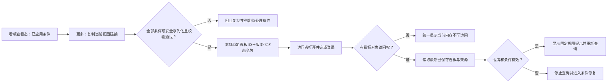

# YPBI 产品需求文档

## 0. 文档信息

| 项目 | 内容 |
|---|---|
| 文档 ID | BI-PRD-001 |
| 版本 / 状态 | 1.69 / 核心范围已确认，首批公网身份与人工凭据底座本地候选实现完成，待生产验收 |
| 优先级 | P0 |
| 用途 | 产品经理与同事阅读评审、后续 AI 继续澄清并按已确认章节开发和验收的产品需求权威源 |
| 指标权威版本 | 本次需求核对基线为 `v0.23-draft`；开发或验收开始时重新读取权威源当前版本，并在实施记录中注明实际使用版本 |
| 更新时间 | 2026-09-08 |

本文只写目标产品及稳定规则。当前代码、API、数据粒度、支持状态和改造事项统一见[现有平台调整方案](./BI-现有平台调整方案.md)。

指标 ID、名称、版本、分类、维度和口径只引用[全站指标体系](../../../全站埋点与指标体系/全站指标体系.md)；事件 ID、名称、版本、属性和定义 / 契约状态只引用[埋点权威源](../../../全站埋点与指标体系/H5全站埋点规范-协作主文档.md)。YPBI 不建立第二套公式、指标或事件定义。

埋点权威源记录产品期望和已确认的事件契约，不等于事件已经开发、上报或可分析。事件的实际交付与运行状态必须来自开发提供的真实采集和查询服务；正式可分析事件取“权威源已登记的事件”与“已开发上线、有真实数据、YPBI 可查询且验数通过的事件”的交集。只在文档中登记但未交付的事件保留为待建设且不可选；开发侧出现但权威源未登记的事件标记为未治理，不自动进入正式分析，确认后先回写权威源。

后续 AI 开发时必须同时读取本文、现有平台调整方案和[UI 防回归规则](../UI-已确认问题与防回归规则.md)。UI 文档只继承视觉、响应式和通用交互护栏，其中记录的旧入口、旧名称和旧流程不覆盖本文的目标架构。内嵌线框的准入状态与所在章节一致：已确认章节的线框是实施约束，待确认章节的线框是待讨论方案。独立 Demo、竞品截图和导出样例只帮助理解，不证明正式数据能力，也不覆盖文字规则。

### 0.1 文档阅读与质量标准

本文必须同时满足“人能快速读懂”和“AI 能无歧义执行”，不得依赖聊天记录补全需求。

本文是后续 AI 生成和迭代 YPBI 的产品规格，不套用面向传统研发评审的通用 PRD 模板或外部需求说明写作规范。只保留影响 AI 实现正确性的功能、对象关系、交互、状态、数据边界、依赖和验收门槛；不强制增加用户故事、五章式结构、逐按钮描述或重复数据字典。

| 阅读层 | 解决的问题 | 写作要求 |
|---|---|---|
| 快速理解 | 产品包含什么、页面如何组织、当前确认到哪里 | 每个模块先给目标、功能点清单和必要的页面/流程示意；使用产品语言，不堆实现术语 |
| 规则核对 | 点击后发生什么、不同状态如何处理、哪些能力不能做 | 紧随功能点写清交互、状态、边界、数据真实性和多端规则，不把关键细节藏在其他章节 |
| 开发执行 | AI 如何在不猜测的情况下实现并验收 | 明确入口、对象关系、默认值、条件、异常和验收标准；当前能力与改造缺口统一查阅调整方案 |

- 已确认事实直接陈述；建议和尚未决定的内容只能放入“待确认”，不得混写成需求。
- 对话只承担澄清和决策过程；每轮确认后必须主动回写本文及调整方案。任何会影响 AI 实现的已确认功能点、默认值、展示、交互、状态、边界或依赖都不得只留在聊天中。
- 示意图固定信息层级和操作关系，文字规则固定行为；二者冲突时以同版本文字规则为准。
- 只写会影响产品行为或验收结果的细节，不复制指标公式、事件契约、代码设计或讨论过程。
- 权威业务指标只引用指标 ID、名称和版本，公式继续由《全站指标体系》唯一维护；事件分析等通用统计方式属于 YPBI 产品计算规则，必须在对应章节记录展示名称、精确定义、公式、分子与分母、去重粒度、时间归属、缺失身份及除零处理，AI 不得根据名称自行推断。

### 0.2 快速阅读路径

| 读者 / 任务 | 推荐顺序 |
|---|---|
| 产品经理快速检查产品是否合理 | 产品定位（第 2 节）→ 产品架构（第 3 节）→ 看板与分析（第 5～9 节）→ 数据中心与管理（第 10～11 节）→ 目录与数据核对（第 15 节） |
| AI 实施某个已确认模块 | 章节状态（第 1 节）→ 对应功能章节 → 全局规则（第 4 节）→ 验收门槛（第 14 节）→ 现有平台调整方案 |
| 核对“当前能不能做” | 现有平台调整方案中的数据能力与接口映射；不得仅凭本文功能描述判断接口已支持 |

## 1. 章节状态

核心产品范围已经确认，但不代表所有数据能力都可直接上线。后续开发必须按下表读取章节状态，并按现有平台调整方案逐项通过数据准入。

| 需求 ID | 模块 | 状态 | 已确认边界 |
|---|---|---|---|
| BI-GLOBAL-001 | 产品架构与全局规则 | 已确认，可开发 | 一级结构、对象关系、真实性、指标与维度准入、筛选、响应式原则和阅读者 / 分析者 / 维护者三档最小操作角色 |
| BI-DASH-001 | 看板中心与看板编辑 | 已确认，可开发 | 查看、收藏、刷新、导出、复制当前视图链接、官方看板首次开放门槛、看板生命周期、添加分析、布局编辑和直接保存 |
| BI-DASH-003 | 核心经营总览 | 已确认，可开发 | 官方跨业务看板的首屏 9 张独立指标卡、三组关键链路、M080/M031 关键质量、客观数据状态、动态 PID × 11 项单日经营明细及完整导出边界均已确认；各指标能否进入正式环境仍须独立完成权威映射、真实查询和验数 |
| BI-DASH-002 | 指标速览 | 已确认，可开发 | 多份个人命名速览、自选权威指标观察项、单 PID/单日扫数、所选 PID 与正式大盘的日周对比、指标数据详情抽屉、真实状态、刷新导出及指标定义/分析/看板联动；只展示客观数据，不生成点评 |
| BI-DASH-004 | 功能使用概览 | 已确认，可开发 | 稳定页面/模块渗透率横向比较、完整表格、单功能详情与最多 5 项趋势比较均已确认；稳定指标引用、正式事件、同口径活跃分母、查询和验数未就绪前不得上线空壳 |
| BI-DASH-005 | 获客与新增 | 已确认，可开发 | 最近 7 个完整业务日、上一等长周期、整板筛选、六张独立详细指标卡、响应式布局、维度明细、首次激活质量、渠道结算、真实状态和完整导出均已确认；逐项权威映射、维度兼容、查询与验数仍是生产准入条件 |
| BI-DASH-006 | 活跃与留存 | 已确认，可开发 | 固定业务看板边界、首屏四张详细指标卡、活跃结构、自然月 MAU、注册 Cohort、再激活、分区日期、真实状态和导出均已确认；逐项权威映射、成熟状态、维度交叉、查询与验数仍是生产准入条件 |
| BI-DASH-007 | 视频消费表现 | 已确认，可开发 | 首屏六张独立指标卡、消费结构、有效观影、有效观影留存、内容贡献排行、交互、状态和完整导出均已确认；各指标仍须逐项完成权威映射、真实查询、加工和验数 |
| BI-DASH-008 | 播放与观看质量 | 已确认，可开发 | 播放发起、起播规模与质量、首帧耗时分布、阶段关系、结构诊断、状态和完整导出均已确认；不混入视频消费结果 |
| BI-DASH-009 | 内容发现与互动 | 已确认，可开发 | 首屏六卡、视频首页一级分类 Tab 使用、一级分类下视频内容点击、搜索承接、视频及作者/社区互动、状态和完整导出均已确认；两类点击事实分离，V1 不展示二级分类 |
| BI-DASH-010 | 会员与付费经营 | 已确认，可开发 | 首屏六张付费经营卡、新用户价值、付费与收入结构、会员引导/付费墙、状态和完整导出均已确认；会员存量、到期和续费在权威指标缺失时不建设空壳 |
| BI-DASH-011 | 支付链路与到账质量 | 已确认，可开发 | 首屏六张支付链路卡、阶段关系、支付方式和商品/到账诊断、成熟状态及完整导出均已确认；不把异质阶段伪装成真实漏斗 |
| BI-DASH-012 | 运营玩法概览 | 已确认，可开发 | 签到、任务、福利、邀请的六项核心结果、分区诊断、不适用状态、交互和完整导出均已确认；不同玩法不串成漏斗 |
| BI-DASH-013 | 产品体验与启动质量 | 已确认，可开发 | 启动次数、启动成功率、底部导航 Tab 渗透结构、局部拆解、状态和完整导出均已确认；Tab 渗透率不求和或平均 |
| BI-F-003 | 已保存分析与看板组件 | 已确认，可开发 | 对象分离、稳定引用、来源修改同步、组件展示独立和操作边界 |
| BI-F-003-GOV | 已保存分析 V1 治理边界 | 已确认，可开发 | V1 不提供来源分析删除入口，不建设复杂资产分级和被引用删除策略；底层只区分个人与维护范围，新建、另存默认归当前用户，个人来源加入官方看板前生成独立维护范围副本；存量无归属来源保持只读 |
| BI-F-004 | 指标中心 | 已确认，可开发 | 只读同步权威指标体系，不在 YPBI 改口径 |
| BI-F-006 | 事件中心 | 已确认，可开发 | 同步事件体系并显示定义、上线、可查询和验数状态 |
| BI-F-005 | 指标分析 | 已确认，可开发 | 权威指标的轻量查询、对比与拆解；默认 1 个、最多 5 个指标，最多 2 个真实交叉分组，按兼容规则展示和保存 |
| BI-F-001 | 事件分析 | 已确认，可开发 | 正式事件准入、三项基础统计、数值属性统计、事件条件、公共范围、分组、日期对比、结果、保存复用、导出和真实状态 |
| BI-F-002 | 真实漏斗分析 | 已确认，可开发 | 人数漏斗、2～10 步、有序非严格相邻组链、首步日期与成熟窗口、确定性选序、三类条件、单一分组、结果口径、中位耗时、周期对比、保存复用和真实状态 |
| BI-ADMIN-001 | 数据源维护 | 已确认，可开发 | V1 归入受保护的管理入口，由授权维护者人工轮换站1/站2 Token；普通用户查询时自动使用服务端有效凭据，不要求逐次输入，不扩展成数据建模平台 |
| BI-EXPORT-001 | 导出 V1 | 已确认，可开发 | 内容结构、真实性和命名规则已确认；技术容量由压测确定 |

只有用户明确确认后，待确认章节才能改为“已确认，可开发”。

“已确认，可开发”只代表产品规则已确认，不代表当前接口已经完整支持；开发前仍须逐项通过现有平台调整方案中的数据能力门槛。指标中心、事件中心不得先用假目录、假状态或手工固定数据冒充同步能力。

产品规划与生产准入分开：只要指标已经登记在《全站指标体系》中，规划看板时即可按理想完整目标纳入，不因“技术称已实现（待验数）”“现有口径待确认”“埋点草稿支持”或“需平台加工”等当前状态从需求中删除。当前状态只决定实施依赖、普通用户是否能看到真实结果以及能否上线；开发前仍须完成权威版本映射、真实查询和验数。权威源尚未登记的指标不得由 YPBI 自行命名或编造公式；权威源仍待确认的口径可作为目标占位引用，但必须保留其状态，不能被误读为已定口径。

正式业务数值遵循“先治理、再接入、后展示”：官方看板、指标速览及其他固定业务结果中的 KPI、比率或稳定分析结果，必须能追溯到《全站指标体系》的稳定指标 ID 和版本；即使接口已经返回结果，权威源尚未登记时也只能标记为“待指标治理”，不能直接作为正式指标发布。一级/二级分类、Tab、PID、客户端平台、新老用户、获客类型、渠道、位置等用于筛选、分组或明细展示的字段和值属于维度，不为每个具体取值复制独立指标。事件分析中的总次数、总用户数、人均次数及事件属性分组属于通用事件统计，追溯到正式事件、统计方式和条件即可，不要求把每个临时分析组合登记成业务指标。

新增固定业务结果的协作顺序为：先检索权威指标与事件，已有则复用稳定 ID；没有时由维护者输出可复制的指标登记提示词，列明业务目的、建议名称、定义、公式、主体、时间归属、去重、维度、来源、接口与验数状态，交由指标权威源确认和登记；随后 YPBI 同步指标中心、建立真实查询映射并验数，最后才进入正式界面。YPBI 不自动修改指标权威源，也不因接口“据称有数据”跳过映射和验数。

## 2. 产品定位与 V1 原则

YPBI 用两类核心能力完成“看现状—找原因—沉淀复用”：

- 看板中心持续查看官方经营看板和个人看板。
- 指标速览集中巡检个人关注的多项权威指标，不替代看板、分析或正式报表。
- 分析中心通过指标、事件和漏斗进行自助分析，并把结果保存后加入看板。

V1 的使用角色不是完整权限矩阵：业务阅读者主要查看、筛选和导出；产品/数据分析者创建并保存分析、维护个人看板；授权维护者维护官方看板和数据源。三档最小操作角色、对象归属与数据范围校验按第 4.4 节执行；第 13 节只后置完整 RBAC、审批和主动授权。

V1 优先打通真实数据闭环。便利性增强、复杂治理和高级分析默认后置；但身份、事件顺序、转化窗口、成熟样本、缺失值等会决定结果正确性的能力不能因为“V1 简化”而省略。做不到时应缩小可用范围，不能展示伪结果。

正式界面、详情、下钻和导出禁止使用 Mock、硬编码、固定趋势或推算元数据冒充真实能力。

本文所称“真实交叉粒度”是数据服务能直接返回多个条件组合后的结果，而不是把各自汇总数拼在一起；“数据水位”是当前可以可靠计算到的最晚时间；“成熟样本”是已经走完整个观察窗口、可以判断转化或流失的样本。

### 2.1 核心任务与产品成功信号

以下信号用于验证 YPBI 自身是否帮助用户完成任务，不是业务指标目标。V1 没有可靠基线时先确认信号定义，不编造目标值；只有完成事件契约、隐私边界和授权流程并实际交付后，才能采集对应基线。未获批准前只可使用已经合规存在的信号，不能用安全审计或前端临时事件代替产品埋点。

| 核心任务 | 完成闭环 | 首批观察信号 |
|---|---|---|
| 阅读看板 | 找到目标看板 → 应用筛选 → 获得有效结果 → 查看详情或导出 | 首次有效结果耗时、查询成功 / 失败、导出成功 / 失败、关键步骤流失 |
| 分析沉淀 | 配置分析 → 成功查询 → 保存 → 加入看板 | 各步成功 / 失败、完整闭环完成率、已保存分析再次使用 |
| 维护资产 | 进入可维护对象 → 编辑 → 校验 → 保存并重新读取 | 保存成功 / 失败、权限拒绝、`revision` 冲突及冲突恢复 |

## 3. 产品架构

### 3.1 一级结构

| 导航分组 | 一级入口 | 二级内容 | 说明 |
|---|---|---|---|
| 工作空间 | 看板中心 | 公共概览、我的概览、指标速览、我的收藏 | 公共概览按业务分类展开到具体看板；指标速览是独立的个人扫数对象；收藏是快捷入口，不是第三种看板对象 |
| 工作空间 | 分析中心 | 指标分析、事件分析、漏斗分析、已保存的分析 | 三类分析分别承接指标查询、事件探索和用户级有序转化；已保存的分析统一管理复用资产 |
| 工作空间 | 数据中心 | 指标中心、事件中心 | 统一承载可被分析使用的指标和事件元数据，不再设置重复的“数据字典” |
| 管理 | 数据源维护 | 连接配置、检测与运行状态 | 受保护的低频维护能力，放在导航底部管理分组，不与日常分析工作空间并列 |

```text
YPBI
├── 工作空间
│   ├── 看板中心：公共概览 / 我的概览 / 指标速览 / 我的收藏
│   ├── 分析中心：指标分析 / 事件分析 / 漏斗分析 / 已保存的分析
│   └── 数据中心：指标中心 / 事件中心
└── 管理
    └── 数据源维护：连接配置 / 检测 / 运行状态
```

“报表”与看板是不同产品形态，但当前没有已确认的固定列查询、对账、周期交付或归档需求，因此 V1 不显示报表一级入口。以后出现真实报表对象时再增加，不把“专项”或“专用代码页面”自动叫作报表。

### 3.2 稳定对象关系


| 对象 | 单义定义 |
|---|---|
| 指标 | 权威指标体系中的稳定 ID、名称和版本；YPBI 只引用 |
| 事件 | 埋点权威源中的稳定事件及版本；是否可查询还取决于上线、数据覆盖和验数 |
| 业务分类 | 指标体系提供的可调整分类，用于导航和检索，不写死在前端 |
| 分析 | 一次指标、事件或漏斗查询及结果 |
| 已保存分析 | 可重复执行的查询配置，不包含看板布局；底层归属为绑定 Owner 的个人范围或由维护者负责的维护范围 |
| 看板组件 | 某个来源分析在看板中的展示实例，只保存展示和布局信息 |
| 官方看板 | YPBI 维护并供业务阅读的正式看板 |
| 我的看板 | 当前用户创建和维护的看板 |
| 指标速览 | 当前用户创建的命名扫数配置；保存指标观察项、顺序、分类展示和默认查看条件，不保存或重新定义指标公式 |

界面名称与产品对象统一如下：`公共概览` 展示官方看板，`我的概览` 展示我的看板，`指标速览` 管理当前用户的多份命名速览，界面俗称“卡片”的对象统一称为看板组件，`已保存的分析` 是可复用分析资产。V1 不建立独立“看板模板”对象和模板入口；原系统模板迁为官方看板，原个人模板迁为我的看板。

“我的概览、指标速览、我的收藏”以及归属个人的已保存分析不要求 V1 建设完整角色权限系统，但必须具备稳定用户身份、对象归属和受保护写入；否则“我的”只是伪个人化能力，不能正式上线。

### 3.3 核心使用闭环

```text
数据中心核对可用对象 → 创建并真实查询分析 → 保存分析 → 加入看板
→ 编辑看板布局与设置 → 保存生效 → 查看、筛选、刷新和导出

个人来源加入官方看板 → 确认创建维护范围副本 → 原子生成新来源与组件引用
→ 官方组件只随维护副本更新，个人原件后续修改不影响官方结果

看板组件标题 → 返回来源分析 → 修改 → 保存前确认真实影响范围
→ 保存后所有引用该来源的组件同步查询配置
```

没有来源分析编辑权限时，点击组件标题进入只读的来源分析页；已登录且个人资产写入能力可用时，可“另存为分析”并绑定当前用户后再编辑。没有稳定身份或写入保护时禁用另存。YPBI 不再为同一结果额外建设一套通用卡片详情页。

### 3.4 看板分类

- 指标中心完整同步权威指标体系的“一级分类 → 二级分类 → 指标”，名称、归属和顺序不在 YPBI 复制维护。
- 公共概览导航采用“一级分类 → 看板”两级结构；一级分类作为官方看板的业务归属，后续随权威源灵活调整，不在 YPBI 写死。
- 每张官方看板记录一个所属一级分类和一个或多个覆盖二级分类；二级分类用于确定看板内容范围及板内业务分区，不在公共概览增加第三层目录，也不要求“一项二级分类对应一张看板”。业务判断相近的二级分类可以合入同一看板。
- 核心经营总览是跨业务分类的置顶管理视角，不是新增业务分类。
- 看板按业务判断组合，不按 API、代码模块或页面实现方式拆分。
- 广告内容不进入本阶段看板和分析需求。
- 空分类不在公共概览导航中显示。
- 分类拆分、合并或删除前必须先确定所属看板的新归属，不能产生无归属看板。
- 分类变化只调整看板的导航归属，不改变看板内的指标、来源分析和组件配置。
- 看板使用稳定 ID；分类或名称变化后，已有收藏、当前视图链接和配置关系继续有效。

## 4. 全局规则

### 4.1 时间与筛选

| 条件 | 目标规则 |
|---|---|
| 日期范围 | 固定公共条件；默认最近 7 个已完整业务日，结束日取当前看板全部组件共同可靠的数据截止日，时区 `Asia/Shanghai`，包含起止日 |
| 快捷日期 | 今天、昨天、本周、上周、本月、上月、本年、去年、过去 7/14/30/60/90/180 天和自定义；不可用项按当前对象能力禁用并说明原因 |
| 日期对比 | 通用默认不对比；具体分析或看板可在自身已确认章节中覆盖默认值，核心经营总览按第 5.2 节默认比较上一等长周期；支持上一等长周期、上周同期、上月同期、去年同期和自定义对比期，一次最多 1 个对比期 |
| 保存语义 | 快捷日期保存为动态时间方式，再次打开时重新解析；自定义日期保存具体起止日期 |
| 当前视图链接语义 | 属于保存语义的明确例外：复制所有已应用且影响服务端结果的整板 / 分区查询状态；快捷日期和对比期固化为具体日期，“全部 PID”固化为实际 PID 集合，正式大盘保留 `official_overall` 语义；详细边界见第 5.1 节 |
| 业务平台 `pid` | 固定公共条件；平台清单和数量由正式平台目录及当前查询能力动态返回，支持全部、单平台和多平台；受控平台维度的表格与导出保留当前查询实际返回的全部有效平台，图表展示按各分析模块规则处理 |
| 客户端平台 `platform` | 仅在当前看板全部组件具备相同真实交叉粒度时显示 |
| 新老用户 | 候选公共条件；完成按业务日加工、接口接入和逐指标验数后开放 |
| 获客类型 | 候选公共条件；完成归因版本、接口接入和逐指标验数后开放 |
| 来源渠道 | 仅在当前看板全部组件支持同一渠道粒度时显示 |
| 事件属性 | 用于事件分析、漏斗分析或事件专属组件，不作为混合数据源看板的通用条件 |
| 用户属性、用户分群 | V1 不显示；待正式用户属性库、分群对象和查询能力具备后再设计 |

- 筛选分为三层：看板公共筛选作用于全部组件；看板业务筛选是该看板特有、但仍被全部组件共同支持的条件；组件局部条件在来源分析中配置。V1 不提供“看似全局、实际只作用于部分组件”的筛选。
- 数据筛选用于排除不符合条件的记录；数据分组用于保留当前范围并按维度值拆开比较；按业务分类排列页面对象只影响阅读组织，不参与查询计算。“只看 Android”是筛选，“同时比较 Android / iOS”是分组，两者不复用同一配置语义。
- 看板公共筛选只能出现所有组件都真实支持且语义一致的维度；只支持部分组件的条件放在来源分析，不放入整板筛选区。
- 多维组合必须来自真实交叉粒度，不能拼接多个单维汇总。
- 多个 `pid` 只有在正式身份加工层支持跨业务平台去重时，才能输出合并区间用户数；否则只做各 `pid` 独立对比，不相加冒充跨平台去重人数。
- 不同字段之间使用 AND；同一字段选择多个值时使用 OR。来源分析固定条件与看板条件仍取 AND；发生矛盾时查询前提示并阻止。
- 筛选修改在点击“应用”后统一查询；取消不改变已生效结果。
- 看板默认条件被用户会话条件覆盖；来源分析固定条件与公共条件取交集。
- 切换看板时保留目标看板支持的会话条件；移除不兼容条件并明确提示，不静默带入或忽略。
- 已生效条件以可移除的条件标签展示；除日期和业务平台外没有其他可用条件时，隐藏“更多筛选”。
- 桌面端筛选器使用与入口锚定的弹层，手机端使用全屏抽屉；两端字段、操作符和已生效结果一致。
- 服务端必须再次校验每个筛选是否真实支持，不能只依赖前端隐藏或禁用。
- “过去 N 天”以当前对象共同可靠的数据截止日为结束日；“今天”只有在全部查询对象支持当天数据时可用。所有快捷项和同期项都显示解析后的具体起止日期与数据截止时间。
- 当前期与对比期必须使用相同指标/事件/步骤、筛选、分组、时间粒度和时区并独立查询。日历同期或自定义对比出现天数差异时显示双方实际天数和提示，不静默补齐或截断；变化率继续遵循第 4.2 节分母与缺失规则。
- “上线至今”只有在所选 `pid` 都存在可信上线日期且查询能力支持时才出现，不作为固定通用快捷项。
- 留存日期表示 Cohort 起始日；漏斗日期表示第一步发生日；快照或最新值不混入普通时间同步看板。

### 4.2 数据状态

| 状态 | 展示与计算规则 |
|---|---|
| 真实 0 | 数据已产出且服务明确返回 0；显示并参与合法计算 |
| 无记录 | 显示无记录或空值，不补 0、不参与计算 |
| 状态待确认 | 缺行含义、覆盖或数据水位未知；不参与计算 |
| 未产出 / 未成熟 | 单独标记；未成熟样本不进入分母、流失和变化率 |
| 查询失败 | 显示真实错误；保留旧结果时标明“上次成功结果”和时间 |
| 部分数据 | 明确成功与失败范围，失败范围不补 0 |
| 能力不支持 | 查询前阻止，并说明缺失的数据、粒度或组合能力 |

趋势缺失点断开，表格保留状态，排行排除缺失项。比率或变化率的分母为真实 `0`、缺失、失败或未成熟时显示 `—`，不得显示 `0%`、无穷大或通过补 0 继续计算。没有服务端真实进度时只展示不定进度；自动结论没有充分真实证据时不输出确定性结论。

统一数值显示遵循以下规则：

- 指标卡为节省空间可使用紧凑单位：绝对值达到 1 万显示“万”，达到 1 亿显示“亿”，最多保留 2 位小数并去除无意义的末尾 0；紧凑值只改变展示，不改变查询、比较或导出计算。
- 悬停提示、详情和页面聚合表展示带千分位的精确值；人数和次数默认不显示小数，金额明确币种并按权威精度展示，时长明确使用秒、分钟或小时，比率与变化率最多保留 2 位小数，比例差固定标为百分点。
- 指标权威源另有精度要求时以权威源为准；任何换算后的单位必须同时可追溯原始单位和精确值。同一图表的同类数值使用相同单位，不混用“元/万元”或“秒/小时”。
- 页面四舍五入只作用于显示，后续计算继续使用服务端原始精度。XLSX 中数值保持可计算的数值类型，不把 `1.23万`、`12.5%` 等格式化文案当作原始数值导出；单位、币种和口径写入列名或导出说明。
- 真实 `0` 按对应单位显示；缺失、失败、未成熟和不可比显示 `—` 及原因，不能经格式化变成 `0`。

列表、目录和整页状态统一如下：

| 页面状态 | 展示与可用操作 |
|---|---|
| 首次加载 | 显示骨架或不定进度；不提前显示空列表或“连接正常” |
| 真实空状态 | 区分“尚未创建”与“筛选后无结果”，只给出有效的创建、清除筛选或返回操作 |
| 无权限 | 不显示受限数据摘要；说明无权访问或操作，隐藏或禁用写入入口 |
| 首次失败 / 超时 | 显示可行动的错误摘要和重试；不显示假空态、假 0 或旧数据 |
| 已有结果后刷新失败 | 保留上次成功结果，明确标记结果时间、刷新失败范围和重试入口 |
| 目录同步失败 / 过期 | 有上次成功目录时可只读展示并标记上次同步时间；没有旧目录时显示失败态，不用本地固定数组补齐 |

### 4.3 通用交互与多端

- 来源分析页中的图表与下方结果表使用同一查询快照；图表负责看趋势和差异，表格负责核对完整聚合结果。看板组件只展示其已配置的 KPI、图表或表格，不强制在每张组件内重复放结果表。
- 图表类型由结果结构、指标单位和业务语义决定；不兼容类型禁用并说明原因，不允许仅靠前端换皮伪造图表。
- 桌面端支持完整分析配置和看板编辑；平板、手机支持查看、收藏、筛选、刷新、复制当前视图链接、进入来源分析和导出，不进入复杂编辑。
- 视觉、弹层、焦点、滚动和响应式继续遵循[UI 防回归规则](../UI-已确认问题与防回归规则.md)，本文不建立第二套设计规范。

#### 导航、刷新与草稿恢复

- 每个一级 / 二级页面，以及产品明确支持直接打开或收藏的看板、速览、已保存分析、详情页和编辑页，使用稳定语义 URL 与稳定对象 ID；轻量抽屉、菜单和瞬时编辑子态不要求独立 URL，除非对应章节另有规定。站内普通导航不得整页刷新。浏览器后退 / 前进恢复来源页面、对象和已应用查询状态，直接 URL 或刷新重新读取最新已保存对象；带“复制当前视图链接”状态令牌时按第 5.1 节的优先级恢复。
- hover、菜单开合、滚动位置、临时图例显隐等瞬时阅读状态不写入业务配置，也不要求跨刷新恢复。分页和排序只有在其属于已应用查询条件时才进入 URL 或状态令牌。
- 未保存草稿不得进入 URL 或当前视图链接。站内后退、切换对象和可控路由离开由应用提示确认；刷新、关闭标签页或关闭浏览器时，在浏览器允许离开拦截的条件下使用原生确认，不能依赖自定义提示文案或保证所有终端均出现。确认离开后丢弃草稿。查询 / 保存失败，或收起、临时关闭配置抽屉时，在当前会话保留草稿并在重新打开时恢复；显式点击“取消 / 放弃”并确认后丢弃，保存成功后清除。V1 不因此新增跨设备或跨会话自动草稿。
- 直接 URL 指向无权限、已删除、已失效或不存在对象时进入对应安全状态，不泄露对象标题、条件、结果或存在性细节。

#### 异步操作与三层状态

- 服务端对象状态、页面查询状态、表单 / 编辑草稿状态彼此独立：修改草稿不能把旧查询结果标成新结果，查询失败不能改写已保存对象，服务端保存成功前不能显示已生效。这是状态所有权和结果语义边界，不强制建立三个全局 Store 或通用状态机；仅在这些状态实际共存时分离管理。
- 查询、保存、复制和导出进行中，当前动作显示进行态并阻止同一动作重复提交；前端负责交互防抖，关键写操作仍由服务端保证幂等、并发和失败恢复。重复点击不得创建重复对象或任务。
- 网络错误、超时或服务端失败后，保留可安全恢复的非敏感输入、当前草稿、已应用条件和上次成功结果；旧结果必须标明实际查询时间和过期 / 刷新失败状态，不能按新条件加入看板或导出。Token、密码、越权值和已失效敏感条件不作恢复。
- 只有产品语义允许部分成功的批量查询或导出，才逐项列出成功与失败范围并只重试失败范围；要求原子的保存、复制和“创建维护副本并加入官方看板”等写入必须全部成功或全部失败，不得留下半成品。仅在页面提供明确的“取消任务”入口且服务端任务支持取消时，服务端确认取消后才显示任务已取消；关闭等待界面不等于取消任务，必要时再次载入对账最终状态。`revision` 冲突阻止覆盖，允许重新加载；有权限时可另存为新对象。

#### 可访问性最低线

- 核心查看、筛选、查询和适用的编辑流程可仅用键盘完成；焦点顺序随阅读顺序且始终可见。模态 Dialog 和全屏 Sheet 打开后把焦点移入合理位置并限制在其中；非模态锚定面板、菜单和列表框按对应语义管理焦点，不限制用户离开。两类覆盖层均在语义适用时支持 Esc 关闭，关闭后焦点返回触发器。
- 优先使用原生语义控件；输入具有可关联标签和错误说明，仅图标按钮必须有可访问名称和可见提示。图标只承载明确动作、状态或结构，不以装饰图标代替必要文字。
- 状态、涨跌、选中和错误不能只靠颜色表达。图表具有名称与摘要，并提供同一查询快照的结果表，或提供明确进入表格 / 来源分析的键盘可达路径。
- 以 WCAG 2.2 AA 为最低目标：普通文本对比度至少 `4.5:1`，大型文本至少 `3:1`；识别可用控件、当前状态和有意义图形所必需的非文本视觉信息至少 `3:1`。指针目标满足 AA 的 `24×24 CSS px` 最小尺寸或标准允许的间距 / 等价入口等例外；移动端优先使用 `44×44 CSS px`、桌面紧凑控件优先使用 `32×32 CSS px`，二者是项目设计默认值，不冒充 WCAG AA 硬门槛。尊重 `prefers-reduced-motion`，任何功能不得依赖动画才能完成。

#### 看板说明

- 每张官方看板必须配置看板说明；我的看板可选。查看态只在标题旁放低权重说明图标，悬停显示一句用途，点击打开轻量弹层或抽屉，不在首屏常驻大段文字。
- 完整说明只记录“这张看板帮助回答什么、适用业务范围、默认时间语义、关键已知限制”；指标定义通过指标 ID 和版本进入指标中心查看，不在说明中复制公式或口径。
- 看板说明在看板编辑态的“看板设置”内维护；官方看板仅维护者可编辑，我的看板仅 Owner 可编辑。说明变更跟随看板 `revision` 保存，不改变指标、查询和筛选配置，不扩展为评论、发布或完整版本系统。

#### 看板组件的信息层级与视图切换

看板组件统一按“标题与说明 → 查询上下文 → 合法摘要 → 主视图 → 图例/状态”阅读，避免每类来源各做一套卡头。

| 区域 | 固定规则 |
|---|---|
| 标题区 | 左侧展示组件标题和说明入口；标题进入来源分析。右侧展示当前来源真正支持的视图切换及更多菜单 |
| 查询上下文 | 常驻显示实际日期范围、时间粒度、业务范围摘要、数据截至时间和状态；卡头最多保留 3～4 项，完整筛选统一进入“筛选信息”，不得用省略号隐藏到无法判断口径 |
| 摘要区 | 只展示对当前指标有意义的当前值、周期汇总或对比。截图中的“当前值＋合计＋均值”不是通用模板：区间 UV、区间去重人数、比率、留存、人均等必须使用服务端按权威口径重算，不得累加或平均时间点结果 |
| 主视图 | 使用当前组件保存的默认图表；切换视图时复用同一查询快照和已生效条件，不改变来源分析、筛选、分组或指标口径 |
| 图例与状态 | 图例默认位于图表下方，超出一行分页；加载、无数据、失败、部分数据、未成熟和过期状态必须分别表达 |

视图切换是阅读动作，不是编辑动作。指标或事件来源在真实结果同时具备对应结构时可显示“趋势 / 对比 / 表格”，漏斗来源可显示“漏斗 / 趋势 / 表格”；单值 KPI 或缺少时间序列、对比期、分组结果时不为凑齐按钮生成不存在的视图。切换只在当前会话生效；授权维护者在看板编辑态选择并保存组件默认视图。表格展示完整聚合结果，不冒充原始事件明细。

“对比”固定替代现有含义模糊的“变化”：展示当前值、对比值、绝对差，以及合法的变化率或百分点，可使用并列柱、差值条或对比表；未选择有效对比期时隐藏或禁用并说明。V1 不在该视图生成原因、好坏判断或通用自然语言洞察，没有权威方向、目标或阈值时保持中性。

#### 折线图、柱状图与悬停信息

| 类型 | 适用与布局 | 展示规则 |
|---|---|---|
| 折线图 | 默认用于时间趋势；横轴按真实时间升序，纵轴为同单位指标 | 当前期用实线，对比期用相同颜色虚线；维度系列用颜色区分。折线可使用非零起点聚焦变化，但必须显示轴刻度和实际范围；缺失点断线。点位不密集时显示节点，密集时仅悬停显示，不能以连线暗示缺失数据 |
| 纵向柱状图 | 用于按日/周/月的离散量，或少量、短名称类别比较 | 数值轴必须包含 0；日期按时间升序，类别比较按已声明排序。并列柱最多承载当前期和一个对比期或少量同单位系列；不把大量维度挤成细柱 |
| 横向柱状图 | 用于 PID、渠道、页面、功能等类别较多或名称较长的比较 | 默认按主指标降序，完整保留受控低基数维度并允许纵向滚动；20 个或未来更多 PID 不改成 20 条难以辨认的趋势线 |
| 堆叠柱状图 | 只用于总量与互斥构成 | 继续遵循可加总、非负、覆盖完整和分组互斥门槛；多个功能渗透率可重叠，不得堆叠或改成占比图 |

- 图表卡默认把标题和查询上下文放在图上方，主图占卡片主要面积；KPI 小卡优先位于看板上部，简单单系列折线/柱状图可双列，关键趋势、多系列图和完整表格优先整行。具体宽度仍由第 5.4 节受控栅格保存，不固定像素。
- 同图只展示单位和量级可共同阅读的系列；V1 不开放任意双轴，不把人数、金额和百分比放到同一纵轴。时间趋势优先折线，离散发生量可用柱状；图表类型由指标语义与结果结构共同决定，不按视觉偏好强制替换。
- 图上默认不铺满数值标签；少量类别可显示标签，密集趋势通过悬停查看。图例支持点击隐藏/显示、悬停突出当前系列和恢复全部，临时隐藏不改变查询或导出。
- 悬停点/柱固定展示系列或维度名、实际日期、精确值和单位、数据状态；存在对比时再显示对比期实际日期、对比值、绝对差及合法变化率或百分点。提示随鼠标避让图形，不截断关键字段，也不把持久摘要改写成悬停点数值。
- 指标名称旁说明入口读取权威指标 ID、名称、版本和定义，并补充当前组件的聚合方式、实际日期、业务范围、完整筛选、数据截至时间和已知限制；需求文档和界面均不另写一套公式。

图表兼容规则：

下表只定义结果结构与图表的合法关系，不代表表中所有图表都是 V1 必做项。各分析类型的实际开放清单以其已确认章节为准。

| 结果结构 | 开放类型 | 关键条件 |
|---|---|---|
| 单个聚合值 | KPI、表格 | 无非时间分组；值和状态可被准确表达 |
| 时间序列 | 折线、面积、柱状、表格 | 存在真实时间轴；多系列单位和数量适合共轴展示 |
| 分类比较 | 横向/纵向柱状、表格 | 至少一个分类维度和一个数值；排序与缺失状态明确 |
| 总量与互斥构成 | 堆叠柱状、表格 | 单个可加总指标，分组互斥、数值非负且覆盖完整；比率、人均值等不可加总指标禁止堆叠 |
| 构成占比 | 饼图/环图、条形、表格 | 一个非负数值、分类互斥且存在明确整体；分类过多时提示改用条形或表格 |
| 多指标，且最多一个非时间维度 | 表格为默认；条件满足时开放折线/柱状 | 只有轴结构、单位和系列数量兼容时才开放图形 |
| 两个非时间维度 | 二维交叉表 | 必须来自服务端真实交叉粒度；V1 不直接绘制二维多系列图，先固定其中一个维度值后才可按另一维绘图 |
| 有序漏斗结果 | 漏斗、转化趋势、结果表 | 至少两个有序步骤，且来自真实用户级漏斗计算 |
| 明细记录 | 表格 | 不用趋势、占比或漏斗图冒充聚合结果 |

会造成数值或语义错误的图表类型直接禁用并显示原因；只是阅读效果较差时允许选择但给出提示。筛选或配置变化导致当前图表不再兼容时，明确提示并回退到表格，不静默生成错误图形。

默认展示形式按“指标或统计项 × 使用场景”配置，不是指标的永久属性。指标体系继续维护指标定义、口径、维度和推荐数据产品，不承担为每项指标指定唯一图表；同一指标在指标速览、核心总览和专题看板中可以采用不同的合法形式，但都不得改变权威口径。

每张正式看板确认时，指标引用表必须至少记录“指标 ID、指标名称、业务用途、页面位置、默认形式、详细形式”，由下列全局规则生成初始方案；产品确认整张看板及必要例外，不要求逐项重新设计图表。

正式看板首屏中承担核心经营判断的单一指标，默认使用“独立指标卡”：在一个稳定阅读单元内同时承载指标名称与口径入口、实际日期或区间、当前值、合法对比、该指标自身趋势、数据截至时间和状态。卡片之间不共享趋势，也不通过点击切换其他区域；点击标题或明确的“进入分析”进入指标分析，点击卡内趋势点只查看该点详情。缺少真实趋势或对比能力时展示对应能力状态，不生成假图、假对比或静默隐藏缺口。

独立指标卡按看板场景使用两种密度：核心经营总览等跨业务总览使用紧凑卡，保留当前值、对比和可悬停的迷你趋势；获客与新增等专题看板使用详细卡，提供带时间轴的完整趋势。数量、金额、次数按场景使用折线或柱状，比率默认折线且变化使用百分点。两种卡片只改变信息密度，不改变指标、筛选、周期聚合和比较口径。

该规则不覆盖所有 BI 组件。多指标比较、PID/渠道/平台结构、排行、Cohort 留存、真实漏斗、数值分布、阶段关系和经营明细继续使用各自的专用图表或表格；事件分析和指标分析继续使用“大图表＋完整聚合表”的来源分析布局。任何独立结构组件必须在标题或条件区明确固定的指标与维度，不依赖另一张卡片的隐式选中状态。

#### 总指标与维度结构

固定业务看板默认采用“权威指标总结果卡 → 有明确业务必要时增加该指标的结构组件 → 进入指标分析继续探索”三级关系。维度拆分不复制指标：如“Android 日活”默认表示 `M016＋platform=android` 的已验证结果，只有权威源真正登记为独立指标时才使用新指标 ID。

- 总结果卡继续只承载该指标的整体结果、对比、自身趋势和状态，不把每个维度值复制成一张 KPI 卡。结构组件始终固定一个基础指标，可在该指标权威登记且查询验证通过的低基数维度中切换；切换不改变总卡或其他组件。
- 结构组件一次只绘制一个非时间分组维度，并保留同快照精确表格。两维组合以真实交叉表为主；如需绘图，先通过固定筛选选定其中一个维度值。任何交叉值都必须由服务端直接返回，禁止总量相减、单维拼接或跨 PID 本地汇总。
- 次数、金额、总时长等可加总事实，只有在各组互斥、覆盖完整且同一事实只归属一组时，才显示堆叠或份额。人数在跨端、跨渠道等维度中可能重复，未证明互斥时只并列比较，不求和、不计算伪占比。
- 比率、留存率和人均值不得相加、堆叠或平均各组结果，默认使用并列条形、分组趋势或结果表；比率组间变化继续使用百分点。留存必须在界面中明确 D0 Cohort 归属维度，不得将目标日的客户端平台误当为 D0 分组。
- 指标本身已限定新用户、老用户或其他特定人群时，不再展示无业务意义的同名人群拆分。未归类、其他平台或归因待确认不能静默丢弃；如其存在使已展示组不能回对总量，必须显示独立状态或明确范围差异。

首批业务适用关系如下，后续只随指标权威源的维度和版本调整，YPBI 不自行扩展：

| 业务对象 | 基础指标 | 优先拆解 | 展示边界 |
|---|---|---|---|
| 活跃 | M016 | 客户端平台、新老用户 | 新/老用户在同范围回对总日活；客户端人数如可跨端重复则只并列比较。M018 月活只做已登记的客户端平台比较，不相加或伪占比 |
| 注册留存 | M020～M023 | D0 客户端平台、D0 获客类型 | 使用 Cohort 表和分组留存趋势；分母已是新增用户，不再做新老拆分；目标日允许跨端 |
| 视频消费 | M026、M101、M102、M098、M081、M036 | 客户端平台、新老用户、获客类型、来源渠道 | 可在同一“消费结构”中按已验证兼容项切换；M034/M035/M043 与该组当前登记维度不完全一致，确认前不共用选择器 |
| 有效观影留存 | M040～M042 | D0 首次有效观看客户端平台 | 使用 Cohort 表与并列留存趋势，不作普通端别构成；目标日允许跨端 |
| 获客与新增 | M001～M008 中已登记项 | 来源渠道、下载目标、获客类型 | 落地页的 Android/iOS/App Store 是下载目标，不等于客户端平台；M006/M007 仍只作趋势参考 |
| 付费与支付 | 当前权威源已登记的 M058～M072、M084～M090、M104～M105 中相关项 | 客户端平台、新老用户、来源渠道或支付方式 | 每个指标独立取权威维度交集；新增付费类指标不再做新老拆分，支付方式不伪装整板公共筛选 |
| 功能渗透 | 权威源后续确认的模块通用指标 | 模块/页面/动作/入口 | 模块对象是分组维度，不是多个同义指标；稳定指标 ID 和查询能力就绪前不进入官方看板 |

| 用户要完成的判断 | 默认展示形式 | 关键边界 |
|---|---|---|
| 查看当前核心结果及其变化 | 独立指标卡（KPI 摘要＋自身趋势） | 同时展示统计范围、单位、对比和数据状态；不能把时间点值、区间累计与区间去重混写；无真实时间序列时不生成趋势 |
| 查看规模或比率的连续变化 | 折线图 | 使用真实时间轴；缺失点断开，比率按权威口径逐期重算 |
| 查看每日新增量、金额或发生次数 | 纵向柱状图 | 数值轴从 0 开始；周期累计值不能重复画成每日值 |
| 比较 PID、渠道、平台、页面或功能 | 横向柱状图 | 受控核心维度完整展示；开放高基数维度仅图表侧按通用 TopN 规则收敛，表格和导出保持完整 |
| 查看互斥构成 | 堆叠柱状图；必要时占比视图 | 只有指标可加总、分组互斥、覆盖完整且整体分母合法时开放 |
| 查看排行 | 横向柱状图＋完整结果表 | 图形帮助比较，表格保留准确值、排序、状态和完整对象范围 |
| 查看精确值或多维交叉 | 表格 | 两维组合复杂或单位不兼容时直接以表格为主，不强行绘图 |
| 查看注册或行为留存 | Cohort 表格／专用热力视图＋留存趋势 | 只使用已成熟 Cohort；专用热力视图不因此进入通用 V1 图表选择器 |
| 查看同一主体的有序转化 | 漏斗图＋结果表 | 必须具备真实主体、顺序、转化窗口和成熟样本 |
| 只有阶段汇总或关系指标 | 阶段卡＋关系指标 | 不得使用漏斗外形暗示同一用户转化 |
| 查看数值分布或耗时质量 | 分位数或分布图＋结果表 | 只有查询返回真实分布或分位数时使用，不以平均值伪装分布；不因此默认开放通用高级图表 |

分组值的通用展示规则：

- `pid`、客户端平台、新老用户、获客类型等固定、受控、低基数核心维度默认完整展示，不使用 TopN。业务平台汇总优先使用可纵向滚动的横向柱状图完整显示当前查询返回的全部有效值；只有一个非时间分组维度时，趋势图才允许完整绘制其全部有效系列，图例分页，并支持点击隐藏/显示、悬停突出当前曲线和恢复全部。
- 渠道、内容 ID、页面、搜索词等开放型高基数维度，分组值超过 10 个时，图表默认展示整个查询周期汇总值最高的前 10 项，并提示“图表仅展示前 10 项，完整结果见下方表格”。Top10 只控制图表，不裁剪查询结果、结果表或导出；多个分析项时默认按主指标排序，并允许显式切换排序依据。
- 两个非时间维度默认使用层级或二维交叉表；用户先固定其中一个维度值后，当前结果只剩一个分组维度时才开放图形。只有服务端能够准确返回完整剩余量且统计值可加总时，图表才生成“其他”，否则不推算。

### 4.4 V1 最小身份与操作权限

V1 不建设完整角色矩阵和数据权限平台，但下列最小保护不能后置：

V1 已确认没有可复用的公司统一登录，YPBI 建立自己的独立账号登录。每位同事使用稳定、可区分的账号，作为个人看板、指标速览、收藏、已保存分析和操作审计的 Owner 身份；上游数据 Token、数据源维护密码、浏览器本地标识或共享账号均不能替代普通用户身份。

YPBI 以普通互联网可访问的 HTTPS 站点运行，不依赖先登录公司系统、内网或 VPN。“公网可访问”不等于匿名开放：除登录页、静态资源和必要健康检查外，产品页面、查询、导出和管理能力都必须先验证 YPBI 账号；未登录或会话失效时进入登录页，成功后只回到原本的同源安全路径。生产环境禁止经旧 HTTP 端口、经典版或遗留匿名 API 绕过这一边界。

首批账号管理保持最小：不开放自助注册、忘记密码邮件或账号管理页。授权运维人员通过服务端交互式 CLI 创建、重置密码、停用、重新启用或调整账号角色；不提供批量导入和账号列表接口。密码不经命令参数、环境变量、管道、管理页或文档传递。新建和重置后的账号首次登录必须修改临时密码；在完成前不能进入 BI，但必须提供退出并切换账号。密码为 12～256 个字符，新密码不得与当前密码相同。重复设置相同角色或状态不产生变更；重新启用保留原密码、角色与首次改密状态，只清除失败计数和锁定。

登录会话采用服务端可撤销会话与 `HttpOnly` Cookie，生产 Cookie 同时必须为 `Secure` 和 `SameSite=Strict`，密码、会话原文与 CSRF 密钥不得写入浏览器持久存储、URL、日志或导出。单次会话绝对有效期为 12 小时；主动退出、改密、管理员重置密码、停用、重新启用或角色实际变化必须撤销相应普通会话。维护二次会话还必须绑定账号当前安全版本，使上述安全状态变化后旧维护 Cookie 不能在重新登录后复用。连续 5 次密码错误后账号锁定 15 分钟；公网入口还必须对登录 API 做独立速率限制，但界面统一显示“账号或密码错误”，不暴露账号是否存在、已锁定或已停用。

登录请求必须通过严格同源校验；登录前尚不存在会话 CSRF，不能要求客户端伪造一个替代值。退出、改密以及所有已认证的状态变更或数据写入必须同时通过严格同源与当前会话 CSRF 校验。登录服务、身份数据库或可信反向代理配置不可用时必须失败关闭，不回退为匿名用户。一般 `401` 使当前产品内容卸载并返回登录；`403` 保留当前身份并显示无权限状态，不得把越权错误误判为退出。

V1 不做逐用户 PID 数据权限。所有已登录且具备 BI 访问权的账号，统一可查看平台目录当前动态返回的全部可用 PID；PID 数量不得硬编码，新增或停用 PID 跟随服务端平台目录生效。该规则只统一数据范围，不取消阅读者、分析者、维护者的操作权限，也不允许把多个 PID 的人数类指标直接相加。

| 对象 / 动作 | V1 最小规则 |
|---|---|
| 查看与导出 | 仅向本身具备 BI 访问权的用户展示；导出与查看使用同一数据范围，不因导出扩大可见数据 |
| 复制当前视图链接 | 登录用户可复制自己当前有权查看的看板视图；链接只复现经过服务端校验的安全查询配置，不授予看板或数据权限，打开时按访问者身份重新校验 |
| 我的看板、指标速览和收藏 | 必须有稳定登录身份；只有 Owner 可写入自己的看板、速览与收藏关系 |
| 官方看板 | 只有服务端识别的授权维护者可写；尚无可靠能力标识时保持只读 |
| 已保存分析 | V1 不增加官方 / 个人分类 Tab，但底层必须区分个人与维护范围。个人来源绑定当前 Owner；维护范围来源只允许维护者写入。个人来源加入官方看板前必须生成独立维护范围副本，存量无归属来源保持只读 |
| 数据源凭据 | 先通过普通账号识别为维护者，进入后再输入独立维护密码；维护会话同时绑定操作者和可信客户端 IP，普通账号退出或改密后同步失效，不与普通看板写入权限混用 |

V1 操作角色固定为三档并逐级包含前一档能力：

| 角色 | 可执行动作 |
|---|---|
| 阅读者 | 查看有权对象、筛选、刷新、收藏、复制当前视图链接、进入来源只读查看和导出当前有权数据 |
| 分析者 | 包含阅读者能力；创建、保存和另存自己的指标 / 事件 / 漏斗分析，维护自己的看板与指标速览，并将已验证分析加入自己的看板 |
| 维护者 | 包含分析者能力；维护官方看板、官方看板说明与分类归属，创建或维护官方看板使用的维护范围来源副本，并进入数据源维护执行已确认的连接检测和凭据更新 |

三档角色首批都固定返回 `pidScope=all`，并只从平台目录动态读取当前可用 PID；角色差异只影响操作权限。系统不提供“按账号勾选 PID”的配置，也不在前端固定 PID 数量。

角色只决定能否执行产品动作，不替代看板、PID、字段和数据范围权限。服务端必须校验角色和对象归属；前端根据结果隐藏或禁用不可用动作。现有账号未完成角色映射时按阅读者处理，不能默认获得分析者或维护者权限。

所有受保护的写入、导出和当前视图链接访问必须由服务端重新校验，不得只靠前端隐藏按钮。无可靠身份时不上线“我的”写入和收藏；跨部门数据范围、字段脱敏、主动授予他人访问权和审批仍属后续完整权限建设。

当前视图链接的复制和打开必须记录安全审计日志，至少包含操作者、看板稳定 ID、动作、结果 / 失败原因、时间和请求 ID；日志不得记录完整链接、筛选明文、身份凭据或查询结果。该日志用于安全与故障追溯，不等于新增产品埋点。

## 5. 看板中心

目标：让用户快速找到并持续阅读正式看板或个人看板，在不破坏数据口径的前提下完成筛选、追溯来源、导出和布局维护。

### 5.1 功能点清单

| # | 功能点 | 关键细节 |
|---|---|---|
| 1 | 浏览与搜索看板 | 看板中心左侧包含公共概览、我的概览、指标速览和我的收藏；公共概览按“业务分类 → 看板”二级展开，看板目录支持按名称搜索 |
| 2 | 看板收藏 | 标题旁可收藏/取消收藏；收藏只形成个人快捷入口，不复制看板 |
| 3 | 整板筛选 | 统一选择日期、业务平台及当前整板真正共同支持的更多条件 |
| 4 | 整板刷新 | 沿用已应用条件重新查询全部组件，不刷新浏览器、不重置筛选 |
| 5 | 查看组件 | 显示标题、来源类型、必要条件摘要、数据截至时间和当前状态；按第 4.3 节显示已配置主视图，并可在同一查询快照内切换来源真正支持的趋势、对比、表格或漏斗视图 |
| 6 | 进入来源 | 点击组件标题直接进入对应的指标、事件或漏斗来源分析，并把当前看板条件作为临时条件带入；有权限时默认可编辑，无权限时只读；已登录且个人资产写入可用时可另存并绑定当前用户 |
| 7 | 单组件操作 | 更多菜单提供“进入分析、导出”；查询失败时额外提供“重试”。查看态不移动或移除组件，也不删除来源分析 |
| 8 | 全屏 | 放大整张看板并保留当前筛选、状态和组件顺序 |
| 9 | 导出 | 导出整板结果包或单组件聚合结果，规则见第 12 节 |
| 10 | 复制当前视图链接 | 看板级“更多”菜单提供该入口；复制当前看板和已生效查询条件的可访问链接，不等于分享或授权 |
| 11 | 进入编辑 | 桌面端进入明确的看板编辑态；平板和手机不显示编辑入口 |
| 12 | 管理个人看板 | 我的概览支持新建空白看板、改名和删除；删除需二次确认，且不删除来源分析 |
| 13 | 复制官方看板 | 公共看板支持“另存为我的看板（保存至我的概览）”；个人副本可独立维护名称、布局和组件展示，但查询来源仍保持共享引用并随来源同步；需隔离查询时须另存来源分析并替换引用 |
| 14 | 核心经营总览 | 公共概览置顶展示跨业务核心经营看板，按独立核心指标卡、关键链路与质量、经营明细的顺序阅读；具体规则见第 5.2 节 |

页面顺序：看板名称与收藏 → 数据范围和状态 → 日期/公共筛选 → 刷新/全屏/导出/更多/编辑 → 按业务阅读顺序排列的组件。“复制当前视图链接”收在看板级“更多”菜单，不占用高频工具栏常驻位置。

三个名称相近的动作必须使用不同文案且不能混用：“复制当前视图链接”只复制可访问 URL；“另存为我的看板”创建一份新的个人看板对象；看板编辑中的“复制组件”只在当前看板新增一个继续引用同一来源分析的组件实例。

整板刷新期间保留现有结果并标记“正在刷新”。全部成功后更新最后成功查询时间；部分失败时成功组件更新，失败组件保留上次成功结果并提供单卡重试。数据截至时间来自数据源，不能用点击刷新时间替代。

复制当前视图链接遵循以下 V1 规则：

1. **入口与范围**：入口只出现在官方看板和我的看板的整板查看态，位于看板级“更多”菜单，悬停说明为“复制看板及当前已应用查询条件”；桌面、平板和手机均可使用。不扩展到指标速览、分析页或单组件；看板编辑态不提供该动作。全屏态调用时复制同一查询视图，打开后进入普通看板查看态。
2. **复现对象**：链接使用永不复用的稳定看板 ID，打开时读取该看板及其来源分析的最新已保存版本，不保存历史快照。复制时只额外记录看板修订号和复制时间用于识别后续变更；若版本已变化，仍按最新版本查询，并在结果上方提示“看板已更新，当前展示最新布局与来源，查询条件来自复制链接”。
3. **必须包含的查询状态**：记录所有已应用且会影响服务端查询的整板或分区控件，包括当前期、对比期、各分区独立日期、时间粒度、业务范围、公共筛选和业务筛选。官方大盘使用明确的 `official_overall` 语义；选择具体业务时使用当次实际 `pid` 集合，两者不得互相替代。筛选弹层未应用的草稿、编辑态未保存的默认值均不进入链接。
4. **固定语义与优先级**：今日、本周、过去 7 天等快捷日期在复制时解析为具体起止日期；“全部 PID”固化为当次实际 PID 集合，后续新增 PID 不进入旧链接。“无对比”和“无筛选”也要显式记录，避免被默认值补回。页面状态优先级固定为“校验通过的链接状态 > 当前浏览器会话 > 看板默认值”，链接对其承载的查询控件采用整组替换，不与会话或默认值拼接。
5. **安全载荷**：浏览器地址只暴露稳定看板 ID 与带版本号、可由服务端验证的不可读状态令牌，不以明文拼接筛选名称、筛选值、账号标识、凭据或查询结果。令牌只允许已登记、具备明确类型与枚举范围的链接安全字段；自由文本、用户 / 设备 / 账号 / 订单 / 支付 / 内容标识、原始表达式和任意 URL 参数默认禁止。任一已应用条件无法安全序列化或未通过服务端校验时，必须阻止生成链接并列出需处理的条件，不得悄悄省略。
6. **明确排除项**：链接不包含查询结果、缓存、账号身份、凭据、来源分析的固定条件副本、滚动位置、全屏状态、图例临时显隐、组件临时视图、表格临时排序 / 分页或任何未保存编辑。打开时使用最新已保存来源的固定条件重新查询，因此补数或口径版本变化可使数值变化，但链接承载的查询状态保持不变。
7. **生成时机与反馈**：只有当前条件已经应用且服务端链接校验完成时才允许复制；校验进行中禁用入口并显示“正在校验”。数据查询失败不阻止复制已经校验通过的查询条件。复制成功提示“当前视图链接已复制”；浏览器拒绝剪贴板权限时弹出可选中的完整链接供手动复制；生成失败时说明可处理原因并提供重试，不显示虚假成功。
8. **打开顺序**：收到链接后依次执行“登录并仅回到同源链接 → 校验看板对象访问权 → 读取最新已保存看板与来源 → 验证令牌签名、版本、类型、枚举、日期范围、条件数量和当前能力 → 发起查询”。链接状态始终按不可信输入处理；未知版本、篡改、格式错误或超限时不得发起数据查询，显示“当前视图链接无效”，提供“打开看板默认视图”和“返回看板中心”，且不得自动回退后直接查询。
9. **权限与防泄露**：链接本身不增加任何权限。对象不存在、已删除或无权访问时统一显示“当前内容不可访问”，且在完成对象权限校验前不展示看板名称、筛选值、是否存在或数据摘要。个人看板仍只有 Owner 可打开；看板改名、调整分类或移动目录不影响稳定 ID，但已删除 ID 永不分配给新看板。
10. **正常打开状态**：验证成功后自动查询，并在页面顶部显示低权重提示“已按链接载入固定视图”，同时展示实际日期和业务范围；提供“恢复看板默认视图”。恢复后清除地址中的链接状态并按当前看板默认值重新查询，不修改看板默认设置。若查询失败，保留已载入条件并沿用整板 / 单组件重试规则。
11. **失效条件修复**：只有对象有权访问后才进入条件修复。仍有权限但字段、PID 或枚举值已失效时，可列出具体失效项；条件仍存在但访问者无权使用时只显示受限项数量和通用说明，不回显敏感值。页面停止查询并要求用户确认处理；可选条件允许“移除失效条件后查询”，必选业务范围失效时必须重新选择，禁止回退到“全部”或其他默认范围。确认后同步更新当前地址状态并查询，但不修改看板默认值。
12. **生命周期边界**：V1 不建设链接列表、单独到期时间、手动撤销或访问名单；链接是否可用取决于看板仍存在、访问者仍有权限、状态令牌可验证且条件仍有效。主动分享授权仍属于后续版本。



```text
链接打开后的页面反馈
┌──────────────────────────────────────────────────────────────────┐
│ 已按链接载入固定视图｜2026-09-01～2026-09-05｜业务：A、B          │
│ 看板已更新，当前展示最新布局与来源，查询条件来自复制链接（按需）   │
│                                               [恢复看板默认视图] │
└──────────────────────────────────────────────────────────────────┘
失效时：[2 项条件已失效／1 项条件受当前权限限制] [处理条件]
处理后：可选失效项确认移除；必选业务范围重新选择；地址状态同步更新。
```

官方看板在普通查看态不能删除；个人看板删除需二次确认，只删除看板及其组件实例，不删除仍可独立存在的来源分析。

正式业务看板目标清单与建设顺序已经确认：

| 建设顺序 | 一级归属（可随权威源调整） | 正式看板 | 稳定业务范围 | 当前准入状态 |
|---|---|---|---|---|
| 已完成需求确认 | 跨分类置顶 | 核心经营总览 | 跨业务核心结果及各自趋势、关键链路、质量状态与经营明细 | 已确认，可开发；逐项数据仍须准入 |
| 首批 1 | 用户生命周期 | 获客与新增 | 落地页与下载意向、获客转化、新增规模与质量、首次激活 | 详细产品需求已确认；数据能力按指标和维度逐项准入 |
| 首批 2 | 用户生命周期 | 活跃与留存 | 活跃规模、注册留存、再激活与新老用户 | 详细产品需求已确认；数据能力按指标、时间锚点和维度逐项准入 |
| 首批 3 | 内容消费与互动 | 视频消费表现 | 观影规模与转化、有效观影与留存、观看时长与内容排行 | 详细产品需求已确认；数据能力按指标、维度、内容键和 Cohort 逐项准入 |
| 首批 4 | 商业变现 | 会员与付费经营 | 付费规模与复购、付费转化与用户价值、会员引导与付费墙 | 详细产品需求已确认；数据能力按指标、币种、用户/订单主体及维度逐项准入 |
| 首批 5 | 商业变现 | 支付链路与到账质量 | 支付提交、下单、回调、到账、失败与链路转化 | 详细产品需求已确认；数据能力按事件版本、链路关联、观察窗口和维度逐项准入 |
| 后续 1 | 内容消费与互动 | 播放与观看质量 | 播放尝试、起播、首帧、播放失败与观看质量 | 详细产品需求已确认；数据能力按事件版本、尝试关联、分位数和维度逐项准入 |
| 后续 2 | 内容消费与互动 | 内容发现与互动 | 一级分类导航使用、一级分类下内容点击、搜索、内容发现、点赞、收藏、作者和社区互动 | 详细产品需求已确认；数据能力按事件版本、分类键、内容键、搜索关联和维度逐项准入 |
| 后续 3 | 运营玩法 | 运营玩法概览 | 签到、任务、福利、分享与邀请 | 详细产品需求已确认；数据能力按玩法开通状态、事件版本、结果关联和维度逐项准入 |
| 后续 4 | 产品体验 | 产品体验与启动质量 | 启动、全局导航与基础产品体验 | 详细产品需求已确认；数据能力按启动终态、身份分母、Tab 清单和维度逐项准入 |
| 后续 5，数据前置 | 产品体验 | 功能使用概览 | 按稳定页面或模块比较真实功能渗透率 | 详细产品需求已确认；稳定指标引用、正式事件、页面/模块映射、同口径活跃分母、查询和验数未就绪前不建设空壳 |

上述顺序只确定需求澄清和目标建设先后，不代表排期承诺。分类展示名、顺序和看板归属可随权威指标体系调整；看板稳定 ID、已确认业务范围、指标口径、收藏和链接关系不得因此变化。视频消费结果与播放技术质量、付费经营结果与支付链路质量分别保留为独立看板；功能使用概览因比较对象和结果形态不同，也不并入产品体验与启动质量。

官方看板首次对普通用户出现在公共概览前，必须同时满足：首屏核心组件全部可用、默认筛选可用、至少一个下层诊断或明细区可用、整板导出可追溯。首次开放后，非核心区域可以按真实数据能力逐项增加，但不得预留空卡、假 0 或 Mock；尚无任何达到门槛看板的分类不展示空目录。该门槛只控制产品可见性，不替代每个指标、事件、维度和组件自身的数据准入与验数。

### 5.2 核心经营总览（已确认，可开发）

定位：核心经营总览是公共概览中置顶的官方跨业务看板，用于帮助用户基于真实结果、周期变化和业务构成判断经营表现，再进入专题看板或来源分析定位原因。它不是新的指标分类，也不承担展示全部指标；没有权威目标或阈值时，页面不根据单次涨跌自动判定“正常/异常”或使用红绿颜色表达好坏。

| # | 功能点 | 已确认规则 |
|---|---|---|
| 1 | 核心结果 | 首屏纳入 9 项已确认核心指标，覆盖用户规模、用户增长、内容消费、消费效率、留存和付费经营；采用主结果与效率/留存两级信息层级。九项各使用一张紧凑独立指标卡，在卡内同时展示周期结果、合法对比、自身趋势和状态，不设置跨卡片选中或共享趋势。正式展示仍须满足已接入、可查询和验数通过 |
| 2 | 自身趋势与结构边界 | 各核心指标的时间变化由其自身卡片承载，不再设置共享主趋势或随卡片点击切换的右侧结构区。业务 PID 间的核心结果比较由页面底部经营明细表承载；其他维度结构进入对应专题看板、来源分析或完整导出。后续如增加常驻结构图表，必须明确固定指标和维度，作为独立组件查询 |
| 3 | 关键链路与质量 | 核心指标卡之后采用“关键业务链路＋右侧状态栏”并列层：左侧按内容消费、获客转化、支付三组组织阶段值与已登记关系指标；右侧依次展示 M080 启动成功率、M031 起播率和客观数据状态。各组、各指标按自身接入与验数结果独立准入，不把不同主体或窗口的阶段量包装成真实用户漏斗 |
| 4 | 经营明细 | 页面底部固定提供“动态业务 PID × 11 项核心经营指标”的单日表；页面只承担高频扫数，复杂拆分进入完整 XLSX 导出。当前值、日周比较、状态、排序、单元格详情和导出分 Sheet 规则见下文；页面分页或横向滚动不得裁剪导出范围 |
| 5 | 业务范围 | 默认以正式服务返回的“大盘整体结果”为目标，并允许切换单个或多个 PID；正式大盘能力未接入时明确显示暂不支持，YPBI 不自行跨 PID 去重、求和或加权制造大盘 |
| 6 | 阅读与进入分析 | 指标卡主体只承担当前卡片阅读，不改变其他卡片或整板状态；点击卡片标题或明确的“进入分析”进入指标分析。点击卡内趋势点先展示该点详情，再由明确入口携带真实支持的日期、PID 和看板条件进入来源分析，不静默改写整板筛选 |
| 7 | 与指标速览的边界 | 核心经营总览是所有用户共同阅读的官方分析看板，强调结果、趋势、结构和定位；指标速览是每位用户自定义的单日密集扫数表，两者不互相替代 |
| 8 | 数据真实性 | 所有数值、趋势、结构、链路和明细均来自真实查询；指标未接入、未验数、无记录、未成熟、查询失败和部分数据分别展示，不用占位值或 Mock 冒充正式结果 |
| 9 | 看板说明 | 遵循第 4.3 节全局看板说明规则；查看态低权重展示，维护者在看板设置中编辑，不扩展为评论区 |

首屏指标引用和默认形式如下。这里只确定指标选择、业务用途与 BI 展示，不复制指标公式；周期聚合语义见本表后的已确认规则。

| 层级 | 指标 ID | 指标名称 | 首屏用途 | 卡片摘要形式 | 卡内自身趋势 | 基础指标状态 |
|---|---|---|---|---|---|---|
| 主结果 | M016 | 日活跃用户数 | 用户规模 | 紧凑独立指标卡 | 折线图 | 技术称已实现（待验数） |
| 主结果 | M008 | 新增用户数 | 用户增长 | 紧凑独立指标卡 | 按日柱状图 | 技术称已实现（待验数） |
| 主结果 | M026 | 观影用户数 | 内容消费人数 | 紧凑独立指标卡 | 折线图 | 技术称已实现（待验数） |
| 主结果 | M102 | 观影总时长 | 内容消费总量 | 紧凑独立指标卡（小时） | 按日柱状图 | 需平台加工 |
| 主结果 | M059 | 付费用户数 | 付费规模 | 紧凑独立指标卡 | 折线图 | 技术称已实现（待验数） |
| 主结果 | M058 | 总充值金额 | 付费结果 | 紧凑独立指标卡（显示币种） | 按日柱状图 | 技术称已实现（待验数） |
| 效率 / 留存 | M081 | 活跃用户观影率 | 内容消费渗透 | 紧凑独立百分比卡 | 折线图 | 技术称已实现（待验数） |
| 效率 / 留存 | M036 | 有效观影率 | 观看质量 | 紧凑独立百分比卡 | 折线图 | 需平台加工 |
| 效率 / 留存 | M020 | 注册用户D1留存率 | 新增用户次日留存 | 紧凑独立百分比卡，显示对应成熟批次 | 折线图（横轴为 D0 Cohort 日期） | 技术称已实现（待验数） |

桌面端默认按第一组 6 项主结果、第二组 3 项效率 / 留存组织，紧凑卡默认每行 3 张；“6＋3”固定的是业务分区和默认阅读顺序，不是不可调整的卡片版式。授权维护者可在桌面编辑态按第 5.4 节受控栅格逐张调整宽度、高度和分区内顺序，查看者不能调整；调整后仍保留两组归属、必备字段和最小可读尺寸。平板与手机按可用宽度自动换行并保持业务分区，不另存一套布局。每张指标卡嵌入自身可读趋势，不存在默认选中指标、跨卡片共享趋势、选择高亮或回退状态。百分比指标的变化显示为百分点。M020 明确展示为“注册用户D1留存率”并标注对应 Cohort 日期和成熟状态；M040“D1有效观影留存率”留在内容消费专题，不以“次留”简称混入首屏。

每张首屏卡固定展示：权威指标名称、当前看板的周期聚合语义、当前值、对比基准与合法变化、实际查询日期或 Cohort 范围、数据截至时间和数据状态。指标 ID 与权威版本可在详情或提示中查看，不用内部字段名替代产品名称。数量与金额指标在卡片正文显示变化率，悬停或指标数据详情同时显示对比基准值和绝对差值；比率指标固定显示百分点变化，不用相对变化率代替百分点。

首屏日期、周期与独立卡片规则：

1. 默认查询截至所有已准入且当前展示指标共同可靠数据水位的最近 7 个完整业务日；9 项目标指标全部准入后即使用 9 项共同水位。不机械使用 T-1，也不将尚未完整的今天并入默认区间；页面始终显示解析后的实际日期范围和共同数据截至时间。
2. M016、M026 的卡片展示所选区间成熟业务日的日均结果，卡内自身趋势展示逐日值；M008、M102、M058 的卡片展示所选区间累计结果，卡内自身趋势展示逐日值，其中 M102 首屏统一换算为小时，M058 必须显示已确认币种；M059 的卡片展示所选区间去重结果，卡内自身趋势展示每日去重值，趋势点不得相加为周期值。卡片保留权威指标名称，并用标题辅助文案或提示明确“日均 / 累计 / 区间去重”，不把展示聚合生成新的指标名称。
3. M081、M036 的卡片展示所选区间由服务端按权威指标口径重新计算的周期结果，卡内自身趋势展示逐日比率，不平均每日比率生成周期值；M020 只展示所选区间内已成熟注册 Cohort 的汇总结果，卡内使用以 D0 注册 Cohort 日期为横轴的折线趋势，并明确成熟批次范围。当前期和对比期只比较均已成熟且等价的 Cohort 范围。
4. 默认与上一等长周期比较；当前期与对比期使用相同指标、筛选、粒度、时区和有效数据范围。百分比指标使用百分点表示变化；任一时期不完整、未成熟或不具备可比能力时不生成变化值。
5. 九张卡同时展示各自结果与趋势，不存在默认选中指标或依赖点击产生的共享上下文。修改整板筛选或刷新后，各卡按同一看板会话条件独立更新；某张卡能力不支持、无记录、未成熟或失败时只更新该卡状态，不回退到其他指标，也不影响其他卡的成功结果。点击标题或“进入分析”按指标 ID 打开指标分析。
6. 启用对比时，每张卡的自身趋势使用“当前期实线＋对比期虚线”。等长周期按区间相对位置对齐；非等长周期保留两期全部真实点并明确实际天数，不补齐或截断。悬停同时展示系列、实际日期或 Cohort 日期、当前值、对比值、绝对差、合法变化率或百分点及数据状态；缺失点断开。悬停只展示点位信息，不把卡片顶部周期汇总改写为单日值。
7. 核心经营总览 V1 不再增加与经营明细重复的动态 PID 结构区。业务 PID 间的 11 项核心结果在页面底部经营明细中完整比较；客户端平台、新老用户、获客类型、渠道等结构进入对应专题看板、来源分析或完整导出，不为首屏九张卡增加隐式联动。
8. 后续如业务判断确需常驻结构分析，应新增标题和条件明确的独立图表或表格，固定写明指标与维度。结构项展示维度名称、当前值、合法周期变化和真实状态；只有指标可加总、分组互斥且整体分母一致并完成验数时才展示占比，不计算伪份额，也不依赖另一张卡片的选中状态。
9. 点击卡内趋势点只打开该指标的点位详情，提供显式“进入分析”入口；独立结构图表存在时，其维度项同样先展示点位详情。进入指标分析只携带真实支持的所点指标、实际日期或维度值及当前看板条件，不静默修改整板公共筛选；目标分析不能表达该条件时禁用入口并说明。整板 PID 公共筛选只有在全部受控组件支持同一 PID 语义时才出现。

关键业务链路采用“内容消费 / 获客转化 / 支付链路”三个轻量切换项，默认打开内容消费。切换只改变链路阅读内容，不修改整板筛选或重新定义指标；各组都采用“阶段规模在上、已登记关系指标在下”的一致结构。看板只引用权威指标 ID、名称和当前映射版本，具体公式、维度与口径继续以指标体系为准。

| 链路 | 阶段或核心结果 | 关系与诊断指标 | 展示边界 |
|---|---|---|---|
| 内容消费 | M016 日活跃用户数、M026 观影用户数、M035 有效观影用户数 | M081 活跃用户观影率 | 三个阶段值按业务阅读顺序展示；M081 只连接 M016 与 M026。M026 到 M035 之间没有已登记的用户级转化指标时不生成百分比。M036 有效观影率是观看尝试级质量指标，已在首屏效率 / 留存组展示，不连接两个人数阶段，也不在右侧关键质量区重复出现 |
| 获客转化 | M001 落地页访问次数、M003 落地页下载点击次数、M008 新增用户数 | M005 访问-下载点击转化率、M006 下载点击-注册转化率、M007 访问-注册转化率 | 展示阶段规模与三项核心转化，不绘制收窄漏斗。M005 显示权威源登记的次数口径提示；M006、M007 在当前主体和窗口尚未统一时只标记为趋势参考，不能宣称为同一用户精确转化。M099 访问-下载点击转化率（去重）作为来源分析中的诊断指标，不与三项核心转化并列抢占主位 |
| 支付链路 | M084 支付提交次数、M086 充值到账订单数 | M090 支付提交-充值到账转化率；M070 充值页访问-支付提交转化率、M071 下单成功率、M072 支付回调-充值到账转化率作为诊断 | 主区先回答提交规模、到账结果和端到端转化，再以下单、回调等诊断指标定位环节。六个支付事件是数据依赖，不机械等同于六个看板节点；没有稳定指标 ID 的事件结果不直接生成正式 KPI。M085 支付提交用户数可在来源分析及已准入的支付导出中查看，不与订单/请求级主链强行相连，也不进入页面固定 11 项经营明细 |

支付链路依赖的六个事件为：进入充值页 `recharge_page_view`、点击支付 `recharge_submit_click`、下单请求结果 `order_create_request_result`、支付等待超时 `payment_wait_timeout`、支付回调处理结果 `payment_callback_process_result`、充值到账状态变化 `recharge_credit_status_change`。用户已确认六个埋点均已存在，因此目标方案不再提出新增同义支付埋点；实施时把这一现网事实同步进事件中心，并核对实际事件版本、近期开数、链路关联、查询支持和验数状态。埋点存在不等于 YPBI 已可查询或对应指标已经可用。`payment_wait_timeout` 当前没有可直接引用的稳定指标 ID，只作为链路数据依赖；如需在看板展示超时次数或比率，须先在指标权威源新增或确认对应指标。

三组链路按组独立准入：首次建设时，只有一组所需指标已经完成权威映射、真实查询和验数，才向普通用户开放该切换项；未就绪组不会以空卡、相邻指标、本地推算或 Mock 占位。某组一旦正式发布，后续临时无记录、未成熟、部分失败或查询失败时保留入口，并按第 4.2 节展示真实状态。产品需求中的完整目标与生产环境的数据准入必须分开管理，数据缺口不删除合理需求，理想需求也不等于当前已经可用。

关键质量与数据状态规则：

| 对象 | 已确认规则 |
|---|---|
| 关键质量指标 | V1 常驻 M080 启动成功率与 M031 起播率，均使用辅助型紧凑百分比卡，不强制复制首屏完整趋势；继承整板业务范围、日期、对比期和公共筛选，变化以百分点展示。点击标题或明确入口进入指标分析；卡片其余区域不修改其他指标卡、独立图表或整板筛选，不复制指标公式 |
| 首帧耗时 | M032 首帧耗时不作为 V1 常驻卡。它是分布型指标，待权威默认统计量、分位数查询、单位和验数能力明确后，再进入质量详情或后续版本；不得用简单平均值替代耗时分布 |
| 数据准入 | M080、M031 当前目标保留，但只有事件实际上线、查询映射、PID 范围和验数全部通过后才显示真实卡片；一项可用时单卡自适应，两项均不可用时不留空壳，由数据状态说明缺口 |
| 数据状态摘要 | 固定展示实际数据范围与共同可靠数据截至时间、已覆盖 PID 数 / 当前正式范围内应覆盖 PID 数、当前期与对比期完整性、未成熟 / 无记录 / 部分失败 / 暂不支持数量，以及本次查询完成时间。应覆盖 PID 范围由正式服务动态返回，不写死数量 |
| 数据状态详情 | 点击摘要展开指标 × PID × 日期级详情，至少给出状态、实际覆盖范围、缺失或失败原因和可用来源；刷新时间仅表示本次查询完成时间，不得冒充上游数据截至时间 |
| 状态判定 | 统一使用“完整、部分数据、无记录、未产出或未成熟、查询失败、能力不支持”。状态由服务端真实能力与查询结果给出；缺行、空值或失败不得转换为 0，也不得由前端猜测完整性 |
| 判断边界 | V1 不生成综合健康分、数据质量分或自动红黄绿经营结论。没有权威目标和阈值时，只客观展示数值、变化和数据状态；状态颜色只表达系统状态，不表达经营好坏 |

经营明细表规则：

1. 经营明细是用于日常汇报取数的单日核心表，不是第二个分析工作台。V1 页面不再按活跃、留存、观影、支付、获客等主题设置切换 Tab，也不把所有细分维度常驻展开；用户通过一张表完成跨业务 PID 扫数，再用完整导出做进一步分析。
2. 表格一行代表正式服务动态返回的一个业务 PID。冻结列依次为业务产品名称、PID、产品模式、推广状态和数据状态；产品模式与推广状态来自正式配置或接口元数据，未接入时标记能力缺口，不手工编造。业务 PID 的数量和顺序由正式服务动态返回，不写死平台数量。
3. 页面固定目标集为 11 项权威指标：M016 日活跃用户数、M008 新增用户数、M026 观影用户数、M102 观影总时长、M059 付费用户数、M058 总充值金额、M081 活跃用户观影率、M036 有效观影率、M020 注册用户D1留存率、M061 活跃用户-付费转化率、M090 支付提交-充值到账转化率。前 9 项与首屏核心指标保持一致；M061、M090只补充日报所需的付费效率和到账链路质量，不加入首屏 6＋3 卡片。产品目标不因当前缺口删除，但普通用户界面只呈现已完成权威映射、可查询且验数通过的指标列，未就绪项进入数据状态与导出说明，不用空列、假 0 或 Mock 补齐。
4. 明细区使用独立的单日日期选择器。默认取整板所选范围内不晚于结束日的最近共同完整业务日；该范围没有共同完整日时显示真实无数据状态。用户切换明细日期只刷新经营明细及其导出，不改写上方看板日期和结果；界面始终显示实际数据日、时区与数据截至时间。
5. 每个指标单元格主行展示所选日 D 的当前值，次行紧凑展示较 D-1 和较 D-7；D-1、D-7 均按同一业务时区的明确自然日取值，不用最近有数日期替代。数量与金额显示相对变化率，比率与留存显示百分点差；悬停或详情同时给出两组基准的准确日期、基准值和绝对差。任一基准不可比较、无记录、未成熟、部分失败或查询失败时显示对应状态，不生成变化值。
6. 列标题使用权威指标名称，提示或详情展示指标 ID、权威版本、单位和数据日期，不复制公式。M102 显示小时，M058 显示已确认币种；M020 按所选 D0 Cohort 展示，未成熟即标记“未成熟”，不得静默替换成更早批次，其详情给出 Cohort 日期、成熟状态和排除原因。
7. 若上游提供并验数通过正式“大盘整体结果”，表格首行固定为“大盘”，其余 PID 排在下方；没有正式大盘结果时不展示该行，不由 YPBI 对各 PID 求和、平均、加权或去重制造大盘。
8. 默认按 M016 日活跃用户数当前值降序排列；用户可按其他已展示指标切换升序或降序。有效数值优先，真实 0 随后，缺失、未成熟和失败项排在末尾并保留状态。桌面和平板横向滚动时冻结身份与状态列；手机保持表格语义和横向滚动，不折成难以比较的卡片。
9. 点击具体指标单元格打开该 PID × 指标 × 所选日查询快照的数据详情，展示当前值、D-1 / D-7 基准、差异、实际日期、单位和状态，并提供明确的“进入指标分析”；整行和业务名称不设置模糊跳转。页面不永久展开 Android / iOS、新老用户、获客类型、来源渠道或支付方式列。
10. 经营明细区提供“完整导出”XLSX，输出全部真实返回 PID 与全部已准入结果，不受页面分页、横向滚动、排序或当前可视列限制。工作簿固定为 `00_导出说明`、`01_经营核心`、`02_端别与新老`、`03_留存观影`、`04_支付`、`05_获客渠道`、`99_数据状态与限制` 七个 Sheet：`01_经营核心`承载页面 11 项；其余四个业务 Sheet 承载相应已准入指标及真实可查询拆分；`00_导出说明`记录对象、条件和版本，`99_数据状态与限制`记录实际水位、逐项状态和能力缺口。
11. `02_端别与新老`仅导出权威源允许且接口直接支持、验数通过的客户端平台、新老用户、获客类型及其交叉结果；Android 老用户、iOS 新用户等组合不能由 YPBI 通过相减或拼接生成。`05_获客渠道`中的渠道值由服务动态返回，不固化渠道列；访问、下载点击、注册及转化目标引用 M001、M003、M008、M005、M006、M007，其中尚不具备同主体同窗口的指标只按权威状态标记为趋势参考。`04_支付`可纳入已准入的 M058、M059、M061、M084、M085、M086、M090、M070、M071、M072；`03_留存观影`可纳入已准入的 M020、M021、M022 及对应观影指标与真实拆分。各业务 Sheet 只输出真实支持结果，未就绪能力写入 `99_数据状态与限制`，不生成虚构数值。
12. V1 不支持自由拖拽行列、任意透视表、表内自定义公式、自动归因或页面内复杂拆分配置；后续扩展不得改变本表的单日扫数定位。

广告指标保留在指标体系和指标中心，但不进入本阶段核心经营总览。页面日期使用统一日期组件。M058 只有在当前范围的币种和充值范围已统一、可比较且完成验数时才展示总计与变化；不由 YPBI 本地换汇或混合不一致范围。未接入或未验数指标不得为保持九宫格完整而使用空壳、相邻指标或 Mock 补位；页面应按真实可用指标自适应排版。

以下低保真示意只用于帮助产品理解和讨论页面层级、阅读顺序、主要区域关系与动作分流，不是最终 UI、设计稿或验收基准，也不锁定像素、颜色、卡片宽度和最终排版。后续 AI 实现以本需求正文和《UI-已确认问题与防回归规则》为准；示意图不得被当作真实数据样例或直接照图复刻。

```text
核心经营总览
[名称 / 收藏 / 说明] [业务范围] [日期 / 对比期] [公共筛选] [刷新 / 全屏 / 导出 / 更多]
[实际范围与已生效条件｜共同数据截至时间｜完整 / 部分 / 失败状态]
┌────────────────────────────────────────────────────────────┐
│ 01A 主结果 6 张独立紧凑卡：当前值｜对比｜各自迷你趋势｜状态    │
│ 01B 效率 / 留存 3 张独立紧凑卡：比率｜百分点｜各自趋势｜状态   │
├────────────────────────────────┬───────────────────────────┤
│ 02 内容消费｜获客转化｜支付链路   │ M080 / M031 关键质量       │
│                                   │ 数据范围 / 覆盖 / 完整性状态 │
├────────────────────────────────┴───────────────────────────┤
│ 03 动态业务 PID × 11 项单日经营明细｜D-1 / D-7｜完整导出    │
└────────────────────────────────────────────────────────────┘

九张卡同时可读且互不切换；卡片标题＝进入指标分析；卡内趋势点＝先看点位详情，再显式进入分析。
```

### 5.3 页面与动作示意

```text
看板查看态
┌──────────────────────┬────────────────────────────────────────────┐
│ 搜索看板              │ 看板名称 ☆收藏｜数据范围与状态              │
│ 公共概览 / 我的概览    │ 日期｜业务平台｜更多筛选｜刷新｜全屏｜导出｜更多｜编辑 │
│ 我的收藏              ├────────────────────────────────────────────┤
│ 业务分类              │ 按业务阅读顺序排列的看板组件画布              │
│   └── 看板            │                                            │
└──────────────────────┴────────────────────────────────────────────┘
```

```text
单个看板组件
[标题 → 来源分析] [?说明]             [趋势｜对比｜表格] […进入分析 / 导出]
日期｜粒度｜业务范围｜数据截至时间｜状态                [筛选信息]
┌──────────────────────────────────────────────────────────────────┐
│ 合法摘要（按指标聚合语义出现）                                     │
│ 该组件当前主视图                                                  │
│ 图例 / 完整状态                                                   │
└──────────────────────────────────────────────────────────────────┘
```

| 操作位置 | 行为边界 |
|---|---|
| 点击组件标题 | 进入对应来源分析，并继承当前看板会话中该来源真实支持的日期、业务平台和其他筛选；继承项标记“来自看板”，不支持项明确提示“未继承”，不得静默忽略；临时条件不自动写回来源分析，只有用户主动保存才进入配置 |
| 核心经营总览指标卡主体 | 只承担该卡片的数值、对比、自身趋势和状态阅读；不触发跨组件联动，不进入分析，也不修改整板筛选 |
| 核心经营总览卡片标题 / 趋势点 | 标题进入指标分析；趋势点先展示当前值、对比值、差异、实际日期及数据状态，只有点击明确的“进入分析”才携带真实支持条件打开指标分析 |
| 独立结构图表点位 | 如专题看板配置固定指标与维度的独立结构图表，点位先展示维度值、当前值、对比和状态，再由明确入口进入来源分析；不依赖其他卡片选中状态 |
| 组件更多菜单“进入分析” | 与点击标题一致；不再建设独立、通用的卡片详情页 |
| 组件更多菜单“导出” | 导出该组件当前已生效查询快照的聚合结果 |
| 看板级更多菜单“复制当前视图链接” | 按第 5.1 节复制稳定看板 ID 与当前已应用的安全查询配置；不复制数据、不授予权限，也不包含未保存编辑或临时展示状态 |
| 组件视图切换 | 只切换同一结果的合法阅读方式，不重查、不修改来源配置；没有对比期、时间序列或所需结构时不显示对应视图 |
| 看板编辑中选中组件 | 只修改展示标题、兼容图表、尺寸和位置；不修改来源查询 |
| 看板编辑中“移除” | 只删除当前组件实例；来源分析仍保留 |
| 看板编辑中“复制” | 新增一个组件实例，默认继续引用同一个来源分析，不复制查询定义 |

第 5.5～5.15 节的所有正式业务看板均继承同一标准页头与查看交互：名称、低权重可编辑说明、收藏、实际数据范围与状态、日期 / 对比、业务范围、公共筛选、刷新、全屏、导出、看板级“更多”和有权用户的编辑入口。各章节示意图只画该看板特有的内容区域，不重复画完整页头；未在对应章节明确声明的额外入口、联动或状态不得根据示意图自行增加。

### 5.4 看板编辑 V1

| # | 功能点 | 关键细节 |
|---|---|---|
| 1 | 编辑看板设置 | 修改名称、简短说明、默认日期、默认业务平台和公共筛选；官方看板还需选择业务分类，个人看板不设置公共分类 |
| 2 | 添加分析 | 搜索、按分析类型筛选、多选并批量加入已有分析；也可新建分析，保存后返回当前看板。官方看板只直接选择维护范围来源；选中个人来源时先确认并创建维护范围副本后再加入 |
| 3 | 组织阅读 | 添加轻量章节标题或说明文字；新增分析默认插入当前章节末尾，没有当前章节时放在看板末尾 |
| 4 | 调整布局 | 拖动排序、调整组件宽度/尺寸、复制组件、移除组件 |
| 5 | 调整展示 | 修改组件展示标题和兼容图表类型；不能修改来源的指标、事件、漏斗步骤或计算规则 |
| 6 | 预览 | 使用真实查询结果预览保存后的页面结构、响应式顺序和数据状态，不使用示意数据代替 |
| 7 | 保存前校验 | 检查失效分析、不支持的公共筛选、缺失数据能力、无权限对象和来源归属；官方看板存在个人或无归属来源引用时必须阻断保存 |
| 8 | 保存或取消 | 保存当前修改或取消；存在未保存修改时，离开、切换看板或关闭页面需确认 |
| 9 | 官方看板保存 | 保存前提示“修改将直接影响公共概览”；有维护权限的用户确认后直接生效，并记录更新人和更新时间 |
| 10 | 我的看板保存 | 直接保存并生效，不设置发布流程 |

看板编辑负责“引用什么、放在哪里、如何展示”；来源分析编辑负责“查什么、怎么算、如何筛选和分组”。从看板移除组件不删除来源分析，删除看板也不自动删除来源分析。

“复制当前视图链接”不是编辑能力。进入看板编辑态后不显示该入口，也不得把未保存的名称、布局、组件或默认条件写入链接；需复制时先保存或取消编辑并返回查看态。

所有允许写入的官方看板、我的看板和来源分析，保存时必须携带读取时的对象 `revision`。服务端发现对象已被其他操作者更新时阻止覆盖，显示“已被更新”并允许重新加载；用户可在有权范围内另存新对象。`revision` 只用于并发保护，不等于草稿、发布或历史版本系统。

```text
看板编辑态
[返回] 看板名称                                  [预览] [取消] [保存]
[看板设置：名称｜说明｜业务分类（仅官方）｜默认日期｜默认平台｜公共筛选]
[添加分析] [添加分区标题] [添加说明文字]
┌───────────────────────────────────────────────┬──────────────────┐
│ 看板画布：拖动排序｜栅格吸附｜调整尺寸          │ 组件属性（选中后） │
│ 组件悬停动作：拖动｜复制｜移除                  │ 展示标题           │
│ 未选中组件时画布使用完整可用宽度                │ 兼容图表           │
│                                               │ 尺寸与位置         │
└───────────────────────────────────────────────┴──────────────────┘
保存前：失效分析｜不支持筛选｜数据能力｜操作权限校验
```

- 看板编辑不设置常驻“组件库”；点击“添加分析”后按需打开选择器，支持搜索、按指标 / 事件 / 漏斗类型筛选和多选加入。V1 不增加官方 / 个人分类 Tab，但选择器以低权重标记显示“个人 / 维护范围”，并按当前用户权限禁用不可用项。
- 分析页“保存 → 加入看板”是主要添加路径：普通保存先进入“已保存的分析”，再选择用户可编辑的“我的看板”生成组件；添加成功后立即生效并提供撤销和查看看板，添加失败不回滚已成功保存的个人分析，可原条件重试。官方看板通过其受保护的看板编辑态维护；维护者从个人来源发起加入时，须先完成第 6.2 节的维护副本确认与原子创建。
- 看板编辑内从已保存分析添加是补充路径，新增组件随本次看板修改一起保存或取消；官方看板只能保存维护范围来源引用，不能把个人或无归属来源直接挂入。个人看板允许加入当前用户有权使用的个人来源。同一来源已存在时先提示，确认后允许重复添加，以便使用不同展示方式。
- 桌面画布使用受控栅格，不允许组件重叠：宽度支持 `1/3、1/2、2/3、整行`，高度支持“标准、加高”；拖动后自动吸附和补位。
- 默认不常驻占用属性区；选中组件后从画布右侧展开可收起的属性面板，画布同步缩窄但保持栅格和顺序，关闭面板后恢复完整可用宽度。点击空白处取消选择；切换选中组件时面板直接显示新组件设置，不叠加多个面板。
- 核心经营总览的 9 张独立指标卡同样可以逐卡调整尺寸和分区内顺序；“6＋3”只保留主结果与效率/留存的默认业务分区，不把 9 张卡锁成一个不可编辑整体。调整不得移除指标名称、周期聚合语义、当前值、合法对比、自身趋势、实际日期 / 数据截至时间和数据状态，也不得改变指标所属业务分区、口径、来源或引入卡片间隐式联动。
- 分区标题与说明文字默认占整行。移除组件后底部提示“组件已移除”，在提示消失前提供一次“撤销”；V1 不建设全局撤销 / 重做历史。复制只复制组件展示设置并继续引用同一来源分析。
- 平板最多两列，手机单列，并保持桌面阅读顺序；两端不单独保存另一套布局。

缩略图快速布局、边框/圆角等精细样式、订阅、预警、审批、草稿发布、历史版本和回滚不进入 V1。

### 5.5 功能使用概览（已确认，可开发）

目标：用一处完整列表横向比较各稳定页面或业务模块被活跃用户使用的程度，再查看单个功能或少量功能的时间趋势。它回答“哪些功能被多少活跃用户使用”，不评价功能好坏，也不替代内容消费、启动质量或底部导航分析。

#### 5.5.1 功能点

| # | 功能点 | 关键细节 |
|---|---|---|
| 1 | 功能范围 | V1 只纳入有稳定 ID、业务名称和正式使用事实的页面或业务模块；按钮、入口和普通动作暂不纳入，避免功能粒度失控 |
| 2 | 全功能比较 | 主体使用可纵向滚动的横向柱状图和完整表格展示所有已准入功能的渗透率、合法比较、样本和状态；主比较不使用 TopN |
| 3 | 单功能详情 | 点击功能后展示该功能的当前结果、近 7/30 日趋势、实际日期、同口径样本和状态 |
| 4 | 多功能趋势 | 用户可主动选择最多 5 个功能同图比较；未选择时不默认塞入 Top5，完整列表始终保留 |
| 5 | 局部拆解 | 所选功能可按自身已验证的客户端平台、新老用户、获客类型等维度查看；不把局部能力包装成整板公共筛选 |
| 6 | 查看与分析 | 功能行进入以该功能为固定分组值的指标分析；需分析具体使用事件时进入事件分析，不复制查询口径 |
| 7 | 状态与通用操作 | 继承看板说明、收藏、日期比较、刷新、全屏、编辑、复制当前视图链接和完整导出；未纳入、未验数和未开通状态均可追溯 |
| 8 | V1 边界 | 不建设整体功能渗透率、功能评分、自动异常结论、每按钮分析或无正式数据的静态功能清单 |

#### 5.5.2 权威引用与默认形式

本看板复用《全站指标体系》中的模块通用“渗透率”模板，但当前尚无可供 YPBI 稳定引用的独立指标 ID。正式实施前必须先由指标权威源提供稳定引用方式；页面/模块只是该指标的分组值，不得为视频详情页、个人中心、短视频等逐项复制同义指标。

| 分析对象 | 页面用途 | 默认形式 | 详细形式 |
|---|---|---|---|
| 渗透率（模块通用模板，无独立指标 ID） | 全部已准入功能横向比较 | 横向柱状图＋完整表格 | 单功能详细结果卡＋近 7/30 日折线；最多 5 项多功能折线 |
| 稳定页面/模块 ID | 功能分组值与行级定位 | 显示业务名称，保留稳定 ID 供追溯 | 已验证维度拆解和数据状态 |

使用用户数及同口径活跃用户数只有在权威查询明确返回时才作为核对列，不由前端从比例反推，也不在本看板定义为新指标。

#### 5.5.3 页面结构与关键规则

```text
[看板名称 / 说明] [PID] [日期 / 对比]              [收藏] [刷新] [全屏] [导出] [更多]

01 各功能使用概览
[横向柱状图：全部已准入页面 / 模块渗透率]
[完整表：功能名称｜稳定ID｜当前结果｜对比｜样本｜实际日期｜状态]

02 所选功能详情
[功能选择，最多5项] [近7日 / 近30日]
[单功能结果与局部结构] [所选功能趋势；多选时同图比较]
```

- 默认最近 7 个完整业务日并比较上一等长周期；单功能趋势可切换近 7/30 日。区间结果必须由服务端按权威周期语义返回，不平均每日渗透率。
- PID 是整板条件。客户端平台、新老用户和获客类型仅在同一功能、分子与分母均真实支持时作为局部拆解；两个维度只使用服务端真实交叉表。
- 功能清单从已验数的页面/模块元数据动态返回，不把示例、前端路由标题或固定数组当成正式目录。产品未配置该功能时显示“未启用/不适用”；应该存在但无记录时显示“无记录”，两者都不是 0。
- 同一用户可使用多个功能，各功能结果之和可能超过 100%，因此不使用饼图、百分比堆叠或“合计 100%”。不得求和或平均各功能结果后命名为“整体功能渗透率”。
- 横向柱状图用于快速比较，默认按当前结果降序并完整展示所有已准入页面/模块，类别较多时在图内纵向滚动，不使用 TopN 截断。表格同样保留全集，并可按产品模块顺序、当前值或变化排序。最多 5 项限制只作用于下方多功能趋势，不作用于主比较、查询、表格或导出。

#### 5.5.4 状态、导出、多端与验收

- 当前稳定指标 ID、正式使用事件、身份去重、同口径活跃分母、页面/模块映射和通用查询均未完整就绪。产品方案虽然已确认，但这些前置项未通过时不显示空看板、假卡或 Mock；导航入口随正式数据能力一起开放。
- 完整 XLSX 固定包含 `00_导出说明`、`01_功能概览`、`02_功能趋势`、`03_功能结构`、`04_功能目录与状态`、`99_数据状态与限制`。保留指标引用/版本、稳定功能 ID、当前与对比期、样本、维度、水位和状态；未生成区域只在状态与限制中记录原因，不包含用户 ID 或原始事件。
- 桌面显示完整柱图与表格；平板压缩为单列区块；手机优先显示可搜索表格和所选功能详情，宽表横向滚动，不隐藏功能名称、结果或状态。
- 验收须证明：功能对象来自稳定元数据；横向柱图、表格和导出均保留全部已准入功能；单功能与多功能趋势使用相同口径；最多 5 项限制仅在多功能趋势生效；各功能结果未求和、平均或强行构成 100%；未启用、无记录、未产出、不支持、失败和真实 0 均分开；无稳定指标引用或查询时未上线空壳。

### 5.6 指标速览（已确认，可开发）

目标：让用户用一张密集表格一次扫完自己关注的权威指标及日、周变化，减少逐张看板点开的成本。它是看板中心内的独立专用页面，不是普通看板、不产生新的指标定义，也不新增“报表中心”。

#### 功能点清单

| # | 功能点 | 关键细节 |
|---|---|---|
| 1 | 管理多份速览 | 每位用户可创建多份独立速览并自定义名称；列表展示名称、指标数、默认 PID 和更新时间，支持打开、重命名和删除自己的速览 |
| 2 | 配置观察项 | 只从指标中心选择已映射、可查询且验数通过的权威指标；每项保存指标 ID、权威版本及可选的已验数固定筛选条件，不复制公式 |
| 3 | 排序与分类展示 | 可拖动调整观察项顺序，并按指标体系当前业务分类组织阅读；分类名称与归属实时读取权威源，不复制到速览中形成第二套分类 |
| 4 | 切换业务平台 | 一次选择一个业务平台 `pid`，整表同步切换；同一份速览在不同 PID 间复用同一观察项清单，不为每个 PID 复制配置 |
| 5 | 选择数据日 | 使用单日日期选择器，不选择日期范围；默认查询最新完整业务日，也可选择其他可查询业务日，每行明确展示实际数据日 |
| 6 | 查看所选 PID | 固定展示指标、实际数据日、所选 PID 当前值、较昨日和较上周同日 |
| 7 | 查看大盘 | 同表展示正式接口给出的整体当前值、较昨日和较上周同日；大盘范围随接口实际可用数据动态变化，不写死 PID 数量，也不受当前单 PID 选择缩小 |
| 8 | 查看指标数据详情 | 点击指标名称或所选 PID 当前值，在当前速览内打开右侧详情抽屉；桌面端不离开列表上下文，手机端改为全屏抽屉 |
| 9 | 查看短期趋势 | 详情默认展示截至所选数据日的近 30 日趋势，可切换近 7 日；在同图比较所选 PID 与正式大盘，不提供“全部历史”快捷项 |
| 10 | 后续操作 | 详情内提供“进入指标分析”“查看所在看板”“查看指标定义”；分别进入完整分析、真实引用组件所在看板和指标中心定义详情 |
| 11 | 刷新与导出 | 刷新沿用当前速览、PID 和数据日；导出当前完整表格及查询说明，遵循第 12 节真实性规则 |
| 12 | 真实状态 | 所选 PID 与大盘分别展示加载中、真实 0、无记录、未产出、未成熟、不支持、查询失败和无权限；不隐藏失败行或补 0 |

```text
指标速览
┌──────────────────┬─────────────────────────────────────────────────────────────┐
│ 搜索速览  [+ 新建] │ 速览名称 [重命名]              PID｜数据日｜刷新｜导出｜编辑指标 │
│ 日常核心指标       ├─────────────────────────────────────────────────────────────┤
│ 增长巡检           │ 指标｜实际数据日｜状态｜操作                                  │
│ 内容质量           │ 所选 PID：当前｜较昨日｜较上周同日                            │
│                    │ 大盘：当前｜较昨日｜较上周同日                                │
└──────────────────┴─────────────────────────────────────────────────────────────┘

点击指标名称或所选 PID 当前值
┌───────────────────────────────────────────────────────────────────────────────┐
│ 指标数据详情                                                        [关闭] │
│ 指标名称｜指标 ID/版本｜所选 PID｜固定筛选｜实际数据日｜更新时间             │
├───────────────────────────────────────────────────────────────────────────────┤
│ 所选 PID：当前值｜较昨日｜较上周同日      大盘：当前值｜较昨日｜较上周同日 │
├───────────────────────────────────────────────────────────────────────────────┤
│ 趋势：[近7日] [近30日]    所选 PID 与大盘双系列，结束日为当前所选数据日     │
├───────────────────────────────────────────────────────────────────────────────┤
│ 数据状态与覆盖范围                                                           │
│ [进入指标分析] [查看所在看板] [查看指标定义]                                 │
└───────────────────────────────────────────────────────────────────────────────┘
```

每份速览是独立个人对象，至少保存稳定 ID、名称、Owner、默认 PID、观察项及顺序、分类展示方式和 `revision`。名称不能为空，名称不作为对象主键；切换 PID 或数据日只改变当前查看条件，主动保存后才更新该速览的默认条件。删除需二次确认，只删除速览配置，不删除指标、分析、看板或组件。V1 不提供公开速览、共享协作、订阅、目标值或自动结论。

“Android DAU”“iOS 新增”“Android 老用户”等应保存为“权威基础指标 + 已验证固定筛选条件”的观察项；只有权威体系本身定义为独立指标时才引用独立指标 ID，不能为了速览重复创建名称相近的新指标。同一观察项在所选 PID 不支持时保留该行并显示原因，不得静默消失。

页面选择的是单个查询基准日 `D`。普通日指标使用 `D` 的结果，“较昨日”比较 `D-1`，“较上周同日”比较 `D-7`，均按 `Asia/Shanghai` 日历日确定，不自动跳到另一个有数据日期。留存等延迟成熟指标使用不晚于 `D` 的最新成熟数据，并明确实际数据日和成熟状态，其较昨日、较上周同日均以该实际数据日为锚点。累计、月度及其他特殊时间语义按权威指标已验证规则计算；不支持按日锚定或比较时显示不可比原因。不得把较早成熟数据标成基准日数据。

数量和金额指标的日、周变化展示相对变化率；比率指标展示百分点变化；累计、留存及其他特殊时间语义遵循权威指标自身定义和已验证比较规则。基准值缺失、为 0、未成熟或不可比时显示 `—` 及原因，不生成无穷大或伪 0%。所选 PID 与大盘使用相同的比较规则，但分别基于各自三期正式结果计算，不能混用基准。

“大盘”定义为正式接口在该业务日直接提供的整体结果，包含其当日覆盖范围内的全部可用业务数据；覆盖的 PID 数量可以变化，不在 YPBI 配置中写死。大盘不随页面当前单 PID 选择缩小，所选 PID 若属于接口当日覆盖范围，则自然包含在整体结果中。接口必须能返回或追溯实际数据日、覆盖范围和完整/部分状态；覆盖未知或只返回部分范围时，不得标成完整大盘。

YPBI 不遍历各 PID 去重、求和、加权或重算来制造大盘，也不把外部静态 HTML 的内嵌值接入正式页面。大盘当前值及昨日、上周同日三个基准值均取同一正式整体服务；如果现有服务尚未定位、未接入或未验数，对应列显示 `—` 和“暂不支持/待验数”，不得回退成本地聚合。V1 只呈现数值、变化和数据状态，不展示“相对大盘”、表现好坏、原因分析、自然语言点评或运营建议。

“指标数据详情”只承接当前查询条件下的数值和短期趋势，不是卡片详情，也不复制指标公式。一个指标可能没有看板组件，也可能被多张看板引用，因此不能把“进入某张卡片”作为默认详情路径：“查看所在看板”仅在存在真实引用时可用，多个引用先列出看板名称供选择，没有引用时禁用并说明。进入指标分析时携带当前 PID、基准日和观察项固定筛选作为临时条件；查看指标定义时进入指标中心，读取权威定义、版本、维度及接入验数状态。

详情趋势与摘要来自同一指标口径和当前筛选语义，结束日固定为所选基准日或该指标明确展示的实际数据日。近 7 日、近 30 日的所选 PID 与大盘序列均必须来自正式查询；任一序列缺失或部分返回时单独标记，不能补 0、用另一序列推导或隐藏异常。V1 不展示当前份额、自动评价、原因总结或评论。

产品命名固定为：指标中心的“指标详情”表示定义与数据能力；指标速览的“指标数据详情”表示当前条件下的数据结果；“指标分析”表示可继续调整筛选、分组和图表的完整分析页。三者不得复用同一个名称或混成同一页面。

桌面端支持创建和编辑速览；平板和手机按全局规则只读查看。小屏保留全部结果字段，固定指标名与当前值，其余列横向滚动，不因适配而隐藏比较值或状态。

### 5.7 获客与新增（已确认，可开发）

目标：从落地页流量、下载意向、真实新增到首次激活，判断获客规模、关键转化和新增质量，并能按真实渠道与业务范围定位差异。目标方案引用本文文档信息中的指标权威核对基线，不因当前待验数或待建设状态删减合理指标；正式展示仍须逐项通过真实查询和验数。

#### 5.7.1 功能点

| # | 功能点 | 关键细节 |
|---|---|---|
| 1 | 默认查询 | 默认最近 7 个完整业务日，以本看板全部已展示指标的共同可靠数据日为结束日；默认比较上一等长周期，一次只启用一个对比期 |
| 2 | 看板筛选 | 顶部提供日期、业务平台 PID、来源渠道和周期对比；整板筛选必须对六项首屏指标使用同一语义，不能只作用于部分卡片后静默展示 |
| 3 | 获客阶段量 | M001 落地页访问次数、M003 落地页下载点击次数、M008 新增用户数各用一张独立详细指标卡 |
| 4 | 获客转化 | M005 访问-下载点击转化率、M006 下载点击-注册转化率、M007 访问-注册转化率各用一张独立详细指标卡；本区称“获客阶段与转化”，不称真实漏斗 |
| 5 | 卡片结果 | 每张卡同时展示当前值、对比、自身趋势、实际数据日期或区间、数据截至时间和状态；卡片之间不共享趋势或选择状态 |
| 6 | 获客明细 | “增长效果”按来源渠道、下载目标或获客类型切换行维度；客户端平台入口仅在 M008 的权威语义确认且真实查询支持后开放，以完整表格展示当前维度真实支持的指标结果 |
| 7 | 首次激活质量 | M033 首个视频页到达率、M037 新增用户-有效观影转化率、M038 二次有效观看用户数作为独立指标卡置于获客明细之后 |
| 8 | 去重诊断 | M099 访问-下载点击转化率（去重）作为 M005 的诊断结果，不增加第四张首屏转化卡，可在明细、指标分析和完整导出中查看 |
| 9 | 渠道结算 | 获客明细提供独立“渠道结算”页签展示 M011 新增用户数（扣后）；不得与 M008 混成同一新增口径或用于增长、转化和留存分母 |
| 10 | 通用操作 | 继承看板收藏、刷新、全屏、复制当前视图链接、卡片进入指标分析及完整导出规则；不增加自动点评或推测原因 |

#### 5.7.2 页面结构与阅读顺序

```text
[看板名称] [日期] [PID] [来源渠道] [周期对比]  [收藏] [刷新] [全屏] [导出] [更多]

01 获客阶段与转化
[M001 访问次数]       [M003 下载点击]       [M008 新增用户]
[M005 访问-下载转化]  [M006 下载-注册转化]  [M007 访问-注册转化]

02 获客明细
[增长效果｜渠道结算]  [来源渠道｜下载目标｜获客类型｜客户端平台（待权威确认）]
[维度值 × 当前值 × 对比 × 数据状态的完整结果表]

03 首次激活质量
[M033 首个视频页到达率] [M037 新增-有效观影转化率] [M038 二次有效观看用户数]
```

线框只固定信息层级，不代表最终视觉稿。首屏六张卡在宽屏桌面按三列两行排列，保持三个阶段量在前、三个转化率在后的阅读关系；普通桌面与平板最多两列，手机单列。该规则取代旧稿的固定“两列三行”。授权维护者可在受控栅格内调整尺寸和同一业务分区内的顺序，但不能把阶段量和转化率混成没有业务分区的随机顺序。

#### 5.7.3 日期、筛选与对比

- 日期和对比复用第 4 节公共组件；本看板默认最近 7 个完整业务日并比较上一等长周期，也可改用上月同期、去年同期或自定义对比。卡片只显示当前启用的一组比较，避免多个基准同时挤占阅读空间。
- 六张首屏卡、明细表和首次激活质量均显示自己的实际数据日期与状态。落地页指标当日尚未产出时显示“未产出”，不得填 0；整板默认结束日取共同可靠数据日，避免把不同水位拼成同一完整周期。
- PID 和来源渠道只有在当前可见六项指标均支持相同筛选语义并完成验数后，才可作为整板条件开放。能力不足时在查询前指出受影响指标并阻止产生伪一致结果，不允许服务端接收后静默忽略。
- 下载目标和获客类型是获客明细的局部拆解维度，不默认作用于整板；客户端平台仅在 M008 的权威语义确认且真实查询支持后开放。新老用户不进入本看板筛选：新增及首次激活指标已限定新增用户，再做新老拆分没有有效业务含义。

#### 5.7.4 卡片与图表规则

首屏六项与首次激活三项均使用第 4.3 节的独立详细指标卡。数量/次数默认柱状趋势，比率默认折线趋势；当前期与对比期按统一相对日期对齐。悬停点展示实际日期、当前值、基准值、绝对差、合法变化率或百分点及状态。点击标题或“进入分析”进入对应指标分析；点击趋势点只查看该点详情，不改变其他卡片或整板条件。

M005、M006、M007虽然并列阅读，但不得画成连续漏斗或暗示同一用户按顺序转化。M006、M007在权威主体、归因和窗口尚未统一前须显示“趋势参考，非精确漏斗”的口径提示；未来只有满足真实漏斗条件后，才可在漏斗分析中另建用户级方案。

#### 5.7.5 获客明细

“增长效果”默认按来源渠道查看，支持切换为下载目标或获客类型；客户端平台只在 MD-01 完成权威确认且真实查询支持后出现。顶部来源渠道是限定整板范围的筛选条件；此处选择的是把结果拆开比较的行分组维度，两者语义和保存字段必须分开。V1 一次只选择一个行分组维度，切换不改变上方指标卡或其他页面区域。表格只呈现当前维度在权威源与真实查询中均已确认支持的指标；不兼容指标不生成空列，更不能以空白或 0 冒充结果。所有维度值均由查询服务直接返回，不能在 YPBI 内跨维度推算、相减或拼接。

每行展示维度值、各已支持指标的当前值与变化、实际数据日期和状态。页面单元格以当前值为主、变化为辅，悬停可查看基准值和差值；完整导出把当前值、基准值、差值、变化率/百分点和状态拆成独立列。默认按 M008 新增用户数降序；若当前维度不支持 M008，则按首个可用核心结果降序并明确排序指标。表格支持搜索、排序、分页和横向滚动，页面与导出均保留全部维度结果，不使用 TopN 截断完整表格。

“渠道结算”与“增长效果”是两个单义页签。渠道结算按真实结算渠道展示 M011 及其状态，只承担经营结算核对；名称、提示和导出 Sheet 均须明确“扣后”，不与产品真实新增并列求和或计算转化。

#### 5.7.6 状态、多端与验收

- 任一指标查询失败、未产出、未验数、维度不支持或部分返回时，仅该卡片或单元格显示真实状态，其余成功结果继续保留；缺失值不补 0，上次成功结果必须标明旧时间且不能冒充本次刷新成功。
- 首次激活质量区按 M033、M037、M038 分别准入；尚未具备真实查询的指标不使用 Mock、相邻指标或静态空壳补位。维度拆解也须逐项准入，不能直接套用整板筛选。
- 桌面支持全部查看与编辑；平板只读时保留两列或单列卡片及可横向滚动的完整表格；手机按单列阅读，固定维度名称和当前值，其余表格列横向滚动，不隐藏状态或比较结果。
- 验收时须证明：九张指标卡的摘要与自身趋势来自同一查询语义；整板筛选没有被任何组件静默忽略；三个转化率未被包装成真实漏斗；维度切换只返回兼容指标且完整表格不受 TopN 影响；落地页未产出与真实 0 可区分；M008 与 M011 不混用；导出包含查询条件、摘要、趋势、增长明细、首次激活、渠道结算和数据说明，并记录部分失败与不支持项。

本看板产品规则已确认，无剩余产品决策；指标、维度、API、加工与验数缺口见现有平台调整方案。完成缺口不改变本文已确认的业务结构，若需新增或修改指标及维度，应先回到指标权威源确认。

### 5.8 活跃与留存（已确认，可开发）

目标：同时判断登录活跃规模、注册用户留存质量、存量用户复访和首次体验失败用户再激活。V1 是引用权威指标的固定业务看板，不在分析中心新增可自由配置起始行为、留存行为的通用留存分析器；后续是否建设通用留存分析另行确认。

#### 5.8.1 功能点

| # | 功能点 | 关键细节 |
|---|---|---|
| 1 | 首屏核心判断 | M016 日活跃用户数、M020 注册用户D1留存率、M022 注册用户D7留存率、M024 存量用户次日复访率各用一张独立详细指标卡 |
| 2 | 活跃规模 | M016 展示所选活跃业务日范围内的逐日趋势，卡片主值明确对应的最新完整业务日；M018 月活跃用户数在独立自然月卡片中展示，不与日指标共用时间口径 |
| 3 | 活跃结构 | 以 M016 的分析视图分别查看客户端平台或新老用户结构；同时选择两者时只使用真实二维交叉表，不使用退役指标 ID、总量相减或单维结果拼接制造组合 |
| 4 | 注册留存里程碑 | M020、M021、M022、M023 对应 D1、D3、D7、D30；D1/D7 位于首屏，D3/D30 在注册留存详情中补齐，各自展示权威范围内的成熟 Cohort 汇总、合法对比和趋势 |
| 5 | Cohort 矩阵 | 按 D0 注册日期逐行展示 Cohort 基数及 D1/D3/D7/D30 的人数与留存率，支持人数/留存率切换、色阶、悬停解释和完整表格；不增加另一套留存公式 |
| 6 | 存量复访 | M024 与注册留存明确分区和命名，使用存量用户观察范围，不与 M020 直接合并或解释为同一种次留 |
| 7 | 再激活 | M100 48小时再次激活率、M025 72小时再次激活率位于独立诊断区，只统计满足权威失败人群和成熟窗口的结果；未接入前不放静态空卡 |
| 8 | 日期与比较 | 活跃业务日、D0 注册 Cohort、自然月和首次体验失败 Cohort 分别使用明确的时间锚点；日期控件复用全局快捷项，对比仍一次最多一组 |
| 9 | 维度拆解 | 活跃结构局部使用客户端平台和新老用户；注册留存局部使用 D0 客户端平台和获客类型。来源渠道是已确认的目标拆解，但当前未登记为 M020～M023 的权威维度，须先回到指标体系确认后才能进入详情和完整导出；所有局部维度均不提升为不适用于全板的公共筛选 |
| 10 | 通用操作 | 继承看板收藏、刷新、全屏、复制当前视图链接、卡片进入指标分析和完整导出；卡内趋势点只查看当前点详情，不联动改写其他卡片 |
| 11 | V1 取舍 | 不建设连续留存、自定义区间留存、LTV、流失用户分析、高级多分组或用户 ID 下载；不复制竞品的自由留存行为配置到固定经营看板 |

#### 5.8.2 指标引用与默认形式

| 指标 ID | 指标名称 | 页面用途 | 默认形式 | 详细形式 |
|---|---|---|---|---|
| M016 | 日活跃用户数 | 首屏活跃规模、活跃结构 | 详细指标卡＋日趋势 | 客户端平台、新老用户及已验数交叉结构表 |
| M018 | 月活跃用户数 | 月度活跃规模 | 详细指标卡＋自然月趋势 | 完整/未完整月比较明细 |
| M020 | 注册用户D1留存率 | 首屏早期注册留存 | 详细指标卡＋D1趋势 | Cohort 矩阵与人数/率明细 |
| M021 | 注册用户D3留存率 | 注册留存中间观察点 | 详细指标卡＋D3趋势 | Cohort 矩阵与人数/率明细 |
| M022 | 注册用户D7留存率 | 首屏短期留存质量 | 详细指标卡＋D7趋势 | Cohort 矩阵与人数/率明细 |
| M023 | 注册用户D30留存率 | 长期留存结果 | 详细指标卡＋D30趋势 | Cohort 矩阵与成熟状态明细 |
| M024 | 存量用户次日复访率 | 首屏存量用户回访 | 详细指标卡＋日趋势 | 存量观察日结果表 |
| M100 | 48小时再次激活率 | 首次体验失败用户短窗再激活 | 详细指标卡＋趋势 | 成熟失败 Cohort 结果表 |
| M025 | 72小时再次激活率 | 首次体验失败用户长窗再激活 | 详细指标卡＋趋势 | 成熟失败 Cohort 结果表 |

Cohort 基数作为注册留存结果的必要解释字段展示；如需映射到 M008 新增用户数，必须在同一 D0、PID 和维度范围内完成权威映射与验数，不因字段名称相似直接视为相同结果。

#### 5.8.3 页面结构与阅读顺序

```text
[看板名称] [PID] [对比]                            [收藏] [刷新] [全屏] [导出] [更多]

01 核心判断                              [活跃业务日] [D0 注册 Cohort 日期]
[M016 日活跃用户数]                       [M020 注册用户D1留存率]
[M022 注册用户D7留存率]                   [M024 存量用户次日复访率]

02 活跃规模与结构
[M018 月活跃用户数：当月值＋自然月趋势]    [M016：端别 / 新老单维结构；二维交叉表]

03 注册留存详情
[M021 注册用户D3留存率]                    [M023 注册用户D30留存率]
[D0日期｜Cohort基数｜D1｜D3｜D7｜D30 的完整 Cohort 矩阵]

04 首次体验失败用户再激活                 [失败 Cohort 日期]
[M100 48小时再次激活率]                    [M025 72小时再次激活率]
```

线框只固定信息层级和操作关系，不代表最终视觉稿。首屏四张详细卡在宽屏桌面默认两列两行，确保卡内趋势可读；平板和手机默认单列。看板维护者仍可在受控栅格内调整尺寸和同组顺序，但不能把注册留存、存量复访和再激活混成无分区的同类指标。

#### 5.8.4 日期、筛选与比较

- 本看板是全局日期规则的明确例外：页面不提供一个含义不明的日期条件强行控制全部区域。活跃业务日作用于 M016、M024 和活跃结构；注册 Cohort 日期表示 D0 注册日期，作用于 M020～M023 和 Cohort 矩阵；再激活区使用首次体验失败 Cohort 日期。三个控件都复用第 4.1 节的快捷日期、固定/动态保存和时区规则。
- M018 使用所选活跃范围结束日所在的自然月。完整自然月与上一完整自然月比较；当前月尚未结束时，只与上一月相同自然日进度比较，并同时显示双方实际日期及本月数据截至日，不能把不完整月直接与完整上月比较。
- 各区域首次打开沿用全局“最近 7 个已完整业务日”快捷方式，用户可切换更长范围。若所选 D0 范围没有 D30 等目标窗口的成熟 Cohort，对应卡片和矩阵显示“当前范围无成熟 Cohort”，不自动换用更早批次；60/90/180 天等快捷范围继续可用。
- 对比期必须使用相同时间锚点、PID、局部维度和成熟条件。注册留存只比较双方均成熟的合法 Cohort 范围并显示实际纳入范围；比率变化使用百分点。任一侧无合法样本时显示不可比及原因。
- PID 只有在对应指标的权威适用范围和真实查询均支持时才作用于组件；多个 PID 的合并人数仍受第 4.1 节跨 PID 身份规则约束。客户端平台、新老用户、获客类型和来源渠道均为对应区域的局部拆解，不能作为只有部分组件生效的伪全局筛选；当前权威源未登记的“注册留存 × 来源渠道”继续标记待确认，不由 YPBI 自行增加。

#### 5.8.5 卡片、结构与 Cohort 规则

首屏四项、M018、M021、M023、M100 和 M025 使用独立详细指标卡：卡内展示指标名称、实际日期或 Cohort 范围、主值、当前一组比较、自身趋势、数据截至时间和状态。M016、M018 等人数指标默认折线展示连续变化；留存率、复访率和再激活率使用折线并以百分点展示变化。卡片之间没有选中态或共享趋势。

活跃结构是独立结构组件，不依赖点击 M016 卡片后才出现。默认以 M016 为固定指标，提供“客户端平台”和“新老用户”两个单维结构入口；一次选择一个维度时展示可读结构图并保留精确表格。用户同时查看客户端平台 × 新老用户时，V1 固定使用接口直接返回的二维交叉表；只有先固定其中一个维度值后，才按另一维度绘图，不默认绘制 Android 新用户、Android 老用户、iOS 新用户、iOS 老用户四条高密度趋势。若只有单维真实结果，则只展示已支持的一维，不能由总量相减或两个单维结果拼接二维组合。结构分类完整展示，不使用 TopN。

Cohort 矩阵固定展示 D0 日期和 Cohort 基数，目标列使用 M020、M021、M022、M023。已成熟的真实 0 可以显示为 0；未到观察期、仍在迟到缓冲或尚未完成加工的单元格显示明确状态与预计可用时间，不留成无解释空白，也不进入汇总、趋势和比较。汇总结果严格使用权威指标体系登记的成熟 Cohort 口径，不平均各行百分比。切换人数/留存率只改变展示，不重新定义 Cohort 或筛选。

#### 5.8.6 状态、导出、多端与验收

- 指标按组件独立准入。部分组件不可用时保留其他真实结果；未映射、未验数、无记录、未成熟、查询失败、部分数据和能力不支持分别展示，任何缺失都不得转成 0。刷新失败保留旧值时必须标明上次成功日期。
- 完整 XLSX 固定包含 `00_导出说明`、`01_活跃核心`、`02_活跃结构`、`03_注册留存`、`04_Cohort明细`、`05_再激活`、`99_数据状态与限制`。页面切换、分页或尺寸不裁剪导出范围；未准入区域不生成假业务 Sheet，导出说明与状态限制分别记录对象条件，以及未生成原因、指标 ID/版本、各时间锚点、真实纳入范围、成熟状态、数据水位和失败范围。
- V1 的普通聚合导出不包含用户 ID、用户行为序列或原始事件。以后如需留存/未留存用户清单，必须另行设计权限、脱敏和审计，不能跟普通看板导出混在一起。
- 桌面支持全部查看和编辑；平板、手机按全局规则只读。Cohort 矩阵在小屏固定 D0 日期和 Cohort 基数，其余列横向滚动；不得为了适配隐藏 D30、状态或实际纳入范围。
- 验收须证明：四张首屏卡各有独立真实趋势；M018 自然月与日指标未混用；不同时间锚点清楚可见；M020 与 M024 不混成同一种次留；未成熟 Cohort 不补 0、不进入汇总或比较；Android/iOS × 新/老等组合来自真实交叉粒度；再激活区只在正式加工和验数后开放；完整导出与页面查询快照一致。

本看板产品规则已确认，无剩余产品决策。注册留存的来源渠道拆解，以及 M024、M025、M100 等指标能否跟随 PID，属于指标权威适用范围待确认项，不由 YPBI 先行定义。各指标是否具备正式查询、成熟状态、局部维度和跨 PID 能力，按现有平台调整方案逐项准入；数据能力不足不会反向删除理想产品结构。

### 5.9 视频消费表现（已确认，可开发）

目标：判断有多少用户进入视频消费、观看多少次和多长时间、活跃用户中的观影渗透、观看是否达到有效标准、有效消费能否持续，以及哪些内容贡献主要消费。它不承担播放发起、起播、首帧耗时和播放失败等技术质量诊断，也不把点赞、收藏等互动当作观看深度。

#### 5.9.1 功能点

| # | 功能点 | 关键细节 |
|---|---|---|
| 1 | 首屏核心判断 | M026、M101、M102、M098、M081、M036 各用一张独立详细指标卡；同屏回答人数、次数、总时长、人均深度、观影渗透和有效质量 |
| 2 | 消费结构 | 从已准入核心指标中选择一项，按客户端平台、新老用户、获客类型或来源渠道拆解；一次一个维度可绘图并保留精确表，两个维度只使用真实交叉表 |
| 3 | 有效观影 | M034、M035、M043 作为第二层独立卡片，补充有效观看规模、有效观影用户规模和有效消费深度；不重复展示首屏 M036 |
| 4 | 有效观影留存 | M040、M041、M042 使用独立 D0 有效观影 Cohort 区，展示 D1/D3/D7 结果、成熟状态、趋势和 Cohort 明细，不与注册留存混用 |
| 5 | 内容贡献排行 | 默认按 M101 排序，可切换 M097、M102、M034、M036；图形显示 Top10，完整表格、分页和导出保留全部真实结果 |
| 6 | 日期与比较 | 默认最近 7 个共同完整业务日及上一等长周期；普通趋势按业务日，有效观影留存按 D0 Cohort 日期，双方的实际范围、对比范围和水位均可见 |
| 7 | 筛选范围 | PID 是目标整板业务范围；只有所有当前展示组件支持同一 PID 语义时才开放。端别、新老、获客和渠道是能力受控的局部结构条件，不伪装成全板均生效的公共筛选 |
| 8 | 查看与分析 | 点击卡片标题进入对应指标分析；点击趋势点或排行行先查看该点的真实条件、值、基准和状态，再由明确入口携带可支持条件进入分析 |
| 9 | 保存与通用操作 | 继承看板说明、收藏、刷新、全屏、编辑、复制当前视图链接和完整导出；卡片内部的指标或排行切换只改变本组件，不静默改写整板筛选 |
| 10 | 真实数据状态 | 指标按组件独立准入；未映射、未验数、无记录、未成熟、部分数据、失败和能力不支持分别展示，旧接口近似值、缺失补 0 和 Mock 均不能占位 |
| 11 | V1 边界 | M031 起播率、M032 首帧耗时及播放失败进入“播放与观看质量”；点赞、收藏和搜索进入“内容发现与互动”；不建设用户清单、自动原因诊断或原始事件导出 |

#### 5.9.2 指标引用与默认形式

| 指标 ID | 指标名称 | 页面用途 | 周期摘要 | 默认形式 | 详细形式 |
|---|---|---|---|---|---|
| M026 | 观影用户数 | 首屏消费人数、消费结构 | 所选范围成熟业务日的日均结果 | 详细指标卡＋日折线 | 单维结构图、精确表和真实二维交叉表 |
| M101 | 观影次数 | 首屏消费频次、内容排行默认指标 | 所选范围累计结果 | 详细指标卡＋日柱状图 | 内容排行及完整结果表 |
| M102 | 观影总时长 | 首屏消费总量、内容排行 | 所选范围累计结果，界面统一显示小时 | 详细指标卡＋日柱状图 | 内容排行及完整结果表 |
| M098 | 观影用户人均观影时长 | 首屏消费深度 | 查询服务按权威口径返回的周期结果 | 详细指标卡＋日折线 | 维度结构和精确结果表 |
| M081 | 活跃用户观影率 | 首屏消费渗透 | 查询服务按权威口径返回的周期结果 | 详细百分比卡＋日折线 | 维度结构和分子分母状态摘要 |
| M036 | 有效观影率 | 首屏有效观看质量、内容排行 | 查询服务按权威口径返回的周期结果 | 详细百分比卡＋日折线 | 内容排行同时展示必要样本规模 |
| M034 | 有效观看次数 | 有效观影规模 | 查询服务返回的周期结果 | 第二层详细卡＋日柱状图 | 结构和完整结果表 |
| M035 | 有效观影用户数 | 有效消费用户规模 | 查询服务返回并明确时间去重语义的周期结果 | 第二层详细卡＋日折线 | 结构和完整结果表 |
| M043 | 人均有效观看时长 | 有效消费深度 | 查询服务按权威口径返回的周期结果 | 第二层详细卡＋日折线 | 结构和完整结果表 |
| M040 / M041 / M042 | D1 / D3 / D7有效观影留存率 | 有效消费持续性 | 只纳入对应观察点已成熟的 D0 Cohort | 三张紧凑卡＋并列趋势 | Cohort 表、成熟状态和实际纳入范围 |
| M097 | 起播次数 | 内容排行可选的成功起播量 | 只在排行区使用 | 排名切换项 | 完整内容结果表 |

M026、M101、M102、M098、M081、M036 共享结构选择器只是理想目标；实现时仍按权威源逐项返回真实兼容维度。M034、M035、M043 在权威维度尚未对齐前使用各自独立能力声明，不因同属有效观影而继承其他指标的维度。M040～M042 的客户端平台表示 D0 首次有效观看平台，目标日允许跨端，不能解释为目标日发生行为的客户端平台。

#### 5.9.3 页面结构与阅读顺序

```text
[看板名称 / 低权重说明] [PID] [日期 / 对比]         [收藏] [刷新] [全屏] [导出] [更多]

01 消费核心结果：六张独立详细卡
[M026 观影用户数] [M101 观影次数] [M102 观影总时长]
[M098 人均观影时长] [M081 活跃用户观影率] [M036 有效观影率]

02 消费结构
[指标] [客户端平台 / 新老用户 / 获客类型 / 来源渠道]
[单维结构图；两维时为真实交叉表] [精确结果表]

03 有效观影
[M034 有效观看次数] [M035 有效观影用户数] [M043 人均有效观看时长]

04 有效观影留存                                    [D0 Cohort 日期]
[M040 D1] [M041 D3] [M042 D7] [成熟 Cohort 趋势与明细]

05 内容贡献排行
[排行指标切换] [Top10 图]
[完整内容表 / 搜索 / 排序 / 分页 / 导出 / 进入指标分析]
```

线框只固定层级、阅读顺序和动作关系，不是最终视觉稿。桌面首屏六卡默认三列两行，有效观影三卡默认三列；平板两列、手机单列。排行在桌面使用图表加完整表格，小屏保留完整表格语义和横向滚动，不把多字段压成不可比较的信息卡。

#### 5.9.4 日期、聚合、结构与排行规则

- 首屏卡均展示权威名称、指标 ID/版本入口、周期摘要语义、当前值、同口径对比、绝对差或合法变化、实际日期、数据截至时间和状态。M026 不把每日去重人数累加后称为区间观影用户数；需要多日累计规模时只能引用权威源登记的对应结果，不能在 YPBI 临时改名生成。
- M101、M102 的周期累计必须来自完整范围内的正式查询结果；M098、M081、M036 由服务端按权威周期语义返回，禁止平均每日人均值或百分比。比率变化显示百分点；分母无效、任一侧不完整或不可比时不生成变化。
- 消费结构遵循第 4.3 节的全局维度规则。默认以 M026 和客户端平台打开；切换指标后只显示该指标已登记、真实可查询且验数通过的维度。受控核心分类完整展示，不使用 TopN；来源渠道等高基数维度可以只裁剪图形，但表格和导出不得裁剪。
- 有效观影留存只使用 M040～M042。D0 日期、Cohort 基数、观察点、成熟范围和规则版本必须可见；未成熟不补 0、不换用更早 Cohort，不与 M020～M023 注册留存拼接。不同有效观看规则版本不得混入同一趋势或汇总。
- 内容排行以稳定内容 ID 为查询和跳转键，以可读标题和内容类型为展示字段；标题变更不能生成新内容。默认 M101，切换 M097、M102、M034 或 M036 后复用同一查询范围。M036 等比率排行必须同时展示必要的分子、分母或样本规模；没有权威样本门槛时 V1 不擅自过滤，只明确标记低样本结果。
- Top10 只用于图形可读性，不等于查询限制。完整表至少包含名次、内容名称、稳定 ID、内容类型、所选排行指标、必要样本、当前期、对比期、变化和状态；允许搜索、排序和分页。点击行只携带真实支持的视频条件进入指标分析；稳定视频键尚未对齐时禁用跳转并说明原因。
- 点赞、收藏、评论和分享不作为本看板的排行列或综合分；收入也不混入内容消费贡献。后续需要跨消费、互动或收入的内容综合评价时必须单独确认权威指标和权重，V1 不生成内容质量分。

#### 5.9.5 状态、导出、多端与验收

- 当前产品目标按完整指标体系保留，但普通用户只看到已完成权威映射、正式查询与验数的真实组件。部分指标未准入时其余组件正常展示；已发布组件后来失败时保留上次成功结果并明确时间和失败状态。
- 完整 XLSX 固定包含 `00_导出说明`、`01_消费核心`、`02_消费结构`、`03_有效观影`、`04_有效观影留存`、`05_内容排行`、`99_数据状态与限制`。各业务 Sheet 保留当前期、对比期、实际日期、维度、指标 ID/版本、数据水位和逐项状态；页面 Top10、分页和排序不得裁剪导出全集。未准入区域不生成假数据 Sheet，未生成原因写入 `99_数据状态与限制`。
- 普通看板导出不包含用户 ID、播放序列或原始事件；内容行只导出查询权限范围内的聚合结果。没有稳定内容 ID、完整查询或合法对比时不得用展示标题、本地拼表或旧排行字段补齐。
- 验收须证明：六张首屏卡互不切换且各有真实自身趋势；M026 没有被累加成区间 UV；比率和人均值未平均；二维结构来自服务端交叉结果；有效观影留存使用 D0 Cohort 且未成熟不补 0；M036 没有串成 M026 到 M035 的用户转化；排行 Top10 不裁剪表格和导出；M031/M032、互动指标和 Mock 均未混入本看板。

本看板产品规则已确认，无剩余 YPBI 产品决策。M098 多日语义、M035 时间去重语义、M034/M035/M043 的维度兼容、M040～M042 的 PID 适用范围，以及内容排行稳定视频键和内容类型层级，仍须在指标权威源中确认或补全；确认前保留目标位置但不得由 YPBI 猜测、派生或用旧字段替代。

### 5.10 会员与付费经营（已确认，可开发）

目标：判断整体充值规模、真实付费人数、付费效率、用户价值和复购贡献，并观察会员引导与内容付费墙是否有效。它不承担下单失败、支付回调、到账延迟等支付技术问题，也不在权威指标缺失时自行创造会员存量、到期或续费口径。

#### 5.10.1 功能点

| # | 功能点 | 关键细节 |
|---|---|---|
| 1 | 首屏付费经营 | M058、M059、M061、M067、M104、M105 各用一张独立详细指标卡，回答金额、人数、转化、人均价值和复购贡献 |
| 2 | 新用户付费价值 | M064、M088 作为第二层独立卡；M058、M059、M067 仅在权威源允许且查询直接支持时提供新用户分析视图，不复制成新指标 |
| 3 | 用户价值补充 | M087 位于第二层，明确分母人群后展示；不与 M067 混称客单价，也不使用现有“渠道客单价”替代 |
| 4 | 付费结构 | 从已准入金额、人数、转化、人均或复购指标中选择一项，按客户端平台、新老用户、来源渠道、支付方式或商品等兼容维度查看；两个维度只使用真实交叉表 |
| 5 | 收入结构 | M065、M066 分别展示 VIP 和金币充值金额；只有范围完整、币种一致且分类互斥时才展示构成或合计关系 |
| 6 | 会员引导与付费墙 | M073、M068、M069 作为底部独立业务区，按引导位、会员类型、付费墙类型、内容类型或动作等自身维度查看 |
| 7 | 订单诊断边界 | M060 只在数据说明或订单诊断中显示，不与 M059 付费用户数混用，不用旧“充值人数”错误字段名替代 |
| 8 | 查看与分析 | 卡片标题进入对应指标分析；趋势点和结构项先展示点位详情，再携带真实支持的日期、PID 和维度条件进入分析 |
| 9 | 状态与通用操作 | 继承看板说明、收藏、日期比较、刷新、全屏、编辑、复制当前视图链接和完整导出；币种、退款、代付、到账和周期去重状态必须可追溯 |
| 10 | V1 边界 | 暂不建设会员存量、到期会员、续费率、会员购买成功率和 LTV 空壳；这些能力先在指标权威源登记，再进入看板 |

#### 5.10.2 指标引用与默认形式

| 指标 ID | 指标名称 | 页面用途 | 周期摘要 | 默认形式 | 详细形式 |
|---|---|---|---|---|---|
| M058 | 总充值金额 | 首屏充值结果 | 所选范围累计，强制显示币种和纳入范围 | 详细金额卡＋日柱状图 | 付费结构和精确结果表 |
| M059 | 付费用户数 | 首屏真实付费规模 | 所选范围区间去重结果 | 详细人数卡＋日折线 | 付费结构和精确结果表 |
| M061 | 活跃用户-付费转化率 | 首屏付费渗透 | 查询服务按权威口径返回周期结果 | 详细百分比卡＋日折线 | 分子分母状态摘要和结构表 |
| M067 | 付费用户人均充值金额（ARPPU） | 首屏付费用户价值 | 查询服务按权威口径返回周期结果 | 详细金额卡＋日折线 | 商品、端别、新老等兼容结构 |
| M104 | 复购用户数 | 首屏复购规模 | 所选范围区间去重结果 | 详细人数卡＋日折线 | 复购结构和精确结果表 |
| M105 | 复购充值金额 | 首屏复购贡献 | 所选范围累计，强制显示币种 | 详细金额卡＋日柱状图 | 复购结构和精确结果表 |
| M064 | 新增用户-付费转化率 | 新用户付费效率 | 注册业务日范围内的权威周期结果 | 第二层百分比卡＋日折线 | 新用户结构和状态明细 |
| M088 | 新增用户人均充值金额（ARPU） | 新用户价值 | 注册业务日范围内的权威周期结果 | 第二层金额卡＋日折线 | 渠道和端别等兼容结构 |
| M087 | 活跃用户人均充值金额（ARPU） | 全部活跃用户价值 | 查询服务按权威口径返回周期结果 | 第二层金额卡＋日折线 | 结构和精确结果表 |
| M065 / M066 | VIP充值金额 / 金币充值金额 | 收入类型结构 | 各自范围内累计 | 两张结构卡＋日柱状图 | 分类明细，不默认堆叠 |
| M073 / M068 / M069 | 会员引导曝光-点击转化率 / 内容付费墙曝光用户数 / 付费墙曝光-操作转化率 | 会员引导与付费墙 | 各指标自身周期结果 | 百分比或人数卡＋趋势 | 引导位、付费墙、内容和动作明细 |

#### 5.10.3 页面结构与关键规则

```text
[看板名称 / 说明] [PID] [日期 / 对比]              [收藏] [刷新] [全屏] [导出] [更多]

01 付费核心
[M058 总充值金额] [M059 付费用户数] [M061 活跃-付费转化率]
[M067 ARPPU] [M104 复购用户数] [M105 复购充值金额]

02 新用户与用户价值
[M064 新增-付费转化率] [M088 新增用户ARPU] [M087 活跃用户ARPU]

03 付费结构                          04 收入结构
[选定指标 × 兼容维度图表/交叉表]      [M065 VIP] [M066 金币]

05 会员引导与付费墙
[M073 会员引导] [M068 付费墙曝光用户] [M069 付费墙操作转化]
```

- 默认日期为最近 7 个共同完整业务日，对比上一等长周期。不同指标继续使用权威源登记的支付成功日、到账成功日或注册业务日作为归属锚点，卡片必须展示实际锚点；不能因同处一板就把不同日期语义改成同一种交易日。
- PID 是目标整板范围，但只有每个已展示组件完成权威 PID 适用范围确认和真实查询后才生效。客户端平台、新老用户、渠道、支付方式、商品和币种是局部结构条件，不提升为对部分组件静默无效的全局筛选。
- 金额只能在币种、充值范围、代付、退款和终态规则一致时合计或比较；否则按币种或范围分开，不能在 YPBI 本地换汇。M065＋M066 不默认等于 M058，也不为形成 100% 构成而补“其他”。
- M104、M105 的复购判断依赖用户完整充值历史，不能只在当前查询窗口内排序制造复购；M059、M104 等用户数不跨日相加。M061、M064 和各类人均值必须使用服务端权威周期结果，不平均各日、各 PID 或各结构项。
- 会员引导和付费墙操作只表示进入付费意向，不代表付款或到账。看板不将 M073/M069 与 M058/M086 拼成没有统一主体和关联键的漏斗；需要行为序列分析时进入真实漏斗分析。

#### 5.10.4 状态、导出、多端与验收

- 指标按组件独立准入。现有口径冲突、币种不一致、退款范围未定、复购历史不足、未验数、无记录、部分数据、失败和不支持均明确显示，不用订单数冒充人数、不用旧 ARPU/ARPPU 或 Mock 补位。
- 完整 XLSX 固定包含 `00_导出说明`、`01_付费核心`、`02_新用户价值`、`03_付费结构`、`04_收入结构`、`05_会员引导与付费墙`、`99_数据状态与限制`。各业务 Sheet 保留指标 ID/版本、币种、实际日期锚点、当前/对比期、维度、范围和状态；未准入区域不生成假数据，原因写入 `99_数据状态与限制`。
- 桌面首屏默认三列两行，第二层三列；平板两列、手机单列。多维结构与明细在小屏横向滚动，不为了适配隐藏币种、样本、状态或指标名称。
- 验收须证明：M059/M104 未跨日累加，M061/M064/M067/M087/M088 未平均每日结果；金额未混币种或静默换汇；M060 未被展示为付费人数；复购基于完整历史；付费墙不被解释为支付成功；不同锚点、范围和缺口在页面与七 Sheet 导出一致。

本看板产品规则已确认。M058 的代付/退款范围、M061 的活跃分母名称、M064 的两套历史实现、M067/M087/M088 的周期语义，以及 M058/M059/M061/M067 等指标是否完整支持 PID 和新老/端别拆解，仍由指标权威源与验数决定；不足不会删除目标结构，也不得由 YPBI 自行补口径。

### 5.11 支付链路与到账质量（已确认，可开发）

目标：判断支付提交规模、最终到账结果、各段链路质量以及问题集中在哪一环。页面使用权威关系指标和阶段结果，不把主体、时间锚点或观察窗口不同的结果包装成同一条不断收窄的真实漏斗。

#### 5.11.1 功能点

| # | 功能点 | 关键细节 |
|---|---|---|
| 1 | 首屏链路结果 | M084、M086、M070、M071、M090、M072 各用一张独立详细指标卡，回答提交、到账及四项关键关系质量 |
| 2 | 阶段关系 | 按“充值页→提交、提交→下单、回调→到账、提交→到账”四段并列展示已登记指标和真实阶段量；不绘制统一收窄漏斗，不自行补未登记关系 |
| 3 | 提交用户规模 | M085 作为第二层人数卡和结果表字段，不与 M084 次数混用、不挤占首屏 |
| 4 | 支付方式比较 | 支付方式由正式服务动态返回，比较 M084、M085、M086、M090 等真实兼容指标；页面图形可排序，完整表和导出保留全部方式 |
| 5 | 商品与到账诊断 | 按商品、充值场景、到账类型等所选指标兼容维度查看；两个维度只使用真实交叉表，不拼接单维结果 |
| 6 | 成熟与观察中 | M090 等跨步骤结果显示提交 Cohort、观察窗口、成熟水位和观察中样本；观察中不算失败，也不补 0 |
| 7 | 失败与超时 | 已上线且可查询的失败/超时事件可作为事件分析结果组件展示原因分布；没有稳定指标 ID 时不能生成“失败率”“超时率”等固定 KPI |
| 8 | 查看与分析 | 指标卡标题进入指标分析；失败原因组件进入事件分析；需要同一用户行为顺序时进入漏斗分析，各入口携带真实支持条件且不改写整板配置 |
| 9 | 状态与通用操作 | 继承看板说明、收藏、日期比较、刷新、全屏、编辑、复制当前视图链接和完整导出；事件版本、关联覆盖、实际范围、失败和部分数据必须可追溯 |
| 10 | V1 边界 | 不建设请求级自定义漏斗、用户/订单明细下载、自动归因或没有权威 ID 的链路健康分；M060 不能替代 M086 |

#### 5.11.2 指标引用与默认形式

| 指标 ID | 指标名称 | 页面用途 | 周期摘要 | 默认形式 | 详细形式 |
|---|---|---|---|---|---|
| M084 | 支付提交次数 | 首屏提交规模 | 所选范围累计 | 详细次数卡＋日柱状图 | 支付方式、商品和场景结构表 |
| M086 | 充值到账订单数 | 首屏最终到账结果 | 所选范围累计 | 详细订单卡＋日柱状图 | 支付方式、到账类型和商品结构表 |
| M070 | 充值页访问-支付提交转化率 | 首屏提交意向 | 查询服务按权威主体与周期返回 | 详细百分比卡＋日折线 | 场景明细和主体状态 |
| M071 | 下单成功率 | 首屏订单创建质量 | 查询服务按权威请求周期返回 | 详细百分比卡＋日折线 | 支付方式、商品和失败结果明细 |
| M090 | 支付提交-充值到账转化率 | 首屏端到端核心质量 | 只汇总观察窗口已成熟的提交 Cohort | 重点百分比卡＋Cohort趋势 | 支付方式、商品、到账类型和成熟明细 |
| M072 | 支付回调-充值到账转化率 | 首屏到账处理质量 | 查询服务按权威订单范围返回 | 详细百分比卡＋日折线 | 支付方式、到账类型和状态明细 |
| M085 | 支付提交用户数 | 第二层提交用户规模 | 所选范围区间去重 | 人数卡＋日折线 | 支付方式、商品和场景结构表 |

#### 5.11.3 页面结构与关键规则

```text
[看板名称 / 说明] [PID] [日期 / 对比]              [收藏] [刷新] [全屏] [导出] [更多]

01 支付链路核心
[M084 支付提交次数] [M086 到账订单数] [M090 提交-到账转化率]
[M070 页面-提交] [M071 下单成功率] [M072 回调-到账]

02 阶段关系
[充值页→提交] [提交→下单] [回调→到账] [提交→到账]
[各段自身主体、实际日期、成熟状态与阶段量]

03 支付结构与诊断
[M085 提交用户数] [支付方式比较] [商品 / 场景 / 到账类型交叉表]

04 失败与超时（仅在正式事件查询可用时）
[来源事件 / 原因 / 次数或用户数 / 占当前事件结果的结构 / 状态]
```

- 默认日期为最近 7 个共同完整业务日并对比上一等长周期。M084 以提交业务日、M086 以到账成功业务日、M090 以提交 Cohort 和观察窗口为准；页面显示每张卡的实际日期锚点，不把 M084 与 M086 的同日差额解释为未到账。
- 阶段关系区只展示权威源已经登记的四项关系及必要阶段量。各段分别保持用户、请求或订单主体；不得相乘得到总转化，不用阶段量简单相减得到失败数。若以后存在统一 `recharge_request_id` 主体、稳定关联和已确认窗口，可另行增加请求级漏斗，不在本 V1 中隐含实现。
- PID 是目标整板范围，但各指标须先完成权威 PID 适用范围和真实查询。支付方式、商品、场景和到账类型是局部结构；支付方式列表动态返回，不固化支付宝、微信或数量，也不提升为对部分组件无效的伪全局筛选。
- `payment_wait_timeout` 等用户已确认存在的事件不自动成为指标。失败原因组件只能读取事件中心中已登记、实际上线、属性可查询且验数通过的事件版本，并清楚标记事件分析来源；没有指标 ID 时不生成固定率、目标线或综合质量分。
- M090 的观察中样本、关联缺失和终态未返回分别展示；只有成熟且关联完整的范围才能进入正式结果和对比。M086 与旧“支付成功”、M060 支付成功订单数均不能按名称直接替换。

#### 5.11.4 状态、导出、多端与验收

- 六项首屏指标、M085、结构和失败事件组件各自准入。埋点存在不等于 YPBI 可查询；未同步版本、无稳定关联、观察中、关联缺失、无记录、部分数据、失败和不支持不得转成 0 或归为支付失败。
- 完整 XLSX 固定包含 `00_导出说明`、`01_支付核心`、`02_阶段关系`、`03_支付方式`、`04_商品与到账类型`、`05_失败与超时`、`99_数据状态与限制`。失败事件未准入时不生成假结果 Sheet，原因写入 `99_数据状态与限制`；页面排序、TopN 或分页不裁剪导出全集。普通导出不包含用户 ID、订单号、请求 ID 或原始事件流水。
- 桌面首屏默认三列两行，平板两列、手机单列；阶段关系在小屏保持四段独立语义，不折成误导性的单线漏斗。宽表横向滚动并冻结名称和状态列。
- 验收须证明：六张首屏卡各自使用正确主体和日期锚点；M084/M085 次数与人数未混用；M084 与 M086 未以同日差额制造失败；M090 观察中未计失败或补 0；四段关系未串成真实漏斗；支付方式动态返回；失败原因进入事件分析而非自造 KPI；M060/旧三段汇总/Mock 均未替代正式结果。

本看板产品规则已确认。M070 的用户/会话主体、M090 的观察窗口、M084～M086 的现网事件版本和关联键、M086 与旧日报“充值成功”的映射，以及各指标 PID/支付方式/商品范围仍须在权威源、真实查询和验数中核对；产品目标保留，但未通过前不得正式展示。

### 5.12 播放与观看质量（已确认，可开发）

目标：判断用户点击视频后播放器是否真正发起播放、播放尝试能否成功出现首帧、首帧速度是否稳定，以及问题集中在哪个平台、版本、网络、视频类型或播放场景。它不承担观看时长、有效观影、消费留存、内容排行和互动表现，也不把聚合阶段量包装成用户级漏斗。

#### 5.12.1 功能点

| # | 功能点 | 关键细节 |
|---|---|---|
| 1 | 核心质量 | 首屏以 M083、M031、M097 三张独立详细卡回答播放发起、起播质量和成功起播规模 |
| 2 | 首帧性能 | M032 作为首屏全宽分布组件，不压缩成普通平均值卡；分位摘要须以权威源确认结果为准 |
| 3 | 用户规模 | M030 位于第二层，展示成功起播用户规模和趋势，不与 M097 次数混用 |
| 4 | 阶段关系 | 以 M101 观影次数（播放尝试口径）、M097 起播次数（成功起播）及已登记关系指标表达阶段规模和质量；不声称同一批用户构成连续漏斗 |
| 5 | 维度诊断 | 按当前指标真实兼容的平台、版本、网络、视频类型、触发方式或播放模式查看趋势、分布和精确表 |
| 6 | 失败诊断 | 仅展示已上线、原因属性可查询且验数通过的失败结果；没有稳定指标 ID 时不生成固定失败率 |
| 7 | 查看与分析 | 指标标题进入指标分析；趋势点、分布区间或失败行先显示条件、样本与状态，再显式进入对应来源分析 |
| 8 | 状态与通用操作 | 继承看板说明、收藏、日期比较、刷新、全屏、编辑、复制当前视图链接和完整导出；各组件独立准入与重试 |
| 9 | V1 边界 | 不建设自由播放链路编排、用户清单、原始日志浏览、自动根因判断或综合质量分 |

#### 5.12.2 指标引用与默认形式

| 指标 ID | 指标名称 | 页面用途 | 周期摘要 | 默认形式 | 详细形式 |
|---|---|---|---|---|---|
| M083 | 播放发起率 | 首屏判断内容点击后播放器是否收到有效播放指令 | 查询服务返回的同范围周期结果 | 详细百分比卡＋日折线 | 维度趋势、精确表和样本状态 |
| M031 | 起播率 | 首屏判断播放尝试能否成功出现首帧 | 只使用终态已成熟的播放尝试 | 详细百分比卡＋日折线 | 阶段关系、维度趋势和失败诊断 |
| M097 | 起播次数 | 首屏说明成功起播规模和质量样本 | 所选范围累计 | 详细次数卡＋日柱状图 | 阶段关系、维度结构和精确表 |
| M032 | 首帧耗时 | 首屏判断首帧速度和长尾问题 | 不预设单一摘要值 | 全宽当前期/对比期分布图 | 分位结果和维度分布 |
| M030 | 起播用户数 | 第二层成功进入播放的用户规模 | 查询服务返回并明确区间去重语义 | 人数卡＋日折线 | 维度结构和精确表 |
| M101 | 观影次数 | M031 的播放尝试样本背景 | 只在阶段关系和指标详情引用 | 阶段参考值 | 精确阶段表 |

M032 当前权威源只确认观察耗时分布，尚未指定默认 P50/P90/P95。确认稳定分位结果前，不显示单一大号耗时或用平均值替代；确认后可以在分布组件内增加摘要标签，但不能拆成未经登记的新指标。

#### 5.12.3 页面结构与关键规则

```text
[看板名称 / 说明] [PID] [日期 / 对比]              [收藏] [刷新] [全屏] [导出] [更多]

01 核心质量
[M083 播放发起率] [M031 起播率] [M097 起播次数]
[M032 当前期 / 对比期首帧耗时分布]

02 用户规模与阶段关系
[M030 起播用户数]
[M101 观影次数（播放尝试口径）] ── M031 ──> [M097 起播次数（成功起播）]
[M083 独立表达点击到播放发起效率]

03 维度与失败诊断
[指标] [平台 / 版本 / 网络 / 视频类型 / 触发方式 / 播放模式]
[趋势或分布] [精确表] [正式可查询的失败原因表]
```

- 默认最近 7 个完整业务日并比较上一等长周期。PID 只有在全部当前组件语义一致时作为整板条件；版本、网络和视频类型等保留为局部条件。
- M083、M031 的周期结果由服务端按权威口径重新计算，不能平均每日百分比；M097 是次数、M030 是用户数，两者不能相减、相除或互相替代，M030 区间结果不能由每日用户数相加。
- M031 只纳入终态已成熟的播放尝试；等待结果、关联失败和数据缺失分别标记，不直接算作播放失败。
- M032 只使用合法成功样本。没有样本时显示“无有效首帧耗时样本”，不能显示 `0 ms`；当前期与对比期使用相同统计方法和可比范围。
- 单一维度可绘图并保留精确表；两个维度只使用服务端真实交叉结果。失败诊断未完成正式事件查询和属性验数时整区不显示空壳。
- M036/M043/M040～M042 留在“视频消费表现”；内容发现、互动和广告指标均不进入本看板。

#### 5.12.4 状态、导出、多端与验收

- 当前 YPBI 只有旧播放阶段汇总，不能完整关联点击、播放尝试和结果，也没有 M032 分布查询。M083/M031/M097/M030/M032 均须完成真实事件、关联、成熟状态、查询和验数后逐项开放；`videoWatchRanking` 旧观看量不能替代 M097 或 M101。
- 完整 XLSX 固定包含 `00_导出说明`、`01_质量概览`、`02_播放阶段`、`03_首帧耗时分布`、`04_失败诊断`、`99_数据状态与限制`。保留指标 ID/版本、当前与对比期、实际日期、维度、样本、水位和状态；未准入区域不生成假数据 Sheet，普通导出不含用户 ID、播放序列或原始事件。
- 桌面首屏三张卡一行、M032 整行；平板两列、手机单列，M032 仍整行。移动端分布图可横向查看，诊断结果保持表格语义。
- 验收须证明：M032 为真实分布而非平均值卡；M083/M031 未平均每日比率；M097/M030 未混用；未成熟尝试未算失败；维度来自正式查询；阶段关系未标成用户漏斗；消费、互动、广告、旧近似字段和 Mock 均未混入。

本看板产品规则已确认。M032 默认分位展示、播放失败结果的稳定指标引用，以及各播放事件的实际版本、关联覆盖和维度能力仍由权威源、真实查询与验数决定；不足不改变目标结构，也不得由 YPBI 自造口径。

### 5.13 内容发现与互动（已确认，可开发）

目标：判断视频首页一级分类导航是否被真实使用、一级分类下的视频内容是否被点击、内容是否被有效发现、用户在搜索什么、搜索结果是否被内容承接，以及视频、作者和社区内容产生了哪些真实互动。分类 Tab 点击表示用户切换分类，视频内容点击表示用户选择内容，两者不是同一事实。它不承担观看时长、有效观影、播放技术质量，也不把分享邀请指标误作内容分享。

#### 5.13.1 功能点

| # | 功能点 | 关键细节 |
|---|---|---|
| 1 | 首屏发现与互动 | M044、M092、M093、M046、M047、M048 各用一张独立详细卡，回答曝光承接、搜索规模、搜索用户、结果点击、点赞和收藏 |
| 2 | 一级分类导航使用 | 在首屏六卡下新增 M106、M107、M108 三张独立指标卡及一张分类比较图；三项都固定展示“分类层级：一级”，使用服务端动态返回的完整一级分类，不写死分类数量或名称 |
| 3 | 一级分类下内容点击 | M109 作为独立分区，展示视频首页各一级分类下的视频内容点击规模；不把它解释为分类 Tab 点击，也不与 M106～M108 计算转化率 |
| 4 | 内容发现拆解 | M044 按列表、位置、策略、渠道和视频等已准入维度查看完整结构；M045 只作为 M044 的按位置分析视图，不恢复为独立指标 |
| 5 | 搜索需求 | 以 M092/M093 查看搜索词、搜索类型、平台和 PID 等真实结构，图形用于排行，表格保留完整结果 |
| 6 | 搜索承接 | M046 单独回答有结果搜索是否产生内容点击，不把搜索次数、用户数和点击次数拼成未登记漏斗 |
| 7 | 视频互动 | M047/M048 按稳定视频和视频类型查看排行、趋势和精确表，取消操作不计为生效互动 |
| 8 | 作者与社区 | M049/M050/M051 位于第二层，分别承载作者关注、帖子曝光点击和评论提交；不根据事件名推导发布成功或来源视频 |
| 9 | 查看与分析 | 指标标题进入指标分析；排行项和结构项先展示真实键、值、样本、条件与状态，再进入来源分析或对应内容详情 |
| 10 | 状态与通用操作 | 继承看板说明、收藏、日期比较、刷新、全屏、编辑、复制当前视图链接和完整导出；各业务区独立准入 |
| 11 | V1 边界 | 不展示二级分类，不提供父级选择器，不建设分类 Tab→内容点击漏斗、搜索推荐策略配置、内容供给建议、情感分析、原始评论明细或未登记的内容分享率 |

#### 5.13.2 指标引用与默认形式

| 指标 ID | 指标名称 | 页面用途 | 周期摘要 | 默认形式 | 详细形式 |
|---|---|---|---|---|---|
| M044 | 视频内容曝光-点击转化率 | 首屏内容发现效率 | 查询服务返回同范围周期结果 | 百分比卡＋日折线 | 来源/位置/策略/视频结构表 |
| M092 | 搜索次数 | 首屏搜索需求规模 | 所选范围累计 | 次数卡＋日柱状图 | 搜索词排行和完整表 |
| M093 | 搜索用户数 | 首屏搜索用户规模 | 所选范围区间去重 | 人数卡＋日折线 | 搜索词、平台和 PID 结构表 |
| M046 | 搜索结果-内容点击转化率 | 首屏搜索结果承接 | 查询服务返回同范围周期结果 | 百分比卡＋日折线 | 搜索类型和来源渠道结构表 |
| M047 | 点赞数 | 首屏已生效视频点赞 | 所选范围累计 | 次数卡＋日柱状图 | 视频与视频类型排行 |
| M048 | 收藏数 | 首屏已生效视频收藏 | 所选范围累计 | 次数卡＋日柱状图 | 视频与视频类型排行 |
| M106 | 视频首页分类Tab点击次数 | 第二层一级分类导航规模 | 应用固定条件“分类层级＝一级”后的所选范围累计 | 次数卡＋日柱状图 | 一级分类横向柱状图和完整表 |
| M107 | 视频首页分类Tab点击用户数 | 第二层一级分类导航用户规模 | 应用固定条件“分类层级＝一级”后的所选范围区间真去重 | 人数卡＋日折线 | 一级分类横向柱状图和完整表 |
| M108 | 视频首页分类Tab人均点击次数 | 第二层一级分类导航使用频次 | 同一固定条件及范围内的 M106 ÷ M107，由服务端按周期重算 | 次/人卡＋日折线 | 一级分类横向柱状图和完整表 |
| M109 | 视频内容点击次数 | 第二层一级分类下内容选择规模 | 应用固定条件“页面＝视频首页、分类层级＝一级”后的所选范围累计 | 次数卡＋日柱状图 | 一级分类横向柱状图、已准入内容拆解和完整表 |
| M049 | 作者关注生效用户数 | 第二层作者互动 | 所选范围区间去重 | 人数卡＋日折线 | 作者排行和精确表 |
| M050 | 社区帖子曝光-点击转化率 | 第二层社区内容发现 | 查询服务返回同范围周期结果 | 百分比卡＋日折线 | 列表、位置和帖子结构表 |
| M051 | 评论提交用户数 | 第二层社区参与规模 | 所选范围区间去重 | 人数卡＋日折线 | 内容类型和内容结构表 |

#### 5.13.3 页面结构与关键规则

```text
[看板名称 / 说明] [PID] [日期 / 对比]              [收藏] [刷新] [全屏] [导出] [更多]

01 发现、搜索与视频互动
[M044 视频内容曝光-点击转化率] [M092 搜索次数] [M093 搜索用户数]
[M046 搜索结果-内容点击转化率] [M047 点赞数] [M048 收藏数]

02 视频首页一级分类导航
[M106 点击次数] [M107 点击用户数] [M108 人均点击次数]
[比较指标：M106 / M107 / M108] [排序：Tab 位置 / 结果降序]
[一级分类横向柱状图：完整展示] [完整分类表]

03 一级分类下视频内容点击
[M109 视频内容点击次数＋自身日趋势]
[一级分类横向柱状图] [已准入内容拆解] [完整结果表]

04 内容发现与搜索需求
[M044 兼容维度结构] [M092/M093 搜索词排行与完整表] [M046 搜索承接]

05 视频互动排行
[指标：M047 / M048] [Top10 图形] [全部视频精确表]

06 作者与社区
[M049 作者关注] [M050 帖子曝光-点击] [M051 评论提交]
[作者 / 帖子 / 内容的完整结果表]
```

- 默认最近 7 个共同完整业务日并比较上一等长周期。M093/M049/M051 的区间用户数不能由逐日用户数累加；M044/M046/M050 的周期比率由服务端重算，不能平均每日比率。
- PID 可作为整板条件；客户端平台、来源渠道、列表、位置、策略、搜索类型、视频、作者和内容等按指标真实能力留在对应局部区。两个维度只使用服务端真实交叉结果。
- 分类导航区只使用一级分类，不出现层级切换或二级分类控件。服务端动态返回分类 Tab 的稳定 `tab_id`、`tab_group_id`、显示名称、一级层级、实际位置和完整集合；名称只用于展示，M106～M108 的查询、比较、跳转和导出均使用 `tab_id`。
- M106～M108 的主比较图共用一张横向柱状图，默认展示 M106，可切换至 M107 或 M108；不同单位不叠加在同一数轴。默认按产品中的实际 Tab 位置排列，可切换为当前期结果降序；始终展示服务端返回的全部一级分类，分类较多时纵向滚动，不使用 TopN 裁剪。三张总卡必须读取同条件的服务端未分组周期结果：M107 不能求和分类用户数，M108 由总 M106 ÷ 总 M107 重算。
- 开启日期对比时，分类主图使用分组柱展示当前期和对比期。悬停须显示分类名称、稳定 Tab ID、实际位置、当前期与对比期实际日期和值、绝对变化及可计算的变化率；对比期缺失或基准为 0 时不强算变化率。
- 分类导航完整表至少包含：稳定 `tab_id`、`tab_group_id`、分类名称、Tab 位置、M106、M107、M108、当前期与对比期实际日期、比较结果和数据状态。M107 必须为所选区间真去重；M108 必须由同范围周期结果重算，M107 为 0 或身份不足时显示 `—`，不能显示 0 或平均每日人均值。
- M109 独立使用次数卡、日柱状图、一级分类横向柱状图和完整表，并使用稳定一级 `category_id` / 上游等价键承载分类结果。该键与 `tab_id` 是不同语义，只有服务端提供且验数证明一对一映射时才可关联，不能按名称或位置默认相等。M109 总卡读取同条件的服务端未分组周期结果；除非分类集合的互斥性和完整性已经验数，不得前端求和分类行制造总值。一级分类图同样展示服务端返回的全部一级分类并在较多时纵向滚动，不受下方高基数排行 TopN 规则影响。内容、来源、列表、Tab、位置等拆解只在对应字段已正式登记、查询支持并验数后开放；它不包含分类 Tab 点击、滑动、自动播放或预加载。
- 当前期与对比期的分类结果按各自稳定键对齐。默认按当前期 Tab 位置展示，对比期独有项追加在末尾并标记其当时名称、位置和有效状态；任一期不存在的项显示 `—`，不得补 0。分类改名、换序、上线或下线均不按显示名称合并。
- M106～M108 的分类 Tab 点击和 M109 的视频内容点击是两类独立事实，不相除、不拼漏斗、不命名为转化率。未来需要“分类导航→内容点击”时，须先在权威指标体系登记跨事件指标并具备稳定关联、窗口和验数结果。
- 搜索词、视频、作者和帖子必须使用稳定 ID 承载查询、排行、导出和跳转；显示名称只用于阅读，不能作为唯一键。属性缺失单列“无值”，不能并入其他类别或补 0。
- 排行图默认 Top10 并允许 Top5/10/20；完整表、服务端查询和导出不受图形 TopN、页面分页或当前排序裁剪。排序指标必须明确，不把次数与用户数混在同一数轴。
- M049 当前不能证明来源视频归因；M051 只表示合法评论提交，不等于服务端发布成功。M078/M079 属于分享邀请玩法，不作为内容分享指标进入本板。

#### 5.13.4 状态、导出、多端与验收

- 当前 YPBI 只对旧热搜词 `searchCount`、视频点赞/收藏候选字段和部分分类下视频内容点击候选提供局部能力；热搜接口没有日期，查询还可能按 `limit` 截断，旧互动字段也存在缺失补 0。M106～M108 仍需真实分类 Tab 事件查询、身份去重、稳定 Tab 键和验数；M109 的分类内容接口仅是候选，须证明点击事实可固定隔离在“页面＝视频首页、分类层级＝一级”的服务端查询范围，并核对稳定一级分类键、日期和完整性。候选接口不能表达或验证该页面范围时，M109 分区不得准入。M044/M046/M049/M050/M051 及 M092/M093 也须逐项建设或验数。
- 完整 XLSX 在对应区域准入后固定为 `00_导出说明`、`01_发现与搜索核心`、`02_分类导航使用`、`03_内容发现结构`、`04_搜索词与承接`、`05_视频互动`、`06_作者与社区`、`99_数据状态与限制` 八个 Sheet。`02_分类导航使用` 承载 M106～M108 及真实 `tab_id`，`03_内容发现结构` 承载 M109、真实一级 `category_id` 和固定视频首页范围；保留指标 ID/版本、稳定内容键、Tab 位置、当前与对比期实际日期、精确值、样本、维度、水位和状态。未准入区域不生成空白或假业务结果 Sheet，并在 `99_数据状态与限制` 记录未生成原因；普通导出不含用户 ID、原始搜索或评论内容。
- 桌面首屏三列两行；平板两列、手机单列。排行与明细在小屏保持表格并横向滚动，不用一组信息卡替代完整结果。
- 数据能力按区域独立准入：M109 达到门槛时可先上线；M106～M108 未就绪不阻塞其他已准入区域。任何未就绪区域都不展示空卡、假 0、Mock 或不可用控件。
- 验收须证明：现有六张首屏卡未被分类区域替换；M106 按事件唯一事实统计，M107 未由逐日人数或分类人数相加，M108 未平均每日人均值；默认自动选中、重复点击当前 Tab 和程序切换未计入分类 Tab 点击；分类主图完整展示全部一级分类且 M106/M107/M108 未混轴；M109 固定为视频首页一级分类范围，未混入其他页面、Tab 点击、滑动、自动播放或预加载，也未与 M106～M108 拼接转化；`tab_id` 与 `category_id` 未被按名称强行等同，分类跨期变更按稳定键对齐且缺失未补 0；搜索日期真实生效；TopN 未裁剪其他排行的完整表和导出；稳定分类与内容键可追溯；评论提交未称发布成功；内容消费、播放质量、分享邀请、旧近似字段、假 0 和 Mock 均未混入。

本看板产品规则已确认。M106～M108 的真实 Tab 查询、M109 的候选接口映射、稳定分类/内容键、搜索词、M049 来源能力、M051 发布结果边界，以及各事件的实际版本、日期查询、关联和维度覆盖仍须由权威源、真实服务和验数确认；正式能力不足时逐区不展示，不以分类内容点击、旧热搜或互动字段扩大解释。

### 5.14 运营玩法概览（已确认，可开发）

目标：集中判断签到、任务、福利和分享邀请的真实业务结果与执行质量，区分入口转化、业务提交和奖励发放问题。不同玩法可在一张看板连续阅读，但不被包装成一条共同漏斗或综合评分。

#### 5.14.1 功能点

| # | 功能点 | 关键细节 |
|---|---|---|
| 1 | 玩法结果 | M075 签到成功用户数、M079 邀请奖励成功发放用户数作为结果规模卡 |
| 2 | 过程与成功质量 | M074、M076、M077、M078 分别使用独立比率卡，不合成为“综合成功率” |
| 3 | 签到拆解 | 按权威入口、签到周期等已登记且验数维度查看结果，不把入口点击等同签到成功 |
| 4 | 任务与福利拆解 | 按任务类型、任务周期和福利类型查看奖励或领取结果；观察中结果不算失败 |
| 5 | 分享邀请拆解 | 按绑定来源、奖励接收方和里程碑查看 M078/M079，不拆成邀请人与被邀请人两套同义指标 |
| 6 | 未启用状态 | 某 PID 未开通对应玩法时显示“未启用/不适用”，与真实 0、无记录和能力未接入分开 |
| 7 | 查看与分析 | 指标标题进入指标分析；需要底层行为时再进入事件分析，不在看板中用事件次数替代指标 |
| 8 | 状态与通用操作 | 继承看板说明、收藏、日期比较、刷新、全屏、编辑、复制当前视图链接和完整导出；各玩法区独立准入 |
| 9 | V1 边界 | 不建设玩法总分、奖励成本、ROI、积分消耗或权威源未登记的参与人数 |

#### 5.14.2 指标引用与默认形式

| 指标 ID | 指标名称 | 页面用途 | 周期摘要 | 默认形式 | 详细形式 |
|---|---|---|---|---|---|
| M075 | 签到成功用户数 | 签到结果规模 | 查询服务返回区间去重结果 | 人数卡＋日折线 | 签到周期完整表 |
| M079 | 邀请奖励成功发放用户数 | 邀请奖励结果规模 | 查询服务返回区间去重结果 | 人数卡＋日折线 | 奖励接收方、里程碑完整表 |
| M074 | 签到入口曝光-点击转化率 | 签到入口质量 | 查询服务返回同范围周期结果 | 百分比卡＋日折线 | 入口横向比较和完整表 |
| M076 | 任务奖励成功率 | 任务执行质量 | 只使用有结果且已成熟的任务 | 百分比卡＋日折线 | 任务类型和周期完整表 |
| M077 | 福利领取提交-成功转化率 | 福利发放质量 | 查询服务返回同范围周期结果 | 百分比卡＋日折线 | 福利类型完整表 |
| M078 | 邀请绑定提交-成功转化率 | 邀请绑定质量 | 查询服务返回同范围周期结果 | 百分比卡＋日折线 | 绑定来源完整表 |

#### 5.14.3 页面结构与关键规则

```text
[看板名称 / 说明] [PID] [日期 / 对比]              [收藏] [刷新] [全屏] [导出] [更多]

01 玩法结果规模
[M075 签到成功用户数] [M079 邀请奖励成功发放用户数]

02 过程与成功质量
[M074 签到入口曝光-点击转化率] [M076 任务奖励成功率]
[M077 福利领取提交-成功转化率] [M078 邀请绑定提交-成功转化率]

03 玩法拆解
[签到｜任务与福利｜分享邀请]
[当前业务维度｜当前值｜对比｜实际日期｜状态的完整表]
```

- 默认最近 7 个共同完整业务日并比较上一等长周期。日期为公共条件；PID 只有在当前可见组件都支持相同语义时才作为整板条件，否则在玩法区局部选择。
- 人数指标的周期结果与逐日趋势分别由服务端返回，不能把每日人数相加；四项比率由服务端按权威周期重算，不能平均每日比率，变化使用百分点。
- M074 与 M075、M078 与 M079 可在同一业务区连续阅读，但没有稳定同一用户序列时不显示总转化、流失人数或漏斗形状。
- 玩法拆解页签只改变下方局部结果，不反向改写首屏卡或整板条件；不兼容维度不生成空列。未启用、不适用、无记录、未产出、不支持、失败和真实 0 必须分别展示。

#### 5.14.4 状态、导出、多端与验收

- M074 当前为埋点草稿支持，M075～M079 需要平台加工；当前 YPBI 没有六项指标的正式查询映射。只有权威登记、开发上线、真实数据、YPBI 可查询和验数同时满足的组件才能正式展示，没有任何组件准入时不开放空看板。
- 完整 XLSX 固定包含 `00_导出说明`、`01_玩法核心`、`02_签到拆解`、`03_任务与福利`、`04_分享邀请`、`99_数据状态与限制`。保留指标 ID/版本、实际日期、条件、维度、水位和状态；未准入分区不生成假 Sheet，普通导出不含用户 ID 或原始事件。
- 桌面结果规模两列、质量指标两列两行；平板最多两列，手机单列。小屏明细固定业务维度和当前值，其余列横向滚动。
- 验收须证明：六项指标均绑定权威 ID/版本；周期人数和比率未非法相加或平均；拆解来自真实查询；未启用与真实 0 可区分；并列玩法未伪装成漏斗；页面和导出使用同一查询快照；Mock 和相邻指标未补位。

本看板产品规则已确认。若后续需要参与人数、奖励金额、成本或 ROI，必须先在指标权威源登记并完成真实查询；现阶段不由 YPBI 从事件次数或奖励配置自行推导。

### 5.15 产品体验与启动质量（已确认，可开发）

目标：判断产品启动规模和启动成功质量，定位客户端平台、启动类型、版本或网络中的体验差异，并观察各底部导航 Tab 的真实点击渗透。它只覆盖产品壳层体验；内容播放、功能真实使用、广告和支付质量留在对应专题看板。

#### 5.15.1 功能点

| # | 功能点 | 关键细节 |
|---|---|---|
| 1 | 启动规模 | M091 应用启动次数使用独立详细卡展示周期结果、比较和逐日变化 |
| 2 | 启动质量 | M080 启动成功率使用独立详细卡展示当前结果、百分点比较、趋势和终态覆盖状态 |
| 3 | 导航使用 | M052 按每个稳定底部 Tab 展示渗透率横向条形图和完整表，不生成“全部 Tab 总渗透率” |
| 4 | 启动拆解 | 按已准入客户端平台、启动类型、版本和网络等维度查看；两个维度只用真实交叉结果 |
| 5 | Tab 详情 | 默认按产品真实 Tab 位置排序；选择单个 Tab 后查看自身趋势，完整表可切换按结果排序 |
| 6 | 查看与分析 | 指标标题进入指标分析；Tab 行携带稳定 Tab ID 进入同一指标的固定分组分析 |
| 7 | 状态与通用操作 | 继承看板说明、收藏、日期比较、刷新、全屏、编辑、复制当前视图链接和完整导出；三项指标独立准入 |
| 8 | V1 边界 | 不增加主观体验评分、自动异常判断，也不以导航点击代替页面到达或功能真实使用 |

#### 5.15.2 指标引用与默认形式

| 指标 ID | 指标名称 | 页面用途 | 周期摘要 | 默认形式 | 详细形式 |
|---|---|---|---|---|---|
| M091 | 应用启动次数 | 启动规模和变化 | 所选范围累计 | 详细次数卡＋日柱状图 | 客户端平台、版本等完整表 |
| M080 | 启动成功率 | 启动可用性和质量 | 查询服务按权威终态范围返回 | 详细百分比卡＋日折线 | 客户端平台、启动类型、版本、网络完整表 |
| M052 | 底部导航Tab渗透率 | 各底部 Tab 点击渗透 | 每个 Tab 的权威周期结果 | 整行横向条形图＋完整表 | 选中单个 Tab 后的日趋势 |

#### 5.15.3 页面结构与关键规则

```text
[看板名称 / 说明] [PID] [日期 / 对比]              [收藏] [刷新] [全屏] [导出] [更多]

01 启动核心
[M091 应用启动次数] [M080 启动成功率]

02 启动结构与质量诊断
[指标] [客户端平台 / 启动类型 / 版本 / 网络]
[当前维度比较图] [完整结果表]

03 全局导航
[M052 各底部 Tab 渗透率横向条形图]
[Tab｜真实位置｜当前值｜对比｜趋势入口｜实际日期｜状态的完整表]
```

- 默认最近 7 个共同完整业务日并比较上一等长周期。PID 和客户端平台只有在三项指标共同支持相同语义时作为整板条件，否则留在对应局部区。
- M091 周期次数与逐日柱状分别由服务端返回；M080 周期结果由服务端按权威终态范围重算，不能平均每日成功率。M080 必须显示终态覆盖、观察中和已知不完整风险。
- 启动拆解默认一次一个维度；两维组合只使用接口真实交叉表，先固定一维后才按另一维绘图，不拼接单维结果。
- M052 是一个指标按 Tab 分组，不把每个 Tab 复制成新指标。各 Tab 可能由同一用户点击，结果不得求和、平均、堆叠或改成合计 100% 的构成；默认首页自动进入不算 Tab 点击。
- Tab 列表动态读取稳定 ID、名称和真实位置，空 Tab 不显示；产品有该 Tab 但无记录、产品未配置该 Tab 和查询不支持必须使用不同状态。

#### 5.15.4 状态、导出、多端与验收

- M091 当前只有“技术称已实现（待验数）”的候选来源；M080/M052 为埋点草稿支持。现有启动汇总和导航点击接口未证明满足权威唯一键、终态、底部 Tab 范围、身份和同口径活跃分母，不能由前端相除或改名生成正式结果。
- 完整 XLSX 固定包含 `00_导出说明`、`01_启动核心`、`02_启动拆解`、`03_导航Tab`、`99_数据状态与限制`。保留指标 ID/版本、实际日期、条件、维度、水位、终态覆盖、Tab ID/位置和状态；图形排序或页面视区不裁剪完整表，普通导出不含用户 ID 或原始事件。
- 桌面启动核心两列，拆解和导航整行；平板与手机单列。移动端导航图保持可读标签，表格固定 Tab 名称和当前值，其余列横向滚动。
- 验收须证明：M091 缺失未转 0；M080 未平均每日成功率且终态覆盖可追溯；M052 对象是稳定底部 Tab、分母一致且没有总渗透率；二维拆解来自真实交叉结果；播放、普通功能使用、广告、支付、旧导航近似字段和 Mock 均未混入。

本看板产品规则已确认。App/Web 范围、启动事件唯一键、M080 终态覆盖和 M052 活跃分母仍须由权威源、真实查询和验数确认；现有启动与导航接口只作为候选数据源，不能直接证明正式能力。

## 6. 分析中心与已保存分析

三类分析的职责不同：指标分析回答“业务指标是多少、如何变化、由哪些维度构成”；事件分析回答“某个行为发生多少次、涉及多少用户、在什么条件和分组下发生”；漏斗分析回答“同一用户是否按顺序完成关键步骤、在哪一步流失、耗时多久”。

### 6.1 共用分析骨架

所有来源分析使用同一页面骨架，具体配置区随来源类型变化：

```text
[返回] 分析名称｜保存状态｜数据更新时间       [保存] [另存] [加入看板] [导出]
[日期] [业务平台 pid] [添加对比] [更多筛选] [时间粒度] [图表类型]   [查询]
┌──────────────────────┬───────────────────────────────────────────┐
│ 可收起的分析配置区     │ 当前查询摘要                              │
│ 指标/事件/漏斗步骤     ├───────────────────────────────────────────┤
│ 筛选、分组、窗口等     │ 大图表预览                                │
│ 内部独立滚动           ├───────────────────────────────────────────┤
│                      │ 与图表同一查询快照的完整聚合结果表            │
└──────────────────────┴───────────────────────────────────────────┘
```

| 来源类型 | 左侧主要配置 | 右侧主要结果 | 下方结果表 |
|---|---|---|---|
| 指标分析 | 权威指标、筛选、维度 | KPI、趋势、分类比较、占比 | 指标 × 时间 × 维度的聚合结果 |
| 事件分析 | 事件、统计方式、事件属性条件、分组 | 汇总值、趋势、分组比较 | 分析项 × 时间 × 维度的聚合结果 |
| 漏斗分析 | 有序步骤、全局/步骤筛选、转化窗口、属性关联、分组 | 漏斗、转化趋势、流失与耗时 | 步骤人数、转化率、流失和耗时 |

配置修改后不自动发起高成本查询；旧结果标记“配置已修改，需重新查询”。点击“查询”后图表和结果表共同更新。

“保存”是三类分析共用的资产动作，不属于某一种分析。指标分析、事件分析和漏斗分析均保存到统一的“已保存的分析”；保存对象必须记录来源类型，列表打开后进入对应的指标、事件或漏斗编辑页。首次保存创建分析对象，再次保存更新当前对象，普通“另存为分析”创建绑定当前用户的个人对象；只有维护者在“加入官方看板”的受保护流程中才能创建维护范围副本。保存分析配置不等于加入看板，加入看板后才生成引用该分析的看板组件。

公共查询栏在结果区滚动时保持可见，至少包含当前日期、业务平台、对比、筛选摘要和查询入口。多系列结果支持临时隐藏/显示系列，该操作只改变阅读状态，不修改查询定义或触发重查。当前主展示已经是表格时，不在下方重复第二张相同表格；表格导出始终导出当前查询的完整结果，不只导出当前分页。

从看板组件进入时，页面先加载来源分析的保存配置，再叠加该来源真实支持的看板会话条件，并以“来自看板”的临时标签区分。移除临时条件只影响当前页面；用户未主动保存时，离开页面不修改来源分析。无法继承的条件逐项提示，不允许无提示丢弃后展示不同口径结果。

只有分析已保存，且“当前查询定义 + 当前生效筛选”至少完成一次真实成功查询后，“加入看板”才可用。配置改动后的旧结果只用于参考，不得被当作新配置结果加入看板或导出。存在未保存修改时离开页面需确认。桌面端配置区固定在左侧并可收起；平板改为按需打开的配置抽屉；手机 V1 打开已保存分析并按其配置查询或查看可用缓存结果，只读、不编辑。图表全屏、图表图片导出、结果表排序/分页/列配置属于共用能力；展示型操作不重复请求数据。

个人看板可引用已完成真实查询验证的事件或漏斗探索。官方看板中作为稳定 KPI、转化率或对外统一口径的结果，必须绑定权威 M/DM ID 及版本，完成数据能力映射和验数；不得把临时分析算式变成第二套正式指标。

### 6.2 已保存分析功能点

本节的保存、引用、同步、组件展示和官方看板来源归属已经确认。V1 不建立官方 / 个人分析分类 Tab，也不提供来源分析删除入口；复杂资产分级和被引用删除治理后置。新建与普通“另存为分析”默认创建当前用户的个人来源并进入统一列表；官方看板只能引用维护范围来源，不能直接绑定个人 Owner 的来源。

| # | 功能点 | 关键细节 |
|---|---|---|
| 1 | 保存分析 | 指标、事件和漏斗分析使用同一保存入口；保存来源类型、查询定义、动态时间方式、筛选、分组和默认图表，不保存看板位置、尺寸或分析数值结果；最近成功运行只记录时间、状态和可失效缓存引用 |
| 2 | 分析列表 | 统一管理已保存的指标、事件和漏斗分析；支持搜索、类型筛选、收藏和打开，不增加官方 / 个人分类 Tab；维护者可通过低权重“个人 / 维护范围”标记识别归属，普通分析者只管理自己的个人来源 |
| 3 | 资产操作 | 支持改名、另存为分析和加入看板；引用数量必须来自真实关系；资产级不另设与“另存为分析”重复的复制动作 |
| 4 | 版本失效 | 指标、事件或属性失效时指出具体配置，不自动替换或静默升级 |
| 5 | 共享影响 | 修改维护范围来源前展示真实受影响看板；个人来源的修改不影响由它复制出的维护范围副本。无依赖服务时不显示推算数量 |
| 6 | 组件引用 | 一个已保存分析可被多个看板组件引用；组件的布局和展示修改不反写来源分析 |
| 7 | 来源同步 | 维护范围来源的查询定义保存后同步作用于所有引用组件；保存前展示真实影响范围并要求确认。个人来源与维护范围副本使用不同稳定 ID 和 `revision`，二者后续互不联动 |
| 8 | 隔离修改 | 不希望影响原有引用时，使用“另存为分析”创建新来源，再将目标组件改为引用新来源 |
| 9 | 加入官方看板 | 维护者选择个人来源加入官方看板时，先提示“将创建官方维护副本，后续与个人分析独立”；确认后由服务端在同一事务中创建维护范围副本并添加引用该副本的组件。若复制或添加任一步失败，两者均不落库，不生成半成品 |
| 10 | 维护副本内容 | 副本保留来源类型、权威 ID / 版本、查询定义、动态时间方式、筛选、分组和默认图表，生成新的稳定 ID、维护范围和 `revision`；不复制个人 Owner、收藏关系、看板位置 / 尺寸、组件标题等本地展示设置，也不把缓存数值固化为副本结果 |

```text
已保存的分析
[搜索名称] [全部类型 / 指标 / 事件 / 漏斗] [仅看收藏]
┌────────────────────────────────────────────────────────────────────┐
│ 名称｜来源类型｜归属｜查询摘要｜可用状态｜最近成功运行｜真实引用看板数｜更新时间 │
│ 点击名称进入对应来源分析；行内操作：收藏｜改名｜另存｜加入看板          │
└────────────────────────────────────────────────────────────────────┘
无 Owner 或维护范围的存量来源只读；维护者需要使用时先另存为维护范围副本。V1 不显示来源分析删除入口。
```

首次加入看板时，组件标题与图表类型从来源分析初始化；加入后两者成为该组件独立的展示设置，不随来源的显示名称或默认图表变化。指标、事件、步骤、统计方式、筛选、分组、时间方式等查询定义仍由来源分析统一维护并同步。

“从看板移除组件”“删除看板”“删除已保存分析”是三个独立动作。个人收藏只记录快捷关系，不复制分析。

V1 不提供已保存分析删除入口；删除权归、回收站和被引用时的处理作为后续独立需求确认，不影响本期。来源分析保存同样使用第 5.4 节的 `revision` 防止静默覆盖。

## 7. 指标分析（已确认，可开发）

目标：基于权威指标和真实能力声明完成轻量的组合查询、维度拆解与对比，不在 YPBI 重新定义指标。

已确认保留指标分析作为分析中心的独立入口。它回答“权威指标现在表现如何、如何变化、由哪些已支持维度构成”，并作为指标来源看板组件的独立来源分析页；指标中心只回答“指标是什么、当前是否可用”。指标分析只读取权威指标，不创建或修改指标、公式和口径，也不把事件行为统计或用户有序转化混入本模块。V1 优先级低于事件分析和真实漏斗，但该对象在目标架构中保留。

以下为已确认的 V1 功能范围。开发仍须按现有平台调整方案逐项校验指标映射、接口、粒度、平台、维度和验数状态；产品需求已确认不代表当前数据能力已经具备。

### 7.1 功能点清单

| # | 功能点 | 关键细节 |
|---|---|---|
| 1 | 选择指标 | 新建分析默认显示 1 个空指标槽位，不自动选择目录第一项；选择后必要时可增加相关指标，V1 最多 5 个；只能选择已接入、已验数且当前可查询的权威指标，并显示 ID、名称、版本和能力状态 |
| 2 | 能力约束 | 维度、筛选、时间粒度和图表只展示所选指标共同支持的组合；不兼容项禁用并说明原因 |
| 3 | 配置范围 | 设置日期、业务平台及当前指标真实支持的客户端平台、渠道、新老用户或获客类型 |
| 4 | 维度拆解 | 默认不分组，最多选择 2 个非时间分组维度；零或一个维度可查看趋势、排名和合法占比，第二个维度只在服务返回真实交叉粒度时开放，两个维度固定以交叉表查看 |
| 5 | 日期对比 | 复用第 4.1 节公共日期组件；一次最多一个对比期，两期使用相同指标、筛选和维度独立查询，展示差值和合法变化率 |
| 6 | 查看结果 | 根据结果结构提供 KPI、折线、普通横向/纵向柱状、堆叠柱状、饼图/环形图和表格；大图表下方始终保留可核对的聚合表 |
| 7 | 保存与复用 | 支持保存、另存、加入看板和导出；正式分析固定引用指标 ID 与版本 |
| 8 | 状态提示 | 未映射、未验数、维度不兼容、无数据、部分失败和版本失效分别展示 |

### 7.2 页面与交互示意

```text
[返回] 指标分析名称｜保存状态｜数据截至时间          [保存] [另存] [加入看板] [导出]
[日期 / 对比] [PID] [更多筛选] [时间粒度] [图表类型]                         [查询]
┌────────────────────────┬─────────────────────────────────────────────┐
│ 指标配置（默认 1，最多 5） │ 主指标摘要｜当前查询与能力状态                 │
│ 指标搜索 / 排序 / 主指标    ├─────────────────────────────────────────────┤
│ 共同筛选 / 分组（最多 2）   │ 同单位共图；不同单位分图；主指标图优先          │
│ 可收起、独立滚动            ├─────────────────────────────────────────────┤
│                           │ 全部指标的完整聚合结果表                      │
└────────────────────────┴─────────────────────────────────────────────┘
```

新增、删除或替换指标，或修改筛选、日期、粒度和分组后，只更新待查询配置；只有点击“查询”才更新结果。待查询配置与旧结果不一致时保留旧结果供参考，但整块标记过期并禁用加入看板和导出。切换主指标只改变已有完整结果的默认标题、摘要、主要图形和排序，不使结果过期，也不重新查询。

### 7.3 详细规则

V1 不在 YPBI 创建指标公式，不支持任意跨数据源 Join、复杂计算字段、用户分群或高级可视化配置。指标定义和版本治理仍在权威指标体系完成。

多指标的目的，是让相关指标在完全相同的日期、平台、筛选和拆解条件下并列观察，不代表创建组合公式或自动判断因果。最多 5 个是 YPBI V1 的暂定产品上限，后续可根据真实使用和性能验证调整；神策多维分析仅作为多指标同条件对比的交互参考，不复制其在 YPBI 权威边界外创建指标、混合多分析模型或以多维表格为核心的完整能力。

多指标时，第一个选择的指标自动成为主指标，用户可将其他已选指标切换为主指标。主指标只决定默认标题、顶部核心数值、图表主要展示和默认排序，不改变任何指标公式、筛选条件、查询口径或数据优先级；调整已选顺序不自动改变主指标。删除主指标后，如仍有其他指标，则当前列表第一项自动成为新主指标；全部删除后回到待配置状态。主指标切换仅更新展示配置，已有查询结果完整时不重新请求数据。

多个指标的单位一致时可共用一张图和一个纵轴；单位不同时按单位自动拆成多张图，主指标所在图排在最前。下方聚合表仍并列展示全部指标，并在指标名称旁明确单位。V1 不提供双轴图和标准化指数图，不通过缩放把不同单位伪装成可直接比较；后续如有明确场景再扩展。

新建分析默认不选择非时间分组，V1 最多选择 2 个；日期、小时等时间粒度不占这 2 个名额。多指标只能使用所有已选指标语义一致且共同支持的维度；第二个分组只有在查询服务能返回真实交叉粒度时开放，禁止把两个独立单维汇总拼成组合结果。两个非时间分组时固定使用聚合交叉表，不直接绘制二维多系列图；用户先把其中一个维度设为固定筛选值、查询结果只剩一个分组维度后，才按另一维度绘图。筛选用于限定数据范围，分组用于同时拆开比较，两者不得混为同一配置。

`platform`（Android、iOS、Web 等）、新老用户和获客类型属于维度；“新增用户数”等属于指标。新老用户和获客类型只有在权威源定义、上游或加工层稳定产出且验数通过后才开放，YPBI 不自行根据查询日期推断用户类型或归因类型。

堆叠柱状图用于同时观察总规模与互斥构成，只在单个可加总指标、互斥分组、非负数值且数据覆盖完整时开放；转化率、留存率、人均值等不可直接相加的指标不得堆叠。面积、散点、气泡、雷达、仪表盘、地图、热力、双轴和标准化图等高级图表不进入 V1。后续扩展必须依据届时已确认指标的语义、单位、可加总性、维度和真实返回结构补充兼容规则及验收标准，不因竞品具备或前端能够绘制就直接开放。

## 8. 事件分析（已确认，可开发）

目标：围绕正式事件回答行为规模、用户规模、频次及属性差异，并将可复用查询保存为分析资产。

本章已经确认，可作为后续 AI 开发事件分析的完整产品依据。V1 纳入事件选择、三类基础统计、基础数值属性统计、事件条件、预置属性、分组、日期对比、结果、保存复用、导出和真实状态；日期与一次对比期复用第 4.1 节全局规则。任何能力仍须以正式事件数据与查询服务真实交付为准，不因产品规则已确认而虚构可用事件或属性。

### 8.1 功能点清单

| # | 功能点 | 关键细节 |
|---|---|---|
| 1 | 选择事件 | 新建默认 1 个分析项，按需增加且最多 5 个；事件定义来自埋点权威源，实际可选范围以开发真实交付的采集与查询服务为准，只允许选择已登记、已上线、有数据、可查询且验数通过的正式事件；选择器按业务模块分组，支持中文名称/稳定事件 ID 搜索并显示版本和状态 |
| 2 | 选择统计方式 | 事件基础统计固定为总次数、触发用户数、人均触发次数；属性统计只支持数值型事件属性的求和、平均值、最大值和最小值，单独选择属性及聚合方式，不混入基础统计 |
| 3 | 事件独立条件 | 每个分析项最多 5 条局部条件，按自身事件属性或可用预置属性筛选，只影响该分析项；多条件行按 AND，同一条件中的多选值按 OR |
| 4 | 公共范围 | 日期与业务平台固定存在；其他条件只在所有分析项共同支持并验数后出现 |
| 5 | 预置属性 | 属性选择器区分事件属性与公共/预置属性，显示属性 ID、名称、类型、来源和筛选/分组能力 |
| 6 | 分组维度 | 新建默认不分组，最多 2 个非时间维度；按公共维度或事件属性拆解，多事件只能使用语义一致且全部支持的维度，缺失单列“无值” |
| 7 | 时间与对比 | 复用第 4.1 节公共日期组件，支持合计及可用的小时/日/周/月粒度；一次最多一个真实对比期，两期按相同配置独立查询 |
| 8 | 执行查询 | 点击查询后计算；配置改变时旧结果标记过期，不自动沿用旧结果 |
| 9 | 查看结果 | 按“紧凑汇总条 → 大图表 → 完整聚合结果表”展示；根据结果结构开放 KPI、折线、横向/纵向柱状、饼图/环形图和表格，表格不与图表互相替换 |
| 10 | 保存与看板 | 支持保存、另存为分析和加入看板；至少一次真实查询成功后才可加入；分析项内部的“复制”只复制当前配置项，不创建资产 |
| 11 | 导出 | 导出当前查询快照的聚合结果及事件版本、筛选、时间、数据截至时间和失败说明 |
| 12 | 真实状态 | 尚未配置、无可用事件、查询中、无记录、未成熟、部分数据、失败和无权限分别展示 |

### 8.2 页面与交互示意

```text
[返回] 事件分析名称｜保存状态｜数据截至时间          [保存] [另存] [加入看板] [导出]
[日期 / 对比] [PID] [公共筛选] [时间粒度] [图表类型]                         [查询]
┌────────────────────────┬─────────────────────────────────────────────┐
│ 分析项（默认 1，最多 5）   │ 紧凑汇总条｜当前查询与身份覆盖状态              │
│ 事件＋统计方式＋显示别名    ├─────────────────────────────────────────────┤
│ 每项条件（最多 5）          │ 大图表：趋势 / 分组比较 / 合法图表切换          │
│ 公共分组（最多 2）          ├─────────────────────────────────────────────┤
│ 可收起、独立滚动            │ 同一查询快照的完整聚合结果表                  │
└────────────────────────┴─────────────────────────────────────────────┘
```

分析项内的事件条件只作用于该项；顶部公共筛选作用于全部分析项；分组只拆开结果，不排除记录。配置发生变化后沿用共用骨架的“需重新查询”状态，未成功重查前不能加入看板或导出。

### 8.3 配置与计算规则

一个分析项由“事件 + 统计方式 + 可选统计属性 + 事件条件 + 显示别名”组成。V1 的统计对象固定为正式身份加工层提供的“用户”，系统不得自行用账号 ID 与设备 ID 拼接用户。

事件选择器以中文名称为主信息，稳定事件 ID、版本和可用状态为辅助信息；业务模块归属来自埋点权威源，不根据接口路径或页面位置重新分类。默认列表只展示正式可分析事件；搜索命中已登记但不可用的事件时保留禁用项，并直接显示未上线、无数据、不可查询或未验数等阻断原因。选择器可展示当前用户真实使用记录形成的“最近使用”；没有用户身份或历史服务时隐藏该分组，不使用本地固定列表。V1 不提供事件收藏。

选中事件后，可用于统计、筛选和分组的属性取“权威事件契约已登记属性”与“开发查询服务实际支持且验数通过属性”的交集；仅文档存在或仅接口返回的属性均不能直接开放。属性缺口在事件中心说明，不用临时字段或相似属性替代。

事件属性条件是 V1 核心能力：先选择事件和统计方式，再使用该事件的属性和值限定参与计算的事件事实。例如，“页面浏览 + 总次数 + 页面标识属性等于指定页面”回答该页面被浏览多少次；统计方式改为“触发用户数”则回答该页面有多少触发用户。示例中的事件、属性和值只解释配置关系，正式名称与可选值均从权威契约和真实查询能力读取。

| 配置能力 | 对数据的作用 | 典型用途 |
|---|---|---|
| 事件属性条件 | 只过滤当前分析项的事件事实 | 查看指定页面、内容、入口或状态下的事件次数/用户数 |
| 公共筛选 | 以相同条件作用于全部分析项 | 全部分析项统一限定业务平台、客户端平台等共同范围 |
| 分组维度 | 不排除记录，按属性值拆分结果 | 一次查看各页面、各渠道或各平台分别是多少 |
| 属性统计 | 对数值等属性本身执行聚合 | 计算时长、金额等属性的求和、均值或极值 |

查看一个指定属性值使用事件属性条件；比较该属性的多个值优先使用分组；合并查看若干指定值使用同一条件中的多选值。筛选属性和值不改变统计方式，“某属性等于某值的事件总次数”和“某数值属性的均值”是两种不同计算，界面和保存配置必须分开记录。

同一事件可建立多个分析项，用不同统计方式或局部条件进行并列比较。达到 5 个后禁用“添加分析项”并说明上限，不自动删除现有配置。复杂条件对比通过复制分析项、修改局部条件并设置清晰别名完成，例如分别建立“Android 新用户”和“iOS 老用户”；V1 不提供嵌套 AND/OR 条件组。

新建分析默认不选择非时间分组，最多选择 2 个；小时、日、周、月等时间粒度不占名额。第二个分组只有在查询服务能返回真实交叉粒度时开放，禁止将两个单维汇总结果拼接为组合结果。两个非时间分组时结果区固定使用层级或二维交叉表；先把其中一个维度设为固定筛选值后，才按另一维度绘图。多个分析项只能选择全部事件语义一致且共同支持的维度。

统计名称和正式计算口径如下。公式中的“有效事件事实”是先按权威事件契约的稳定事实唯一键去重、再应用当前日期与筛选条件后的记录；“有效身份事件事实”是其中具有正式分析主体 ID 的记录。

| 展示名称 | 精确定义与公式 | 边界规则 |
|---|---|---|
| 总次数 | `有效事件事实去重数`，统计全部有效事件事实 | 不要求具有用户身份；无记录时可显示真实 `0`，查询失败或数据缺失不得显示 `0` |
| 触发用户数 | `正式分析主体去重数`，统计至少触发一次事件的正式用户 | 缺失正式主体 ID 的事件不进入用户数；同时展示身份覆盖率 |
| 人均触发次数 | `有效身份事件事实数 ÷ 触发用户数` | 身份覆盖率 100% 时等于“总次数 ÷ 触发用户数”；分母为 `0`、缺失、失败或身份不可用时显示 `—`，不得用全部事件次数除以部分可识别用户 |
选择多个 `pid` 时，次数可按各平台事件事实汇总；人数、人均和漏斗人数只有在身份层支持跨业务平台稳定去重时才能合并，否则必须按 `pid` 分开展示或对比，禁止直接相加后称为全平台用户数。

属性统计的操作顺序固定为“选择事件 → 选择属性统计 → 选择数值型属性 → 明确选择聚合方式”，系统不得根据属性名称猜测或自动替用户决定聚合方式。属性统计与三类基础统计共同占用最多 5 个分析项的上限，同一事件可用多个分析项分别比较不同统计方式。

属性统计的展示名称和公式固定为：求和 = 有效数值之和；平均值 = 有效数值之和 ÷ 有效数值记录数；最大值/最小值分别取有效数值集合的极值。缺失值、非法数值和单位不一致的记录不转为 `0`，不进入分子或有效样本数；结果详情同时展示有效样本数与被排除数量，样本不足时明确标记。单位读取事件中心登记且查询服务已验证的元数据，不能由前端按属性名猜测。

字符串与枚举、日期、布尔属性在 V1 仅用于其真实支持的筛选或分组，不提供求和、平均值或极值；字符串去重值数、中位数、分位数、“先按用户汇总再统计”和自定义公式等高级统计不进入 V1。后续增加统计方式时，必须先在事件中心登记适用类型与单位，并确认查询服务能够真实计算和验数。

筛选操作符由属性类型决定：字符串支持等于/不等于、范围内/外、包含/不包含及有值/无值；数值支持比较、区间及有值/无值；布尔使用真/假；日期使用绝对或相对区间。“不等于”不自动包含缺失值，需要时必须显式选择“无值”。属性候选值只能来自真实元数据或真实值检索。

新建分析项默认不带事件条件，点击该分析项的“筛选”后新增条件行。低基数枚举属性使用可搜索多选，高基数开放属性必须通过服务端关键词检索，不一次加载或伪造完整值列表；数值、日期和布尔属性使用对应的输入、区间或真假控件。无法取得真实属性值时，不用写死候选值代替；仍可输入的范围必须由属性类型和查询服务明确声明。

每个分析项最多 5 条局部条件，不同条件行统一使用 AND；同一条件选择多个值表示命中任一值，即 OR/`IN`。公共条件作用于全部分析项，并与各分析项自己的局部条件按 `公共条件 AND 局部条件` 共同生效。公共条件数量不占局部条件上限。查询服务不能表达或不能真实应用的条件在提交前禁用并说明原因，不允许界面接受后由接口静默忽略。

更换分析项事件时，语义与稳定属性 ID 均一致且新事件真实支持的条件可以保留；其余条件先列出将失效的具体项，用户确认后再移除，不得静默清空。打开已保存分析时，若事件或属性已失效，页面保留原配置并指出失效项，阻止继续查询和覆盖保存；用户完成删除或替换后才能重新查询。

### 8.4 结果展示规则

结果区固定按“紧凑汇总条 → 大图表 → 完整聚合结果表”排列。汇总条逐项展示所选时间范围内的准确汇总值；触发用户数、人均值等不可按时间桶相加的统计必须对整个查询范围重新计算，禁止使用每日结果求和作为合计。结果表属于聚合结果，不称为“源数据”或原始事件明细。

默认展示根据查询结构确定：存在时间粒度时使用折线图；无时间维度但存在分组时使用横向柱状图；无时间维度且无分组时使用汇总值和表格。V1 可切换 KPI 汇总、折线、横向/纵向柱状、饼图/环形图和表格；气泡图、累积图、面积图和双轴图后置。不兼容图表按第 4.3 节规则禁用并说明原因。

相同单位的分析项可以共图；不同单位按单位拆成多张图，不通过双轴或缩放制造可直接比较的错觉。总次数、触发用户数和人均触发次数分别使用“次、人、次/人”，数值属性使用事件中心登记且查询服务已确认的单位。

分组值的图表展示复用第 4.3 节通用规则：受控低基数维度完整展示，开放高基数维度只在图表侧使用 Top10，结果表和导出保持完整。事件分析存在两个非时间维度时始终使用层级或二维交叉表，不直接生成二维多系列趋势线；用户固定其中一个维度值后，才按另一维度绘图。

零或一个非时间维度使用平铺表格。两个非时间维度按配置顺序形成“第一维父层 → 第二维子层”，支持展开/收起、整体合计和合法的子合计；调整分组顺序会改变层级。导出采用平铺聚合结构，一行对应实际产生的“时间 × 维度组合 × 分析项”。如果接口发生返回截断，页面和导出都必须标明截断范围，不得把部分结果称为完整表格、合计或占比。

用户属性、用户分群、多主体、触发会话数、复杂分布、原始日志、用户列表和单用户行为序列不进入 V1。

## 9. 真实漏斗分析（已确认，可开发）

目标：基于同一用户的真实有序事件事实计算步骤转化、流失和耗时，不能用各阶段独立汇总值替代。

本章产品规则已经确认。开发仍须先建设真实事件事实、正式分析主体、稳定顺序、成熟水位和漏斗查询能力；现有阶段汇总接口不能直接实现本章。

### 9.1 功能点清单

| # | 功能点 | 关键细节 |
|---|---|---|
| 1 | 配置步骤 | 支持 2～10 步；每步选择一个正式事件，可改别名、设置条件、复制、删除和排序 |
| 2 | 指定顺序 | 用户依次完成各步；步骤间可穿插其他事件但不能跳步，同一事件重复出现时必须匹配不同事件事实 |
| 3 | 步骤筛选 | 每一步最多 5 条该事件的属性条件，只过滤本步骤；条件行 AND、同一条件多值 OR，V1 不做嵌套条件组 |
| 4 | 全局筛选 | 统一限定全部步骤的数据范围，只开放所有步骤真实支持且验数通过的公共维度；不再设置重复的“全步骤固定条件”入口 |
| 5 | 属性关联 | 可选高级设置，最多 1 组、至少关联 2 个步骤；要求各步属性已经登记为同一业务对象且类型兼容，使用精确相等保证分析同一内容、商品等对象 |
| 6 | 日期与窗口 | 日期只限制第一步发生时间；后续步骤可超过结束日，但必须在从第一步开始的转化窗口内；默认 1 天，支持分钟/小时/天，V1 为 1 分钟～30 天 |
| 7 | 分组选择 | 默认不分组、最多 1 个，以代表序列第一步发生时的真实值归组；多 `pid` 自动按 `pid` 比较且占用该名额，不跨业务平台串联用户 |
| 8 | 执行查询 | 点击查询后计算；配置变化时旧结果标记过期 |
| 9 | 漏斗结果 | 摘要展示起始用户、最终转化用户、总转化率、总流失用户和总转化时长中位数；漏斗图展示步骤人数、相邻转化率、流失和相邻耗时中位数 |
| 10 | 趋势与表格 | 支持漏斗步骤、转化趋势和完整聚合表；表格同时保留相对首步与相邻步骤口径，不称为源数据 |
| 11 | 日期对比 | 复用公共日期组件，同一配置独立重算一个对比期；摘要与表格显示当前值、对比值和合法差异，漏斗图一次查看一个周期 |
| 12 | 成熟与状态 | 展示共同数据水位、成熟范围、身份覆盖率、排除数量、未成熟进入及部分失败；未成熟样本不进入分母或流失 |
| 13 | 保存与复用 | 复用第 6 节统一保存能力，进入“已保存的分析”；支持另存、加入看板和聚合导出，至少一次真实查询成功后才可加入或导出 |

### 9.2 页面与结果布局

```text
[返回] 漏斗名称｜保存状态｜数据截至时间       [保存] [另存] [加入看板] [导出]
[业务平台 pid] [日期/对比] [全局筛选]                                  [查询]
┌──────────────────────┬───────────────────────────────────────────┐
│ 可收起配置区           │ 查询条件摘要｜成熟范围｜数据状态             │
│ 步骤及步骤筛选         ├───────────────────────────────────────────┤
│ 转化窗口、分组         │ 起始用户｜最终转化｜总转化率｜总流失｜中位耗时 │
│ 高级：属性关联         ├───────────────────────────────────────────┤
│                      │ 漏斗步骤｜转化趋势                           │
│                      ├───────────────────────────────────────────┤
│                      │ 完整聚合结果表                              │
└──────────────────────┴───────────────────────────────────────────┘
```

步骤卡支持别名、条件、复制、删除和拖动排序；属性关联必须使用带文字的“属性关联”入口，不只放一个难以识别的链条图标。配置变化后保留旧图用于参考，但整块结果标记“配置已修改，需重新查询”，并禁用基于旧结果的加入看板和导出。

### 9.3 组链与计算口径

V1 固定为“用户 + 人数漏斗 + 指定顺序、非严格相邻”：步骤之间可以穿插其他事件，但不能跳过任何已配置步骤；同一事件可以重复配置为不同步骤，但每一步必须匹配不同事件事实，同一事实不能同时满足两步。每个用户在整个查询结果中最多计 1 次，后一步人数大于前一步属于计算异常。次数漏斗的每次进入、重叠窗口和事件事实分配规则尚未建设，因此 V1 不显示人数/次数切换入口。

日期范围只限定第一步发生时间，后续步骤可以超出查询结束日，但必须落在相应第一步开始的转化窗口内。V1 不提供“强制所有步骤都发生在查询日期内”的额外开关。新建漏斗默认窗口为 1 天，支持分钟、小时和天，最短 1 分钟、最长 30 天；已保存分析保留自己的窗口配置。30 天是 V1 产品上限，上线前仍须验证事件保留周期、共同数据水位和查询性能；真实能力不能满足时必须返回需求确认，不得静默截短窗口或返回不完整结果。

同一用户存在多次第一步时，只在已经成熟的进入记录中选取代表序列：若至少一次完整到达最后一步，选择最早到达终点的完整序列；若始终没有完整转化，先选择到达步序最大的序列，同深度时再选择该最深步骤事件时间较晚的序列，时间仍相同时选择该最深步骤单调事件序号较大的序列。确定目标步骤后，从后向前为每一步选择时间上最近、满足条件且顺序合法的前序事件事实。同一时间戳只能使用单调事件序号或明确因果顺序决定先后；事实唯一键只用于去重，不能证明顺序。按上述规则仍无法唯一确定时排除该用户序列并返回歧义排除数量。该规则用于确保同一用户只进入一个分组、只贡献一次人数和一套耗时。

漏斗只使用身份加工层输出的正式分析主体 ID，并记录身份规则版本；前端或查询 Adapter 不得自行用账号、设备等字段回退拼接。事件先按正式事实唯一键去重。同时间戳缺少单调事件序号或明确因果顺序的序列从结果中排除，并返回歧义排除数量。

设 `Nᵢ` 为成熟代表序列中到达第 `i` 步的去重用户数，`Tᵢ` 为该序列第 `i` 步事件时间：

| 展示名称 | 计算规则 |
|---|---|
| 起始用户数 | `N₁` |
| 第 i 步到达用户数 | `Nᵢ` |
| 相对首步转化率 | `Nᵢ ÷ N₁` |
| 上一步→本步转化人数 | `Nᵢ`，仅第 2 步起展示 |
| 相邻转化率 | `Nᵢ ÷ Nᵢ₋₁` |
| 相邻流失用户数 | `Nᵢ₋₁ - Nᵢ` |
| 相邻流失率 | `(Nᵢ₋₁ - Nᵢ) ÷ Nᵢ₋₁` |
| 最终转化用户数 | `Nₙ` |
| 总转化率 | `Nₙ ÷ N₁` |
| 总流失用户数 | `N₁ - Nₙ` |
| 相邻转化时长中位数 | 到达第 i 步用户的 `Tᵢ - Tᵢ₋₁` 中位数 |
| 总转化时长中位数 | 完整转化用户的 `Tₙ - T₁` 中位数 |

转化窗口边界采用 `Tₙ - T₁ ≤ 转化窗口`。`N₁=0` 时比率显示 `—`，不是 `0%`；前一步大于 0 而下一步为 0 时，相邻转化率为 `0%`、流失率为 `100%`、耗时为 `—`；后一步人数大于前一步时返回计算异常，不自动压平。V1 以中位数作为漏斗耗时主口径，不用易受长尾影响的平均值替代。耗时以毫秒计算并返回原值；排序后奇数样本取中间值，偶数样本取中间两个值的算术平均，界面换算为易读单位且最多保留两位小数，导出同时保留毫秒原值。

### 9.4 筛选、分组和多平台

分组选择是 V1 必备能力，但不是每次查询的必填项。新建漏斗默认不分组，一次最多选择 1 个已验数且查询服务真实支持的维度；候选包括业务平台 `pid`、客户端平台、新老用户、获客类型、来源渠道等公共维度，以及第一步事件中允许分组的事件属性。新老用户、获客类型等尚未形成稳定公共维度时不得提前展示。

分组值统一取所选代表序列第一步事件发生时的值，避免同一用户因后续步骤属性变化进入多个组；缺失值单列“无值”，不得归入其他组或转成空字符串。选择多个 `pid` 时，各业务平台独立组建漏斗；按 `pid` 分组可以完整比较已选平台，不允许跨 `pid` 串联步骤。高基数属性只有查询服务可返回完整聚合、截断状态和稳定排序时才开放；图表可按通用规则限制展示项，但结果表与导出不得因此裁剪。

单个 `pid` 时可选择客户端平台、新老用户、获客类型、来源渠道或第一步事件属性中的一个已验证维度。选择多个 `pid` 时，`pid` 自动成为比较维度并占用唯一分组名额：所有已选且可查询的平台都保留在比较表中，不应用 TopN，也不把多个漏斗叠在一张图上；默认展示平台比较表，点击某个平台后查看该平台漏斗。若尚无跨 `pid` 统一身份，不生成跨平台去重总人数。需要比较“各 pid 的 Android 用户”时使用客户端平台全局筛选，不在 V1 再增加第二分组。

“全局筛选”和“分组选择”必须使用两个独立配置：前者缩小参与计算的数据范围，后者不排除数据而是拆分比较。选择“客户端平台＝Android”作为全局筛选只计算 Android；选择“客户端平台”作为分组则同时返回 Android、iOS 等实际分组结果。

全局筛选、步骤筛选和属性关联是三种不同语义。全局筛选作用于全部步骤，只开放所有步骤真正共同支持并验数通过的公共维度；选择多个 `pid` 时仍按各 `pid` 分别组链。步骤筛选只作用于所在步骤，每步最多 5 条，不同条件行按 AND、同一条件多个值按 OR，V1 不支持嵌套 AND/OR 条件组。更换步骤事件导致筛选条件失效时，先列出受影响条件并经用户确认后移除，不得静默清空或提交后由服务端忽略。

属性关联不是必填项，默认关闭并放在高级设置；V1 最多配置 1 组，至少选择 2 个步骤。候选属性必须由事件中心明确登记为同一业务对象且类型兼容，名称不同但语义映射明确的属性可以关联，仅技术类型相同的普通字段不能关联。匹配使用上游规范化后的精确相等，任一步缺少关联值时该序列不满足关联，禁止用“空值等于空值”形成转化。没有真实可关联属性或查询服务不能执行跨步相等时不开放配置，不以界面条件冒充正式能力。

日期对比必须用同一配置独立重算，不能按当前期比例推导。成熟边界为“第一步时间 + 转化窗口 ≤ 共同可靠数据水位”；共同水位取所有步骤事件、身份、全局/步骤筛选、分组和属性关联所依赖数据的最小可靠截止时间，并包含迟到缓冲。时间戳相同且没有单调事件序号或明确因果顺序时，不得自行判定步骤先后。

### 9.5 结果、对比与状态

漏斗步骤图以柱高表示到达用户数，步骤间箭头展示相邻转化率；悬停同时展示到达人数、相对首步转化率、相邻转化/流失和相邻耗时中位数。转化趋势默认展示总转化率，可切换为指定步骤到达用户数或相邻转化率，统一按代表序列第一步时间归桶。

完整表格固定为：`步骤｜到达用户数｜相对首步转化率｜上一步→本步转化人数｜相邻转化率｜相邻流失人数｜相邻流失率｜相邻转化时长中位数`。存在日期对比时，摘要和表格展示当前期、对比期和差异：人数与耗时显示绝对差，并在对比值不为 0 时显示 `(当前值-对比值)÷对比值`；转化率和流失率只显示“当前百分点－对比百分点”，不再显示相对变化率。趋势图按对应时间位置叠加两期，漏斗步骤图通过周期切换查看，避免重复漏斗造成误读。

只有满足“第一步时间 + 窗口 ≤ 共同可靠水位”的进入才是成熟样本。仍在观察窗口内的进入单列为“待成熟”，不进入 `N₁`、转化率或流失。任一步事件、身份、筛选、分组、关联或日期分区不完整时，该 `pid` 结果无效；多 `pid` 查询可以保留其他成功平台并标记部分结果，但不得计算一个伪完整总计。

结果必须同时返回并展示实际生效的查询快照、共同水位、身份覆盖率、待成熟数量、歧义与其他排除数量、缓存/刷新时间、失败或截断范围。身份覆盖率按步骤计算为“通过时间、事件及非身份条件且具有正式主体 ID 的候选事件事实数 ÷ 同条件全部候选事件事实数”，摘要展示各步骤最低值；分母为 0 时显示 `—`。待成熟数量按尚未满足成熟边界的第一步事件事实计数。排除数量按原因统计去重主体数；同一主体可能出现在多个原因中，各原因不得相加冒充排除总人数。尚未配置、查询中、无数据、未成熟、部分数据、查询失败、配置过期和无权限分别展示；缺失、失败和未成熟都不得补成 `0`。

### 9.6 保存、导出与多端

保存与另存遵循第 6 节：漏斗保存后出现在统一的“已保存的分析”，保留来源类型、事件 ID/版本、步骤、条件、属性关联、窗口、分组、动态/固定日期方式和默认结果视图；重新打开进入漏斗编辑页。事件、属性、对象映射或身份规则失效时保留原配置并指出失效项，完成修复前禁止重查或覆盖保存。

漏斗 XLSX 至少按 `00_导出说明 → 01_关键结果 → 02_步骤结果 → 03_转化趋势 → 04_分组结果（有分组时）→ 99_数据状态与限制` 组织，只导出当前成功查询的聚合结果，不导出原始事件、用户 ID 或单人序列。

桌面端支持完整编辑；平板将配置区收为抽屉；手机 V1 只查看已保存结果和切换结果视图，不承担多步骤编辑。转化时长分布、转化时长趋势、用户列表、用户分群和行为序列后续再建设。

次数漏斗、多主体、任意顺序、严格相邻、排除事件、多个跨步一致属性、每步附加指标、独立漏斗模板、用户 ID 导出和单用户行为序列不进入 V1。

现有独立阶段汇总不能证明同一用户依序转化，只能命名为“阶段量对比”，不得迁移或展示为真实漏斗。

## 10. 数据中心

指标中心与事件中心使用同一信息结构，避免再生成两套交互：

```text
[数据中心]  指标中心｜事件中心
┌──────────────────┬──────────────────────────────┐
│ 分类 / 业务模块    │ 搜索｜状态筛选｜最近同步信息   │
│ 收藏快捷入口        ├──────────────────────────────┤
│                  │ 指标或事件列表                │
│                  │ 点击条目打开右侧详情            │
└──────────────────┴──────────────────────────────┘
详情：权威定义与版本｜YPBI 查询/维度/验数状态｜属性或维度｜真实使用位置｜进入分析
```

### 10.1 指标中心

| # | 功能点 | 关键细节 |
|---|---|---|
| 1 | 同步指标目录 | 从唯一权威指标源只读同步指标 ID、名称、分类、定义、单位、适用维度摘要、版本和指标状态；YPBI 不新建或编辑指标 |
| 2 | 指标列表 | 展示业务分类、指标 ID/名称、定义摘要、权威版本/状态、YPBI 可查询状态和最近验数状态 |
| 3 | 分类与检索 | 按权威源当前业务分类浏览，支持名称/ID 搜索及状态筛选；分类变化后可同步，不写死 |
| 4 | 指标详情 | 动态展示权威定义、单位和适用维度摘要，并展示源链接、版本、YPBI API/粒度/平台/维度支持、验数状态、数据缺口和真实使用位置 |
| 5 | 能力状态 | 分开显示“指标已定义、YPBI 可查询、当前维度可用、已验数”，不互相冒充 |
| 6 | 收藏与分析 | 可收藏；只有已接入、已验数且当前组合可查询的指标才可进入指标分析 |
| 7 | 版本变化 | 权威版本变化后标记映射待更新/待验数，不自动覆盖线上分析和看板 |

指标中心可在界面读取并展示权威源内容，但 PRD、本地配置和 YPBI 表单都不得复制或维护可独立修改的第二份口径。指标公式、分子分母、完整维度口径、审批和版本历史仍以权威指标体系为准。指标体系完善可以驱动 YPBI 待接入清单，但不能自动产生可用 BI 数据；每项仍需完成映射、接口核对和验数。

### 10.2 事件中心

| # | 功能点 | 关键细节 |
|---|---|---|
| 1 | 合并事件目录 | 权威源同步业务模块、事件 ID、名称、版本和定义；开发提供的真实采集与查询服务同步实施、数据与查询状态，不手工复制第二套事件字典，也不从 KPI 列表反推事件 |
| 2 | 事件列表 | 同时展示计划定义和实际交付，包含业务模块、事件 ID/名称、版本、定义状态、实施状态、数据状态、查询状态、验数状态和最近数据时间 |
| 3 | 状态分层 | 定义、实施、数据、查询和验数状态独立判定；草稿、仅定义、未上线、无真实数据、不可查询或未通过验数的事件不能进入正式分析 |
| 4 | 搜索与筛选 | 按业务模块、名称/ID、事件状态、查询状态和验数状态检索 |
| 5 | 事件详情 | 展示定义、触发时机、版本、覆盖范围、数据水位、最近数据时间及 YPBI 支持能力 |
| 6 | 属性表 | 逐项展示属性 ID/名称、类型、来源，以及能否筛选、分组和聚合；公共/预置属性单独标识 |
| 7 | 进入分析 | 仅同时满足权威源已登记、开发已上线、有真实数据、YPBI 可查询和验数通过的事件可进入事件或漏斗分析；不满足时禁用并说明缺口 |

分析维度不单独建立第三套目录：指标维度随指标详情和能力映射展示，事件属性随事件详情展示，分析时再根据所选对象计算可用交集。业务分类是权威源提供的导航标签，不另设重复管理模块。

文档定义与实际交付不一致时不得静默选边：文档有、运行侧没有的数据标记“待开发/未上报”；运行侧有、文档没有的数据标记“未治理”；两侧都有但查询或验数未通过的数据标记具体阻断原因。事件中心可查看这些状态，事件选择器默认只提供正式可分析事件；搜索命中不可用事件时可以展示禁用项及原因，不能让用户误以为事件不存在。

指标目录、事件目录及其状态必须来自权威源、真实接口或可追溯加工结果；同步服务未建设前显示能力未接入，不得用固定数组先做出“看似完整”的目录。

## 11. 管理 / 数据源维护

目标：让授权维护者确认已接入接口是否可用并安全更新必要连接凭据，不把它扩展成面向分析者的数据建模或字段字典。

| # | 功能点 | 关键细节 |
|---|---|---|
| 1 | V1 维护方式 | 上游暂不支持自动申请或刷新凭据，V1 明确采用人工 Token 维护；服务可在尚无 Token 时以“数据源未配置”状态安全启动，首次接入、失效或主动轮换时均由授权维护者在维护页录入并验证。普通看板、分析和导出不要求用户重复输入 |
| 2 | 查看数据源 | 站1、站2分别展示数据源名称、配置状态、服务端配置用户名、动态 PID 范围、脱敏 Token 尾号、最近检测结果、最近成功时间和 Token 更新时间 |
| 3 | 状态真实性 | BI 服务存活与上游数据源可用是两个状态；未执行真实检测时显示“待检测/未知”，不能用全局“连接正常”代替；检测失败需按站点展示可行动的错误摘要 |
| 4 | 测试当前连接 | 使用当前已生效的 Token、匹配用户名和站点探针参数验证连接，不读取输入框中的候选 Token，不改变配置 |
| 5 | 仅验证新 Token | 输入候选 Token 后可先单独验证且不保存；按钮、过程状态和结果必须与“测试当前连接”“验证并保存”明确区分，便于确认站点和凭据有效性 |
| 6 | 验证并保存 | 明确提示影响站点；服务端使用候选 Token 与该站配置用户名先验证，成功后才原子替换并立即生效，失败保留上一份有效配置；禁止只在前端判断成功 |
| 7 | 凭据配套 | Token 必须与服务端配置的上游用户名来自同一登录会话；账号变化不能只替换 Token，应由受控服务端配置流程同步更新用户名后再验证 |
| 8 | 安全展示 | Token 只提交给 YPBI 后端，使用密码输入控件且提交后清空；只显示脱敏尾号，不在页面、浏览器存储、文档、普通日志、错误信息或导出中回显完整内容 |
| 9 | V1 编辑边界 | 接口地址、用户名和 PID 路由继续由服务端环境维护，不在页面开放编辑；上游未来提供稳定自动认证能力时可替换凭据适配器，但自动刷新不属于 V1 |
| 10 | 未配置失败关闭 | 当前站点没有有效 Token 时，普通业务查询显示“数据源尚未配置/当前不可用”，服务端不得尝试匿名访问上游；PID 命中备用站路由但备用地址或用户名缺失时不得静默改走主站 |

```text
数据源维护
┌──────────────────────────┬──────────────────────────────────────────┐
│ 已接入数据源               │ 数据源名称｜配置状态｜最近检测结果            │
│ 搜索 / 状态筛选            │ 最近成功时间｜更新时间                       │
│ 点击数据源查看详情          ├──────────────────────────────────────────┤
│                          │ 脱敏凭据｜检测连接｜更新凭据                  │
│                          │ 失败摘要与重试；验证成功后才替换有效配置        │
└──────────────────────────┴──────────────────────────────────────────┘
```

该入口位于导航底部“管理”分组，不是数据中心的第三个 Tab；本节只为了连续阅读而与数据中心合并成章。它仅向具备现有维护权限的用户展示，完整权限体系后置不代表可以开放匿名写入。

V1 数据调用流程固定为“服务器预配上游地址、用户名与 PID 路由 → 维护者在页面人工录入候选 Token → 仅验证或验证并保存 → YPBI 服务端保存有效凭据 → 普通用户发起看板/分析查询 → 服务端按 PID 选择站1或站2并自动携带匹配 Token 与用户名 → 返回经过契约校验的查询结果”。当前平台注册表横跨两个后台，生产部署必须同时具备两站地址、用户名和完整 PID 归属；主站和第二站的 Token 都允许后续在维护页首次录入。正式数据查询在对应站有效 Token 保存前返回明确依赖错误，不回退匿名请求，也不把漏配的站2 PID 改查站1。若部署时已有可轮换的初始 Token，也可由服务器受控环境引导，运行时保存的凭据优先且后续继续在页面人工轮换。Token 是上游访问凭据，不是业务数据、普通用户身份或 PID 权限来源。未来平台目录动态化后，PID 归属必须随同一服务端权威目录更新，不能继续写死平台数量。

## 12. 导出 V1

### 12.1 导出对象与格式

| 对象 | 格式 | 内容 |
|---|---|---|
| 整张看板 | XLSX / PDF | XLSX 包含导出说明、看板总览、组件索引、各成功组件结果、数据状态与限制；PDF 用于完整阅读和传阅，不得只截当前视口 |
| 单个组件 | XLSX / PNG | XLSX 导出当前生效条件下的完整聚合结果；图表型组件可另导出当前图形 PNG |
| 指标速览 | XLSX | 包含当前速览的完整表格、观察项对应的指标 ID/版本与固定筛选、所选 PID、基准日、各行实际数据日、所选 PID 与大盘的当前/昨日/上周同日结果及变化、大盘动态覆盖范围、比较基准和数据状态；不导出点评 |
| 已保存分析 | XLSX | 当前查询配置的完整聚合结果 |
| CSV | 条件性补充 | 仅用于程序处理或超大长表；V1 不作为默认导出格式 |
| 原始事件、用户、订单明细 | V1 不建设 | 与聚合结果导出分离；后续另行建设真实明细服务、数据权限、脱敏和审计后再开放 |

XLSX 阅读顺序为：`00_导出说明` → 从 `01_` 起按模块章节列定的业务结果 → `99_数据状态与限制`。模块已经定义精确业务 Sheet 时，不再额外生成泛化的 `01_关键结果` 或 `数据说明`；没有专用定义时才使用 `01_关键结果`。无真实结果的业务 Sheet 不生成，`00` 与 `99` 仍保留并说明缺口；只有一个有效时间点时使用“聚合明细”，不命名为“趋势明细”。

- 导出使用当前查询的真实结果或同条件真实重查，禁止调用 Mock 引擎重算。
- 文件名统一为“对象名称_日期范围_导出时间”，对不允许的字符做安全替换，不改变业务名称含义。
- 导出说明记录对象、统计方式、指标/事件版本、日期、时区、业务平台、筛选、分组、对比、数据截至时间、导出时间和失败范围。
- 关键结果区分“源结果”和“派生加工”；聚合展开行不称为用户级、订单级或事件级原始明细。
- 多日 UV 相加称“日用户数合计”或“用户日合计”，不称周期去重人数；比例相减使用“百分点”；合并区间需在名称中说明。
- 整板不同组件查询窗口或口径不可比时不生成横向比较结论。
- 尚无成功结果、查询进行中、配置已修改但尚未重查时不可导出。刷新失败但保留上次结果时，只能在用户明确确认后导出，并在文件中标记“上次成功结果”及时间。
- 导出仅包含当前用户可见的聚合数据和字段，所有范围与格式校验在服务端再执行一次。
- 无数据不生成空文件；部分失败先提示，再导出成功范围并记录失败项；超过安全容量不静默截断，V1 提示收窄条件。

### 12.2 已确认的导出结构样例

下列文件用于固定 Sheet 顺序、字段组织和阅读层级；其中数值均为示意，不是正式数据，也不证明现有接口支持。实现以本节文字规则和真实查询结果为准。

| 类型 | 工作簿 | 快速预览 | 使用边界 |
|---|---|---|---|
| 指标分析 | [XLSX](../../product-demos/YPBI-指标分析导出示例.xlsx) | [关键结果](../../product-demos/YPBI-指标分析导出示例-关键结果.png) | V1 结构参考 |
| 事件分析 | [XLSX](../../product-demos/YPBI-事件分析导出示例.xlsx) | [关键结果](../../product-demos/YPBI-事件分析导出示例-关键结果.png) | V1 结构参考 |
| 漏斗分析 | [XLSX](../../product-demos/YPBI-漏斗分析导出示例.xlsx) | [结果预览](../../product-demos/YPBI-漏斗分析导出示例-预览.png) | V1 结构参考 |
| 整张看板 | [XLSX](../../product-demos/YPBI-看板整体导出示例.xlsx) | [看板总览](../../product-demos/YPBI-看板整体导出示例.png) | V1 结构参考 |
| 分布 / 留存 | [分布 XLSX](../../product-demos/YPBI-分布分析导出示例.xlsx) · [留存 XLSX](../../product-demos/YPBI-留存分析导出示例.xlsx) | [分布预览](../../product-demos/YPBI-分布分析导出示例-关键结果.png) · [留存预览](../../product-demos/YPBI-留存分析导出示例-关键结果.png) | 仅保留未来格式参考，不代表 V1 建设这两类分析 |

## 13. V1 暂不建设

- 广告 BI。
- 完整平台级角色矩阵、数据脱敏权限、主动分享授权、复杂审批、历史版本和回滚；但个人资产所需的最小身份与归属不能后置。“复制当前视图链接”只复现查询配置，不属于分享授权。
- 用户属性、用户标签、用户分群、多分析主体和原始行为日志探索。
- 原始事件、用户、订单记录导出；现有业务明细也不自动等于可导出范围。
- 路径分析、事件留存、Session 分析、LTV、归因等新增分析类型。
- 次数漏斗、复杂序列语法、用户集合与单人行为序列。
- 自定义指标公式、任意跨源 Join、高级图表设计器。
- 看板订阅、预警、自动轮询、精细样式、独立看板模板对象和模板市场。
- 上游 Token 自动申请、自动续期或自动刷新；上游暂不提供对应能力，V1 使用受保护的人工维护流程。
- KPI 目标值、目标完成率、自动经营异常判断和智能归因；在目标、阈值、指标方向或可靠归因能力成为正式权威数据前，只中性展示真实结果和变化。

## 14. 开发与验收门槛

开发 AI 的执行顺序固定为：

1. 先读取第 1 节状态，只实施“已确认，可开发”的范围；待确认规则不得自行采用默认建议。
2. 再到现有平台调整方案核对目标与当前代码/API 的差异，并实际检查实现，不把旧文档描述直接当成现状。
3. 按“需求功能点 → 数据能力行 → 真实实现入口 → 验证结果”建立实施清单；发现冲突先报告，不擅自改指标或事件口径。
4. 内嵌线框约束信息层级和操作边界；竞品截图与 Demo 只作参考，不要求像素复刻，也不能成为正式数据源。

任一功能标记为完整支持前必须同时满足：

1. 引用权威指标或事件 ID、名称和版本。
2. 在现有平台调整方案中登记真实 API/加工层、粒度、平台、支持状态和缺口。
3. 正式展示、详情、下钻和导出不存在 Mock、硬编码或推算元数据。
4. 真实 0、无记录、未产出、未成熟、失败和部分数据已分开。
5. 不支持的指标、维度、筛选和图表组合在查询前阻止。
6. 指标完成映射与验数；事件完成上线、数据验收和查询语义验收。
7. 图表与结果表来自同一查询快照，导出可追溯到同一配置。
8. 桌面、平板和手机遵循已确认编辑边界及 UI 防回归规则。
9. 所有受保护写入由服务端核对身份、对象归属或维护范围，并用 `revision` 阻止并发静默覆盖。
10. 配置已变化但尚未成功重查时，旧结果不能按新条件加入看板或导出。
11. 列表 → 详情 → 返回、看板 → 来源分析 → 返回、编辑态后退 / 刷新、直接深链及无权 / 已删除对象 URL 均得到确定且不泄露的结果；未保存草稿遵循第 4.3 节离开确认和恢复边界。
12. 重复点击只产生一次对象或任务；断网、超时、服务端失败、允许部分成功的批量能力与 `revision` 冲突均不丢失可安全恢复的输入、不显示假成功，也不把旧结果当成新结果；原子写入失败不留半成品。
13. 核心链路通过键盘、语义标签、可见焦点、非颜色表达、图表等价表格、点击区和减少动效检查；真实浏览器按项目工程规则覆盖对应视口、边界数据和关键失败恢复截图。

模块级最小验收如下；它帮助 AI 做完整性检查，不替代各章节的详细规则。

| 模块 | 必须通过的结果 |
|---|---|
| 产品架构 | 形成“看板、分析、数据”三个工作空间及底部“管理”；不再出现重复数据字典、模板管理主入口或通用卡片详情页 |
| 看板中心 | 公共/个人/收藏对象清楚；筛选只影响真实支持的全部组件；刷新、直接保存、复制当前视图链接、另存官方看板、复制组件和删除的边界符合第 5 节。当前视图链接在生成前校验全部已应用查询状态，只暴露稳定看板 ID 与版本化不可读令牌；快捷日期、无对比、无筛选、`official_overall`、实际 PID 集合和分区独立日期均可确定性复现。打开顺序固定为登录、对象鉴权、读取最新已保存看板 / 来源、令牌与条件校验、查询；正常载入、看板修订变化、恢复默认、失效修复均有明确反馈。无权、删除、篡改、未知版本、权限收窄和失效条件不泄露对象或敏感值，不静默删减或扩大范围；剪贴板拒绝可手动复制，查询失败不丢失已载入条件；复制 / 打开安全日志不保存完整链接或筛选明文 |
| 核心经营总览 | 首屏 9 张独立指标卡分别展示同口径的周期结果、合法对比、自身趋势、实际日期和状态，不存在跨卡片默认选中、切换高亮或回退状态；卡片标题、卡内趋势点和进入分析动作互不串联，单卡失败不覆盖其他成功卡。核心总览不再设置与经营明细重复的动态 PID 结构区；独立结构图表如后续增加，必须固定并显示指标与维度，完整保留有效值并遵守排序、占比与缺失规则。受控调整卡片尺寸不改变 6＋3 业务分区、必备字段、指标来源或数据口径；内容消费、获客转化、支付三组链路只引用指定权威指标并独立通过数据准入，M036 不串入用户人数链，M005/M006/M007 不被伪装为真实用户漏斗；六个支付事件已存在时不重复设计同义埋点，但仍须验证查询、关联和指标结果；关键质量只常驻已准入的 M080/M031，M032 在分位数能力明确前不以平均值占位；数据状态能区分实际水位、PID 覆盖、当前与对比期完整性、无记录、未成熟、部分失败和不支持，且不生成质量分；经营明细按动态 PID 与独立单日展示已准入的 11 项目标指标，默认 M016 降序，单元格可核对 D、D-1、D-7 并进入指标分析，页面不展开复杂拆分；完整导出固定七个 Sheet，保留全部真实 PID、已准入拆分、比较元数据与缺口说明且不受页面视区限制；Android / iOS、新老等交叉值不得本地相减拼接；“大盘”仅来自正式整体接口；无权威目标时不自动标注正常/异常，任何未就绪能力均不以空壳、假 0 或 Mock 补齐 |
| 活跃与留存 | M016/M020/M022/M024 首屏卡、M018 自然月、M016 活跃结构、M021/M023 及 Cohort 矩阵、M100/M025 再激活按各自时间锚点正确查询；不同类型日期没有被一个伪全局范围混用，M020 与 M024 不混称次留，未成熟不补 0、不换用更早 Cohort，交叉维度不由相减或拼接生成，未准入区域不出现空壳或 Mock，七 Sheet 导出与页面查询快照和成熟范围一致 |
| 视频消费表现 | 六张首屏卡各有自身趋势和合法周期摘要；M026 不累加成区间 UV，M098/M081/M036 不平均每日结果；消费结构只使用逐指标真实兼容维度，两维组合来自服务端交叉粒度；M040～M042 使用有效观影 D0 Cohort 并显示成熟状态；M036 不串成 M026→M035 用户转化；排行默认 M101、图形 Top10 但表格和导出完整，稳定内容键、样本规模和状态可追溯；播放技术质量、互动、旧近似字段、假 0 和 Mock 均未混入 |
| 播放与观看质量 | M083/M031/M097 三张首屏卡、M032 全宽分布、第二层 M030、阶段关系及失败诊断逐项准入；比率未平均、用户数未跨日相加、次数与人数未混用，等待终态未算失败，M032 无样本不显示 `0 ms` 且默认分位未确认前不以平均值占位；旧播放阶段量和排行观看量未替代权威指标，阶段关系未称用户漏斗，消费、互动、广告和 Mock 未混入 |
| 内容发现与互动 | M044/M092/M093/M046/M047/M048 六张首屏卡保持不变；第二层 M106～M108 只展示视频首页一级分类导航并完整保留分类，M109 独立展示一级分类下视频内容点击。分类 Tab 与内容点击未相除、拼漏斗或命名为转化率；M107 为区间真去重，M108 为同范围周期重算且无有效分母显示 `—`；M109 未混入 Tab 点击、滑动、自动播放或预加载。内容发现、搜索词、视频互动及 M049～M051 作者/社区区域均使用真实事件关系和稳定业务键；用户数未跨日相加、比率未平均，热搜日期真实生效，图形截取未裁剪完整表和导出；M045 未重复建卡，M049 未伪造来源视频，M051 未冒充发布成功，邀请玩法、假 0 和 Mock 未混入 |
| 会员与付费经营 | M058/M059/M061/M067/M104/M105 首屏卡、新用户价值、付费结构、M065/M066 收入结构及 M073/M068/M069 会员引导区均逐项准入；人数不跨日相加，ARPU/ARPPU 和转化率不平均，复购使用完整历史，金额不混币种或静默换汇，M060 不冒充付费人数或到账订单，付费墙不与到账拼成假漏斗；会员存量、到期和续费无权威指标时不出现空壳，七 Sheet 导出与页面同快照且保留币种、锚点、范围和状态 |
| 支付链路与到账质量 | M084/M086/M070/M071/M090/M072 首屏卡、M085、四段关系、支付方式、商品/到账结构、成熟状态及失败事件组件分别使用真实主体和日期锚点；六个既有支付事件完成版本、查询、关联和验数，旧三段汇总不改名复用；阶段关系不串成连续漏斗，不以 M084 与 M086 同日差额制造失败，M090 观察中不计失败或补 0；支付方式动态返回，无指标 ID 不生成失败率或健康分，普通导出不含用户、订单、请求 ID 或原始流水 |
| 运营玩法概览 | M074～M079 六项指标分别按真实周期结果展示，人数未跨日相加、比率未平均；签到、任务福利、分享邀请按独立分区阅读，未串成漏斗或综合分。PID 未启用玩法显示不适用而不是 0；未上线、未加工和未验数指标未用固定事件汇总、相邻字段、空卡或 Mock 补位，六 Sheet 导出与页面同快照 |
| 产品体验与启动质量 | M091/M080 与 M052 分区展示；启动唯一键、终态覆盖、观察中和拆解范围可追溯，M080 未平均日比率；M052 使用稳定底部 Tab 与同口径活跃分母，默认首页自动进入未计点击，各 Tab 未求和、平均、堆叠或构成 100%；现有启动及导航候选字段未经映射验数未直接使用，五 Sheet 导出保留 Tab ID/位置和真实状态 |
| 功能使用概览 | 只有稳定渗透率指标引用、稳定页面/模块、正式事件、统一身份、同口径活跃分母、查询和验数就绪的范围可见；V1 未纳入按钮、入口或普通动作。主横向柱图、全功能表和导出均保留全部已准入功能，最多 5 项只限制主动选择的多功能趋势；各功能未求和、平均或构成 100%，M052、事件次数、前端推算、计划对象空壳和 Mock 均未代替正式能力 |
| 指标速览 | 同一用户可创建、命名、重命名和删除多份独立速览；只选权威且已验数观察项，单 PID/单日整表切换；所选 PID 与正式接口大盘均展示当前、较昨日和较上周同日。指标数据详情可按所选日期查看近 7/30 日双系列趋势并分别进入指标分析、所在看板和指标定义；平台范围动态、数据日与状态可追溯，且不以卡片详情、本地跨 PID 聚合或点评冒充正式能力 |
| 已保存分析与组件 | 三类分析共用保存入口并在统一列表按来源类型打开，不增加官方 / 个人分类 Tab；新建和普通另存归当前用户。官方看板只引用维护范围来源；个人来源加入时必须提示并原子创建独立维护副本，个人原件后续修改不影响官方结果。维护副本保存前展示真实引用范围并同步其引用组件；复制失败不产生组件或半成品。存量无归属来源只读，组件展示设置独立，移除组件不删除来源，V1 无来源删除入口 |
| 指标分析 | 只选择已接入验数的权威指标；1～5 个指标、维度交集、单位分图、日期对比、聚合表和真实状态符合第 7 节 |
| 事件分析 | 只选择正式可分析事件；统计方式、事件条件、分组、日期对比、聚合表及缺失身份处理符合第 8 节 |
| 真实漏斗 | 使用真实主体事件序列复现第 9 节的组链、成熟样本和结果公式；多 PID、部分数据、中位耗时及导出均不可由阶段汇总或 Mock 替代 |
| 指标中心 | 从权威源当前版本解析目录并区分定义、接入、维度可用和验数状态；不提供第二套可编辑公式 |
| 事件中心 | 目录与属性来自权威源及真实状态；固定数组、假覆盖和假验数状态不能进入正式界面 |
| 数据源维护 | 连接状态来自真实检测；凭据脱敏；失败更新不覆盖上一份有效配置 |
| 导出 | 查询条件和版本可追溯，Sheet 与实际结果一致，完整聚合结果不受页面分页影响，部分失败有明确记录 |

## 15. 仍需核对的目录与数据决策

V1 的产品架构与页面行为已经全部确认。下表只保留最终业务目录和权威数据准入仍需核对的项目；它们不阻断通用框架开发，但会决定对应分类、维度或指标何时进入正式环境。

| 核对 ID | 模块 | 待核对事项 | 正式准入规则 |
|---|---|---|---|
| D-02 | 指标与看板目录 | 指标体系调整完成后的最终一级、二级分类名称，以及各正式看板覆盖哪些二级分类 | 分类使用机制已确认：指标中心完整同步一级/二级分类，公共概览使用“一级分类 → 看板”，每张看板可覆盖同一一级分类下一个或多个二级分类；待权威源调整后只确认具体名单与映射。该目录分类不等同视频首页 Tab 层级；“内容发现与互动”V1 固定展示视频首页一级分类，不依赖二级 Tab |
| MD-01 | 获客维度语义 | M008 的 Android/iOS 应表示注册客户端平台还是落地页下载目标 | 当前权威源两处表达存在歧义；先在指标体系统一稳定字段、取值和归属，再开放相应筛选/分组，YPBI 不按名称猜测 |
| MD-02 | 留存拆解范围 | M020～M023 是否补充来源渠道，以及是否明确适用 PID | 已确认的目标位置继续保留；当前只登记 D0 客户端平台与获客类型，新增维度须先回到权威源确认并完成真实交叉查询与验数 |
| MD-03 | 指标适用 PID | M024、M025、M100 及 M058、M059、M061 等尚未完整登记 PID 适用范围的指标是否跟随业务平台 | 逐指标在权威源登记后再开放；不能因其他同类指标支持 PID 就批量继承 |
| MD-04 | 观影结构兼容 | M034、M035、M043 是否与 M026/M036/M081/M098/M101/M102 对齐客户端平台、新老用户、获客类型和来源渠道 | 如希望共用一套“观影结构”选择器，先统一权威维度；确认前每项只显示自身已登记且已验数的维度，不用空列或本地推导补齐 |
| MD-05 | 视频内容稳定键 | M097、M101、M102、M034、M036 等指标登记的“视频/内容”是否统一使用稳定 `video_id`，以及“内容类型”对应哪一层分类 | 先在权威源建立逐指标稳定键和类型层级映射，再开放跨指标内容排行、内容搜索与行级跳转；YPBI 不按标题或首个标签猜测 |
| MD-06 | 首帧耗时分布 | M032 默认展示哪些已登记的分位结果 | 先在指标权威源确认 P50/P90/P95 等稳定输出及版本；确认前只展示真实可查询的分布结果，不用平均值或 `0 ms` 占位 |
| MD-07 | 功能使用渗透率 | 通用渗透率模板应落为哪个稳定指标 ID，以及首批可分析页面/业务模块清单 | 建议在权威源建立一个稳定指标 ID，以稳定功能对象作为维度；V1 只纳入页面和业务模块，按钮、入口及普通动作后置 |
| MD-08 | 产品体验口径 | M052 的活跃分母及 M080 的启动终态覆盖如何统一 | 先在权威源固定身份、分母、终态、观察中和版本，再接入现有导航/启动候选数据；YPBI 不在前端补算或猜测 |

## 16. 版本记录

| 版本 | 日期 | 变更 |
|---|---|---|
| 1.69 | 2026-09-08 | 收口无初始 Token 的产品与上线边界：当前平台注册表跨两个后台，生产服务器必须预配两站 HTTPS 地址、用户名和完整 PID 归属，Token 可由维护者首次录入；任何无 Token 查询均失败关闭且不产生匿名上游请求，备用 PID 路由不完整时不得回落主站。首次部署允许先安全开放登录与维护入口，完成 Token 验证保存及完整 readiness 后才宣布业务可用；未来动态平台目录接管归属，不写死平台数量。 |
| 1.68 | 2026-09-08 | 补齐首批服务端账号运维闭环：交互式 CLI 支持创建、重置密码、停用、重新启用和调整角色，不新增自助注册、账号管理页、批量导入或账号列表接口；真实角色 / 状态变化撤销普通会话并升级账号安全版本，维护二次会话同步绑定该版本，防止旧维护 Cookie 在重新登录后复用。重复同值操作保持幂等。 |
| 1.67 | 2026-09-08 | 确认 YPBI 以普通互联网可访问的 HTTPS 站点运行，但不匿名开放：公司系统、内网和 VPN 均不是前置条件，所有产品页面、查询、导出与管理能力先经 YPBI 自有账号验证。补齐不自助注册、首次强制改密、安全回跳、12 小时会话、错误锁定、同源 / CSRF、会话撤销、401 / 403 和维护者二次认证规则；三档角色均动态查看全部可用 PID，只按角色区分操作。 |
| 1.66 | 2026-09-08 | 确认当前无公司统一登录可复用，V1 建立 YPBI 自有独立账号；所有已登录账号统一可查看平台目录动态返回的全部 PID，不做逐人 PID 配置。阅读者、分析者、维护者仍按操作权限分档，账号作为个人资产 Owner 和审计身份；上游 Token、维护密码与共享账号不得替代普通身份。 |
| 1.65 | 2026-09-08 | 确认上游暂不支持 Token 自动维护，V1 采用授权维护者人工轮换；普通用户查询由 YPBI 后端自动携带已生效凭据，不逐次输入。补齐站1/站2状态、当前连接测试、候选 Token 仅验证、验证并保存、用户名配套、敏感信息边界、BI 服务与数据源状态分离及未来凭据适配器边界。 |
| 1.64 | 2026-09-08 | 在不扩大 V1 功能范围的前提下补齐产品体验与 AI 实施护栏：增加三条核心任务闭环及无基线时不编造目标值的成功信号；统一可直接打开对象的稳定语义 URL、前进后退 / 刷新 / 深链、瞬时阅读状态和同会话未保存草稿边界；明确服务端对象、页面查询、表单草稿三层状态语义、重复提交、失败输入保留、原子写入、适用的部分成功 / 取消与 `revision` 冲突；增加符合 WCAG 2.2 AA 的键盘、语义、对比度、非颜色表达、图表等价表格、指针目标和减少动效要求，并将 `44×44 / 32×32 CSS px` 保留为项目设计默认值。产品埋点仅确认信号定义和隐私边界，具体事件契约仍须另走埋点权威流程；未新增页面、业务指标、事件、离线模式或复杂移动编辑。 |
| 1.63 | 2026-09-08 | 确认官方看板来源的最小归属规则：V1 不增加官方 / 个人分析分类 Tab，底层区分个人与维护范围；新建和普通另存默认归当前用户，官方看板只引用维护范围来源。维护者把个人来源加入官方看板时，系统先确认并原子创建独立维护副本，副本与个人原件后续互不联动；存量无归属来源只读，来源删除和复杂治理继续后置。SA-01 从待确认表移除，V1 产品架构与页面行为全部收口。 |
| 1.62 | 2026-09-08 | 开工前终审消歧：明确 M106～M108 使用稳定 `tab_id`，M109 使用稳定一级 `category_id` 且必须由服务端隔离视频首页范围，两者未经验数不得默认映射；补齐未分组总值、完整分类、跨期分类变更及缺失状态规则。统一所有正式看板 XLSX 的 `00_导出说明`、顺序化业务 Sheet 与 `99_数据状态与限制` 命名。另统一资产“另存为分析”语义、空指标初始槽位、漏斗代表序列确定规则和 V1 角色引用；来源分析删除及复杂资产治理明确后置，SA-01 保留为唯一资产产品待确认项；核心范围状态改为可按章节与数据准入分模块开发。 |
| 1.61 | 2026-09-08 | 同步指标权威基线 `v0.23-draft`，在“内容发现与互动”看板第二层加入 M106～M108 视频首页一级分类导航使用和 M109 一级分类下视频内容点击。确认 V1 不展示二级分类；M106～M108 使用三张独立卡、可切换指标的完整一级分类横向柱状图和精确表，M109 独立展示，不与分类 Tab 点击拼漏斗或转化。补齐周期聚合、排序、悬停、稳定分类键、分区准入、七类导出 Sheet 和验收规则；未修改指标、事件、接口或代码权威源。 |
| 1.60 | 2026-09-07 | 确认正式业务数值的全局准入流程：官方看板、指标速览及其他固定业务结果必须先登记为权威指标并绑定稳定 ID / 版本，完成真实查询映射和验数后再展示；接口已有但权威未登记的结果标记为待指标治理。明确一级/二级分类、Tab、PID、平台、新老、获客、渠道和位置是维度，不按取值复制指标；事件分析的通用统计追溯正式事件与统计规则即可。新增缺失指标时先输出可复制的权威登记提示词，不由 YPBI 自动造指标或跳过验数。 |
| 1.59 | 2026-09-06 | 确认三项 V1 治理规则：官方看板仅在首屏核心、默认筛选、至少一个诊断 / 明细区及可追溯整板导出就绪后首次开放，后续区域逐项准入且不留空壳；最小操作角色固定为逐级包含的阅读者、分析者、维护者三档，角色与对象 / 数据范围权限分离，未映射账号按阅读者处理；存量迁移采用既定映射，系统模板迁官方看板、个人模板迁我的看板、专用页面按业务并入正式看板，资讯与问卷暂不迁。三项从待确认决策移除。 |
| 1.58 | 2026-09-06 | 对“复制当前视图链接”和关键页面交互完成实现级终审：明确链接复现最新已保存看板 / 来源而非历史快照，覆盖全部已应用整板与分区查询状态，区分正式大盘和 PID 集合，并补齐状态优先级、版本化不可读令牌、服务端链接安全白名单、复制前校验、登录与鉴权顺序、防泄露、看板更新提示、恢复默认、失效修复、反馈、审计和验收场景。增加链接载入 / 修复示意，明确三类复制动作；统一正式看板页头继承规则。看板编辑示意改为默认完整画布、选中后右侧属性面板，移除未定义的全局撤销 / 重做，仅保留移除组件后的单次撤销；修正指标分析中切换主指标与结果过期规则的冲突。 |
| 1.57 | 2026-09-06 | 将“复制当前视图链接”纳入 V1：看板查看态在看板级更多菜单提供入口，以稳定看板 ID 复现复制时已经应用的具体日期、对比期、PID 集合和安全整板筛选；快捷日期与“全部 PID”均固化为当次实际范围。链接不包含查询结果、身份凭据、未保存编辑或临时展示状态，打开时读取最新已保存看板并按访问者权限重新校验；失效或越权条件逐项提示且不静默删除，个人看板链接不产生分享权限。同步补齐多端、反馈、异常和验收边界，主动分享授权仍后置。 |
| 1.56 | 2026-09-06 | 完成其余五张正式业务看板确认并升级为“已确认，可开发”：播放与观看质量以 M083/M031/M097 三张首屏卡、M032 分布和第二层 M030 组织；内容发现与互动以 M044/M092/M093/M046/M047/M048 六张首屏卡及 M049～M051 第二层组织；运营玩法按 M074～M079 分区展示；产品体验以 M091/M080 与 M052 Tab 结构组织；功能使用以稳定页面/模块的完整比较、单功能详情和最多 5 项趋势组织。明确首帧不以平均值占位、TopN 不裁剪完整结果、人数不跨日相加、比率不平均、玩法不串漏斗、Tab 不求和构成，以及功能使用在稳定指标 ID、事件、身份、分母、查询和验数前不开放入口；五板均禁止旧字段、前端推算、空壳、假 0 和 Mock。 |
| 1.55 | 2026-09-06 | 完成“会员与付费经营”和“支付链路与到账质量”整板确认并升级为“已确认，可开发”。前者以 M058/M059/M061/M067/M104/M105 六张首屏卡承载充值、付费、价值和复购，补充 M064/M088/M087、M065/M066 及 M073/M068/M069；后者以 M084/M086/M070/M071/M090/M072 六张首屏卡承载提交、到账和关系质量，补充 M085、四段关系、动态支付结构、成熟状态及事件型失败诊断。明确金额币种与范围、人数去重、复购历史、ARPU/ARPPU 周期聚合、不同交易日期锚点和六 Sheet 导出；六个支付埋点虽已存在仍须同步版本、查询、关联和验数，旧三段汇总不得改名复用，异质阶段不拼成漏斗，观察中不算失败，无权威指标时不生成失败率、会员生命周期空壳或 Mock。 |
| 1.54 | 2026-09-05 | 完成“视频消费表现”整板确认并升级为“已确认，可开发”：首屏以 M026/M101/M102/M098/M081/M036 六张独立详细卡承载消费规模、频次、总量、深度、渗透和有效质量；下层依次为能力受控的消费结构、M034/M035/M043 有效观影、M040～M042 有效观影 Cohort，以及默认 M101、可切换 M097/M102/M034/M036 的内容排行。明确 M026 不累加成区间 UV、比率与人均值不平均、二维结构不拼接、M036 不串入用户转化、Top10 不裁剪表格与导出，并将播放质量和内容互动留给独立看板。登记多日语义、有效观影维度、留存 PID 和稳定内容键等权威源准入缺口。 |
| 1.53 | 2026-09-05 | 确认“总指标卡 → 必要结构组件 → 指标分析”的全局层级，明确筛选、数据分组与业务分类展示是三种不同语义；活跃、观影、留存、获客、支付和功能渗透按权威维度分别适用。单一非时间维度可绘图并保留精确表，两维组合只使用服务端真实交叉表，先固定一维后才按另一维绘图；禁止总量相减、单维拼接、跨 PID 本地汇总，以及对人数、比率、留存率和人均值进行不合法求和、堆叠或平均。登记 M008、注册留存、PID 适用范围及观影指标维度不一致等权威源待确认项。 |
| 1.52 | 2026-09-05 | 将“看板说明”从单张看板细节上提为全局能力：官方看板必填、我的看板可选，查看态以标题旁低权重图标、一句悬停摘要和轻量详情承载；编辑统一进入看板设置，不复制指标口径，不改写查询配置或扩展为评论、发布和版本系统。 |
| 1.51 | 2026-09-05 | 完成“活跃与留存”整板确认并升级为“已确认，可开发”：首屏以 M016/M020/M022/M024 四张独立详细卡回答活跃、注册留存和存量复访，补充 M018 自然月、M016 端别与新老结构、M021/M023 里程碑、Cohort 矩阵及 M100/M025 再激活。明确活跃业务日、D0 注册 Cohort、自然月和失败 Cohort 分区时间语义，未成熟不补 0、不静默换用更早批次，局部维度不伪装全局筛选；V1 不新增自由留存分析、LTV、连续留存或用户 ID 下载。 |
| 1.50 | 2026-09-05 | 完成“获客与新增”整板确认并升级为“已确认，可开发”：默认最近 7 个完整业务日与上一等长周期，顶部统一日期/PID/来源渠道/对比，首屏六张独立详细卡按宽屏 3 列、普通屏 2 列、手机 1 列响应；下方以增长效果/渠道结算分开承载完整维度明细与 M011，并以三张独立卡承载首次激活质量。明确局部拆解不反向联动首屏、新老用户不适用于本看板、完整表格不使用 TopN、落地页 T+1 未产出不补 0，以及 M006/M007 只作趋势参考。同步指标核对基线至 `v0.21-draft`；本版本取代 1.49 中获客卡片固定两列规则。 |
| 1.49 | 2026-09-05 | 将“独立指标卡”确认为正式看板首屏单指标的全局模板，并限定不适用于漏斗、Cohort、排行、结构、分布、阶段关系、来源分析和明细表。核心经营总览同步取消共享主趋势、默认选中指标及右侧联动结构：9 项核心指标改为各自承载周期结果、对比、自身迷你趋势和状态的紧凑卡；PID 比较由经营明细承载。获客与新增采用两列独立详细卡。本版本取代 1.34、1.35、1.37、1.38 及 1.48 中关于共享趋势、选中状态、联动结构和待确认影响范围的旧规则。 |
| 1.48 | 2026-09-05 | 对照神策概览卡片并纠正“获客与新增”的趋势方案：取消首屏指标共用趋势与右侧联动结构，六项指标改为各自完整的独立卡片，在卡内同时承载当前值、对比、指标自身趋势和状态；数量默认柱状趋势，转化率默认折线趋势。维度结构如需常驻，改在下方使用分析对象固定的独立图表或明细表。核心经营总览此前已确认的共享趋势规则未在本次静默改动，需单独确认影响范围。 |
| 1.47 | 2026-09-05 | 登记“获客与新增”首屏已确认范围：第一层为 M001、M003、M008 三个阶段量，第二层为 M005、M006、M007 三项获客转化；区域不称真实漏斗。M033/M037/M038 进入首次激活质量，M099 作为去重诊断，M011 仅进入渠道结算明细或完整导出。趋势、维度拆分、明细和完整交互继续待确认，因此看板仍为草稿。 |
| 1.46 | 2026-09-05 | 确认场景化展示全局规则：图表不是指标的永久属性，由“指标／统计项 × 使用场景”决定；指标体系不维护唯一图表。补充核心结果、趋势、离散量、分类比较、构成、排行、多维表格、Cohort、真实漏斗、阶段汇总和分布质量的默认选型与边界；每张正式看板只需记录指标用途、位置、默认形式和详细形式，并确认整板及必要例外。 |
| 1.45 | 2026-09-05 | 确认“理想产品规划与生产数据准入分开”：凡已登记在《全站指标体系》的指标，规划看板时均可纳入完整目标，不因待验数、口径待确认、埋点草稿或需加工而从需求删除；这些状态只影响实施依赖、正式展示与上线。未登记指标仍不得由 YPBI 自行创造，待确认口径必须保留真实状态。 |
| 1.44 | 2026-09-05 | 确认正式业务看板目标清单及建设顺序：核心经营总览之外，首批依次确认获客与新增、活跃与留存、视频消费表现、会员与付费经营、支付链路与到账质量；后续保留播放与观看质量、内容发现与互动、运营玩法概览、产品体验与启动质量、功能使用概览。视频消费结果与播放质量、付费经营与支付链路、产品体验与功能渗透分别独立；清单确认不等于详细需求可开发，各看板仍须逐张完成指标、布局、交互及数据能力确认。分类可调整但稳定看板 ID 和业务范围不随导航改名丢失。 |
| 1.43 | 2026-09-05 | 确认指标与看板分类的使用机制：指标中心完整同步权威源“一级分类 → 二级分类 → 指标”；公共概览保持“一级分类 → 看板”两级导航；每张官方看板记录一个所属一级分类及一个或多个覆盖二级分类，二级分类用于内容范围和板内分组，不增加第三层导航，也不机械生成一类一板。最终分类名称及看板映射待指标体系调整完成后确认。 |
| 1.42 | 2026-09-05 | 确认核心经营总览的经营明细收口为单日单表：动态 PID 一行、身份与状态冻结、页面固定目标为原首屏 9 项加 M061/M090 共 11 项，显示所选日及 D-1/D-7 比较但不增加主题 Tab 或常驻复杂拆分。完整导出固定为经营核心、端别与新老、留存观影、支付、获客渠道、数据说明六个 Sheet；端别、新老、获客、渠道和支付方式等只导出接口直接支持且验数通过的真实结果，不本地相减、拼接、制造大盘或填充假 0。首屏 6＋3 指标保持不变。 |
| 1.41 | 2026-09-05 | 完成核心经营总览产品范围确认并改为“已确认，可开发”：右侧关键质量常驻 M080 启动成功率与 M031 起播率，M032 首帧耗时待分位数能力明确后进入详情或后续版本；数据状态展示实际水位、动态 PID 覆盖、两期完整性及真实失败类型，不生成健康分；经营明细采用动态 PID × 首屏 9 项指标，确认正式大盘首行、比较语义、M016 默认排序、冻结列、单元格详情、响应式和完整 XLSX 导出。所有区域继续按权威映射、真实查询和验数独立准入，不用空壳、假 0 或 Mock 补位。 |
| 1.40 | 2026-09-04 | 确认核心经营总览关键链路按理想目标保留内容消费、获客转化和支付三组，并按组独立进行数据准入。获客区引用 M001/M003/M008 与 M005/M006/M007，M099 仅作诊断；内容区不把尝试级 M036 串入用户人数链；支付区引用 M084/M086/M090 及 M070/M071/M072。确认六个支付埋点已具备，不重复设计同义事件；正式展示仍以运行状态、查询接入、链路加工和验数为门槛。 |
| 1.39 | 2026-09-04 | 对照神策与 GrowingIO 的折线、柱状和 KPI 卡片后，补齐看板组件统一信息层级、来源受控视图切换、折线/柱状位置与样式、图例、悬停及对比字段；现有“变化”目标改为中性、可核对的“对比”。登记功能使用概览：按通用模块渗透率与稳定功能维度展示，禁止用饼图或求和平均制造整体渗透率；稳定指标引用、正式事件、查询和验数未就绪前保持草稿。 |
| 1.38 | 2026-09-04 | 对照神策与 GrowingIO 后确认核心经营总览 V1 补充规则：周期趋势使用当前期实线与对比期虚线；拆分指标卡选择、标题进入分析和图形点位详情；PID 结构按当前值排序并完整保留，只有可加总且分母有效时显示占比；增加统一数值格式和看板说明入口，移除无目标时自动判断正常/异常的产品语义。“6＋3”保留为默认业务分组，个卡仍可在受控栅格内调整。 |
| 1.37 | 2026-09-04 | 确认核心经营总览首屏下方采用“左侧共享主趋势＋右侧能力受控结构”，点击指标同步切换；再下方依次为“关键业务链路＋质量与数据状态”和经营明细表。数量与金额卡正文显示变化率，悬停或详情补充基准值与绝对差值；比率显示百分点。D-01 收敛为后两层的具体内容及明细列/排序。 |
| 1.36 | 2026-09-04 | 对已确认内容进行全量回读审计：补齐首屏卡片固定字段、各指标卡片与趋势的不同聚合语义、M102 小时单位、M058 币种边界、M020 Cohort 趋势横轴、PID 结构能力门槛及多端换行；明确核心总览默认周期对比是全局规则的特例，并把受控维度完整展示/高基数维度图表 Top10 上提为指标分析与事件分析共用规则。数量与金额的变化主次形式列为 D-04 待确认。 |
| 1.35 | 2026-09-04 | 确认核心经营总览首屏默认最近 7 个完整业务日；M016、M026 展示成熟日均，M008、M102、M058 展示区间累计，M059 展示区间去重，M081、M036 展示权威周期结果，M020 只汇总成熟注册 Cohort。默认比较上一等长周期；主趋势默认 M016 按日，结构默认全部可用 PID，并随所点卡片同步。首屏产品规则收口，下一步确认趋势与结构。 |
| 1.34 | 2026-09-04 | 确认核心经营总览采用“6 项主结果＋3 项效率/留存”的首屏层级；九项均以数值卡展示，人数趋势默认折线，新增、观影总时长和充值金额默认按日柱状，三项比率默认折线且变化使用百分点。卡片不嵌迷你图，点击切换共享主趋势；“次留”固定为 M020 注册用户D1留存率并显示成熟 Cohort，M040 留在内容消费专题。周期展示语义和默认日期继续待确认。 |
| 1.33 | 2026-09-04 | 确认核心经营总览首屏纳入 M016、M008、M026、M102、M059、M058、M081、M036、M020 共 9 项指标，并按主结果与效率/留存两级组织；未接入、未验数或需加工指标不以空壳、相邻指标或 Mock 补位。指标默认样式、周期语义与默认日期继续待确认；指标核对基线同步至权威源 `v0.20-draft`。 |
| 1.32 | 2026-09-04 | 确认核心经营总览的页面框架：作为公共概览置顶的官方跨业务看板，只选核心指标，按“核心结果 → 趋势与结构 → 关键链路与质量 → 经营明细”阅读，并与个人单日扫数的指标速览区分。目标默认读取正式大盘整体结果并可切换 PID，不允许 YPBI 本地制造大盘；首批指标与默认日期仍按 D-01 待确认。指标业务分类按 D-02 暂缓，待指标体系调整后统一同步。 |
| 1.31 | 2026-09-03 | 确认指标速览使用单日日期选择器，普通日指标以所选日 D 查看并比较 D-1、D-7。点击指标名称或当前值打开轻量“指标数据详情”抽屉，展示所选 PID 与大盘的摘要、截至所选日的近 7/30 日趋势及真实状态，并提供进入指标分析、查看所在看板和查看指标定义；不默认跳卡片、不展示份额或点评。 |
| 1.30 | 2026-09-03 | 确认指标速览的大盘规则：平台数量不写死，业务平台清单和大盘覆盖范围随正式服务动态返回；大盘直接读取上游整体结果，YPBI 不跨 PID 去重、求和或加权。所选 PID 与大盘均展示当前、较昨日和较上周同日；V1 只显示客观数值与数据状态，不提供相对大盘评价、原因分析或自然语言点评。同步将事件分析和漏斗分析的平台完整展示规则改为动态范围。 |
| 1.29 | 2026-09-03 | 确认看板中心新增“指标速览”：每位用户可创建、命名、重命名和删除多份个人速览，自选已接入验数的权威指标观察项，按单 PID 和单日查看当前值、日周变化与真实状态，并支持刷新、导出及进入指标分析/所在看板。大盘列的聚合范围和去重口径按 QV-01 暂缓。 |
| 1.28 | 2026-09-03 | 完成真实漏斗 V1 收口：确认结果公式、中位耗时、结果布局、日期对比、20 个 PID 展示、成熟/部分数据、保存导出和多端边界，章节升级为“已确认，可开发”。同时确认三类分析共用保存入口并统一进入“已保存的分析”；资产保存查询定义而非数值结果，事实唯一键不承担同时间戳排序。 |
| 1.27 | 2026-09-03 | 确认漏斗条件模型收敛为全局筛选、步骤筛选和属性关联：删除重复的“全步骤固定条件”；每步最多 5 条简单条件。属性关联作为默认关闭的可选高级能力，V1 最多一组、至少两步，只允许语义同一且类型兼容的已验证对象属性精确匹配，缺失值不得互相匹配。 |
| 1.26 | 2026-09-03 | 确认漏斗分组选择为 V1 必备能力：默认不分组、最多 1 个，支持已验数公共维度及第一步可分组属性，统一按代表序列第一步发生时的值归组，缺失单列“无值”。全局筛选与分组选择保持独立，多 `pid` 分别组链，高基数分组不得借图表裁剪影响完整结果。 |
| 1.25 | 2026-09-03 | 结合神策当前规则与 GrowingIO 4.1 版本差异，确认漏斗基础口径：V1 只做用户人数漏斗、2～10 步、指定顺序且非严格相邻；同一事件可重复为不同步骤但必须使用不同事实。日期只限制第一步，窗口默认 1 天、支持 1 分钟～30 天；完整转化取最早完成序列，始终未完整时取靠后的最深序列，并按最近合法前序事件组链。 |
| 1.24 | 2026-09-03 | 完成事件分析章节收口：最后一组属性统计范围确认后，复核本章已无未决产品项，状态改为“已确认，可开发”。开发准入不代表现有接口已具备能力，仍须按调整方案补齐正式事件查询、属性服务、身份和验数链路。 |
| 1.23 | 2026-09-03 | 确认事件属性统计 V1：仅支持数值型事件属性的求和、平均值、最大值和最小值；必须显式选择属性与聚合方式，空值和非法值不转为 0，结果详情展示有效与排除样本数。字符串/枚举、日期和布尔属性只用于可用的筛选或分组，去重值数及其他高级统计后置。 |
| 1.22 | 2026-09-03 | 确认事件条件交互：默认无条件，按属性类型提供低基数多选、高基数服务端搜索及数值/日期/布尔控件；多值 OR、多行 AND。更换事件时只保留新事件真实支持的同义稳定属性，其他条件提示后移除；已保存分析属性失效时保留现场并阻止错误查询。 |
| 1.21 | 2026-09-03 | 确认事件属性条件为事件分析 V1 核心能力：事件条件只过滤当前分析项，用于统计指定页面、内容、入口或状态下的事件次数、触发用户数或人均次数；并固定其与公共筛选、分组维度和属性统计的差异，筛选属性值不得被实现成属性聚合。 |
| 1.20 | 2026-09-03 | 收敛事件分析 V1 的事件基础统计为总次数、触发用户数和人均触发次数三项；移除误加的触发人天数与人均触发天数及其公式、单位和能力要求。属性求和、均值等继续作为独立的属性统计，不计入基础统计。 |
| 1.19 | 2026-09-03 | 确认事件选择器 V1：按权威业务模块分组，中文名为主、稳定 ID/版本/状态为辅助，支持名称与 ID 搜索；默认只列正式可分析事件，搜索命中不可用事件时禁用并说明原因。属性取权威契约与真实查询能力交集；最近使用依赖真实用户历史，事件收藏后置。 |
| 1.18 | 2026-09-03 | 确认事件定义与实际交付的双源关系：埋点权威源负责记录产品期望和正式契约，开发采集与查询服务负责提供真实上线、数据、查询和验数状态；正式可分析事件取两者交集。文档单边和运行单边事件均保留可追溯状态，但不可直接进入事件分析或漏斗。 |
| 1.17 | 2026-09-03 | 确认事件分析结果展示：紧凑汇总条、大图表和完整聚合表固定共存；按结构选择默认图形、不同单位分图、两维结果使用层级表。业务平台等受控核心维度完整展示并提供图例分页，高基数开放维度才对图表使用 Top10；图表裁剪不得影响表格和导出。 |
| 1.16 | 2026-09-03 | 确认事件分析配置上限与筛选关系：新建默认 1 个、最多 5 个分析项；默认不分组、最多 2 个非时间分组且第二维必须为真实交叉粒度；每项最多 5 条局部条件，条件行 AND、同条件多值 OR，公共条件与局部条件按 AND 共同生效；V1 不做嵌套条件组。 |
| 1.15 | 2026-09-03 | 确认事件分析三项基础统计及属性聚合候选，并新增通用统计名称与公式必须完整记录的文档规则。 |
| 1.14 | 2026-09-03 | 确认指标分析 V1 图表范围，增加受严格可加总与互斥条件约束的堆叠柱状图，高级图表按未来权威指标和真实数据结构再扩展；指标分析全部待确认项收口，章节改为“已确认，可开发”。 |
| 1.13 | 2026-09-03 | 确认全平台公共日期组件：补齐常用动态/固定快捷日期、上一周期及周/月/年同期、自定义对比和一次对比期；指标、事件和漏斗统一复用，漏斗保留第一步日期与成熟度语义。 |
| 1.12 | 2026-09-03 | 确认指标分析默认不分组、最多 2 个非时间分组；时间不占名额，第二维必须来自真实交叉粒度。明确新老用户和获客类型是待上游稳定产出并验数的公共维度，不是指标。 |
| 1.11 | 2026-09-03 | 确认多指标单位展示：同单位可共轴，不同单位按单位分图且主指标图优先，表格并列保留全部指标；V1 不做双轴或标准化趋势。 |
| 1.10 | 2026-09-03 | 确认多指标中的主指标规则：首选指标自动为主指标且可切换；主指标仅控制默认标题、摘要、主要图形和排序，不改变查询口径；补齐删除、重排和切换边界。 |
| 1.9 | 2026-09-03 | 确认指标选择规则：新建默认 1 个、按需增加、V1 最多暂定 5 个；多指标用于相同查询条件下并列观察，不创建组合口径。神策多维分析只作交互参考，不照搬其跨模型能力。 |
| 1.8 | 2026-09-03 | 确认保留指标分析，定位为只读使用权威指标的轻量查询、对比与维度拆解能力；与指标中心、事件分析、漏斗分析及指标来源组件的职责边界固定，具体功能参数继续逐项确认。 |
| 1.7 | 2026-09-03 | 确认从看板组件进入来源分析时继承当前可支持的看板会话条件；条件标记为临时来源，不支持项显式提示，未主动保存时不写回分析。 |
| 1.6 | 2026-09-03 | 按本轮决定后置已保存分析的资产分级与来源删除治理；保留最低身份、只读和防覆盖底线，继续确认其他核心功能。 |
| 1.5 | 2026-09-03 | 终审纠正确认越界与实施歧义：指标/漏斗详细方案回归待确认；补齐页面状态、最小写权限、并发保护和官方看板副本语义；校正导出格式、原始明细范围、数据源导航层级及线框准入状态。 |
| 1.4 | 2026-09-02 | 按完整聊天的最终确认纠正公共看板直接保存和卡片直达来源分析；补齐个人看板生命周期、三层筛选、分类迁移、分析引用同步、共用分析交互、数据源维护、快速阅读路径和模块级验收，并将待确认项拆为单一问题。 |
| 1.3 | 2026-09-02 | 明确总 PRD 同时服务产品评审与 AI 开发，增加分层阅读、无聊天依赖、事实/待确认分离及图文关系规则。 |
| 1.2 | 2026-09-02 | 回读完整对话与既有产出，补齐看板查看/编辑/卡片详情线框、卡片动作边界、分析页来源差异、图表兼容矩阵、受控栅格、指标/事件中心字段、缺失分母规则、导出样例及 AI 开发读取顺序。 |
| 1.1 | 2026-09-02 | 确认指标分析作为分析中心独立二级入口；指标中心继续负责目录与能力说明，指标分析负责查询和结果。 |
| 1.0 | 2026-09-02 | 将产品架构、全局规则、看板、已保存分析、指标中心、事件中心、指标/事件/漏斗分析及导出收拢为一份 AI 使用的总需求文档；保留章节级确认状态，不把未确认功能误标为可开发。 |
